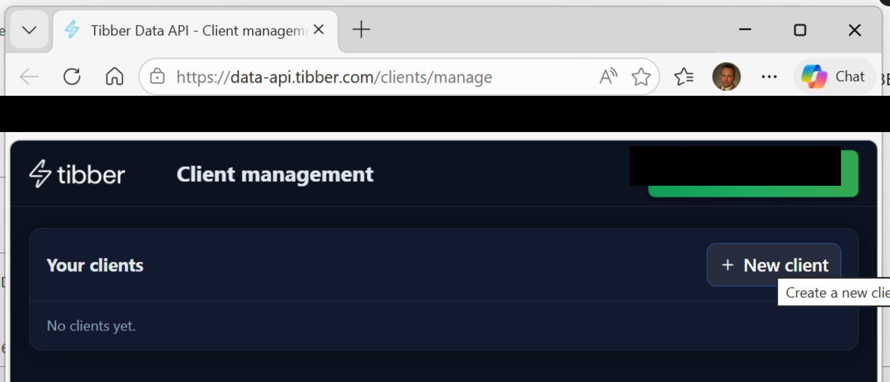

# IoBroker.tibberlink
[](https://github.com/hombach/ioBroker.tibberlink/actions/workflows/codeql-analysis.yml)

## Версии
## Часовой
**Этот адаптер использует библиотеки Sentry для автоматического сообщения разработчикам об исключениях и ошибках в коде.** Более подробную информацию, а также сведения о том, как отключить отправку сообщений об ошибках, см. <a href="https://github.com/ioBroker/plugin-sentry#plugin-sentry">в документации Sentry-Plugin</a> !

## Адаптер для использования данных Tibber Energy в ioBroker
Этот адаптер подключает данные API вашей учетной записи Tibber к ioBroker, независимо от того, используется ли он для одного дома или для нескольких.
Он также поддерживает прямое локальное считывание данных с датчика Tibber Pulse через вашу домашнюю сеть, что позволяет осуществлять мониторинг и сбор данных в режиме реального времени, не полагаясь исключительно на облачный API.

Если вы еще не пользуетесь Tibber, я буду очень признателен, если вы воспользуетесь моей реферальной ссылкой: [Реферальная ссылка Tibber](https://invite.tibber.com/mu8c82n5).

## Стандартная конфигурация
Для начала создайте новый экземпляр адаптера.
— Вам также потребуется API-токен от Tibber, который можно получить здесь: [Tibber Developer API](https://developer.tibber.com).
— Введите свой API-токен Tibber в стандартных настройках и укажите как минимум одну строку для параметров прямой трансляции (выберите «Нет в наличии»).
— Сохраните настройки и выйдите из режима конфигурации, чтобы перезапустить адаптер; этот шаг позволит впервые выполнить запрос к вашему(им) дому(ам) с сервера Tibber.
— Вернитесь на экран настроек и выберите дома, из которых вы хотите получать данные в реальном времени с помощью Tibber Pulse. Вы также можете выбрать дома и отключить передачу данных (Примечание: это работает только в том случае, если оборудование установлено и сервер Tibber подтвердил подключение к Pulse).
Примечание: Если в вашей учетной записи Tibber несколько домов, необходимо добавить их все, чтобы избежать сообщений об ошибках, вызванных ненужными домами. Добавьте все дома и отключите ненужные.
— У вас есть возможность отключить получение данных о ценах на сегодня и завтра, например, если вы планируете использовать только прямую трансляцию Pulse.
— При желании вы можете включить получение исторических данных о потреблении. Укажите количество наборов данных для часов, дней, недель, месяцев и лет. Вы можете использовать «0», чтобы отключить один или несколько из этих интервалов в соответствии с вашими предпочтениями.
Примечание: Важно учитывать размер набора данных, поскольку слишком большие запросы могут привести к отсутствию ответа от сервера Tibber. Мы рекомендуем поэкспериментировать с размером набора данных, чтобы обеспечить оптимальную функциональность. Настройка интервалов и количества данных в наборе данных поможет найти правильный баланс между получением полезных данных и поддержанием быстродействия сервера. Например, рекомендуемое значение для часов — 48.
— Сохраните настройки.

## Документация по данным о потреблении
При включении функции ежедневного анализа исторического потребления адаптер предоставляет сводную информацию за текущий месяц:

- `Homes.<HOME-ID>.Consumption.currentMonthConsumption`

Это состояние представляет собой общее потребление за текущий календарный месяц в `kWh`, рассчитанное на основе ежедневных данных о потреблении, возвращаемых Tibber. Если задано слишком мало дней, значение будет отражать только это количество дней, а не полный месяц.

## Настройка калькулятора
— Теперь, когда соединение с Tibber установлено и работает, вы также можете использовать калькулятор для добавления дополнительных функций автоматизации в адаптер TibberLink.
- Калькулятор работает по каналам, причем каждый канал связан с выбранным домом.
- Эти состояния предназначены для использования в качестве внешних динамических входных данных для TibberLink, позволяя, например, корректировать предельные издержки ("TriggerPrice") из внешнего источника или активировать канал калькулятора ("Active").
— Эти каналы необходимо активировать или деактивировать в зависимости от соответствующего состояния.
— Состояния канала калькулятора расположены рядом с основными состояниями и названы в соответствии с номером канала. Название канала, введенное в административной панели, отображается здесь для облегчения идентификации ваших настроек.

  

- Поведение каждого канала определяется его типом: «оптимальная стоимость (LTF)», «оптимальное время работы за один час (LTF)», «оптимальное время работы за блок часов (LTF)» или «умный буфер батареи».
- Каждый канал выдает одно или два внешних состояния, которые необходимо выбрать на вкладке настроек. Например, это может быть "0_userdata.0.example_state" или любое другое записываемое внешнее состояние.
- Если внешнее выходное состояние не выбрано, будет создано внутреннее состояние в пределах диапазона канала.
- Значения, которые будут записаны в выходное состояние, могут быть определены как "значение ДА" и "значение НЕТ", например, "истина" для логических состояний или число или текст для записи.
- Выходные данные:
- "Оптимальная стоимость": Использует состояние "Цена срабатывания" в качестве входных данных, выдавая "ДА" каждый час, когда текущая стоимость энергии Tibber ниже цены срабатывания.
- "Лучшие часы": Генерирует вывод "ДА" в течение наименее затратных часов, при этом число определяется в состоянии "AmountHours".
- "Блок оптимального времени": Выводит "ДА" в течение наиболее экономически эффективного блока времени, при этом количество часов указано в состоянии "AmountHours".

Кроме того, средняя общая стоимость в определенном блоке записывается в состояние "AverageTotalCost", расположенное рядом с входными состояниями этого канала. Также в результате вычислений в состояния "BlockStartFullHour" и "BlockEndFullHour" записываются время начала и окончания блока.

- "Лучший процент": Выводит "ДА" в самый дешевый час и в любые другие часы, когда цена попадает в диапазон процентов, указанный в настройках "Процент".
- «Оптимальная стоимость в рамках ограниченного временного периода»: «Оптимальная стоимость» в рамках ограниченного временного периода.
- «Лучшие отдельные часы в рамках ограниченного временного интервала» (LTF): «Лучшие отдельные часы» в рамках ограниченного временного интервала (LTF).
- "Блок лучших часов в рамках ограниченного временного интервала (LTF)": "Блок лучших часов" в рамках ограниченного временного интервала (LTF).
- "Лучший процент в рамках ограниченного временного интервала": "Лучший процент" в рамках ограниченного временного интервала (LTF).
- "Интеллектуальный буфер батареи":
Параметр "EfficiencyLoss" определяет потери эффективности аккумуляторной системы. Его значение варьируется от 0 до 1, где 0 означает отсутствие потерь эффективности, а 1 — полную потерю энергии. Например, значение 0,25 указывает на потерю эффективности в 25% за цикл заряда/разряда.
— Параметр "AmountHours" задает максимальное количество часов, которое система может использовать для зарядки аккумулятора, округленное до четверти часа. Важно: это верхний предел, а не гарантированное количество часов. Фактическое количество временных интервалов зарядки определяется динамически на основе цен на электроэнергию и потерь эффективности. Будут выбраны только те временные интервалы, когда зарядка экономически целесообразна (т.е. цена значительно ниже, чем у самого дорогого интервала, с учетом потерь эффективности).
Калькулятор работает следующим образом:
- Дешевые временные интервалы: зарядка аккумулятора включена (значение ДА), а подача энергии в домашнюю энергосистему отключена (значение 2 НЕТ). Это временные интервалы с самыми низкими ценами, которые проходят фильтр эффективности, до AmountHours.
- Дорогие временные интервалы: зарядка аккумулятора отключена (значение НЕТ), а подача электроэнергии в домашнюю энергосистему включена (значение 2 ДА). В эти интервалы действуют самые высокие цены, превышающие динамически рассчитываемый порог, основанный на ценах самых дешевых временных интервалов и потерях эффективности.
- В обычные временные интервалы: если зарядка экономически нецелесообразна, оба выхода отключаются.
— Такой подход гарантирует, что батарея используется только тогда, когда это экономически выгодно, а не строго по фиксированному количеству часов.
- Каналы LTF: Они работают аналогично стандартным каналам, но активны только в течение временного интервала, определяемого объектами состояния «StartTime» и «StopTime». После «StopTime» канал автоматически деактивируется. «StartTime» и «StopTime» могут охватывать два календарных дня, поскольку Tibber не предоставляет данные за пределами 48-часового окна. Для обоих состояний требуется строка даты и времени в формате ISO-8601 со смещением часового пояса, например, «2024-12-24T18:00:00.000+01:00». Кроме того, каналы LTF имеют новый параметр состояния под названием «RepeatDays», который по умолчанию равен 0. Если «RepeatDays» установлено на положительное целое число, канал будет повторять свой цикл, увеличивая значения «StartTime» и «StopTime» на указанное количество дней после достижения «StopTime». Например, установите значение параметра 'RepeatDays' равным 1 для ежедневного повторения.

## Настройка вывода графика
Адаптер помогает визуализировать ценовые тренды и результаты калькулятора. Он предлагает три уровня сложности — от простого подхода на основе JSON до полностью настраиваемого решения на JavaScript.

### 1. **(В разработке) Визуализация с использованием адаптера "E-Charts"**
Для этого метода требуется отдельная установка адаптера "E-Charts".

- Можно использовать данные в формате JSON, сгенерированные в разделе «Состояния калькулятора» («Вывод — Электронные диаграммы»).
— Возможности ограничены особенностями адаптера E-Charts.

### 2. **Использование адаптера "FlexCharts" (или "Fully Featured eCharts") с JSON**
Для этого метода требуется отдельная установка адаптера "FlexCharts".

- Адаптер TibberLink создает состояние с именем `jsonFlexCharts`.

                      

— Адаптер FlexCharts отображает это состояние по следующему URL-адресу:

```
http://[YOUR IP of FLEXCHARTS]:8082/flexcharts/echarts.html?source=state&id=tibberlink.0.Homes.[TIBBER-HOME-ID].PricesTotal.jsonFlexCharts
```

— Начиная с версии 0.7.0, FlexCharts поддерживает автоматическое обновление диаграмм через SSE (Server-Sent Events). Для этого добавьте `&sse` к URL-адресу:

```
http://[YOUR IP of FLEXCHARTS]:8082/flexcharts/echarts.html?source=state&id=tibberlink.0.Homes.[TIBBER-HOME-ID].PricesTotal.jsonFlexCharts&sse=30
```

Для получения более подробной информации обратитесь к документации по адаптеру FlexCharts по адресу [https://github.com/MyHomeMyData/ioBroker.flexcharts].

#### **Использование шаблонов JSON**
— Состояние `jsonFlexCharts` генерируется на основе шаблона, настроенного через редактор JSON в параметрах адаптера.
- Встроенный редактор JSON использует режим JSON5, поэтому допускаются комментарии и завершающие запятые.
— Образец шаблона можно скачать по ссылке: [TemplateFlexChart01.md](docu/TemplateFlexChart01.md).
— Скопируйте и вставьте шаблон в редактор JSON.
- Шаблон содержит заполнители:
- `%%seriesData%%` (заполняется данными о ценах временного ряда во время выполнения).
- `%%CalcChannelsData%%` (заполняется данными выбранного канала калькулятора).
— Остальная часть шаблона соответствует конфигурации Apache ECharts. Для справки см. [Примеры Apache ECharts](https://echarts.apache.org/examples/en/index.html).
- **Рекомендация:** Протестируйте адаптер TibberLink без реального шаблона, используя строку по умолчанию:

```
%%seriesData%%\n\n%%CalcChannelsData%%
```

Это помогает понять его функциональность.

— Настройки шаблона можно протестировать на страницах примеров Apache ECharts, используя данные состояния "Output-E-Charts".
— Хорошие шаблоны будут распространены в сообществе разработчиков адаптеров TibberLink.

### 3. **Использование FlexCharts с пользовательским кодом JavaScript**
Для максимальной гибкости и возможности индивидуальной настройки адаптер FlexCharts можно использовать с пользовательским JavaScript.

— Адаптеры «FlexCharts» и «JavaScript» необходимо устанавливать отдельно.
— Такой подход позволяет создавать множество настраиваемых графиков.
— Для получения более подробной информации обратитесь к [обсуждению адаптера FlexCharts](https://github.com/MyHomeMyData/ioBroker.flexcharts/discussions/67).

## Подсказки
### Обратное использование
Чтобы получить, например, часы пиковой нагрузки вместо оптимальных часов, просто поменяйте местами использование и параметры:


Поменяв местами true и false, вы получите значение true с низкой стоимостью в первой строке и значение true с высокой стоимостью во второй строке (названия каналов — это лишь примеры, и их можно выбирать по своему усмотрению).

Внимание: Для пиковых часов, как в примере, также необходимо скорректировать количество часов. Исходное значение: 5 -> Инверсное значение (24-5) = 19 -> Вы получите «истинный» результат в течение 5 пиковых часов.

### Каналы LTF
Расчет производится для данных за несколько дней. Поскольку у нас есть информация только за «сегодня» и «завтра» (доступна примерно после 13:00), временной интервал охватывает до 48 часов, хотя обычно около 35 часов сразу после обновления цены в 13:00. Однако крайне важно учитывать это, поскольку рассчитанный результат может/изменится примерно в 13:00, когда станут доступны новые данные о ценах на завтра.

Чтобы наблюдать за этим динамическим изменением временного диапазона для стандартного канала, вы можете выбрать ограниченный временной интервал (LTF), охватывающий несколько лет. Это особенно полезно для сценария «оптимальный LTF для отдельных часов».

## Прямой локальный опрос данных Pulse
Для этого необходимо изменить веб-интерфейс Bridge, чтобы он оставался постоянно включенным.
marq24 дает отличное описание того, как это сделать для своей интеграции с Home Assistant, здесь:

https://github.com/marq24/ha-tibber-pulse-local

Если всё работает корректно, данные с счётчика будут записываться в состояния ioBroker каждые 2 секунды.

## Конфигурация транспортных средств и зарядных устройств
Tibber использует два отдельных API, предназначенных для разных целей:

- **API для разработчиков GraphQL** (`api.tibber.com`) — цены на энергоносители, история потребления и лента новостей Pulse в режиме реального времени. Доступ к этому предоставляет стандартный токен API Tibber (с сайта [developer.tibber.com](https://developer.tibber.com)).
- **Tibber Data API** (`data-api.tibber.com`) — данные об устройствах IoT для сопряженных транспортных средств, зарядных устройств, тепловых насосов и инверторов. Это новый, отдельный REST API, требующий собственной регистрации клиента OAuth2.

Ни один из API не заменяет другой — они дополняют друг друга. Функция управления транспортными средствами и зарядными устройствами, описанная здесь, использует API данных и, следовательно, требует собственных учетных данных в дополнение к основному токену API.

### Предварительные условия
1. Откройте [https://data-api.tibber.com/clients/manage](https://data-api.tibber.com/clients/manage) и нажмите **+ Новый клиент**.

 

2. Присвойте клиенту имя (например, `ioBrokerTibber`), установите **URI перенаправления** точно на `http://localhost/` (с косой чертой в конце) и включите как минимум следующие области действия:
- `data-api-homes-read`
- `data-api-vehicles-read`
- `data-api-chargers-read`

    

3. Нажмите **Создать**. Немедленно скопируйте **Идентификатор клиента** и **Секретный ключ клиента** — секретный ключ отображается только один раз.

 

4. Откройте вкладку **Автомобили и зарядные устройства** в настройках адаптера, введите оба значения и сохраните.
5. Перезапустите адаптер. В журнале появится **предупреждение**, содержащее готовый к использованию URL-адрес авторизации с уже заполненным вашим идентификатором клиента:

```
[tibberDataAPI]: no auth code configured — please authorize. URL: https://thewall.tibber.com/connect/authorize?client_id=<your-id>&...
```

6. Откройте этот URL-адрес в браузере и войдите в свою учетную запись Tibber, чтобы предоставить доступ.
7. Браузер перенаправит вас на `http://localhost/` и покажет ошибку подключения — это **ожидаемо и правильно**. Скопируйте полный URL из адресной строки (он содержит `?code=...`).

 

8. Вставьте полный URL-адрес в поле **Код авторизации** в конфигурации адаптера и сохраните.
9. Адаптер обменивает код на токены и начинает опрос. Поле «Код авторизации» автоматически очищается.

Адаптер хранит токен обновления внутри себя и автоматически обновляет токен доступа, поэтому этот одноразовый этап авторизации не нужно повторять.

### Доступные состояния
Данные об автомобиле записываются в `Vehicles.<VIN>.*`:

| Штат | Описание |
| --------------------- | --------------------------------- |
| `ChargingStatus` | Текущий статус зарядки |
| `LastUpdated` | Отметка времени последнего обновления данных |
| `PlugStatus` | Состояние подключения штепсельной вилки |
| `Range` | Оставшийся запас хода в км |
| `StateOfCharge` | Уровень заряда батареи в % |
| `TargetStateOfCharge` | Целевой уровень заряда в % |
| `Целевое состояние заряда` | Целевой уровень заряда в % |

### Интервал опроса
Интервал опроса можно настроить на вкладке **Автомобили и зарядные устройства** (от 1 до 60 минут, по умолчанию: 5 минут).

## Пожертвовать
<a href="https://www.paypal.com/donate/?hosted_button_id=F7NM9R2E2DUYS"></a> Если вам понравился этот проект — или вы просто чувствуете себя щедрым, — подумайте о том, чтобы угостить меня пивом. За ваше здоровье! :beers:

## Changelog

<!--
  Placeholder for the next version (at the beginning of the line):
  ### **WORK IN PROGRESS**
-->
### **WORK IN PROGRESS**

- (HombachC) removed redundant test devDependencies (chai, chai-as-promised, sinon-chai, proxyquire) and switched unit tests to Node's built-in assert

### 7.1.4 (2026-07-09)

- (HombachC) fixed regression where smart battery buffer ignored the EfficiencyLoss parameter (#918)

### 7.1.3 (2026-06-27)

- (HombachC) updated axios
- (HombachC) fixed local SML parsing for EMH meters reporting meter_mode 4 but sending binary SML data (#912)
- (HombachC) fixed false warn log for SBB when no price slot matches current quarter (#912)

### 7.1.2 (2026-06-19)

- (HombachC) fixed adapter crash on null liveMeasurement from Tibber feed (#910)
- (HombachC) improved vehicles & chargers OAuth2 setup documentation
- (HombachC) fixed setInterval/clearInterval to use adapter-managed variants
- (HombachC) removed yarn dependency, replaced with npm in release script
- (HombachC) updated adapter-core
- (HombachC) fixed adapter checker warnings
- (HombachC) updated dependencies

### 7.1.1 (2026-06-07)

- (HombachC) optimized vehicle states
- (HombachC) fixed adapter checker warnings

### 7.1.0 (2026-06-07)

- (claude) added integration for vehicles(#67)
- (HombachC) optimized documentation
- (claude) added code documentation
- (claude) performance optimization of event listeners
- (HombachC) added current month consumption docu
- (HombachC) updated release-script
- (HombachC) fixed adapter checker warnings

### Old Changes see [CHANGELOG OLD](CHANGELOG_OLD.md)

## License

GNU General Public License v3.0 only

Copyright (c) 2023-2026 C.Hombach <TibberLink@homba.ch>