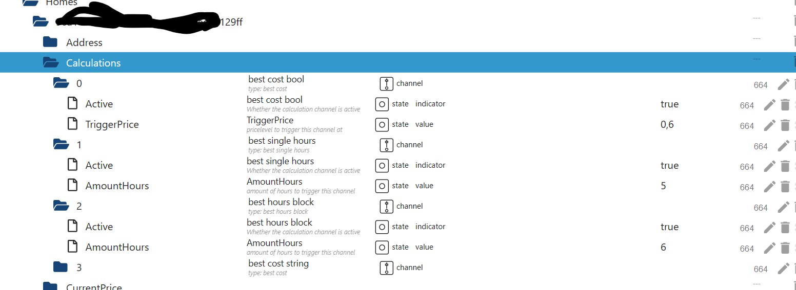

# IoBroker.tibberlink
[](https://github.com/hombach/ioBroker.tibberlink/actions/workflows/codeql-analysis.yml)

## Версии
## Адаптер для использования данных об энергии TIBBER в ioBroker
Этот адаптер облегчает подключение данных из API вашей учетной записи Tibber для использования в ioBroker, как для одного дома, так и для нескольких жилых помещений.
Новая функция: адаптер теперь поддерживает прямое локальное считывание импульсного датчика Tibber через вашу домашнюю сеть, что позволяет осуществлять мониторинг и сбор данных в режиме реального времени, не полагаясь исключительно на облачный API.

Если вы в настоящее время не являетесь пользователем Tibber, я был бы очень признателен, если бы вы могли воспользоваться моей реферальной ссылкой: [Реферальная ссылка Тиббера](https://invite.tibber.com/mu8c82n5).

## Стандартная конфигурация
- Начните с создания нового экземпляра адаптера.
- Вам также потребуется токен API от Tibber, который можно получить здесь: [Tibber Developer API](https://developer.tibber.com).
- Введите свой токен API Tibber в стандартных настройках и настройте хотя бы одну строку для параметров прямой трансляции (выберите «Нет доступных»).
- Сохраните настройки и выйдите из конфигурации, чтобы перезапустить адаптер; этот шаг позволит вашему дому(ам) впервые получить запрос с сервера Tibber.
- Вернитесь на экран конфигурации и выберите дома, из которых вы хотите получать данные в реальном времени с помощью Tibber Pulse. Вы также можете выбрать дома и отключить канал (Примечание: это работает только в том случае, если установлено оборудование и сервер Tibber проверил подключение к Pulse).
- Примечание: Если в вашей учетной записи Tibber активно более одного дома, вам придется добавить их все, чтобы избавиться от сообщения об ошибке, вызванной потенциально ненужными домами. Добавьте их все и отключите опции.
- У вас есть возможность отключить получение данных о ценах на сегодня и завтра, например, если вы собираетесь использовать только прямые трансляции Pulse.
- При желании вы можете включить извлечение исторических данных о потреблении. Укажите количество наборов данных для часов, дней, недель, месяцев и лет. Вы можете использовать «0», чтобы отключить один или несколько из этих интервалов в зависимости от ваших предпочтений.
- Примечание: важно помнить о размере набора данных, так как чрезмерно большие запросы могут привести к отсутствию ответа от сервера Tibber. Мы рекомендуем поэкспериментировать с размером набора данных, чтобы обеспечить оптимальную функциональность. Настройка интервалов и номеров наборов данных может помочь найти правильный баланс между получением содержательных данных и поддержанием отзывчивости сервера. Например, 48 — это довольно хорошее количество для часов.
- Сохраните настройки.

## Конфигурация калькулятора
- Теперь, когда соединение Tibber установлено и работает, вы также можете использовать калькулятор для включения дополнительных функций автоматизации в адаптер TibberLink.
- Калькулятор работает с использованием каналов, каждый из которых связан с выбранным домом.
- Эти состояния предназначены для использования в качестве внешних динамических входов для TibberLink, позволяя, например, корректировать предельную стоимость («TriggerPrice») из внешнего источника или включать канал калькулятора («Active»).
- Эти каналы должны быть активированы или деактивированы в зависимости от соответствующих состояний.
- Состояния канала калькулятора располагаются рядом с домашними состояниями и именуются в соответствии с номером канала. Таким образом, имя канала, выбранное на экране администратора, отображается здесь для лучшей идентификации ваших конфигураций.

  

- Поведение каждого канала определяется его типом: «лучшая стоимость (LTF)», «лучшие отдельные часы (LTF)», «лучший блок часов (LTF)» или «умный буфер батареи».
- Каждый канал заполняет одно или два внешних состояния в качестве выходных данных, которые должны быть выбраны на вкладке настроек. Например, это состояние может быть "0_userdata.0.example_state" или любое другое записываемое внешнее состояние.
- Если внешнее выходное состояние не выбрано, будет создано внутреннее состояние в диапазоне канала.
- Значения, которые должны быть записаны в выходное состояние, могут быть определены как «значение ДА» и «значение НЕТ», например, «истина» для логических состояний или число или текст, которые должны быть записаны.
- Выходы:
- «Лучшая стоимость»: использует состояние «TriggerPrice» в качестве входных данных, выдавая выход «ДА» каждый час, когда текущая стоимость энергии Tibber ниже цены триггера.
- «Лучшие отдельные часы»: генерирует вывод «ДА» в течение наименее дорогих часов с числом, указанным в состоянии «AmountHours».
- «Блок лучших часов»: выводит «ДА» в течение наиболее экономически эффективного блока часов с количеством часов, указанным в состоянии «AmountHours».

Дополнительно, средняя общая стоимость в определенном блоке записывается в состояние "AverageTotalCost" рядом с входными состояниями этого канала. Также начальный и конечный час блока записывается в "BlockStartFullHour" и "BlockEndFullHour" как результат расчета.

- «Лучший процент»: выводит «ДА» в течение наименее дорогого часа и любых других часов, когда цена попадает в процентный диапазон, указанный в настройках «Процент».
- «Лучшая стоимость LTF»: «Лучшая стоимость» в течение ограниченного периода времени (LTF).
- «Лучшие отдельные часы LTF»: «Лучшие отдельные часы» в течение ограниченного периода времени (LTF).
- «Блок лучших часов LTF»: «Блок лучших часов» в течение ограниченного периода времени (LTF).
- «Лучший процент LTF»: «Лучший процент» в течение ограниченного периода времени (LTF).
- "Smart Battery Buffer": используйте параметр "EfficiencyLoss", чтобы указать потерю эффективности аккумуляторной системы. Параметр "EfficiencyLoss" может иметь значение от 0 до 1, где 0 означает отсутствие потери эффективности, а 1 означает полную потерю эффективности. Например, значение 0,25 указывает на потерю эффективности 25% для цикла заряда/разряда.

Используйте параметр "AmountHours" для ввода желаемого количества часов для зарядки аккумулятора. Калькулятор активирует зарядку аккумулятора ("значение ДА") и деактивирует питание аккумулятора ("значение 2 НЕТ") в течение указанных "AmountHours" самых дешевых часов. И наоборот, он деактивирует зарядку аккумулятора ("значение НЕТ") и активирует питание аккумулятора ("значение 2 ДА") в часы с самой высокой стоимостью, при условии, что стоимость выше самой высокой общей цены среди дешевых часов. В оставшиеся обычные часы, когда буферизация энергии аккумулятором экономически нецелесообразна, оба выхода будут отключены.

- Каналы LTF: они работают аналогично стандартным каналам, но активны только в течение временного интервала, определяемого объектами состояния «StartTime» и «StopTime». После «StopTime» канал автоматически деактивируется. «StartTime» и «StopTime» могут охватывать два календарных дня, поскольку Tibber не предоставляет данные за пределами 48-часового окна. Для обоих состояний требуется строка даты и времени в формате ISO-8601 со смещением часового пояса, например, «2024-12-24T18:00:00.000+01:00». Кроме того, каналы LTF имеют новый параметр состояния, называемый «RepeatDays», который по умолчанию равен 0. Если для «RepeatDays» задано положительное целое число, канал будет повторять свой цикл, увеличивая «StartTime» и «StopTime» на указанное количество дней после достижения «StopTime». Например, установите «RepeatDays» на 1 для ежедневного повторения.

## Конфигурация выходного графика
Адаптер помогает визуализировать ценовые тенденции и результаты калькулятора. Он обеспечивает три уровня сложности, каждый из которых предлагает различные варианты.
Эти три метода предоставляют различные варианты визуализации ценовых тенденций и результатов калькулятора. В зависимости от ваших требований вы можете выбрать от простого подхода на основе JSON до полностью настраиваемого решения JavaScript.

### 1. **(В разработке) Визуализация с использованием адаптера "E-Charts"**
Для этого метода требуется отдельная установка адаптера «E-Charts».

- Можно использовать данные JSON, сгенерированные в разделе «Состояния калькулятора» как «Output-E-Charts».
- Возможности ограничены ограничениями адаптера E-Charts.

### 2. **Использование адаптера «FlexCharts» (или «Fully Featured eCharts») с JSON**
Для этого метода требуется отдельная установка адаптера «FlexCharts».

- Адаптер TibberLink создает состояние под названием `jsonFlexCharts`.

    

- Адаптер FlexCharts отображает это состояние через следующий URL:

```
http://[YOUR IP of FLEXCHARTS]:8082/flexcharts/echarts.html?source=state&id=tibberlink.0.Homes.[TIBBER-HOME-ID].PricesTotal.jsonFlexCharts
```

- Более подробную информацию см. в [документации по адаптеру FlexCharts](https://github.com/MyHomeMyData/ioBroker.flexcharts).

#### **Использование шаблона JSON**
- Состояние `jsonFlexCharts` формируется на основе шаблона, настроенного через редактор JSON в настройках адаптера.
- **Важно:** встроенный редактор JSON в ioBroker.Admin не поддерживает JSON5, что может приводить к появлению ложных сообщений об ошибках.
- Образец шаблона можно загрузить с сайта: [TemplateFlexChart01.md](docu/TemplateFlexChart01.md).
- Скопируйте и вставьте шаблон в редактор JSON.
- Шаблон содержит заполнители:
- `%%xAxisData%%` и `%%yAxisData%%` (заполняются информацией о ценах во время выполнения).
- `%%CalcChannelsData%%` (заполняется данными выбранного канала калькулятора).
- Остальная часть шаблона соответствует конфигурации Apache ECharts. Для справки см. [Примеры Apache ECharts](https://echarts.apache.org/examples/en/index.html).
- **Рекомендация:** Протестируйте адаптер TibberLink без реального шаблона, используя строку по умолчанию:

```
%%xAxisData%%\n\n%%yAxisData%%\n\n%%CalcChannelsData%%
```

Это помогает понять его функциональность.

- Настройки шаблона можно протестировать на страницах примеров Apache ECharts с использованием данных состояния «Output-E-Charts».
- Хорошие шаблоны будут распространены в сообществе адаптеров TibberLink.

### 3. **Использование «FlexCharts» с пользовательским кодом JavaScript**
Для максимальной гибкости и настройки адаптер FlexCharts можно использовать с пользовательским JavaScript.

- Адаптеры «FlexCharts» и «JavaScript» необходимо устанавливать отдельно.
- Такой подход позволяет создавать несколько настраиваемых графиков.
- Более подробную информацию см. в [Обсуждении адаптера FlexCharts](https://github.com/MyHomeMyData/ioBroker.flexcharts/discussions/67).

## Подсказки
### Обратное использование
Чтобы получить, например, часы пик вместо оптимальных часов, просто поменяйте местами использование и параметры:  Поменяв местами true <-> false, вы получите true по низкой стоимости в первой строке и true по высокой стоимости во второй строке (названия каналов не являются триггерами и по-прежнему могут быть выбраны).

Внимание: Для пиковых отдельных часов, таких как в примере, вам также необходимо скорректировать количество часов. Исходное: 5 -> Обратное (24-5) = 19 -> Вы получите истинный результат в течение 5 пиковых часов.

### LTF-каналы
Расчет выполняется для «многодневных» данных. Поскольку у нас есть только информация на «сегодня» и «завтра» (доступная примерно после 13:00), временной диапазон фактически ограничен максимум 35 часами. Однако крайне важно помнить об этом поведении, поскольку рассчитанный результат может/изменится около 13:00, когда станут доступны новые данные о завтрашних ценах.

Чтобы наблюдать это динамическое изменение временного диапазона для стандартного канала, вы можете выбрать Limited Time Frame (LTF), охватывающий несколько лет. Это особенно полезно для сценария «Best Single Hours LTF».

## Прямой локальный опрос данных Pulse
Чтобы это заработало, вам нужно изменить веб-интерфейс Bridge, чтобы он оставался постоянно включенным.
marq24 описал, как это сделать превосходно для своей интеграции HomeAssistant здесь:

https://github.com/marq24/ha-tibber-pulse-local

Если все работает правильно, данные счетчика будут записываться в состояния ioBroker каждые 2 секунды.

## Часовой
Этот адаптер использует библиотеки Sentry для автоматического сообщения об исключениях и ошибках кода разработчикам. Для получения более подробной информации и информации о том, как отключить отчеты об ошибках, обратитесь к [Документация по плагину Sentry](https://github.com/ioBroker/plugin-sentry#plugin-sentry)! Отчеты Sentry инициируются, начиная с js-controller 3.0.

## Пожертвовать
<a href="https://www.paypal.com/donate/?hosted_button_id=F7NM9R2E2DUYS"></a> Если вам понравился этот проект — или вы просто чувствуете щедрость, подумайте о том, чтобы угостить меня пивом. Ура! :beers:

## Changelog

### **WORK IN PROGRESS**

- (HombachC) enable JSON5 parsing starting with admin 7.5.3
- (HombachC) fix vulnerability in axios <1.8.2 (#673)

### 4.5.0 (2025-03-05)

- (HombachC) add calculator channel 'smart battery buffer LTF' (#668)
- (HombachC) rearrange calculator channels in configuration
- (HombachC) improve debugging messages, code optimisations
- (HombachC) fix 2 errors in enable/disable FlexCharts

### 4.4.0 (2025-03-01)

- (HombachC) add generation time cutoffs for graph outputs (#643)
- (HombachC) set admin to minimum 7.4.10 as recommended by ioBroker (#651)
- (HombachC) Code optimisations, preparations to switch to ESM module
- (HombachC) bump cron to 4.x.x (#648)
- (HombachC) bump axios from 1.8.x (#664)

### 4.3.1 (2025-02-23)

- (HombachC) Bump "@iobroker/adapter-dev" to 1.4.0 (#653)
- (HombachC) start using "@alcalzone/release-script" (#650)
- (HombachC) add option to enable/disable FlexCharts-JSON for each channel (#642)
- (HombachC) fix logging for multiple homes (#647)
- (HombachC) fix encrypted element "tibberBridgePassword" (#652)

### 4.3.0 (2025-02-09)

- (HombachC) added ioBroker.FlexCharts - JSON
- (HombachC) Update tibber-api to 5.2.1 - handle obsolete data as default, remove option
- (HombachC) Calculate outputJSON prior to time frame for channels of type 'BestSingleHours', 'BestHoursBlock', 'BestPercentage', 'BestCost' and their LTF variants (#592)
- (HombachC) add outputJSON and outputJSON2 for 'SmartBatteryBuffer' channels (#592)
- (HombachC) calculator and projectUtils code optimizations
- (HombachC) correct role of stats states to json

### 4.2.3 (2025-01-14)

- (HombachC) bump cron to 3.5

### Old Changes see [CHANGELOG OLD](CHANGELOG_OLD.md)

## License

GNU General Public License v3.0 only

Copyright (c) 2023-2025 C.Hombach <TibberLink@homba.ch>