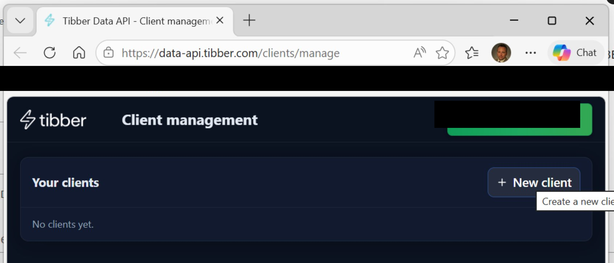

# Конфигурация транспортных средств и зарядных устройств

_Часть [документации ioBroker.tibberlink](/#/adapters/tibberlink) ._

Tibber использует два отдельных API, предназначенных для разных целей:

- **API GraphQL для разработчиков** (`api.tibber.com` ) — цены на энергоносители, история потребления и прямая трансляция Pulse. К этому предоставляет доступ стандартный токен API Tibber (с сайта [developer.tibber.com](https://developer.tibber.com) ).
- **API данных Tibber** (`data-api.tibber.com` — Данные IoT-устройств для сопряженных транспортных средств, зарядных устройств, тепловых насосов и инверторов. Это новый, отдельный REST API, требующий собственной регистрации клиента OAuth2.

Ни один из API не заменяет другой — они дополняют друг друга. Функция управления транспортными средствами и зарядными устройствами, описанная здесь, использует API данных и, следовательно, требует собственных учетных данных в дополнение к основному токену API.

> Примечания разработчиков/исследователей по API данных (конечные точки, схема устройства, возможности) находятся в файле [../Info/TibberDataAPI.md](https://github.com/Hombach/ioBroker.tibberlink/blob/master/Info/TibberDataAPI.md) .

## Предварительные требования

1. Откройте <https://data-api.tibber.com/clients/manage> и нажмите **+ Новый клиент** .

 

2. Укажите имя клиента (например)`ioBrokerTibber` ), установите **URI перенаправления** точно на`http://localhost/` (с завершающей косой чертой) и включите как минимум следующие области видимости:

   - `data-api-homes-read`
   - `data-api-vehicles-read`
   - `data-api-chargers-read`

    

3. Нажмите **«Создать»** . Сразу же скопируйте **идентификатор клиента (Client ID** ) и **секретный ключ клиента (Client Secret)** — секретный ключ отображается только один раз.

 

4. Откройте вкладку **«Транспортные средства и зарядные устройства»** в настройках адаптера, введите оба значения и сохраните.
5. Перезапустите адаптер. В журнале появится **предупреждение** , содержащее готовый к использованию URL-адрес авторизации с уже заполненным идентификатором клиента:
   ```
   [tibberDataAPI]: no auth code configured — please authorize. URL: https://thewall.tibber.com/connect/authorize?client_id=<your-id>&...
   ```
6. Откройте этот URL-адрес в браузере и войдите в свою учетную запись Tibber, чтобы предоставить доступ.
7. Браузер перенаправит на`http://localhost/` и отобразить ошибку подключения — это **ожидаемо и правильно** . Скопируйте полный URL-адрес из адресной строки (он содержит`?code=...` ).

 

8. Вставьте полный URL-адрес в поле **«Код авторизации»** в настройках адаптера и сохраните.
9. Адаптер обменивает код на токены и начинает опрос. Поле «Код авторизации» автоматически очищается.

Адаптер хранит токен обновления внутри себя и автоматически обновляет токен доступа, поэтому этот одноразовый этап авторизации не нужно повторять.

## Доступные состояния

Данные об автомобиле записываются в`Vehicles.<VIN>.*` :

| Состояние             | Описание                                                                              |
| --------------------- | ------------------------------------------------------------------------------------- |
| `ChargingStatus`      | Текущее состояние зарядки                                                             |
| `HomeId`              | Идентификатор дома Associated Tibber                                                  |
| `LastSeen`            | Отметка времени, когда устройство в последний раз было замечено пользователем Tibber. |
| `LastUpdated`         | Отметка времени последнего обновления данных                                          |
| `PlugStatus`          | Состояние подключения штекера                                                         |
| `Range`               | Оставшийся запас хода в км                                                            |
| `StateOfCharge`       | Уровень заряда батареи в %                                                            |
| `TargetStateOfCharge` | Целевой уровень заряда в %                                                            |

Данные зарядного устройства записываются в`Chargers.<id>.*` Поскольку возможности зарядных устройств могут различаться у разных производителей (например, go-e, Wallbox Pulsar Plus), каждая сообщаемая возможность записывается в виде отдельного состояния, названного по идентификатору возможности Data API (точки заменены подчеркиваниями) и помеченного описанием, предоставленным API. Типичные состояния включают:

| Состояние                          | Описание                                                                             |
| ---------------------------------- | ------------------------------------------------------------------------------------ |
| `connector_status`                 | Состояние разъема зарядного устройства                                               |
| `charging_status`                  | Состояние зарядки зарядного устройства                                               |
| `charging_current_max`             | Максимально допустимый зарядный ток (А)                                              |
| `charging_current_offlineFallback` | Резервный ток при отключении зарядного устройства (А)                                |
| `grid_phaseCount`                  | Количество фаз, используемых для зарядки                                             |
| `HomeId`                           | Идентификатор дома Associated Tibber                                                 |
| `LastSeen`                         | Отметка времени, когда устройство в последний раз было замечено пользователем Tibber |
| `LastUpdated`                      | Отметка времени последнего обновления данных                                         |

## Интервал опроса

Интервал опроса можно настроить на вкладке **«Транспортные средства и зарядные устройства»** (1–60 минут, по умолчанию: 5 минут).