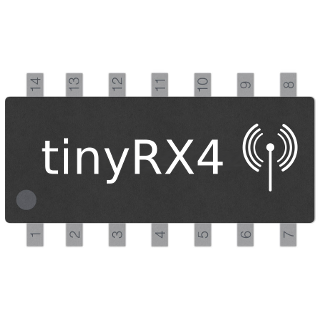

# ioBroker.tinyrx4

## Адаптер TinyRX4 для ioBroker

(Немецкая версия см. ниже)

Считывание данных с беспроводных датчиков, полученных через TinyRX4.

Беспроводной трансивер TinyTX4 и приемник TinyRX4 были разработаны пользователем meigrafd на немецком форуме Raspberry Pi.

Страница проекта: <https://forum-raspberrypi.de/forum/thread/7472-batteriebetriebene-funk-sensoren/>

Github:

- Трансивер: <https://github.com/meigrafd/TinyTX4>
- Приёмник: <https://github.com/meigrafd/TinyRX4>

Цель проекта — обеспечить работу беспроводных датчиков, питающихся от батарей, а также прием и обработку данных с помощью Raspberry Pi.

В принципе, в качестве датчиков можно использовать все типы датчиков, например, датчики температуры, влажности, атмосферного давления, высотомеры, датчики присутствия, магнитные переключатели, датчики вибрации, гигрометры и т. д.

Этот адаптер ioBroker поддерживает все скетчи для датчиков, опубликованные на <https://github.com/meigrafd/TinyTX4>

- BMP085 (датчик давления/температуры)
- DHT22 (датчик температуры/влажности)
- DS18B20 (датчик температуры)
- HCSR04 (ультразвуковой датчик)
- Герконовый переключатель (контакт двери/окна)

Дополнительные эскизы в поддержку проекта:

- BME280 (датчик давления/температуры/влажности) <https://github.com/bowao/tinytx4_bme280>

В конфигурации адаптера можно задать последовательный интерфейс и соответствующую скорость передачи данных. Кроме того, можно выполнить поиск новых или случайно удаленных точек данных в уже созданных датчиках без необходимости создавать весь датчик заново.

Датчики автоматически создаются с их идентификатором узла после получения первого сообщения. Создаются только те точки данных, которые обнаружены с помощью переменных сообщения. Кроме того, в разделе "config" создаются соответствующие точки смещения, чтобы при необходимости можно было скорректировать значения датчиков. В разделе "calculated" создаются вычисляемые точки данных: абсолютная влажность и точка росы, но только если датчик предоставляет значения температуры и относительной влажности.

Если вы используете другие датчики с настраиваемыми переменными msg, я могу реализовать это в адаптере, или вы можете отправить запрос на добавление изменений (pull-request). Переменные msg должны отличаться от уже используемых.

Уже использованы переменные msg

- d = Расстояние
- h = Влажность
- он = Рост
- p = Давление воздуха
- r = Контакт язычка
- t = Температура
- v = Напряжение батареи

---

## Адаптер TinyRX4 для ioBroker

Einlesen der vom TinyRX4 empfangenen Funksensordaten

Funksender TinyTX4 и Funkempfänger TinyRX4 были опубликованы на немецком форуме Raspberry Pi.

Сайт проекта: <https://forum-raspberrypi.de/forum/thread/7472-batteriebetriebene-funk-sensoren/>

Github:

- Отправитель: <https://github.com/meigrafd/TinyTX4>
- Эмпфенгер: <https://github.com/meigrafd/TinyRX4>

Ziel des Projekts — это, если вы отключаете Funk Sensoren, у вас есть разные батареи, которые можно использовать и использовать RaspberryPI Daten zu empfangen sowie auszuwerten.

Als Sensor kann man im Prinzip alle Arten von Sensoren verwenden, zB Temperatur, Luftfeuchtigkeit, Luftdruck, Höhenmesser, Anwesenheitssensoren, Magnetschalter, Erschütterungs-Sensoren, Feuchtigkeitsmesser usw.

Dieser IoBroker-Adapter unterstützt alle unter <https://github.com/meigrafd/TinyTX4> Hinterlegten Sensorsketche:

- BMP085 (Датчик жидкости/температуры)
- DHT22 (датчик температуры/фейхтезистора)
- DS18B20 (датчик температуры)
- HCSR04 (Ультразондовый датчик)
- ReedSwitch (Tür-/Fensterkontakt)

Вот какой эскиз:

- BME280 (Druck-/Temperatur-/Feuchtesensor) <https://github.com/bowao/tinytx4_bme280>

В конфигурации адаптера указана серийная шпиндельная и дополнительная скорость передачи данных. Außerdem besteht die möglichkeit für bereits erstellte Sensoren nach neuen или versehentlich gelöschten Datenpunkte zu suchen ohne das der der der verbate Sensor neuen angelegt werden muss.

Датчики автоматически работают с идентификатором узла. Es werden Jeweils nur die Datenpunkte angelegt, die über die msg-Variablen erkannt wurden. Если вы используете "config" для смещения даты, необходимо, чтобы датчик был корректно установлен. При «расчетном» использовании эрехнетен Datenpunkte Feuchte абсолютного и Taupunkt angelegt, необходимо, чтобы датчик был Werte Temperatur и относительный Feuchte Lifert.

Когда другие датчики падают с переменными сообщениями, они могут умереть, если адаптер будет отключен или будет использован пул-запрос. Die msg-Variablen müssen sich von den bereits benutzten unterscheiden.

Bereits benutzte msg-Variablen:

- d = Entfernung
- h = Luftfeuchte
- он = Höhe
- p = Luftdruck
- r = Рид-Контакт
- t = Температура
- v = Batteriespannung

## Changelog
### 1.0.1
- Optimization for js-controller 3.3
- Fix for negative temperature values
- Update travis.yml

### 1.0.0
- Update dependencies
- BREAKING CHANGE: Drop node 8 support, requires node 10 or above
- BREAKING CHANGE: js-controller v2.4.0 or above required

### 0.1.5
- Update travis.yml, License, Readme

### 0.1.4
- (bowao) fix typo

### 0.1.3
- (bowao) fix npm Version

### 0.1.2
- (bowao) close serialport on unload and cleanup 2

### 0.1.1
- (bowao) close serialport on unload and cleanup

### 0.1.0
- (boawo) add option to search new data points on already created sensors
- (bowao) add calculated data points humidity_absolute and dew point
- (bowao) remove TiNo support (TiNo now has his own adapter)

### 0.0.3
- (bowao) add support for TiNo
- (bowao) bugfix

### 0.0.2
- (bowao) cleanup and npm release

### 0.0.1
- (bowao) initial release

## License
MIT License

Copyright (c) 2021 bowao <cryolab@web.de>

Permission is hereby granted, free of charge, to any person obtaining a copy
of this software and associated documentation files (the "Software"), to deal
in the Software without restriction, including without limitation the rights
to use, copy, modify, merge, publish, distribute, sublicense, and/or sell
copies of the Software, and to permit persons to whom the Software is
furnished to do so, subject to the following conditions:

The above copyright notice and this permission notice shall be included in all
copies or substantial portions of the Software.

THE SOFTWARE IS PROVIDED "AS IS", WITHOUT WARRANTY OF ANY KIND, EXPRESS OR
IMPLIED, INCLUDING BUT NOT LIMITED TO THE WARRANTIES OF MERCHANTABILITY,
FITNESS FOR A PARTICULAR PURPOSE AND NONINFRINGEMENT. IN NO EVENT SHALL THE
AUTHORS OR COPYRIGHT HOLDERS BE LIABLE FOR ANY CLAIM, DAMAGES OR OTHER
LIABILITY, WHETHER IN AN ACTION OF CONTRACT, TORT OR OTHERWISE, ARISING FROM,
OUT OF OR IN CONNECTION WITH THE SOFTWARE OR THE USE OR OTHER DEALINGS IN THE
SOFTWARE.