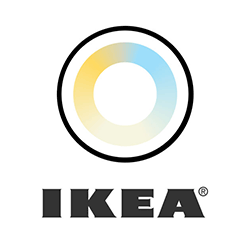

# ioBroker.tradfri

## Требования

- Linux (например, Raspberry Pi) / OSX / Windows
- NodeJS >= 12.x
- Въездной шлюз Традфри

## Установка

1. Установите этот адаптер через административный интерфейс iobroker или с помощью`npm install iobroker.tradfri --production`
2. В графическом интерфейсе ioBroker добавьте экземпляр адаптера.
3. Настройте экземпляр, введя IP-адрес/имя хоста вашего шлюза и код безопасности, который можно найти на этикетке внизу.

### Устранение неполадок при установке:

#### Linux/OSX:

Убедитесь, что установлена самая последняя выпущенная версия. Если возникают ошибки компиляции, возможно, потребуется установить build-essential:

```
apt-get -y install build-essential
```

#### Окна:

Если вы используете более старые версии NodeJS (< 10), установка может завершиться с ошибкой, указанной в логе:

```
Can't find Python executable "python", you can set the PYTHON env variable.
```

Для решения проблемы откройте командную оболочку с правами администратора:

1. Нажмите<kbd> ⊞ Windows</kbd> ключ
2. Входить`cmd` , нажимать<kbd> Ctrl</kbd> +<kbd> Сдвиг</kbd> +<kbd> Входить</kbd>
3. Подтвердите запрос UAC и выполните следующую команду:

```
npm install --add-python-to-path --global windows-build-tools
```

Это может занять некоторое время... после чего установка должна пройти успешно.

## Отправка пользовательских CoAP-пакетов

Вы можете отправлять пользовательские CoAP-пакеты с других адаптеров, используя...`sendTo` Пример из JavaScript:

```js
sendTo("tradfri.0", "request", options, (ret) => {
	// do something with the result
});
```

Он`options` Объект выглядит следующим образом:

```js
{
	path: string,
	method?: "get" | "post" | "put" | "delete", // optional, default = "get"
	payload?: object                            // optional, should be a JSON object
}
```

Результирующий объект`ret` Выглядит следующим образом:

```js
{
	error: string | null,
	result: {
		code: string,            // see https://tools.ietf.org/html/rfc7252#section-12.1.2
		payload: object | Buffer
	}
}
```

## Changelog
[Older changes](https://github.com/AlCalzone/ioBroker.tradfri/blob/master/CHANGELOG_OLD.md)
<!--
	Placeholder for next release:
	### __WORK IN PROGRESS__
-->
### 3.1.3 (2022-04-24)
* Fix: support for Node.js 18

### 3.1.2 (2021-12-31)
* Fixed a typo preventing the adapter from controlling air purifiers

### 3.1.1 (2021-12-21)
* Fix: actually create states for STARKVIND Air Purifier

### 3.1.0 (2021-12-19)
* Add support for STARKVIND Air Purifier

### 3.0.2 (2021-12-03)
* Improve support for older browsers
* Update dependencies

## License
The MIT License (MIT)

Copyright (c) 2017-2022 AlCalzone <d.griesel@gmx.net>

Permission is hereby granted, free of charge, to any person obtaining a copy
of this software and associated documentation files (the "Software"), to deal
in the Software without restriction, including without limitation the rights
to use, copy, modify, merge, publish, distribute, sublicense, and/or sell
copies of the Software, and to permit persons to whom the Software is
furnished to do so, subject to the following conditions:

The above copyright notice and this permission notice shall be included in
all copies or substantial portions of the Software.

THE SOFTWARE IS PROVIDED "AS IS", WITHOUT WARRANTY OF ANY KIND, EXPRESS OR
IMPLIED, INCLUDING BUT NOT LIMITED TO THE WARRANTIES OF MERCHANTABILITY,
FITNESS FOR A PARTICULAR PURPOSE AND NONINFRINGEMENT. IN NO EVENT SHALL THE
AUTHORS OR COPYRIGHT HOLDERS BE LIABLE FOR ANY CLAIM, DAMAGES OR OTHER
LIABILITY, WHETHER IN AN ACTION OF CONTRACT, TORT OR OTHERWISE, ARISING FROM,
OUT OF OR IN CONNECTION WITH THE SOFTWARE OR THE USE OR OTHER DEALINGS IN
THE SOFTWARE.