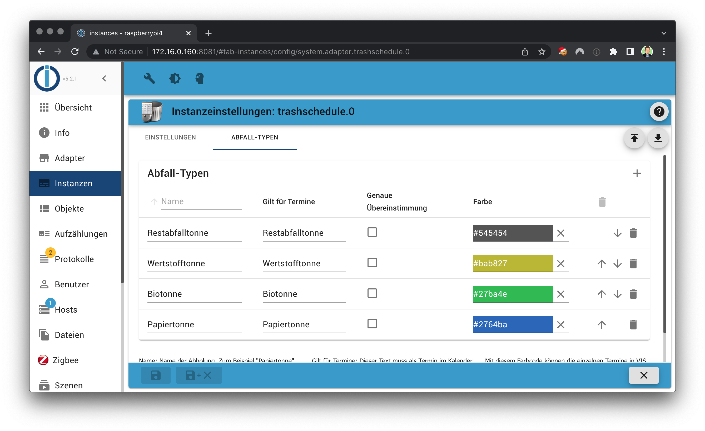
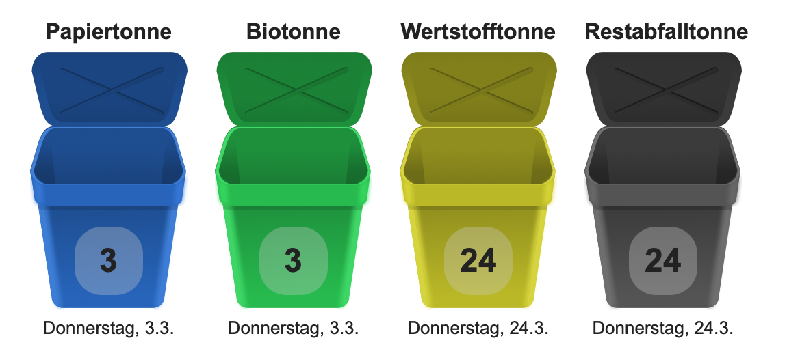

# ioBroker.trashschedule

## Оглавление

- [Поставщики](/#/docs/adapterref/iobroker.trashschedule/providers.md)
- [Блокли](/#/docs/adapterref/iobroker.trashschedule/blockly.md)
- [JavaScript](/#/docs/adapterref/iobroker.trashschedule/javascript.md)
- [Часто задаваемые вопросы](https://github.com/klein0r/ioBroker.trashschedule/blob/master/docs/en/faq.md)

## Требования

1. Node.js 20.0 (или более поздняя версия)
2. js-controller 6.0.0 (или более поздняя версия)
3. Административный адаптер 6.0.0 (или более поздняя версия)
4. iCal Adapter 1.12.1 (или более поздняя версия) — _опционально_

## Конфигурация

1. Создать`trashschedule` Выберите экземпляр iCal в качестве источника. В качестве альтернативы можно выбрать поставщиков напрямую, которые интегрированы через различные онлайн-сервисы.
2. Перейдите на вкладку «Типы мусора» и добавьте столько типов, сколько у вас уже есть.
3. Задайте имя для каждого нового типа мусора и настройте соответствующие события.
4. Запустите экземпляр

**Есть вопросы?** Ознакомьтесь с разделом [часто задаваемых вопросов (FAQ).](https://github.com/klein0r/ioBroker.trashschedule/blob/master/docs/en/faq.md)

## Предварительные условия для iCal

1. Создайте новый экземпляр [адаптера iCal.](https://github.com/iobroker-community-adapters/ioBroker.ical)
2. Настройте URL-адрес своего календаря (например, Google Календарь).
3. Установите параметр "Дни предварительного просмотра" в диапазоне, который включает каждый тип мусора как минимум дважды (например, 45 дней).
4. Если вы используете вкладку «События», убедитесь, что для каждого типа событий установлен флажок «Отображать», который также должен использоваться в вашем расписании удаления (в противном случае событие будет скрыто экземпляром iCal).

## Виджет VIS (версия VIS 1.x)

**Данный виджет не поддерживает VIS 2.x!**

## Changelog

<!--
  Placeholder for the next version (at the beginning of the line):
  ### **WORK IN PROGRESS**
-->
### **WORK IN PROGRESS**

* (copilot) Adapter requires node.js >= 22 now
* (@klein0r) admin 7.6.20 and js-controller 6.0.11 (or later) are required

### 5.3.0 (2026-04-22)

* (@Jailobeam) Fixed filtering of Lobbe.app address selections in the admin UI
* (@Jailobeam) Added Lobbe.app as a new data source
* (@Jailobeam) Added German labels for the Lobbe address selection

### 5.2.1 (2026-01-08)

* (@klein0r) Fixed responsive config layout on xl screens

### 5.2.0 (2025-12-22)

* (@klein0r) Responsive config layout

### 5.1.0 (2025-12-09)

* (@klein0r) Added Wolfenbüttel to providers

### 5.0.1 (2025-11-26)

* (@klein0r) Increased timeout of api calls

[Older changelogs can be found there](CHANGELOG_OLD.md)

## License

MIT License

Copyright (c) 2026 Matthias Kleine <info@haus-automatisierung.com>

Permission is hereby granted, free of charge, to any person obtaining a copy
of this software and associated documentation files (the "Software"), to deal
in the Software without restriction, including without limitation the rights
to use, copy, modify, merge, publish, distribute, sublicense, and/or sell
copies of the Software, and to permit persons to whom the Software is
furnished to do so, subject to the following conditions:

The above copyright notice and this permission notice shall be included in all
copies or substantial portions of the Software.

THE SOFTWARE IS PROVIDED "AS IS", WITHOUT WARRANTY OF ANY KIND, EXPRESS OR
IMPLIED, INCLUDING BUT NOT LIMITED TO THE WARRANTIES OF MERCHANTABILITY,
FITNESS FOR A PARTICULAR PURPOSE AND NONINFRINGEMENT. IN NO EVENT SHALL THE
AUTHORS OR COPYRIGHT HOLDERS BE LIABLE FOR ANY CLAIM, DAMAGES OR OTHER
LIABILITY, WHETHER IN AN ACTION OF CONTRACT, TORT OR OTHERWISE, ARISING FROM,
OUT OF OR IN CONNECTION WITH THE SOFTWARE OR THE USE OR OTHER DEALINGS IN THE
SOFTWARE.