# Инструкции по использованию прокси-сервера для мобильных телефонов

## iOS

**Важно: начиная с версии 3.0.0, прокси-сервер называется "NodeMITMProxyCA", а не "Anyproxy"!**

<https://youtu.be/bHaL9ftU2zc>

### Установить сертификат

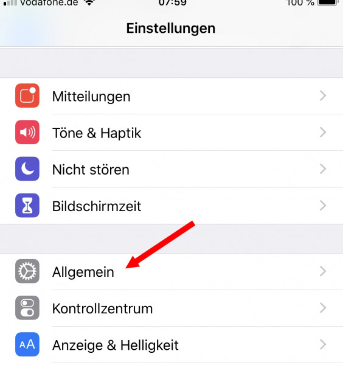

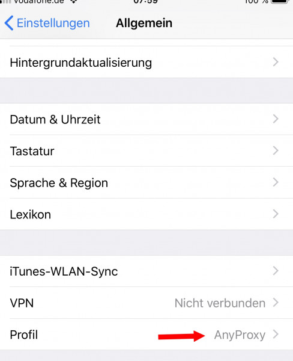

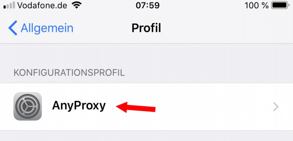

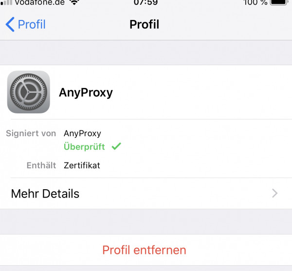

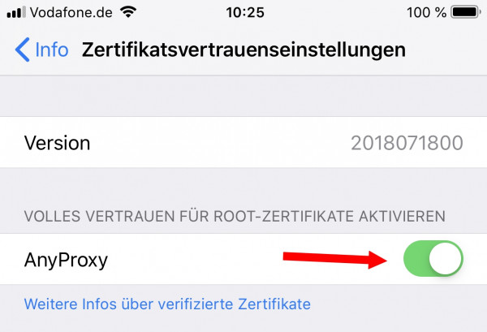

### Включить прокси

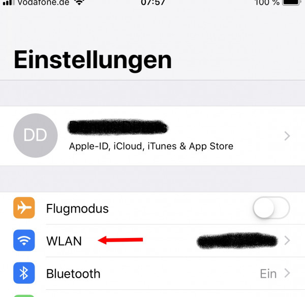

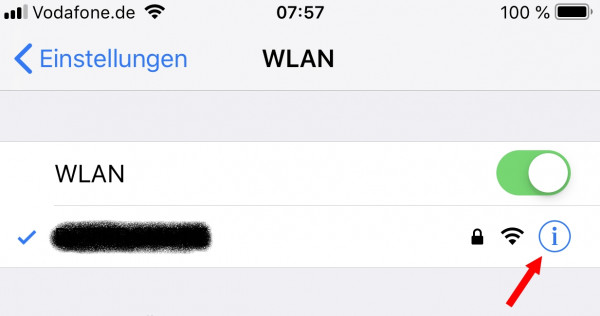

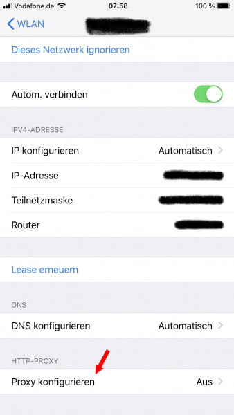

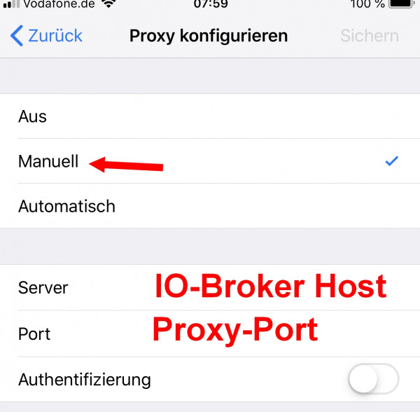

## Android

<https://youtu.be/bHaL9ftU2zc?t=275>

**Важно: начиная с версии 3.0.0, прокси-сервер называется "NodeMITMProxyCA", а не "Anyproxy"!**

**Важно: В некоторых новых версиях Android самоподписанные сертификаты могут быть вообще недоступны! Поэтому, если вы уверены, что всё сделали правильно, но ничего не работает или в логах отображаются только ошибки SSL, попробуйте использовать эмулятор Android (см. ниже)!**

### Установить сертификат

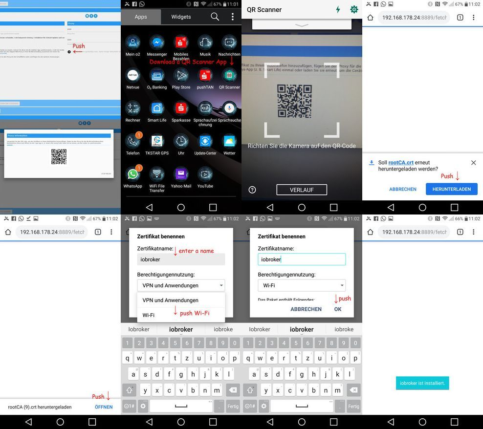

В зависимости от версии Android может потребоваться установка сертификата для «VPN и приложений» ИЛИ «Wi-Fi». Простой способ — установить его дважды (по одному разу для каждого режима) :-)

### Включить прокси

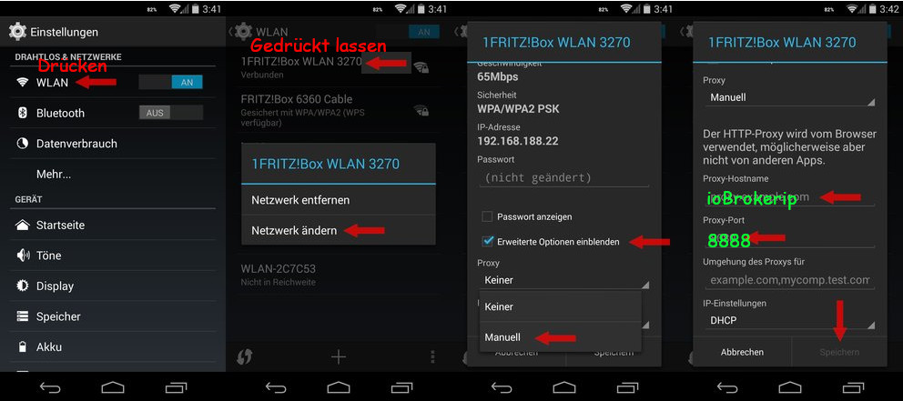

### Подробное пошаговое руководство по использованию прокси-сервера с Android и более старыми версиями приложения.

см. [TuyaSync.pdf](https://raw.githubusercontent.com/Apollon77/ioBroker.tuya/master/TuyaSync.pdf)

Список известных совместимых приложений и версий можно найти в [файле README.md](https://github.com/Apollon77/ioBroker.tuya#compatible-mobile-apps-and-versions) !

Благодарим пользователя HappyTeaFriend с форума ioBroker!

### Резервный вариант, если вышеуказанные не сработают

Решение, работающее для пользователей, у которых также есть компьютер под управлением Windows, было описано на [форуме ioBroker](https://forum.iobroker.net/topic/16103/aufruf-neuer-adapter-iobroker-tuya-wlan-devices-tuya-smart-life-und-andere/83) и функционирует с симулятором Android. Второй подход с использованием эмулятора Android описан по ссылке: <https://forum.iobroker.net/topic/23431/aufruf-tuya-adapter-tests-verschl%C3%BCsselte-ger%C3%A4te/19>

<https://youtu.be/bHaL9ftU2zc?t=157>