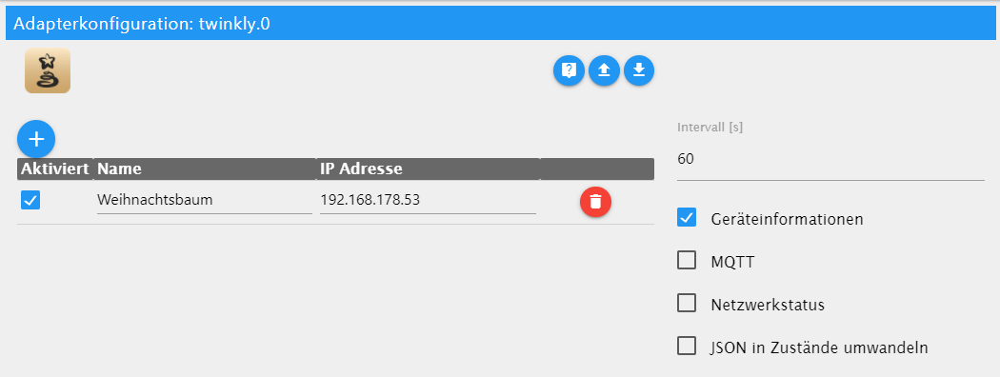

# ioBroker.twinkly

## Адаптер Twinkly для ioBroker

Адаптер для связи с [гирляндой Twinkly](https://www.twinkly.com/) .

**Этот адаптер использует библиотеки Sentry для автоматического сообщения разработчикам об исключениях и ошибках в коде.** Более подробную информацию, а также инструкции по отключению отправки сообщений об ошибках см. [в документации Sentry-Plugin](https://github.com/ioBroker/plugin-sentry#plugin-sentry) ! Система отчетности Sentry используется начиная с js-controller 3.0.

## Настройки

Доступны следующие настройки:

В таблице вы можете добавить все гирлянды Twinkly, которыми хотите управлять.

| Столбец      | Описание                                                                                                                                                |
| ------------ | ------------------------------------------------------------------------------------------------------------------------------------------------------- |
| `Enabled`    | Будет ли осуществлен доступ к этому соединению?                                                                                                         |
| `Name`       | Название соединения в ioBroker                                                                                                                          |
| `IP Address` | IP-адрес гирлянды «Мерцающие огоньки»                                                                                                                   |
| `Mode On`    | Который`ledMode` следует активировать при изменении состояния`on` включено.<br/> Цвет, Эффект, Фильм, Музыка (реактивный), Плейлист или последний режим |

При установке флажка для каждого устройства создаются следующие дополнительные состояния:

- Информация об устройстве
- MQTT
- Состояние сети

Доступны следующие штаты:

| Состояние     | Записываемый         | Описание                                                                                                                                                 |
| ------------- | -------------------- | -------------------------------------------------------------------------------------------------------------------------------------------------------- |
| `connected`   | :x:                  | Устройство подключено                                                                                                                                    |
| `details`     | :x:                  | Сведения об устройстве                                                                                                                                   |
| `firmware`    | :x:                  | Версия прошивки                                                                                                                                          |
| `ledBri`      | :heavy\_check\_mark: | Яркость (отключите регулировку с помощью -1)                                                                                                             |
| `ledColor`    | :heavy\_check\_mark: | Цвет светодиодов, HSV/RGB(W)/HEX (`Color` )                                                                                                              |
| `ledConfig`   | :heavy\_check\_mark: | Конфигурация светодиодов                                                                                                                                 |
| `ledEffect`   | :heavy\_check\_mark: | Эффекты (`Effect` )                                                                                                                                      |
| `ledLayout`   | :heavy\_check\_mark: | Схема расположения светодиодов (отключены для дальнейшего тестирования)                                                                                  |
| `ledMode`     | :heavy\_check\_mark: | Режимы: Цвет, Эффект, Фильм, Реагирование на музыку, Плейлист, Выкл., В реальном времени (пока не поддерживается), Демонстрация                          |
| `ledMovie`    | :heavy\_check\_mark: | Активный фильм. Если в плейлист добавлено несколько фильмов, их можно выбрать здесь.`Movie` )                                                            |
| `ledPlaylist` | :heavy\_check\_mark: | Активация списка воспроизведения, переключение между фильмами.`Playlist` )                                                                               |
| `ledSat`      | :heavy\_check\_mark: | Насыщенность 0-100 (отключение управления с помощью -1)                                                                                                  |
| `mqtt`        | :heavy\_check\_mark: | MQTT-соединение                                                                                                                                          |
| `name`        | :heavy\_check\_mark: | Имя                                                                                                                                                      |
| `network`     | :x:                  | Сетевая информация                                                                                                                                       |
| `on`          | :heavy\_check\_mark: | Переключатель включения/выключения                                                                                                                       |
| `paused`      | :heavy\_check\_mark: | Приостановите соединение с Twinkly, чтобы вносить изменения в приложение. В противном случае вы можете потерять соединение во время работы в приложении. |
| `timer`       | :heavy\_check\_mark: | Обновить таймер                                                                                                                                          |

[Информация о частном API](https://xled-docs.readthedocs.io/en/latest/) от [Павола Бабинчака](https://github.com/scrool)

## Известные проблемы

- Максимальная длина названия фильма — 15 символов.

## Примеры кода

### Загрузить фильм

```
sendTo('twinkly.0', 'uploadMovie', {
    connection : 'Fenster',
    frames     : [
        [{"r":18,"g":105,"b":58},{"r":18,"g":105,"b":58}, ...],
        [{"r":18,"g":105,"b":58},{"r":18,"g":105,"b":58}, ...],
        ...
    ],
    delay : 250
});
```

### Загрузить шаблон фильма

Загрузите заранее подготовленный фильм.

- 0: Мерцающий сине-белый
- 1: Рождественское мерцание - Зеленый - Красный

```
sendTo('twinkly.0', 'uploadTemplateMovie', {
    connection : 'Fenster',
    template   : 1
});

```

### Загрузить фильм «Твинкл»

```
sendTo('twinkly.0', 'uploadTwinkleMovie', {
    connection  : 'Fenster',
    baseColor   : '#00873f', // or {r: 0, g: 135, b: 62}
    secondColor : '#c30F15'  // or {r: 195, g: 15, b: 22}
});
```

<!--
### Send Realtime Frame
```
sendTo('twinkly.0', 'sendrealtimeframe', {
    connection : 'Fenster',
    frame      : [{"r":221,"g":0,"b":85},{"r":221,"g":0,"b":85}, ...]
});
```
-->

### Создать рамку определенного цвета

Возвращает полный кадр одного цвета. Цвета передаются в свойстве.`colors` В результате вы получаете массив кадров.

```
sendTo('twinkly.0', 'generateFrame', {
    connection : 'Fenster',
    color      : '#12693a' // or {"r": 18,"g":105,"b":58}
});
response => {
    // [{"r":18,"g":105,"b":58},{"r":18,"g":105,"b":58}, ...]
    ...
}

sendTo('twinkly.0', 'generateFrame', {
    connection : 'Fenster',
    colors     : ['#12693a', ...] // or [{"r":18,"g":105,"b":58}, ...]
});
response => {
    // [[{"r":18,"g":105,"b":58},{"r":18,"g":105,"b":58}, ...], ..]
    ...
}
```

## Changelog
<!--
  Placeholder for the next version (at the beginning of the line):
  ### **WORK IN PROGRESS**
-->
### **WORK IN PROGRESS**
* Update dependencies

### 1.0.14 (2023-07-19)
* Add formatting to some states (hex-values -> uppercase, uptime in hours)
* Handle Sentry message (IOBROKER-TWINKLY-8P)
* Update dependencies

### 1.0.13 (2023-02-01)
* Update dependencies

### 1.0.12 (2022-12-22)
* Slave can write ledBri and ledSat

### 1.0.11 (2022-12-13)
* Extend Sentry logging for details.groups when "deprecated"
* Cancel active pause not working after startup if active beforehand
* Merge libraries request and twinkly
* Optimized Code in requests
* Updated Sentry logging for better viewability

### 1.0.10 (2022-12-05)
* Add sendTo message `uploadTwinkleMovie` to upload a twinkle movie with own colors
* Update Release Integration in Github Actions and Sentry

### 1.0.9 (2022-11-27)
* Now detects if Twinkly is in a group (firmware >= 2.8.3). If so, the group can only be controlled by the master, the states from the slave are read-only.

### 1.0.8 (2022-11-26)
* Add `musicreactive` Mode
* Add Ukrainian translation
* Rework how objects are created, objects are now created after first connect after startup and updated after a firmware update

## License
MIT License

Copyright (c) 2024 patrickbs96 <patrickbsimon96@gmail.com>

Permission is hereby granted, free of charge, to any person obtaining a copy
of this software and associated documentation files (the "Software"), to deal
in the Software without restriction, including without limitation the rights
to use, copy, modify, merge, publish, distribute, sublicense, and/or sell
copies of the Software, and to permit persons to whom the Software is
furnished to do so, subject to the following conditions:

The above copyright notice and this permission notice shall be included in all
copies or substantial portions of the Software.

THE SOFTWARE IS PROVIDED "AS IS", WITHOUT WARRANTY OF ANY KIND, EXPRESS OR
IMPLIED, INCLUDING BUT NOT LIMITED TO THE WARRANTIES OF MERCHANTABILITY,
FITNESS FOR A PARTICULAR PURPOSE AND NONINFRINGEMENT. IN NO EVENT SHALL THE
AUTHORS OR COPYRIGHT HOLDERS BE LIABLE FOR ANY CLAIM, DAMAGES OR OTHER
LIABILITY, WHETHER IN AN ACTION OF CONTRACT, TORT OR OTHERWISE, ARISING FROM,
OUT OF OR IN CONNECTION WITH THE SOFTWARE OR THE USE OR OTHER DEALINGS IN THE
SOFTWARE.