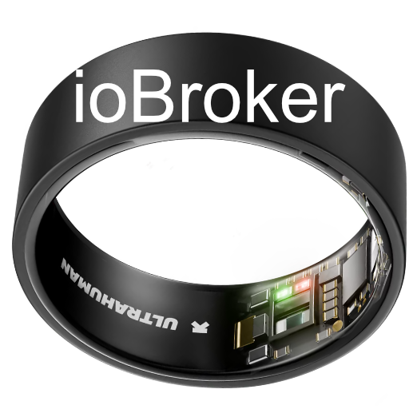

# IoBroker.ultrahuman
**Текущая версия адаптера:** 0.1.13

## Адаптер Ultrahuman Ring для ioBroker
Этот адаптер считывает показатели здоровья с вашего **кольца Ultrahuman** через [API партнера Ultrahuman](https://blog.ultrahuman.com/blog/accessing-the-ultrahuman-partnership-api/) и создает объекты ioBroker, которые можно использовать в визуализациях, скриптах и автоматизации.

**Подробное руководство (на немецком языке):** [Ultrahuman Ring im ioBroker – Schlaf, HRV & Gesundheitsdaten](https://smarterpapa.de/ultrahuman-ring-iobroker-adapter-gesundheitsdaten-smart-home/) (SmarterPapa.de) — установка, все параметры, примеры автоматизации, часто задаваемые вопросы.

Исходный код: [GitHub](https://github.com/SmarterPapa/ioBroker.ultrahuman)

**Сопровождающие:** Включите [[Доверенные издатели](https://docs.npmjs.com/trusted-publishers) для `iobroker.ultrahuman` (этот репозиторий GitHub). В релизах используется `ioBroker/testing-action-deploy@v1` на **Node.js 24** только с OIDC (без `npm-token`). См. [testing-action-deploy#19]](https://github.com/ioBroker/testing-action-deploy/issues/19).

### Установка
Установите адаптер через административный интерфейс ioBroker:

1. Откройте раздел **Адаптеры** в административной панели ioBroker.
2. Поиск **сверхчеловека**
3. Нажмите **Установить**

### Доступные метрики
| Канал | Штат | Описание | Единица измерения |
|-------------------|--------------------|-------------------------------|----------|
| `sleep` | `bedtimeStart` | Время, когда вы легли спать | ISO 8601 |
| `sleep` | `timeInBed` | Общее время в постели | мин |
| `sleep` | `timeAsleep` | Общее время сна | мин |
| `sleep` | `timeToFallAsleep` | Сколько времени потребовалось, чтобы заснуть | мин |
| `sleep` | `sleepEfficiency` | Эффективность сна | % |
| `sleep` | `sleepScore` | Оценка качества сна | |
| `sleep` | `sleepQuality` | Качество сна (отличное/хорошее/удовлетворительное/плохое) | |
| `sleep` | `remSleep` | Продолжительность REM-сна | мин |
| `sleep` | `deepSleep` | Продолжительность глубокого сна | мин |
| `sleep` | `lightSleep` | Продолжительность легкого сна | мин |
| `sleep` | `restorativeSleep` | Восстановительный сон (REM + глубокий) | % |
| `sleep` | `sleepCycles` | Полные циклы сна | |
| `heart` | `restingHR` | Частота сердечных сокращений в состоянии покоя (во время сна) | уд/мин |
| `heart` | `nightRHR` | Частота сердечных сокращений в состоянии покоя ночью | уд/мин |
| `heart` | `lastReading` | Последнее показание ЧСС | уд/мин |
| `heart` | `avg` / `min` / `max` | Статистика частоты сердечных сокращений | уд/мин |
| `heart` | `trend` | Динамика частоты сердечных сокращений | |
| `hrv` | `average` | Средняя вариабельность сердечного ритма | мс |
| `hrv` | `sleepHRV` | Средняя вариабельность сердечного ритма во время сна | мс |
| `hrv` | `min` / `max` | Статистика вариабельности сердечного ритма | мс |
| `hrv` | `trend` | Тренд вариабельности сердечного ритма | |
| `spo2` | `avg` / `min` / `max` | Статистика уровня кислорода в крови | % |
| `temperature` | `lastReading` | Последняя температура кожи | °C |
| `temperature` | `avg` / `min` / `max` | Статистика температуры | °C |
| `activity` | `steps` | Всего шагов сегодня | шагов |
| `activity` | `stepsAvg` | Среднее количество шагов | шагов |
| `activity` | `activeMinutes` | Активные минуты | мин |
| `activity` | `movementIndex` | Индекс движения | |
| `activity` | `recoveryIndex` | Индекс восстановления | |
| `activity` | `vo2Max` | VO2 max | мл/кг/мин|
| `info` | `connection` | Статус подключения к API | логическое значение |
| `info` | `lastUpdate` | Последнее успешное обновление | ISO 8601 |
| `info` | `lastUpdate` | Последнее успешное обновление | ISO 8601 |

### Предварительные условия
Вам необходим доступ к **API-интерфейсу партнеров Ultrahuman**:

1. Отправьте электронное письмо на адрес **feedback@ultrahuman.com** и запросите доступ к API для личного использования.
2. Вы получите **ключ API** и **код доступа**.
3. В приложении Ultrahuman перейдите в **Профиль > Настройки > Идентификатор партнера** и введите **Код доступа**.
4. Настройте **ключ API** и адрес электронной почты вашей учетной записи в настройках адаптера.

### Конфигурация
| Настройки | Описание | По умолчанию |
|--------------------|----------------------------------------------|---------|
| Секретный ключ API | Ключ авторизации API вашего партнера Ultrahuman | — |
| Электронная почта пользователя | Адрес электронной почты, привязанный к вашей учетной записи Ultrahuman | — |
| Интервал опроса | Как часто получать данные (в минутах) | 30 |

Минимальный интервал опроса составляет 5 минут. Поскольку данные кольца синхронизируются периодически (не в режиме реального времени), рекомендуется интервал в 30 минут.

### Поддерживать
Если этот адаптер окажется для вас полезным, рассмотрите возможность поддержки его разработки:

### Благодарности
Интеграция API основана на [сверхчеловеческая приборная панель](https://github.com/mt-krainski/ultrahuman-dashboard) Мэтта Крайнски (лицензия MIT).

## Changelog

### 0.1.13 (2026-04-11)

* Deploy uses **Node.js 24** with `testing-action-deploy@v1`; **Trusted Publishing** only (no `npm-token`), per maintainer note on [testing-action-deploy#19](https://github.com/ioBroker/testing-action-deploy/issues/19)

### 0.1.12 (2026-04-10)

* **0.1.12:** `testing-action-deploy@v1` with **`npm-token`** again (OIDC-only path breaks on `ubuntu-latest` during global npm upgrade); README documents **W3019** trade-off
* `common.news` trimmed to seven entries (W1032); **0.1.3** moved to history only via [CHANGELOG_OLD.md](CHANGELOG_OLD.md)

### 0.1.11 (2026-04-09)

* GitHub Releases: `ioBroker/testing-action-deploy@v1` with granular `NPM_TOKEN` (Bypass 2FA)
* Changelog lists **0.1.11** here; older releases in [CHANGELOG_OLD.md](CHANGELOG_OLD.md)
* Dependabot default cooldown 7 days; includes **0.1.9**–**0.1.10** fixes (integration tests, Admin `jsonConfig`)

### 0.1.8 (2026-03-27)

* `io-package.json` `common.news` reduced to 7 entries (ioBroker repository checker [W1032](https://github.com/ioBroker/ioBroker.repochecker))

### 0.1.7 (2026-03-26)

* Package `homepage` (npm) points to the [detailed German blog guide](https://smarterpapa.de/ultrahuman-ring-iobroker-adapter-gesundheitsdaten-smart-home/) on SmarterPapa.de
* README and ioBroker Admin (About tab) link to the same article; GitHub remains the `repository` URL

Older versions: [CHANGELOG_OLD.md](CHANGELOG_OLD.md).

## License

MIT License — see [LICENSE](LICENSE) for details.

Copyright (c) 2026 [SmarterPapa](https://smarterpapa.de)