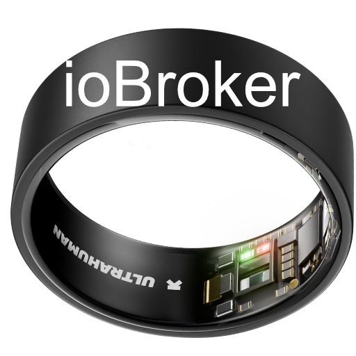

  

  

# ioBroker.ultrahuman

**Текущая версия адаптера:** 0.1.13

## Адаптер Ultrahuman Ring для ioBroker

Этот адаптер считывает показатели состояния вашего **кольца Ultrahuman Ring** через [API партнеров Ultrahuman](https://blog.ultrahuman.com/blog/accessing-the-ultrahuman-partnership-api/) и создает объекты ioBroker, которые можно использовать в визуализациях, скриптах и автоматизации.

**Подробное руководство (на немецком языке):** [Ultrahuman Ring im ioBroker – Schlaf, HRV & Gesundheitsdaten](https://smarterpapa.de/ultrahuman-ring-iobroker-adapter-gesundheitsdaten-smart-home/) (SmarterPapa.de) — установка, все данные, примеры автоматизации, часто задаваемые вопросы.

Исходный код: [GitHub](https://github.com/SmarterPapa/ioBroker.ultrahuman)

**Разработчики:** Включить [доверенных издателей](https://docs.npmjs.com/trusted-publishers) для`iobroker.ultrahuman` (этот репозиторий GitHub). В релизах используется`ioBroker/testing-action-deploy@v1` на **Node.js 24** только с OIDC (без`npm-token` См. [testing-action-deploy#19](https://github.com/ioBroker/testing-action-deploy/issues/19) .

### Установка

Установите адаптер через административный интерфейс ioBroker:

1. Откройте **адаптеры** в административной панели ioBroker.
2. Поиск **сверхчеловеческих способностей**
3. Нажмите **«Установить»**

### Доступные метрики

| Канал         | Состояние           | Описание                                                      | Единица         |
| ------------- | ------------------- | ------------------------------------------------------------- | --------------- |
| `sleep`       | `bedtimeStart`      | Пора тебе ложиться спать                                      | ISO 8601        |
| `sleep`       | `bedtimeEnd`        | Пора вставать                                                 | ISO 8601        |
| `sleep`       | `timeInBed`         | Общее время, проведенное в постели                            | мин             |
| `sleep`       | `timeAsleep`        | Общее время сна                                               | мин             |
| `sleep`       | `timeToFallAsleep`  | Сколько времени потребовалось, чтобы заснуть                  | мин             |
| `sleep`       | `sleepEfficiency`   | эффективность сна                                             | %               |
| `sleep`       | `sleepScore`        | Оценка качества сна                                           |                 |
| `sleep`       | `sleepQuality`      | Качество сна (отличное/хорошее/удовлетворительное/плохое)     |                 |
| `sleep`       | `remSleep`          | продолжительность фазы быстрого сна                           | мин             |
| `sleep`       | `deepSleep`         | Продолжительность глубокого сна                               | мин             |
| `sleep`       | `lightSleep`        | Продолжительность легкого сна                                 | мин             |
| `sleep`       | `restorativeSleep`  | Восстановительный сон (фаза быстрого сна + глубокий сон)      | %               |
| `sleep`       | `sleepCycles`       | Полные циклы сна                                              |                 |
| `heart`       | `restingHR`         | Частота сердечных сокращений в состоянии покоя (во время сна) | ударов в минуту |
| `heart`       | `nightRHR`          | Частота сердечных сокращений в состоянии покоя ночью          | ударов в минуту |
| `heart`       | `lastReading`       | Последнее показание ЧСС                                       | ударов в минуту |
| `heart`       | `avg` /`min` /`max` | Статистика частоты сердечных сокращений                       | ударов в минуту |
| `heart`       | `trend`             | Динамика частоты сердечных сокращений                         |                 |
| `hrv`         | `average`           | Средняя вариабельность сердечного ритма                       | РС              |
| `hrv`         | `sleepHRV`          | Средняя вариабельность сердечного ритма во время сна          | РС              |
| `hrv`         | `min` /`max`        | Статистика вариабельности сердечного ритма                    | РС              |
| `hrv`         | `trend`             | тренд вариабельности сердечного ритма                         |                 |
| `spo2`        | `avg` /`min` /`max` | Статистика уровня кислорода в крови                           | %               |
| `temperature` | `lastReading`       | Последняя температура кожи                                    | °С              |
| `temperature` | `avg` /`min` /`max` | Статистика температур                                         | °С              |
| `activity`    | `steps`             | Общее количество шагов сегодня                                | шаги            |
| `activity`    | `stepsAvg`          | Среднее количество шагов                                      | шаги            |
| `activity`    | `activeMinutes`     | Активные минуты                                               | мин             |
| `activity`    | `movementIndex`     | Индекс движения                                               |                 |
| `activity`    | `recoveryIndex`     | индекс восстановления                                         |                 |
| `activity`    | `vo2Max`            | VO2 max                                                       | мл/кг/мин       |
| `info`        | `connection`        | статус подключения к API                                      | логический      |
| `info`        | `lastUpdate`        | Последнее успешное обновление                                 | ISO 8601        |

### Предварительные требования

Вам необходим доступ к **API партнеров Ultrahuman** :

1. Отправьте электронное письмо на адрес **<feedback@ultrahuman.com>** и запросите доступ к API для личного использования.
2. Вы получите **ключ API** и **код доступа** .
3. В приложении Ultrahuman перейдите в **раздел Профиль > Настройки > Идентификатор партнера** и введите **код доступа** .
4. Укажите **ключ API** и адрес электронной почты вашей учетной записи в настройках адаптера.

### Конфигурация

| Параметр                       | Описание                                                                | По умолчанию |
| ------------------------------ | ----------------------------------------------------------------------- | ------------ |
| Секрет API                     | Ключ авторизации API вашего партнера Ultrahuman                         | —            |
| Электронная почта пользователя | Адрес электронной почты, привязанный к вашей учетной записи Ultrahuman. | —            |
| Интервал опроса                | Как часто следует получать данные (в минутах)                           | 30           |

Минимальный интервал опроса составляет 5 минут. Поскольку данные кольца синхронизируются периодически (не в режиме реального времени), рекомендуется интервал в 30 минут.

### Поддерживать

Если этот адаптер окажется для вас полезным, рассмотрите возможность поддержки его разработки:

### Благодарности

Интеграция API на основе [ultrahuman-dashboard](https://github.com/mt-krainski/ultrahuman-dashboard) от Мэтта Краински (лицензия MIT).

## Changelog

### 0.1.13 (2026-04-11)

* Deploy uses **Node.js 24** with `testing-action-deploy@v1`; **Trusted Publishing** only (no `npm-token`), per maintainer note on [testing-action-deploy#19](https://github.com/ioBroker/testing-action-deploy/issues/19)

### 0.1.12 (2026-04-10)

* **0.1.12:** `testing-action-deploy@v1` with **`npm-token`** again (OIDC-only path breaks on `ubuntu-latest` during global npm upgrade); README documents **W3019** trade-off
* `common.news` trimmed to seven entries (W1032); **0.1.3** moved to history only via [CHANGELOG_OLD.md](https://github.com/SmarterPapa/ioBroker.ultrahuman/blob/main/CHANGELOG_OLD.md)

### 0.1.11 (2026-04-09)

* GitHub Releases: `ioBroker/testing-action-deploy@v1` with granular `NPM_TOKEN` (Bypass 2FA)
* Changelog lists **0.1.11** here; older releases in [CHANGELOG_OLD.md](https://github.com/SmarterPapa/ioBroker.ultrahuman/blob/main/CHANGELOG_OLD.md)
* Dependabot default cooldown 7 days; includes **0.1.9**–**0.1.10** fixes (integration tests, Admin `jsonConfig`)

### 0.1.8 (2026-03-27)

* `io-package.json` `common.news` reduced to 7 entries (ioBroker repository checker [W1032](https://github.com/ioBroker/ioBroker.repochecker))

### 0.1.7 (2026-03-26)

* Package `homepage` (npm) points to the [detailed German blog guide](https://smarterpapa.de/ultrahuman-ring-iobroker-adapter-gesundheitsdaten-smart-home/) on SmarterPapa.de
* README and ioBroker Admin (About tab) link to the same article; GitHub remains the `repository` URL

Older versions: [CHANGELOG_OLD.md](https://github.com/SmarterPapa/ioBroker.ultrahuman/blob/main/CHANGELOG_OLD.md).

## License

MIT License — see [LICENSE](https://github.com/SmarterPapa/ioBroker.ultrahuman/blob/main/LICENSE) for details.

Copyright (c) 2026 [SmarterPapa](https://smarterpapa.de)