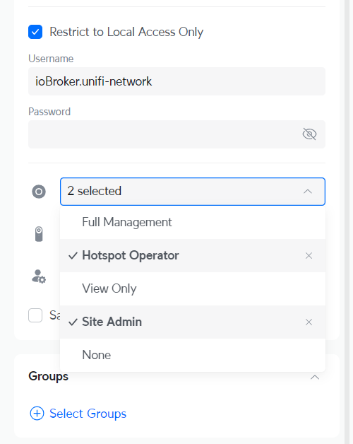

# ioBroker.unifi-network

## адаптер unifi-network для ioBroker

Компания Unifi Network использует интерфейс WebSocket для получения информации в режиме реального времени от приложения unifi-network.

## Важный

1. Адаптер разработан исключительно на базе операционной системы UniFi. Совместимость с самостоятельно установленным сетевым контроллером должна быть обеспечена, но гарантировать её не удаётся.

2. **Этот адаптер может потреблять очень много ресурсов!**  Это зависит от вашей среды, то есть от количества устройств и клиентов UniFi в вашей сети. На это можно частично повлиять с помощью API реального времени.`debounce time [s]` Этот параметр находится в настройках адаптера. События в реальном времени не затрагиваются этой настройкой, только «циклическое» обновление устройств, клиентов и т. д. в реальном времени.

3. **Не все состояния становятся доступны сразу после запуска адаптера.**  Состояния создаются и обновляются только тогда, когда данные отправляются сетевым контроллером; это может занять некоторое время до первой отправки данных.

## Конфигурация

### Локальный пользователь (UniFi OS)

Для входа в систему вам потребуется локальный пользователь, созданный в консоли UniFi OS. Пользователи Ubiquiti SSO Cloud не подойдут. Рекомендуется использовать администратора или пользователя с полными правами на чтение/запись, чтобы максимально эффективно использовать интеграцию, но это не обязательно.

1. Войдите в локальный портал на вашем устройстве UniFi OS и нажмите «Пользователи».\
   &#x20;**Примечание** : Это **необходимо** сделать из операционной системы UniFi, получив доступ к ней напрямую по IP-адресу (например, 192.168.1.1), а не через unifi.ui.com или приложение UniFi Network.

2. В меню слева перейдите в раздел **«Администраторы и пользователи»** и выберите вкладку «Администраторы» или перейдите по адресу \[IP-адрес]/admins/ (например, 192.168.1.1/admins/).

3. Нажмите на значок **«+»** в правом верхнем углу и выберите **«Добавить администратора»** .

4. Выберите **«Ограничить доступ только для локального доступа»** и введите новое имя пользователя и пароль.

5. Для роли в сети выберите **«Оператор точки доступа»** и **«Администратор сайта»** .\
   &#x20;**Примечание:** Это не является абсолютно необходимым. Если прав доступа недостаточно, вы получите уведомление в журнале событий.

## Changelog

<!--
	Placeholder for the next version (at the beginning of the line):
	### **WORK IN PROGRESS**
-->

### **WORK IN PROGRESS**
- (Scrounger) channel / device name undefined bug fix #116
- (Scrounger) vpn client handling optimized
- (Scrounger) event messages improved #122 #115

### 1.5.0 (2026-06-23)

- (Scrounger) vpn event handler for network >= 10.3.x added #89
- (Scrounger) event messages improved #109, #91
- (Scrounger) typescript 6.x bug fixes
- (Scrounger) dependencies updated
- (ioBrokerTranslator) spanish language added #98
- (Scrounger) bug fix for expired token since v10.4.57 #108
- (copilot) Adapter requires node.js >= 22 now

### 1.4.0 (2026-04-08)

- (Scrounger) bug fix for speed test event spamming since v.10.2.105
- (Scrounger) event messages improved #68 #54
- (Scrounger) dependencies updated
- (Scrounger) support for Unifi OS on custom port added (e.g. UniFi OS Server) #65
- (Scrounger) bug fix: vpn is wrongly shown as lan
- (Scrounger) system informations added #63
- (Scrounger) port states up, rx/tx error and rx/tx dropped added
- (Scrounger) event messages improved #64
- (Scrounger) read controller version added #59
- (Scrounger) option to set debug level for client connection events added #61
- (Scrounger) property version for devices added
- (Scrounger) satisfaction object create condition removed to prevent create and deletion of object
- (Scrounger) event messages for dream machines compatibility < v10.x added #72
- (Scrounger) weblate translation added
- (Scrounger) downgrade @iobroker/adapter-core to v3.3.1 to prevent conflicts with js-controller < v7.1.0 in rare cases #56

### 1.3.1 (2025-12-01)

- (Scrounger) null bug fix #48
- (Scrounger) dependencies updated
- (Scrounger) event messages improved #46
- (Scrounger) bug fixes

### 1.3.0 (2025-11-24)

- (Scrounger) event messages improved #46
- (Scrounger) option to change tx power mode of access point channels
- (Scrounger) dependencies updated
- (Scrounger) code optimized
- (Scrounger) logging optimized

### 1.2.2 (2025-11-14)

- (Scrounger) delete device event added
- (Scrounger) event messages improved #43

[Older changelogs can be found there](https://github.com/Scrounger/ioBroker.unifi-network/blob/main/CHANGELOG_OLD.md)

## License

MIT License

Copyright (c) 2025-2026 Scrounger <scrounger@gmx.net>

Permission is hereby granted, free of charge, to any person obtaining a copy
of this software and associated documentation files (the "Software"), to deal
in the Software without restriction, including without limitation the rights
to use, copy, modify, merge, publish, distribute, sublicense, and/or sell
copies of the Software, and to permit persons to whom the Software is
furnished to do so, subject to the following conditions:

The above copyright notice and this permission notice shall be included in all
copies or substantial portions of the Software.

THE SOFTWARE IS PROVIDED "AS IS", WITHOUT WARRANTY OF ANY KIND, EXPRESS OR
IMPLIED, INCLUDING BUT NOT LIMITED TO THE WARRANTIES OF MERCHANTABILITY,
FITNESS FOR A PARTICULAR PURPOSE AND NONINFRINGEMENT. IN NO EVENT SHALL THE
AUTHORS OR COPYRIGHT HOLDERS BE LIABLE FOR ANY CLAIM, DAMAGES OR OTHER
LIABILITY, WHETHER IN AN ACTION OF CONTRACT, TORT OR OTHERWISE, ARISING FROM,
OUT OF OR IN CONNECTION WITH THE SOFTWARE OR THE USE OR OTHER DEALINGS IN THE
SOFTWARE.