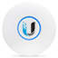

# IoBroker.unifi
Этот адаптер ioBroker позволяет осуществлять мониторинг и ограниченное управление [Устройства UniFi](http://www.ubnt.com/), например точками доступа UniFi WiFi, с помощью общедоступного веб-API UniFi Controller.

## Конфигурация
### Минимальная необходимая информация
Для запуска этого адаптера необходима следующая информация:

* IP-адрес и порт вашего контроллера UniFi (оставьте порт пустым, если ваш контроллер работает на UbiOS (например, UDM Pro))
* Имя пользователя и пароль (2FA не поддерживается)
* Интервал обновления

По умолчанию информация обновляется каждые 60 секунд. В зависимости от вашего оборудования ioBroker и размера вашей сети (количество клиентов, устройств UniFi и т. Д.) Не рекомендуется дополнительно уменьшать интервал.

### Фильтровать объекты
Адаптер обновляет как можно больше информации с вашего контроллера UniFi, но предлагает возможность ограничить обновленную информацию.

Можно отключить обновление выбранной информации или отфильтровать определенные объекты этой информации.

| Информация | Объекты фильтруются по |
|-------------|-----------------------------------------|
| Клиенты | Имя, имя хоста, IP-адрес, MAC-адрес |
| Устройства | Имя, IP-адрес, MAC-адрес |
| WLAN | Имя |
| Сети | Имя |
| Здоровье | Подсистема |

## Контроль
### Включение / отключение WLAN
Изменяя состояние «включено» WLAN, можно включить / отключить его. Через несколько секунд изменение будет внесено в точки доступа.

### Создание ваучера
Используя кнопку «vouchers.create_vouchers», можно создавать предопределенные ваучеры. Можно настроить количество создаваемых ваучеров, срок действия ваучеров, а также установить лимиты на загрузку и скачивание.

## Отсутствующие точки данных
Адаптер использует [узел-унифи](https://github.com/jens-maus/node-unifi) для подключения к вашему контроллеру UniFi. Чтобы упростить ситуацию, не все доступные точки данных загружаются в ваш ioBroker. Если вам не хватает точек данных, используйте следующие URL-адреса для проверки API. (Примечание: вы должны заменить IP, ПОРТ и САЙТ своими настройками)

| Информация | URL API |
|-------------|---------------------------------------------|
| Сайты | https:// IP: ПОРТ / api / self / sites |
| SysInfo | https:// IP: ПОРТ / api / s / SITE / stat / sysinfo |
| Клиенты | https:// IP: ПОРТ / api / s / SITE / stat / sta |
| Устройства | https:// IP: ПОРТ / api / s / SITE / stat / device |
| WLAN | https:// IP: ПОРТ / api / s / SITE / rest / wlanconf |
| Сети | https:// IP: ПОРТ / api / s / SITE / rest / networkconf |
| Здоровье | https:// IP: PORT / api / s / SITE / stat / health |
| Ваучеры | https:// IP: PORT / api / s / SITE / stat / voucher |
| DPI | https:// IP: ПОРТ / api / s / SITE / stat / dpi |
| Сигнализация | https:// IP: ПОРТ / api / s / SITE / stat / alarm |

### Конечные точки UbiOS
| Информация | URL API |
|-------------|------------------------------------------------------|
| Сайты | https:// IP / прокси / сеть / api / self / sites |
| SysInfo | https:// IP / прокси / сеть / api / s / SITE / stat / sysinfo |
| Клиенты | https:// IP / прокси / сеть / api / s / SITE / stat / sta |
| Устройства | https:// IP / прокси / сеть / api / s / SITE / stat / device |
| WLAN | https:// IP / прокси / сеть / api / s / SITE / rest / wlanconf |
| Сети | https:// IP / прокси / сеть / api / s / SITE / rest / networkconf |
| Здоровье | https:// IP / прокси / сеть / api / s / SITE / stat / health |
| Ваучеры | https:// IP / прокси / сеть / api / s / SITE / stat / voucher |
| DPI | https:// IP / прокси / сеть / api / s / SITE / stat / dpi |
| Сигнализация | https:// IP / прокси / сеть / api / s / SITE / stat / alarm |

## Известные проблемы
* Состояние is_wired клиентов неверно после того, как клиент перешел в автономный режим. Это известная проблема контроллера UniFi, не связанная с адаптером. (см. https://community.ui.com/questions/Wireless-clients-shown-as-wired-clients/49d49818-4dab-473a-ba7f-d51bc4c067d1)

## Рекомендации
Этот адаптер использует функции следующих сторонних модулей nodejs:

* [узел-unifi] (https://github.com/jens-maus/node-unifi)
* [json-logic-js] (https://github.com/jwadhams/json-logic-js)

## Changelog
<!--
    Placeholder for the next version (at the beginning of the line):
    ### **WORK IN PROGRESS**
-->
### 0.5.9 (2021-05-07)
* (jens-maus) Fixed all js-controller 3.3 related state warnings
* (kirovilya, jens-maus) Added device state object with dedicated states list.
* (jens-maus) Updated node-unifi to latest version
* (jens-maus) Updated dependencies

### 0.5.8 (2020-08-29)
* (braindead1) Fixed problems related to unused sites
* (braindead1) Fixed some errors reported via Sentry

### 0.5.7 (2020-07-27)
* (braindead1) Fixed Sentry errors caused by not updated configuration after update

### 0.5.6 (2020-07-25)
* (Scrounger, braindead1) Implemented Alarms, DPI & Gateway Traffic
* (braindead1) Prevented creation of ghost clients caused by iOS MAC randomization
* (dklinger) Implemented manual update trigger
* (braindead1) Implemented deletion of used vouchers
* (braindead1) Fixed some errors reported via Sentry

### 0.5.5 (2020-06-13)
* (braindead1) Fixed some errors reported via Sentry

### 0.5.4 (2020-06-06)
* (braindead1) Implemented offset for is_online
* (braindead1) Fixed some issues related to is_online
* (braindead1) Prepared whitelisting of clients etc.

### 0.5.2 (2020-05-23)
* (jens-maus) Implemented UniFiOS/UDM-Pro support
* (braindead1) Implemented possibility to enable/disable WLANs
* (braindead1) Implemented voucher creation
* (braindead1) Implemented online state for clients
* (braindead1) Updated client states
* (braindead1) Updated device states
* (braindead1) Improved error messages

### 0.5.0 (2020-05-09)
* (braindead1) Implemented configuration of updates
* (braindead1) Improved JsonLogic
* (braindead1) Removed legacy code
* (braindead1) Implemented Sentry

### 0.4.3 (2020-04-24)
* (braindead1) fixed configuration issue

### 0.4.2 (2020-04-23)
* (braindead1) subsystem issue fixed

### 0.4.1 (2020-04-16)
* (braindead1) Enhanced refactoring

### 0.4.0 (2020-04-16)
* (bluefox) Refactoring
  
### 0.3.1
* (jens-maus) added support for multi-site environments.

### 0.3.0
* (jens-maus) added access device data query and moved the client devices to the 'clients' subtree instead

### 0.2.1
* (jens-maus) minor fixes

### 0.2.0
* (jens-maus) moved `lib/unifi.js` to dedicated node-unifi nodejs class and added it as a dependency.

### 0.1.0
* (jens-maus) implemented a first basically working version which can retrieve status information from a UniFi controller.

### 0.0.1
* (jens-maus) initial checkin of non-working development version

## License
The MIT License (MIT)

Copyright (c) 2020 braindead1 &lt;os.braindead1@gmail.com&gt;
Copyright (c) 2016-2020 Jens Maus &lt;mail@jens-maus.de&gt;

Permission is hereby granted, free of charge, to any person obtaining a copy
of this software and associated documentation files (the "Software"), to deal
in the Software without restriction, including without limitation the rights
to use, copy, modify, merge, publish, distribute, sublicense, and/or sell
copies of the Software, and to permit persons to whom the Software is
furnished to do so, subject to the following conditions:

The above copyright notice and this permission notice shall be included in
all copies or substantial portions of the Software.

THE SOFTWARE IS PROVIDED "AS IS", WITHOUT WARRANTY OF ANY KIND, EXPRESS OR
IMPLIED, INCLUDING BUT NOT LIMITED TO THE WARRANTIES OF MERCHANTABILITY,
FITNESS FOR A PARTICULAR PURPOSE AND NONINFRINGEMENT. IN NO EVENT SHALL THE
AUTHORS OR COPYRIGHT HOLDERS BE LIABLE FOR ANY CLAIM, DAMAGES OR OTHER
LIABILITY, WHETHER IN AN ACTION OF CONTRACT, TORT OR OTHERWISE, ARISING FROM,
OUT OF OR IN CONNECTION WITH THE SOFTWARE OR THE USE OR OTHER DEALINGS IN
THE SOFTWARE.