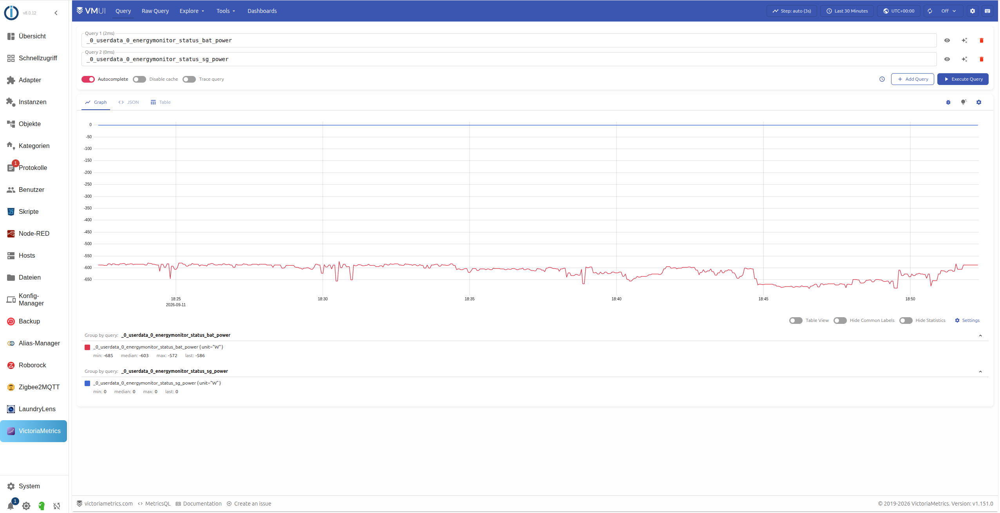

# IoBroker.victoriametrics
<!-- Эти значки должны быть одобрены официальным репозиторием ioBroker или Weblate, поэтому пока не работают - раскомментируйте, как только будет выполнен любой из этих шагов: -->

Записывает историю данных ioBroker непосредственно в [VictoriaMetrics](https://victoriametrics.com/) - через его [API для импорта JSON-строк](https://docs.victoriametrics.com/#how-to-import-data-in-json-line-format), используя реальные метки Prometheus вместо суффиксов имен полей (как, например, при записи через слой совместимости InfluxDB, например, `Living_Room_Temperature_value`).

Адаптер буферизует и записывает изменения точек данных в VictoriaMetrics, а также отвечает на запросы `getHistory()` (чтобы виджеты диаграмм vis могли напрямую обращаться к этому адаптеру) - подробности и известные ограничения см. в [Путь чтения](#read-path) ниже. Для визуализации вне vis (например, Grafana) вместо этого обращайтесь к VictoriaMetrics напрямую через PromQL. Этот адаптер пока не включен в официальный репозиторий ioBroker.

Документация на других языках: [немецкий](https://github.com/seaspotter/ioBroker.victoriametrics/blob/main/docs/de/victoriametrics.md)

## Требования
- Запущенный экземпляр VictoriaMetrics (одноузловой), доступный по протоколу HTTP(S) - см.

[Установка VictoriaMetrics](#installing-victoriametrics) ниже

- ioBroker js-controller >= 6.0.11, Admin >= 7.0.23

## Установка VictoriaMetrics
VictoriaMetrics работает как единый, самодостаточный бинарный/Docker-образ - отдельная настройка сервера базы данных, как в случае с InfluxDB, не требуется. Официальные руководства по установке для всех платформ (бинарный файл Linux, Docker, Helm-диаграмма Kubernetes и т. д.): см. [Документация VictoriaMetrics](https://docs.victoriametrics.com/victoriametrics/single-server-victoriametrics/).

### Через Docker
```bash
docker run -d --name victoriametrics \
  -p 8428:8428 \
  -v victoria-metrics-data:/victoria-metrics-data \
  victoriametrics/victoria-metrics:latest \
  --storageDataPath=/victoria-metrics-data \
  --retentionPeriod=100y
```

VictoriaMetrics становится доступна по адресу `http://<docker-host>:8428` (проверка работоспособности: `http://<docker-host>:8428/health`, VMUI: `http://<docker-host>:8428/vmui/`). Официальный образ Docker: [victoriametrics/victoria-metrics на Docker Hub](https://hub.docker.com/r/victoriametrics/victoria-metrics/).
Для постоянной работы используйте монтирование тома/привязки для `-storageDataPath` (см. выше) и, в зависимости от вашей среды, `docker-compose.yml` с `restart: unless-stopped`.

### Без Docker
Загрузите статически скомпилированный исполняемый файл для вашей платформы из [Страница релизов GitHub](https://github.com/VictoriaMetrics/VictoriaMetrics/releases), распакуйте его и запустите:

```bash
./victoria-metrics-prod --storageDataPath=/path/to/data --retentionPeriod=100y
```

Подробные инструкции по установке (включая службу systemd, Kubernetes, настройку кластера) находятся в разделе [официальная документация](https://docs.victoriametrics.com/victoriametrics/single-server-victoriametrics/#how-to-start-victoriametrics).

## Конфигурация
### Вкладка "Подключение"
| Поле | Описание |
|-------|--------------|
| Протокол | `http` или `https` |
| Порт | По умолчанию: `8428` |
| Использовать базовую аутентификацию | Включает имя пользователя/пароль (VictoriaMetrics `-httpAuth.*`) |
| Использовать базовую аутентификацию | Включает ввод имени пользователя/пароля (VictoriaMetrics `-httpAuth.*`) |
| Тайм-аут (мс) | Тайм-аут HTTP-запроса |

Кнопка «Проверить соединение» проверяет конечную точку VictoriaMetrics `/health`, используя введенные (еще не сохраненные) значения; в случае успеха отображается также текущий настроенный срок хранения.

При запуске адаптера также регистрируется текущая настроенная продолжительность хранения на сервере виртуальной машины (`VictoriaMetrics reachable at ... (Retention: 100y)`) - отображение только для чтения; см. [Удержание](#retention) ниже, почему это нельзя изменить через адаптер.

В левой боковой панели ioBroker.admin также появляется пункт меню **"VictoriaMetrics"** (аналогично Node-RED/Zigbee2MQTT), который встраивает VMUI (собственный веб-интерфейс VictoriaMetrics для выполнения запросов PromQL, построения графиков и т. д.) непосредственно по адресу `http://<host>:<port>/vmui/`. **Примечание:** если ioBroker.admin работает по HTTPS, а VictoriaMetrics - только по HTTP, браузер блокирует встраивание (защита от смешанного контента), и вместо этого открывается пустая страница. Единственное решение - сделать VictoriaMetrics доступной и по HTTPS - внутри адаптера нет обходного пути.



### Вкладка "Запись поведения"
| Поле | Описание |
|-------|--------------|
| Интервал записи (секунды) | Как часто буферизованные значения записываются в пакете |
| Максимальный размер буфера (в пунктах) | При достижении этого размера немедленно запускается запись |

### Включение истории для точки данных
В дереве объектов откройте вкладку «История» для нужной точки данных, выберите этот адаптер и включите его с помощью переключателя «Включено».

| Поле | Описание |
|-------|--------------|
| Время задержки (мс, необязательно) | Регистрирует значение только после того, как оно останется неизменным в течение заданного времени (ожидает «стабилизированного» значения перед записью) |
| Время записи блока (мс, необязательно) | Игнорирует новые значения в течение заданного времени после последнего записанного значения (ограничение скорости) |
| Игнорировать значения ниже/выше (необязательно) | Пороговый фильтр, например, для отбрасывания очевидных выбросов от датчика |
| Игнорировать нулевые значения (0) | Пропускает значения, равные ровно 0 |
| Название метрики (необязательно) | Переопределяет метрику (`__name__`), автоматически вычисляемую на основе идентификатора объекта, см. ниже |
| Округлить до десятичных знаков (необязательно) | Округляет значение перед записью; оставьте поле пустым, если округление не выполняется |
| Минимальное изменение (необязательно) | Значения, отличающиеся от последнего записанного значения менее чем на эту величину, не записываются; оставьте поле пустым, если фильтрация не применяется |
| Записывать только изменения в журнал | Записывает значение только в том случае, если оно отличается от последнего записанного значения |
| Интервал повторной записи (мс, необязательно) | Действует только при включенной опции "Записывать только изменения": неизмененное значение записывается повторно не позднее указанного времени, поэтому на графиках не отображаются пробелы |

Фильтры «Время задержки» и «Время блокировки» можно комбинировать с другими фильтрами: «Время задержки» задерживает запись до тех пор, пока значение не стабилизируется на некоторое время; «Время блокировки» ограничивает частоту записи точки данных, независимо от того, изменяется она или нет. Фильтр «Только изменения в логе» можно использовать независимо от фильтра «Минимальное изменение»: первый записывает данные только при *точном* изменении значения (с возможностью периодической повторной записи в лог), второй фильтрует изменения ниже *порогового значения*.

### Вкладка "Настройки по умолчанию"
Те же поля (за исключением имени метрики) можно также задать **для всего экземпляра** на вкладке конфигурации экземпляра "По умолчанию". Они применяются ко всем точкам данных, которые не задают собственное поле на вкладке "История" - поэтому не каждую точку данных нужно настраивать отдельно. Собственное значение точки данных всегда переопределяет значение по умолчанию для всего экземпляра.

## Вывод названий метрик
Название метрики Prometheus (`__name__`) определяется следующим образом:

1. Если на вкладке «История» указано имя метрики (`aliasId`), оно будет использовано.
2. В противном случае используется **идентификатор объекта ioBroker** (а не имя объекта, поскольку оно может измениться).

незаметно и молча разделили временной ряд.

Выбранное имя затем нормализуется: оно преобразуется в нижний регистр, `.` становится `_`, любая последовательность недопустимых символов сводится к одной `_`, начальные и конечные `_` удаляются, и `_` добавляется в начало, если результат начинается с цифры.

Пример: `javascript.0.Room Temperature` → `javascript_0_room_temperature`. Для короткого описательного имени, например `room_temperature`, используйте поле **имя метрики**.

## Обработка типов данных
Показатели VictoriaMetrics по своей сути являются числовыми:

- **Числа** записываются без изменений.
- **Логические значения** преобразуются в `0.0`/`1.0`.
- Строки интерпретируются как число (например, `"21.5"` → `21.5`); строки, которые не могут быть интерпретированы

Пропускаются с предупреждением в логе (строковая метка не записывается, чтобы избежать чрезмерного увеличения мощности множества).

Метка `unit` также устанавливается автоматически, если объект ioBroker определяет единицу измерения (`common.unit`).

## Защита от потери соединения и потери данных
Значения сначала собираются в буфер и записываются в VictoriaMetrics пакетом с заданным интервалом записи (или после достижения максимального размера буфера).

Если операция записи завершается неудачей (например, виртуальная машина недоступна), счетчик ошибок увеличивается для каждой затронутой точки данных:

- Если значение счетчика не равно `10`, точка снова буферизуется и попытка повтора выполняется на следующем интервале.
- После достижения значения «10» точка сбрасывается, и счетчик перезагружается (предотвращает неограниченный буфер).

рост, в то время как виртуальная машина остается недоступной).

Буфер также сохраняется при корректном завершении работы адаптера и (с ограничением частоты обновления до одного раза в минуту) после неудачных попыток записи, поэтому при серьезном сбое (например, перезапуске контейнера) данные не теряются при нормальных обстоятельствах.

## Путь чтения
Адаптер отвечает на запросы `getHistory()` (так это называется в виджетах диаграмм vis), считывая точки данных запрошенной метрики из VictoriaMetrics и передавая их в общую библиотеку [`@iobroker/aggregate`](https://github.com/ioBroker/aggregate) - ту же самую библиотеку, которую `iobroker.influxdb`, `iobroker.sql` и `iobroker.history` используют для агрегирования по интервалам (среднее/минимум/максимум/всего/количество/процентиль/...), обработки пропусков и интерполяции границ. Это означает, что все стандартные типы агрегирования работают без необходимости переписывать логику работы с интервалами.

**Передача данных на стороне сервера:** для методов агрегации `average`, `min`, `max`, `total` и `count` с известным временем `step` VictoriaMetrics вычисляет результат самостоятельно с помощью PromQL (`avg_over_time`, `min_over_time`, `max_over_time`, `sum_over_time`, `count_over_time`) - адаптер затем передает только готовые значения сегментов, а не каждую исходную точку. Для `onchange`/`none`/`minmax`, а также `percentile`/`quantile`/`integral` (прямого эквивалента в PromQL нет), и всякий раз, когда передача данных вниз не удается, происходит прозрачный возврат к пути необработанных данных (`/api/v1/export` + агрегация на стороне JavaScript).

** `id: '*'`:** возвращает последние необработанные значения по всем точкам данных, *в настоящее время включенным в администрирование* (а не по «осиротевшим» метрикам из точек данных, отключенных в данный момент), каждая из которых имеет поле `id`. Агрегирование в этом случае не поддерживается (не имеет смысла для разных метрик) - всегда возвращаются необработанные значения.

**Дополнительные известные ограничения:**

- Ответы не содержат `ack`/`q`/`from` - адаптер не хранит эти поля.

VictoriaMetrics во всех отношениях

- Перед выполнением запроса не выполняется предварительная очистка буферизованных значений, которые еще не были записаны (в отличие от...).

`iobroker.influxdb`) - вызов `getHistory()` сразу после изменения состояния может не увидеть новое значение до следующего интервала записи

### Доступ из JavaScript-адаптера
```javascript
// Last 50 raw values
sendTo('victoriametrics.0', 'getHistory', {
    id: 'javascript.0.exampleValue',
    options: {
        end: Date.now(),
        count: 50,
        aggregate: 'onchange',
    }
}, function (result) {
    for (var i = 0; i < result.result.length; i++) {
        console.log(result.result[i].ts + ' ' + result.result[i].val);
    }
});

// Hourly average of the last 24h
var end = Date.now();
sendTo('victoriametrics.0', 'getHistory', {
    id: 'javascript.0.exampleValue',
    options: {
        start: end - 24 * 3600000,
        end: end,
        aggregate: 'average',
        step: 3600000,
    }
}, function (result) {
    console.log(JSON.stringify(result.result));
});

// Last 20 raw values across all enabled datapoints
sendTo('victoriametrics.0', 'getHistory', {
    id: '*',
    options: {
        end: Date.now(),
        count: 20,
        addId: true,
    }
}, function (result) {
    for (var i = 0; i < result.result.length; i++) {
        console.log(result.result[i].id + ' ' + result.result[i].val);
    }
});
```

Поддерживаемые поля `options` и значения `aggregate` соответствуют стандарту ioBroker (см. [документация `iobroker.history`](https://github.com/ioBroker/ioBroker.history#access-values-from-javascript-adapter) для получения полной информации) - с ограничениями, указанными выше.

## Управление данными / интерфейсы скриптов
Адаптер также обрабатывает три дополнительные команды сообщений ioBroker (`sendTo`), например, для скриптов или инструментов миграции:

### Функции
Обнаружение возможностей:

```javascript
sendTo('victoriametrics.0', 'features', {}, function (result) {
    console.log(JSON.stringify(result.supportedFeatures)); // ['storeState', 'deleteAll']
});
```

### StoreState
Записывает одну или несколько исторических точек, например, для импорта старой истории из другого источника (например, InfluxDB):

```javascript
sendTo('victoriametrics.0', 'storeState', {
    id: 'javascript.0.exampleValue',
    state: { ts: 1690000000000, val: 512.3 },
    rules: true, // apply rounding + threshold/zero filters (see below)
}, result => console.log(JSON.stringify(result)));

// also as a batch for the same id:
sendTo('victoriametrics.0', 'storeState', {
    id: 'javascript.0.exampleValue',
    state: [
        { ts: 1690000000000, val: 512.3 },
        { ts: 1690000060000, val: 498.1 },
    ],
}, result => console.log(JSON.stringify(result)));

// or as an array of multiple ids:
sendTo('victoriametrics.0', 'storeState', [
    { id: 'javascript.0.a', state: { ts: 1690000000000, val: 1 } },
    { id: 'javascript.0.b', state: { ts: 1690000000000, val: 2 } },
], result => console.log(JSON.stringify(result)));
```

`rules: true` применяет фильтры округления и порогового значения/нулевого значения (проверка достоверности значения, также полезна для импорта); время задержки/время блокировки/минимальное изменение **всегда** игнорируются, поскольку они предназначены для изменений состояния в реальном времени и не имеют смысла для массового импорта данных задним числом. Для работы с историей в реальном времени точка данных в данный момент не требуется. При частичном сбое ответ - `{error, errors: [...], successCount}`, при полном успехе - `{success: true, successCount}`.

### DeleteAll
Удаляет всю историю точки данных, хранящуюся в VictoriaMetrics:

```javascript
sendTo('victoriametrics.0', 'deleteAll', { id: 'javascript.0.exampleValue' },
    result => console.log(JSON.stringify(result)));

// also as an array of multiple ids:
sendTo('victoriametrics.0', 'deleteAll', [
    { id: 'javascript.0.a' },
    { id: 'javascript.0.b' },
], result => console.log(JSON.stringify(result)));
```

**Преднамеренно не реализовано:** `delete`/`deleteRange`/`update` (удаление/редактирование отдельных точек, как это предлагается в административном интерфейсе InfluxDB при щелчке по точке на графике).
Технически VictoriaMetrics не может удалять или редактировать отдельные точки данных - только целые временные ряды путем сопоставления меток, поскольку хранение основано на неизменяемых, отсортированных по времени блоках (как в Prometheus). «Удаление одной точки» на самом деле привело бы к удалению всего временного ряда - это было бы неожиданно и опасно, поэтому эта функция намеренно опущена.

## Удержание
Функция сохранения данных VictoriaMetrics представляет собой **стартовый флаг на стороне сервера** (`-retentionPeriod`) самого процесса виртуальной машины, который нельзя изменить во время выполнения через HTTP API (в отличие, например, от InfluxDB, где адаптер может активно устанавливать значение через `ALTER RETENTION POLICY`). Поэтому этот адаптер отображает только текущее настроенное значение сохранения данных в режиме только для чтения - чтобы изменить его, необходимо перезапустить виртуальную машину с другим значением `-retentionPeriod` (в Docker: измените параметр `--retentionPeriod=...` в `docker run`/`docker-compose.yml` и пересоздайте контейнер).

Текущий срок хранения отображается в трех местах (все доступны только для чтения, считывается один раз с конечной точки `/flags` при запуске адаптера):

- Точка данных ** `<instance>.info.retention` ** (строка, например, `"100y"`) - для скриптов/визуализации
- Запись в журнале при запуске (`VictoriaMetrics доступна по адресу ... (Срок хранения: 100 лет)`)
- Сообщение об успешном завершении нажатия кнопки **«Проверить соединение»** на вкладке «Соединение».

**Подробности:**

- **Срок хранения по умолчанию**, если параметр `-retentionPeriod` не задан: **1 месяц (31 день)**.
- **Минимальное**: 24 часа/1 день. VictoriaMetrics не поддерживает "неограниченное" удержание пользователей.

В строгом смысле, но возможны произвольно высокие значения, например, `-retentionPeriod=100y`.

- Данные удаляются **для каждого раздела по месяцам**, в первый день каждого нового месяца - а не

Сразу после достижения лимита. Таким образом, максимальное использование диска составляет `retentionPeriod + 1 month`.

- Срок хранения данных может быть **продлён** в любое время без потери данных. Если это необходимо

**Сокращено**, данные, превышающие новый лимит, будут удалены при следующем изменении в следующем месяце.

- Подробная информация: [Документация VictoriaMetrics, раздел "Удержание пользователей"](https://docs.victoriametrics.com/victoriametrics/single-server-victoriametrics/#retention).

## Другие известные ограничения
- Отсутствует поддержка нескольких кластеров (vminsert/vmselect) - только для одноузловых целевых систем.
- Бесплатные, настраиваемые для каждой точки данных дополнительные метки (помимо `unit`) не реализованы.

## Разработка
| Сценарий | Описание |
|--------|--------------|
| `npm run lint` | ESLint |
| `npm run test:js` | Модульные тесты |
| `npm run test:package` | Проверяет `package.json`/`io-package.json` |
| `npm run dev-server` | Запускает [`dev-server`](https://github.com/ioBroker/dev-server) для локального тестового запуска, включая административный интерфейс |
| `npm run release` | Выпускает релиз (увеличение версии, синхронизация журнала изменений/новостей, тег git) через [`@alcalzone/release-script`](https://github.com/AlCalzone/release-script) |
| `npm run release` | Выполняет релиз (увеличение версии, синхронизация журнала изменений/новостей, добавление тега git) через [`@alcalzone/release-script`](https://github.com/AlCalzone/release-script) |

## Changelog
### 0.4.5 (2026-10-02)
* (SeaSpotter) Translated one remaining German error string in `getHistory`'s invalid-id response (`lib/history.js`) that the review's log/sendTo/errors.push sweep had missed - it's returned to the caller via `sendTo`, same category as the `dataManagement.js` fix in 0.4.4
* (SeaSpotter) Added full i18n names for the `info` channel and the `adminTab` (flagged by the official repo review's object-structure check)

### 0.4.4 (2026-09-11)
* (SeaSpotter) Addressed maintainer review findings: translated all remaining German log/error messages to English, fixed the `cache` object's German-only name to a full i18n object, replaced the German `"zeitreihe"` keyword with `"timeseries"`, added code-level validation for `writeInterval`/`requestTimeout` against Node.js' timer maximum
* (SeaSpotter) CI: added Node.js 26.x to the test matrix; upgraded `@iobroker/testing` to 6.2.1

### 0.4.3 (2026-08-29)
* (SeaSpotter) Completed `info.retention`'s `common.name` translations to all 11 languages (flagged by the official repo review's object-structure check)

### 0.4.2 (2026-08-28)
* (SeaSpotter) Fixed official ioBroker repo-checker findings: moved `encryptedNative`/`protectedNative` to the top level of `io-package.json` (were incorrectly nested under `common`), removed `common.docs` (redundant with the English README), fixed `info.retention`'s role, bumped `engines.node`/admin dependency minimums, added full responsive breakpoints to all admin config fields
* (SeaSpotter) Added `CHANGELOG_OLD.md`, `.github/dependabot.yml`, and dependabot auto-merge workflow
* (SeaSpotter) Releases now auto-publish to npm via trusted publishing (OIDC) and auto-create the GitHub release when a version tag is pushed

### 0.4.1 (2026-08-28)
* (SeaSpotter) README is now the canonical English documentation (required for official repo submission); full German documentation moved to `docs/de/victoriametrics.md`
* (SeaSpotter) GitHub repository renamed to `ioBroker.victoriametrics` (capital B) to match convention
* (SeaSpotter) Adapter-checker compliance fixes: trimmed unpublished versions from `common.news`, removed deprecated `common.title`, corrected `keywords`/`common.keywords` per-file rules

Older changelog entries can be found in CHANGELOG_OLD.md.

## License
MIT License

Copyright (c) 2026 SeaSpotter <seatowage@gmail.com>

Permission is hereby granted, free of charge, to any person obtaining a copy
of this software and associated documentation files (the "Software"), to deal
in the Software without restriction, including without limitation the rights
to use, copy, modify, merge, publish, distribute, sublicense, and/or sell
copies of the Software, and to permit persons to whom the Software is
furnished to do so, subject to the following conditions:

The above copyright notice and this permission notice shall be included in all
copies or substantial portions of the Software.

THE SOFTWARE IS PROVIDED "AS IS", WITHOUT WARRANTY OF ANY KIND, EXPRESS OR
IMPLIED, INCLUDING BUT NOT LIMITED TO THE WARRANTIES OF MERCHANTABILITY,
FITNESS FOR A PARTICULAR PURPOSE AND NONINFRINGEMENT. IN NO EVENT SHALL THE
AUTHORS OR COPYRIGHT HOLDERS BE LIABLE FOR ANY CLAIM, DAMAGES OR OTHER
LIABILITY, WHETHER IN AN ACTION OF CONTRACT, TORT OR OTHERWISE, ARISING FROM,
OUT OF OR IN CONNECTION WITH THE SOFTWARE OR THE USE OR OTHER DEALINGS IN THE
SOFTWARE.