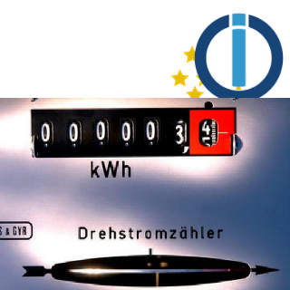
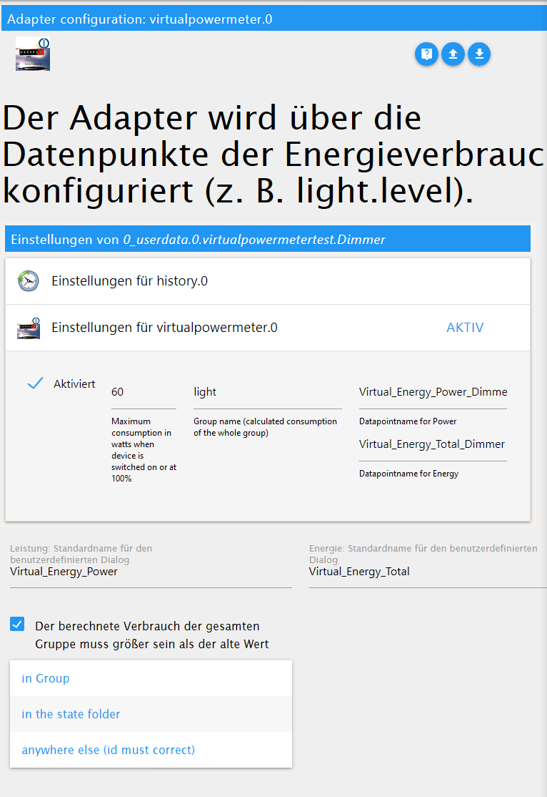
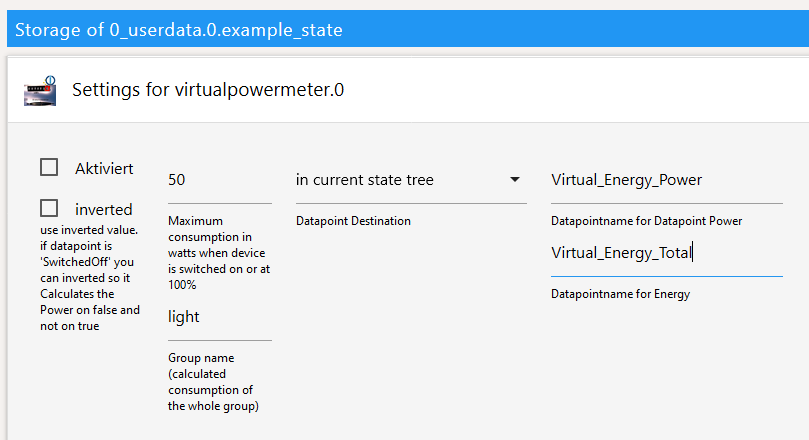
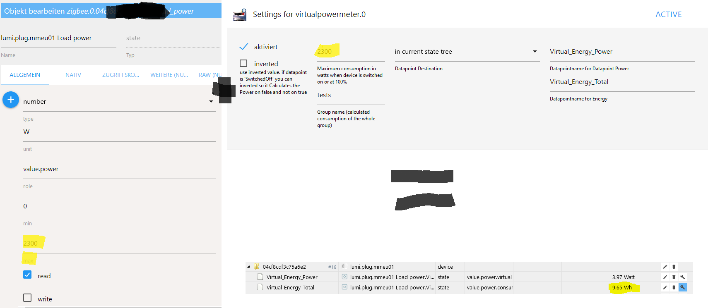

<h1>
	
	ioBroker.virtualpowermeter
</h1>

## Адаптер virtualpowermeter для ioBroker

Erzeugt Virtuelle Strommesser

В случае использования Smarthome вы можете получить доступ к электросчетчику мощности (meist Lichter).

С этим адаптером вы можете использовать Datenpunkt (über Custom -> MaxWatt (zB 60W)) для zwei zusätzliche Datenpunkte zu befüllen -> Energy\_Power (zB 60 Вт) и Energy\_Total (zB 2501,23 Втч). Zusätzlich werden Gruppen gebildet (diese werden unter virtualpowermeter.0.xxx abgelegt) die die summe der einzelnen Datenpunkte darstellt

Mit diesen neuen Datenpunkten kann dann eine Einfache Visualiserung durchgeführt werden.

Die neuen Datenpunkte (besonders die Gruppen) könnten super mit valuetrackerovertime weiterverarbeitet werden

## Настройки экземпляра

здесь может быть указано имя по умолчанию для определения мощности и общего количества энергии.

Настройка по умолчанию для параметра «Назначение точки данных»: «Назначение точки данных». В «папке состояния» будут новые пользовательские настройки стандартного имени для мощности и энергии. «В группе» означает «Стандартное имя», а также «Идентификатор объекта Custom-DP (. durch\_ersetzt) или «Unterverzeichnis + der Standardname für Power und Energie genutz». «Где-либо еще» не соответствует стандартному названию для мощности и энергетики, которое должно быть выбрано вручную для Custom-DP.

## Пользовательские настройки

 Активируйте пользовательские настройки, активировав 2 пункта. Мощность -> Ватт, Энергия(\_Total) -> Wh Der Speicherort setzt sich aus dem Datapoint Destination + Datapointname zusammen.

Wichtig: Wenn Destination "in Group" bzw wenn mehere DP im gleichen Verzeichnis "в текущем дереве состояний" braucht jeder Datenpunkt seinen eindeutigen Namen. Если пункт назначения по умолчанию «в группе» автоматически указывает имя Datenpunkt с идентификатором состояний (. durch \_ ersetzt). Hier kann aber Auch zB Wohnzimmer\_Licht.Power und Wohnzimmer\_Licht.Energy angegeben werden.

## Пользовательские настройки для выбора мощности (Ватт) и количества часов, которые будут установлены

Es gibt Geräte die nur eine Watt ausgabe haben und man aber wissen will wieviel Strom verbraucht wurde. Hierfür cann auch der VirtualPowermeter verwendet werden. Dafür muss nur der Max-Wert от Datenpunkt der Max-Power от VirtualPowermeter gleich sein. Бейшпиль:

Действия с трекером сверхурочной работы:

<!--
	Placeholder for the next version (at the beginning of the line):
	### __WORK IN PROGRESS__
-->

## Changelog

### 1.5.0 (2024-12-16)
* (Omega236) Update Dependencies

### 1.4.6 (2022-02-14)
* (Omega236) Update Dependencies

### 1.4.5 (2022-01-30)
* (Omega236) add minimum/standby power usage

### 1.4.4 (2022-01-30)
* (Omega236) bugfix wrong datapoint name

### 1.4.3 (2022-01-16)
* (bluefox) added support for admin5

### 1.4.1 (2021-02-13)
* (Omega236) on unit '%' interpret common.max as 100 if common.max not set

### 1.4.0 (2021-02-12)
* (Omega236) adding OptionalSwitch for Dimmer with On/Off State

### 1.3.2 (2021-01-27)
* (Omega236) group total is now its own counter
* (Omega236) improved precision

### 1.3.1 (2021-01-25)
* (Omega236) reduce initializations and optimize group handling

### 1.3.0 (2021-01-15)
* (scrounger) default ids for power and energie configurable through adapter settings
* (scrounger) custom: autocomplete for group input added
* (scrounger) option added -> group energy values can only increase 
* (Omega236) Check duplicate Destination DP
* (Omega236) allows to Set Destination of DP

### 1.2.2 (2020-12-26
* (Omega236) Group Calculations only after InitialFinished

### 1.2.1 (2020-04-15)
* (Omega236) translation

### 1.2.0 (2020-04-15)
* (Omega236) js-controller 3.x support

### 1.1.1 (2020-04-07)
* (Omega236) bugfix translation

### 1.1.0 (2020-04-05)
* (Omega236) inverted added

### 1.0.1
* (Omega236) SecurityUpdates

### 1.0.0
* (Omega236) Final Release

### 0.2.8
* (Omega236) Bug found on travis unsubscribeStatesAsync

### 0.2.6
* (Omega236) texts adapted

### 0.2.5
* (Omega236) awaits missing

### 0.2.4
* (Omega236) var remove and SettingPage Info and dic in class and .bind(this) (Template 1.10)

### 0.2.3
* (Omega236) CodeOptimierung nach eslint

### 0.2.1
* (Omega236) CodeOptimierung und bild

### 0.2.0
* (Omega236) Alle Funktionen implementiert, code noch nicht überprüft/optimiert/getestet

### 0.1.0
* (Omega236) Erste Version mit Grundfunktionalität

### 0.0.1
* (Omega236) initial release

## License
MIT License

Copyright (c) 2024 Omega236 general.of.omega@googlemail.com

Permission is hereby granted, free of charge, to any person obtaining a copy
of this software and associated documentation files (the "Software"), to deal
in the Software without restriction, including without limitation the rights
to use, copy, modify, merge, publish, distribute, sublicense, and/or sell
copies of the Software, and to permit persons to whom the Software is
furnished to do so, subject to the following conditions:

The above copyright notice and this permission notice shall be included in all
copies or substantial portions of the Software.

THE SOFTWARE IS PROVIDED "AS IS", WITHOUT WARRANTY OF ANY KIND, EXPRESS OR
IMPLIED, INCLUDING BUT NOT LIMITED TO THE WARRANTIES OF MERCHANTABILITY,
FITNESS FOR A PARTICULAR PURPOSE AND NONINFRINGEMENT. IN NO EVENT SHALL THE
AUTHORS OR COPYRIGHT HOLDERS BE LIABLE FOR ANY CLAIM, DAMAGES OR OTHER
LIABILITY, WHETHER IN AN ACTION OF CONTRACT, TORT OR OTHERWISE, ARISING FROM,
OUT OF OR IN CONNECTION WITH THE SOFTWARE OR THE USE OR OTHER DEALINGS IN THE
SOFTWARE.