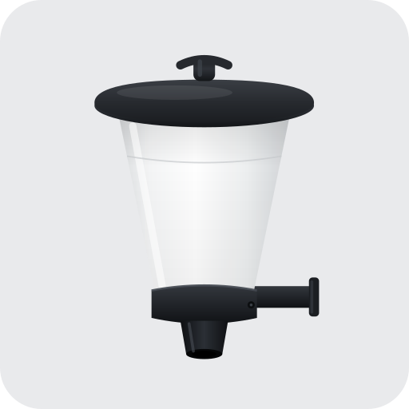
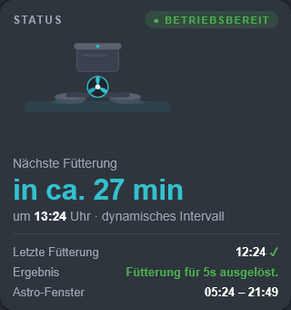
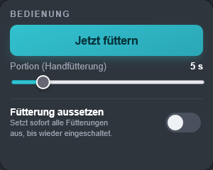
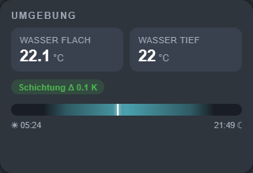
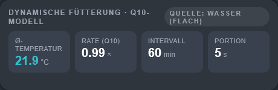
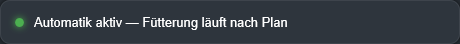
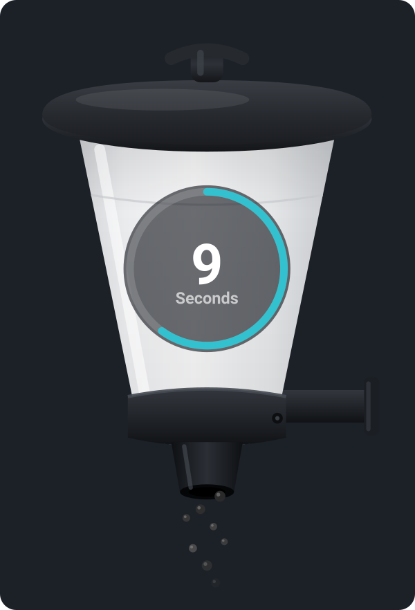
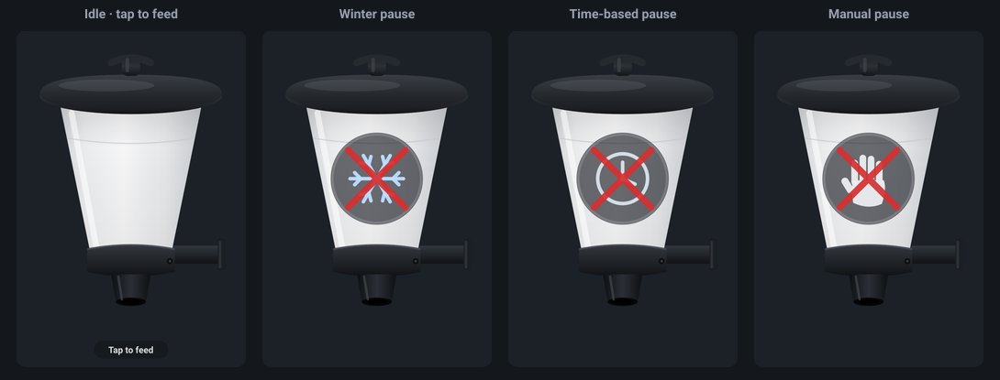
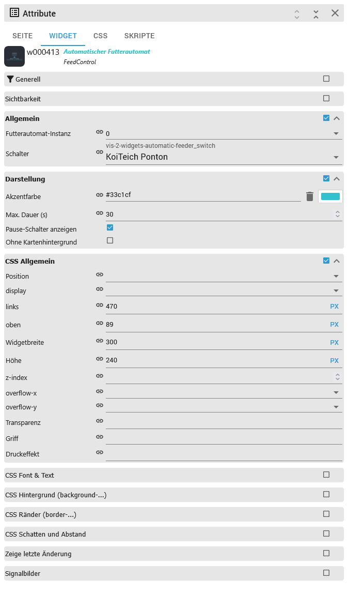

# IoBroker.vis-2-widgets-automatic-feeder
---

<p align="center"><a href="https://www.buymeacoffee.com/ssbingo"></a></p>

---

## Виджеты vis-2 для автоматической подачи
Готовые **виджеты панели управления vis-2** для адаптера [ioBroker.automatic-feeder](https://github.com/ssbingo/ioBroker.automatic-feeder) — карточки с возможностью перетаскивания для кормушки для рыб/карпов кои/прудов. **Не нужно искать идентификаторы объектов и писать HTML-код**: вы выбираете экземпляр кормушки и переключатель кормушки **по его понятному имени** из выпадающего списка, и каждый виджет самостоятельно считывает и управляет нужными точками данных.

В этот пакет входят **шесть виджетов**, которые вместе образуют полноценную панель управления кормушкой, выполненную в темном, удобном для планшетов дизайне в виде карточек с акцентным цветом, который можно изменить. Четыре виджета только *отображают* данные; два также позволяют *действовать* (запускать разовую кормушку или приостанавливать кормление).

Это всего лишь **слой визуализации**. Все планирование, модель температуры, логика восхода/захода солнца, паузы и уведомления находятся в отдельном адаптере **ioBroker.automatic-feeder**; эти виджеты представляют собой отображение в реальном времени и удаленное управление этим адаптером. (В более широком семействе «умных прудов» родственный адаптер *pond-aeration* может, например, приостанавливать аэрацию во время подачи воды из кормушки — но это настраивается там, а не здесь.)

Этот документ представляет собой полное руководство. Если вы никогда раньше не использовали эти виджеты, прочтите его от начала до конца: раздел **Быстрый старт** позволит вам запустить карточку примерно за минуту, а остальная часть подробно описывает каждый виджет и каждую опцию.

> 🇩🇪 Deutsche Anleitung: [doc/de/README.md](doc/de/README.md) · другие языки: см. > [Документация](#documentation) внизу.

---

## Оглавление
1. [Что такое виджеты vis-2?](#1-what-are-vis-2-widgets)
2. [Что вы получаете](#2-что-вы-получаете)
3. [Требования](#3-требования)
4. [Установка](#4-установка)
5. [Быстрый старт](#5-быстрый-старт)
6. [Подробное описание виджетов](#6-подробное-о-виджетах)
- [6.1 FeederStatus](#61-feederstatus)
- [6.2 FeedControl](#62-feedcontrol)
- [6.3 Окружающая среда](#63-окружающая среда)
- [6.4 DynamicFeeding](#64-dynamicfeeding)
- [6.5 Сезонный баннер](#65-сезонный баннер)
   - [6.6 AnimatedFeeder](#66-animatedfeeder)
7. [Конфигурация и привязки](#7-configuration--bindings)
8. [Какие точки данных использует каждый виджет](#8-which-data-points-each-widget-uses)
9. [Разработка](#9-разработка)
10. [Устранение неполадок и часто задаваемые вопросы](#10-устранение неполадок--FAQ)

---

## 1. Что такое виджеты vis-2?
**vis-2** — это современный инструмент визуализации от ioBroker (преемник классического *vis 1*). Вы создаете панели мониторинга («представления»), перетаскивая **виджеты** — кнопки, индикаторы, карточки — на холст и связывая их с состояниями вашего устройства.

Обычно виджет подключают к состоянию вручную: находят идентификатор объекта (например, `automatic-feeder.0.switches.sw-0.status.feedingActive`) и вводят его в поле привязки. Это подходит для одного значения, но для хорошей карточки-поставщика требуется десяток таких значений, работающих вместе.

Такой набор виджетов решает эту проблему: это дополнение, которое включает в себя специально разработанные виджеты для одного адаптера. Каждый виджет уже знает, какие состояния ему нужны. Вам нужно только указать, какой фидер отображать — всё остальное уже настроено. Таким образом, вместо десятка ручных настроек вы делаете **два щелчка** (создание экземпляра + переключение) и получаете готовую карточку.

---

## 2. Что вы получаете
Шесть виджетов. Каждый представляет собой самостоятельную карточку; вы можете использовать только один или объединить их в полноценную панель управления.

| Виджет | Что он отображает/делает | Что он записывает? |
|--------|----------------------|---------|
| **Статус кормушки** | Основная карточка состояния: анимированное изображение кормушки (вентилятор вращается во время кормления), обратный отсчет в реальном времени, обратный отсчет до **следующей** кормления с указанием времени и режима, **последнее** кормление и его результат, астрономическое окно (восход/закат) и — если заблокировано — причина. | нет |
| **FeedControl** | Кнопка **Начать кормление** с двухэтапным подтверждением, ползунок порции (длительности) и главный переключатель **Приостановить кормление**. | да |
| **Окружающая среда** | Температура воды (на мелководье и в глубине), термическая стратификация Δ, показания содержания кислорода (только при наличии датчика) и индикатор дня восхода-захода солнца с текущим маркером. | нет |
| **Динамическая подача** | Краткая информация о температурном режиме **Q10** адаптера: средняя температура, коэффициент скорости, интервал и доля, а также какой датчик (вода/воздух) его использует. | нет |
| **SeasonBanner** | Единая цветовая кодировка состояния, показывающая наиболее важный на данный момент статус (ручная пауза → пауза по времени → зимняя пауза → автоматическая активация). | нет |
| **Анимированная кормушка** | Большая анимированная кормушка на холсте: гранулы корма падают, а кольцо обратного отсчета заполняется во время кормления; в остальное время отображаются символы паузы (ручной режим / время / зима). **Нажмите на нее, чтобы запустить разовое кормление.** | да |

Два виджета для «написания» (FeedControl, AnimatedFeeder) записывают данные только при щелчке/касании *вашими* глазами — сами по себе они ничего не изменяют.

В палитре виджетов vis-2 весь набор отображается под названием группы **Автоматическая подача**.

---

## 3. Требования
- **ioBroker** с установленным **vis-2** (современный vis). Это виджеты vis-2, и они **не** работают в классическом режиме.

вис 1.

- Адаптер **ioBroker.automatic-feeder**, установленный и настроенный как минимум с одним коммутатором** (коммутатор — это один

Подающий элемент в конфигурации адаптера; он имеет понятное название, например, *KoiTeich Ponton*). Рекомендуемые версии адаптера:

- **v1.4.0 или новее** — для числовых временных меток необходимы команды `blockReasonCode` и `feedFor`.

Виджеты основаны на этом.

- **v1.5.0 или новее** — рекомендуется, дополнительно включает **обратный отсчет в реальном времени** в FeederStatus.

(точка данных `status.feedingEndsTs`).

- **v1.6.0 или новее** — рекомендуется для точного отображения обратного отсчета в **AnimatedFeeder** (

`status.feedingDurationSec` точка данных).

Вам никогда не придется вводить идентификатор объекта вручную: виджеты считывают и записывают только собственные данные `status.*` и `settings.*` выбранного переключателя, полученные из выбранного вами экземпляра + переключателя.

---

## 4. Установка
1. Установите **ioBroker.vis-2-widgets-automatic-feeder** в ioBroker — из списка **адаптеров** в административной панели после его установки.

из репозитория или напрямую из GitHub/npm. Устанавливается как адаптер *visualization-widgets* (`onlyWWW`, запущенный экземпляр не создается).

2. Откройте **vis-2**. В палитре виджетов (слева, в режиме редактирования) появится новая группа виджетов **Автоматическая подача**.

   режим).

3. Перетащите любой из его виджетов на представление — см. [Быстрый старт](#5-quick-start) ниже.

> **После каждого обновления:** запустите `iobroker upload vis-2-widgets-automatic-feeder`, затем перезапустите vis-2 (установка адаптера уже помечает vis-2 для перезапуска) и выполните принудительное обновление страницы (Ctrl+F5) в браузере, чтобы средство запуска подхватило новый пакет виджетов. См. [Поиск неисправностей](#10-troubleshooting--faq).

---

## 5. Быстрый старт
1. В vis-2 переключитесь в **режим редактирования**, откройте представление и перетащите виджет **FeederStatus** из **Automatic Feeder**.

группа на него.

2. Выбрав виджет, откройте панель **Атрибуты** справа и заполните два поля в **общем** разделе.

   группа:

- **Экземпляр фидера** — выберите свой экземпляр `automatic-feeder` (обычно `0`; это стандартный инструмент выбора экземпляра).
- **Переключатель** — выберите свой фидер из выпадающего списка. В нем перечислены настроенные переключатели **по их понятным именам**.

(например, *KoiTeich Ponton*), считывается непосредственно из конфигурации адаптера.

3. Карточка мгновенно отображает данные в реальном времени. Повторите то же самое для любого другого виджета — выбор экземпляра/переключателя работает точно так же.

То же самое относится ко всем шести.

Вот и всё: никаких идентификаторов объектов, никаких ручных привязок, никаких скриптов. Пока оба поля не будут заданы, виджет отображает дружественную подсказку *"Выберите канал переключения фидера в настройках виджета."* вместо данных.

---

## 6. Виджеты подробно
Для каждого виджета используются одни и те же две обязательные настройки — **экземпляр кормушки** и **переключатель** — в группе атрибутов **common** (см. [Конфигурация и привязки](#7-configuration--bindings)). Параметры внешнего вида для каждого виджета указаны ниже. Все скриншоты показывают данные в реальном времени из кормушки для карпов кои.

### 6.1 FeederStatus


Главная карточка. Сверху вниз отображается:

- Индикатор состояния: **Готов** (зеленый) или **Заблокирован** (янтарный). "Заблокирован" означает, что адаптеру в данный момент не разрешено использовать.

кормление (ночью, слишком низкая температура, слишком низкий уровень кислорода, пауза…).

- **Анимированная графика кормушки**. Во время подачи корма вентилятор вращается, и — с адаптером версии 1.5.0 и выше — **время работы**

Рядом с ним появляется обратный отсчет** (например, `5 s`), который отсчитывает время до конца текущей подачи корма.

- **Следующее кормление**: длинный обратный отсчет (*примерно через 27 мин*, или `1 ч 05 мин` через час), точное время и

режим (*динамический интервал*, если включена динамическая подача, в противном случае *расписание*).

- **Последняя подача** с маркером ✓ (успех, зеленый) или ✗ (ошибка, красный) и текстом **результата** адаптера.
- **Астрономическое окно** (восход – закат), используемое для логики смены дня и ночи.
- При блокировке добавляется дополнительная строка с **причиной**, удобочитаемым объяснением причины блокировки (выделено желтым цветом).

Карточка обновляется раз в секунду, поэтому обратный отсчет остается активным.

**Параметры внешнего вида** (группа *Внешний вид*):

| Вариант | Тип | По умолчанию | Значение |
|--------|------|---------|---------|
| **Цвет акцента** | цвет | `#33c1cf` | Цвет подсветки карточки и графики. |
| **Положение таймера выполнения** | выбрать (Справа / Слева) | Справа | Отображать обратный отсчет времени подачи слева или справа от графика. |
| **Анимированная графика кормушки** | флажок | включено | Включить/выключить анимацию вращающегося вентилятора. |
| **Без фона карточки** | флажок | выключено | Отобразить без фона карточки (чтобы разместить ее на собственной панели). |

Размер виджета по умолчанию: 320 × 340 пикселей.

### 6.2 Управление подачей


Плата управления:

- **Накормить сейчас** — кнопка, состоящая из **двух шагов**. Первое нажатие *активирует* её, и надпись меняется на *Подтвердить: N s ?*;

Второй щелчок запускает ровно **один** цикл подачи выбранного времени и на короткое время отображает *Сработало ✓*. Если вы не подтвердите в течение ~4 секунд, устройство отключается.

- **Порция (вручную)** — ползунок, устанавливающий продолжительность кормления в секундах, от `1` до *Максимальная продолжительность* (по умолчанию)

начинается с 5 с).

- **Приостановка подачи** — главный выключатель, который немедленно приостанавливает **всю** подачу для этого выключателя до тех пор, пока вы его не повернете.

Отступите. Это записывает значение `settings.pauseNow` адаптера, которое переопределяет все режимы и все паузы, основанные на времени.

**Параметры внешнего вида** (группа *Внешний вид*):

| Вариант | Тип | По умолчанию | Значение |
|--------|------|---------|---------|
| **Цвет акцента** | цвет | `#33c1cf` | Цвет выделения. |
| **Максимальная продолжительность (с)** | число (1–3600) | 30 | Верхний край ползунка размера порции. |
| **Показать переключатель паузы** | флажок | включено | Показать/скрыть главный переключатель *Приостановить подачу*. |
| **Без фона карточки** | флажок | выключено | Отображать без фона карточки. |

Размер виджета по умолчанию: 300 × 240 пикселей.

Кнопка отправляет **однократный** поток данных через команду `feedFor` адаптера (значение = продолжительность в секундах). Она **не** изменяет ваше расписание и **не** перезапускает адаптер.

### 6.3 Окружающая среда


Карта «Вода/Окружающая среда»:

- Температура **мелководья** и **глубоководья** (в °C, округлено до 0,1). Глубоководный участок остается в положении «–», если вы этого не сделали.

настройте второй, более глубокий датчик.

- Таблетка **стратификации**, показывающая разницу Δ между двумя слоями (в К). Она становится янтарной, когда слои...

Различия составляют более **3 тыс.**.

— Таблетка **O₂** в мг/л — отображается **только** при настройке датчика кислорода и становится красной, когда значение падает.

ниже установленного минимума (`settings.o2Min`).

- **Дневная шкала** от восхода солнца (☀) до заката (☾) с индикатором текущего времени (пересчитывается каждую минуту).

**Параметры внешнего вида** (группа *Внешний вид*):

| Вариант | Тип | По умолчанию | Значение |
|--------|------|---------|---------|
| **Цвет акцента** | цвет | `#33c1cf` | Цвет выделения. |
| **Без фона карточки** | флажок | выключено | Отображать без фона карточки. |

Размер виджета по умолчанию: 320 × 220 пикселей.

### 6.4 Динамическая подача


Показаны **температурные параметры Q10**, используемые адаптером для адаптации подачи воды к её температуре. Четыре плитки:

- **Средняя температура** — средняя температура, на основе которой построена модель (°C).
- **Скорость (Q10)** — результирующий коэффициент скорости (× относительно эталонной температуры).
- **Интервал** — результирующий интервал кормления в минутах.
- **Порция** — время кормления в секундах.

В заголовке отображается индикатор **Источник**, показывающий, управляется ли модель датчиком **Вода (мелководье)** или **Воздух** (`settings.dynamicSource`). Если динамическая подача данных отключена для этого переключателя, вместо плиток на карточке отображается подсказка *"Динамическая подача данных отключена для этого переключателя."*.

**Параметры внешнего вида** (группа *Внешний вид*):

| Вариант | Тип | По умолчанию | Значение |
|--------|------|---------|---------|
| **Цвет акцента** | цвет | `#33c1cf` | Цвет подсветки плитки средней температуры. |
| **Без фона карточки** | флажок | выключено | Отображать без фона карточки. |

Размер виджета по умолчанию: 460 × 150 пикселей.

### 6.5 Сезонный баннер


Единая цветовая индикация состояния — идеально подходит для верхней части экрана. Она всегда отображает **наиболее важное** текущее состояние в следующем порядке приоритета:

1. **Ручная пауза** (красный) — главный переключатель паузы (`status.pauseManual`) включен.
2. **Пауза по времени** (янтарный) — активно настроенное окно паузы (`status.pauseActive`) с указанием времени его окончания.

добавлено (`status.pauseActiveUntil`).

3. **Зимняя пауза** (синий) — зимнее окно активно (`status.winterActive`).
4. **Автоматический режим активен** (зеленый) — ничто не препятствует кормлению, расписание выполняется в обычном режиме.

У этого виджета **нет** никаких дополнительных параметров внешнего вида, кроме двух распространенных настроек (экземпляр + переключатель).

Размер виджета по умолчанию: 460 × 44 пикселя.

### 6.6 Анимированная кормушка


Большая анимированная кормушка, отображаемая на HTML-элементе `<canvas>` — визуальный центр панели управления прудом. Она реагирует в режиме реального времени на переключение:

- **Во время кормления:** из выходного отверстия высыпаются гранулы корма, и раздается **звук обратного отсчета**, показывающий оставшиеся секунды до заполнения.

Точность сигнала сохраняется, если адаптер обеспечивает `status.feedingDurationSec` (**v1.6.0+**); в более старых адаптерах общая продолжительность определяется с момента начала кормления.

- **Состояния паузы**, отображаемые в виде символа на диске с красным крестом, имеют тот же приоритет, что и SeasonBanner:

**ручная пауза** (стрелка) → **пауза по времени** (часы) → **зимняя пауза** (снежинка).

- **Режим ожидания:** только кормушка, с дополнительной подсказкой «Нажмите, чтобы покормить».



**Кормление касанием:** коснитесь виджета один раз, чтобы активировать его (*Подтверждение: N s ?*), коснитесь еще раз, чтобы запустить одноразовую кормление заданной продолжительности (через `feedFor`). Касания игнорируются, пока активна пауза или уже идет кормление, и всю функцию можно отключить с помощью **Включить кормление касанием**. (Анимация падающих гранул автоматически уменьшается, когда операционная система запрашивает уменьшение движения.)

**Параметры** — AnimatedFeeder имеет три группы атрибутов:

*Поведение:*

| Вариант | Тип | По умолчанию | Значение |
|--------|------|---------|---------|
| **Включить функцию «Нажатие для получения ленты»** | флажок | включен | Разрешить запуск получения ленты нажатием на виджет. |
| **Продолжительность подачи (с)** | число (1–3600) | 5 | Продолжительность задается нажатием кнопки. |
| **Анимированная графика кормушки** | флажок | включено | Включить/выключить анимацию падающих гранул. |

*Появление:*

| Вариант | Тип | По умолчанию | Значение |
|--------|------|---------|---------|
| **Цвет акцента** | цвет | `#33c1cf` | Цвет кольца обратного отсчета и подсказки. |
| **Изображение (необязательно)** | изображение | *(встроенное)* | Пользовательское изображение для фидера; оставьте поле пустым для встроенного изображения. Пользовательское изображение может иметь другое соотношение сторон. |
| **Без фона карточки** | флажок | выключено | Отображать без фона карточки. |

*Геометрия* — позиции указываются в **%** от размера виджета, поэтому анимацию можно выровнять, если вы используете собственное изображение:

| Параметр | Тип | Значение по умолчанию | Диапазон |
|--------|------|---------|-------|
| **Выход гранул X (%)** | число | 50 | 0–100 |
| **Выход гранул Y (%)** | число | 80 | 0–100 |
| **Обратный отсчет X (%)** | число | 50 | 0–100 |
| **Обратный отсчет Y (%)** | число | 44 | 0–100 |
| **Размер обратного отсчета (%)** | число | 20 | 5–45 |

Размер виджета по умолчанию: 300 × 440 пикселей.

---

## 7. Конфигурация и привязки
Для каждого виджета в группе **общих** атрибутов есть два обязательных параметра:



- **Экземпляр фидера** — выберите свой экземпляр `automatic-feeder` из выпадающего списка (обычно `0`). Принимает любой из следующих вариантов:

простое число (`0`) или полная форма (`automatic-feeder.0`).

- **Переключатель** — выберите фидер из выпадающего списка, в котором перечислены настроенные вами переключатели **по их понятным именам** (например,

*KoiTeich Ponton*), а не по внутреннему идентификатору. Список считывается из конфигурации выбранного экземпляра (`system.adapter.automatic-feeder.<instance>` → `native.switches[]`).

На основе этих двух значений виджет формирует канал переключения `automatic-feeder.<instance>.switches.<switch>` и подписывается на необходимые ему относительные подсостояния — вам не нужно самостоятельно вводить привязку. Пока оба поля не будут заданы, виджет отображает подсказку *"Выберите канал переключения фидера…"* вместо данных.

Дополнительные параметры внешнего вида находятся в группе **Внешний вид** каждого виджета (а для AnimatedFeeder — в группах **Поведение** и **Геометрия**); см. описание каждого виджета выше. Общие параметры для всех виджетов:

| Вариант | Виджеты | Значение |
|--------|---------|---------|
| **Цвет акцента** | все, кроме SeasonBanner | Цвет подсветки (по умолчанию pond-aqua `#33c1cf`). |
| **Без фона карточки** | все, кроме SeasonBanner | Отображает виджет без фона карточки, например, для размещения на пользовательской панели. |

---

## 8. Какие точки данных использует каждый виджет
Для обеспечения полной прозрачности — виджеты подписываются на канал переключения `automatic-feeder.<instance>.switches.<switch>.…` и используют только эти относительные точки данных:

| Виджет | Чтение | Запись |
|--------|-------|--------|
| **Статус фидера** | `status.feedingActive`, `status.feedingEndsTs`, `status.nextFeeding`, `status.nextFeedingTs`, `status.lastFeeding`, `status.lastResult`, `status.blocked`, `status.blockReasonCode`, `status.blockReason`, `status.error`, `status.sunrise`, `status.sunset`, `settings.dynamicEnabled` | — |
| **Окружающая среда** | `status.waterTemperature`, `status.waterTemperatureDeep`, `status.waterStratification`, `status.oxygen`, `status.sunrise`, `status.sunset`, `status.sunriseTs`, `status.sunsetTs`, `settings.o2Min` | — |
| **Динамическое кормление** | `settings.dynamicEnabled`, `settings.dynamicSource`, `status.dynamicAvgTemperature`, `status.dynamicRate`, `status.dynamicIntervalMin`, `status.dynamicDurationSec` | — |
| **Сезонный баннер** | `status.winterActive`, `status.pauseActive`, `status.pauseActiveUntil`, `status.pauseManual`, `settings.winterWindow` | — |
| **Анимированная подача** | `status.feedingActive`, `status.feedingEndsTs`, `status.feedingDurationSec`, `status.winterActive`, `status.pauseManual`, `status.pauseActive` | `feedFor` (нажатие для подачи, значение = секунды) |
| **Анимированная лента новостей** | `status.feedingActive`, `status.feedingEndsTs`, `status.feedingDurationSec`, `status.winterActive`, `status.pauseManual`, `status.pauseActive` | `feedFor` (нажмите для просмотра ленты, значение = секунды) |

Точное значение каждой точки данных см. в разделе [документация ioBroker.automatic-feeder](https://github.com/ssbingo/ioBroker.automatic-feeder).

---

## 9. Развитие
Виджеты написаны на **TypeScript + React 18** (с MUI для редакторов атрибутов) и объединены с **Vite** и **Module Federation** в единый `customWidgets.js`, который vis-2 загружает во время выполнения. Исходный код находится в [`src-widgets-ts/src/`](src-widgets-ts/src/):

| Файл | Виджет / роль |
|------|---------------|
| `FeederWidgetBase.tsx` | Общий базовый класс, используемый **четырьмя** виджетами (Environment, DynamicFeeding, SeasonBanner, AnimatedFeeder): определяет канал переключения, подписывается на подсостояния, хранит значения в состоянии и предоставляет вспомогательные функции чтения/записи/форматирования. FeederStatus и FeedControl напрямую наследуют `window.visRxWidget` и выполняют собственную подписку/инициализацию. |
| `FeederStatus.tsx`, `FeedControl.tsx`, `Environment.tsx`, `DynamicFeeding.tsx`, `SeasonBanner.tsx`, `AnimatedFeeder.tsx` | Шесть виджетов. |
| `styles.ts` | Внедренный CSS-код для дизайна карточки. |
| `translations.ts` + `i18n/*.json` | Тексты пользовательского интерфейса на 11 языках. |
| `translations.ts` + `i18n/*.json` | Тексты пользовательского интерфейса на 11 языках. |

Набор виджетов зарегистрирован в [`io-package.json`](io-package.json) в `common.visWidgets.vis2AutomaticFeeder` (компоненты `FeederStatus`, `FeedControl`, `Environment`, `DynamicFeeding`, `SeasonBanner`, `AnimatedFeeder`).

**Сборка и скрипты** (запускаются из корневой директории репозитория):

```bash
npm run npm      # install root + src-widgets-ts dependencies
npm run build    # build the TypeScript widgets → widgets/vis-2-widgets-automatic-feeder/
npm run lint     # ESLint over src-widgets-ts
npm test         # @iobroker/testing package tests (mocha test/package)
```

`npm run build` запускает `node tasks --typescript`, который выполняет очистку, сборку `src-widgets-ts` с помощью Vite и копирует `customWidgets.js`, ресурсы, изображения и набор значков, в `widgets/vis-2-widgets-automatic-feeder/` (папка, поставляемая конечным пользователям; `main` указывает на свою `customWidgets.js`). Релизы создаются с помощью `@alcalzone/release-script` (`npm run release-patch` / `-minor` / `-major`), который также запускает сборку перед фиксацией изменений.

---

## 10. Устранение неполадок и часто задаваемые вопросы
**Виджет отображает только "Выберите канал переключения фидера…".** Задайте значения в обоих **общих** полях (экземпляр *и* переключатель). Выпадающий список переключателя заполняется из выбранного экземпляра, поэтому сначала выберите экземпляр.

**Выпадающий список переключателей пуст.** В выбранном экземпляре `automatic-feeder` еще не настроены переключатели, или номер экземпляра указан неверно. Сначала настройте переключатель в адаптере.

**Значения отображаются как `–`.** Убедитесь, что адаптер **версии 1.4.0 или новее** (версия 1.5.0+ для обратного отсчета во время выполнения). Более старые версии не предоставляют числовые метки времени и данные команд, на которые полагаются виджеты. Плитка **Глубина воды** остается `–`, если вы не настроили второй, более глубокий датчик; таблетка **O₂** скрыта, если не настроен датчик кислорода — оба варианта являются нормальными.

**Обратный отсчет времени выполнения никогда не отображается.** Для его работы требуется адаптер **v1.5.0+** (`status.feedingEndsTs`), и он отображается только *во время фактической подачи корма*.

**Время обратного отсчета AnimatedFeeder не совсем пропорционально.** Для точного отображения времени требуется адаптер **v1.6.0+** (`status.feedingDurationSec`); в более старых адаптерах продолжительность оценивается исходя из времени начала кормления, поэтому время обратного отсчета приблизительное.

**Новые/обновленные виджеты не отображаются, или видны только некоторые из них.** Это почти всегда связано с устаревшим пакетом виджетов в браузере/сервере. Запустите `iobroker upload vis-2-widgets-automatic-feeder`, перезапустите vis-2 (или хост) и выполните принудительное обновление страницы в браузере (Ctrl+F5).

**Заменяет ли это адаптер?** Нет. Это всего лишь виджеты панели управления. Все настройки расписания, логика измерения температуры, паузы и уведомления находятся в адаптере **ioBroker.automatic-feeder**; виджеты представляют собой интерфейс для этого адаптера и одновременно удаленный доступ к нему.

---

## Документация
- 🇩🇪 [Немецкая документация](doc/de/README.md)
- 🇷🇺 [Документация на английском языке](doc/ru/README.md)
- 🇳🇱 [Нидерландская документация](doc/nl/README.md)
- 🇫🇷 [Французская документация](doc/fr/README.md)
- 🇮🇹 [Итальянская документация](doc/it/README.md)
- 🇪🇸 [Документация на испанском языке](doc/es/README.md)
- 🇵🇱 [Польская документация](doc/pl/README.md)
- 🇵🇹 [Португальская документация](doc/pt/README.md)
- 🇺🇦 [Документация украинская](doc/uk/README.md)
- 🇨🇳 [简体中文文档](doc/zh-cn/README.md)

## Changelog
<!--
	Placeholder for the next version (at the beginning of the line):
	### **WORK IN PROGRESS**
-->
### 0.2.1 (2026-07-07)
* (ssbingo) Fixed **AnimatedFeeder** showing nothing in Firefox: the built-in feeder image now uses a base64 data URI (Firefox rejects the non-standard `;utf8,` form that Chrome tolerated) and the canvas 2D context is initialised from the `<canvas>` ref callback, so it binds reliably regardless of mount order. A failed or zero-size custom image can no longer blank the whole widget

### 0.2.0 (2026-07-07)
* (ssbingo) New sixth widget **AnimatedFeeder**: a large animated feeder (canvas) with falling pellets, a countdown ring and pause symbols (manual / time-based / winter); tap it to trigger a one-off feeding. The exact countdown ring uses the adapter's new `status.feedingDurationSec` (**automatic-feeder v1.6.0+**)
* (ssbingo) New stylized adapter and widget-set icon (feeder on a light grey tile)

### 0.1.0 (2026-07-07)
* (ssbingo) Fixed the adapter icon not showing in the ioBroker Developer Portal — `extIcon` and `readme` now point to the real repository instead of the template placeholder

### 0.0.5 (2026-07-06)
* (ssbingo) Internal: the package test now uses the standard `@iobroker/testing` test suite (`tests.packageFiles`) so the ioBroker adapter checker can verify it

### 0.0.4 (2026-07-06)
* (ssbingo) Internal/CI: adopted the ioBroker standard workflow actions (`ioBroker/testing-action-check`, `ioBroker/testing-action-deploy`) — still token-less npm trusted publishing (OIDC) with provenance — and the standard Dependabot auto-merge workflow

### 0.0.3 (2026-07-06)
* (ssbingo) Full user manual with screenshots of every widget, plus translations in all 11 languages (`doc/<lang>/README.md`)
* (ssbingo) Repository and CI hardening: added a `check-and-lint` job, committed the root `package-lock.json`, replaced the broken Dependabot auto-merge with the GitHub-native flow, moved Dependabot to a distributed cron schedule and added `.vscode` JSON-schema settings; first release published with provenance via the npm Trusted Publisher pipeline

### 0.0.2 (2026-07-06)
* (ssbingo) All five widgets now register correctly; widget preview uses the feeder icon instead of the template demo image; the adapter installs straight from GitHub (removed the puppeteer-based demo test)

### 0.0.1 (2026-07-06)
* (ssbingo) Initial version with five widgets — FeederStatus, FeedControl, Environment, DynamicFeeding and SeasonBanner — for the ioBroker.automatic-feeder adapter, configurable by feeder instance and switch name

---

[Older changelogs can be found there](CHANGELOG_OLD.md)

## License

MIT License

Copyright (c) 2026 ssbingo <silvio.sternitzke@googlemail.com>

Permission is hereby granted, free of charge, to any person obtaining a copy
of this software and associated documentation files (the "Software"), to deal
in the Software without restriction, including without limitation the rights
to use, copy, modify, merge, publish, distribute, sublicense, and/or sell
copies of the Software, and to permit persons to whom the Software is
furnished to do so, subject to the following conditions:

The above copyright notice and this permission notice shall be included in
all copies or substantial portions of the Software.

THE SOFTWARE IS PROVIDED "AS IS", WITHOUT WARRANTY OF ANY KIND, EXPRESS OR
IMPLIED, INCLUDING BUT NOT LIMITED TO THE WARRANTIES OF MERCHANTABILITY,
FITNESS FOR A PARTICULAR PURPOSE AND NONINFRINGEMENT. IN NO EVENT SHALL THE
AUTHORS OR COPYRIGHT HOLDERS BE LIABLE FOR ANY CLAIM, DAMAGES OR OTHER
LIABILITY, WHETHER IN AN ACTION OF CONTRACT, TORT OR OTHERWISE, ARISING FROM,
OUT OF OR IN CONNECTION WITH THE SOFTWARE OR THE USE OR OTHER DEALINGS IN
THE SOFTWARE.