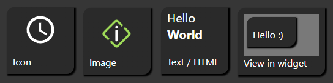
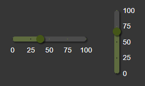

# Виджеты inventwo для ioBroker.vis 2.0
## О
Добавляет переключатели, кнопки, ползунки и многое другое в качестве виджетов для ioBroker VIS 2.0.

## Содержание
Различные виджеты для переключения, навигации и прочего.

Различные типы контента

Выбор цвета

Слайдер

Переключатели

#### Дальше будет больше...

## Changelog
<!--
    Placeholder for the next version (at the beginning of the line):
    ### **WORK IN PROGRESS**
-->
### 0.1.5 (2024-04-14)
* Added optional button click feedback options
* Added widget type to send http requests and open urls

### 0.1.4 (2024-04-14)
* Fixed issue in workflow

### 0.1.3 (2024-04-14)
* Fixed issue in widget state check. Also includes #12
* Removed second unused field 'button width' (#10)
* Added widget type Increase/Decrease value (#7)
* Added more info to readme
* Removed iobroker/adapter-core dependency
* Added node 20 to test-and-release workflow

### 0.1.2 (2024-04-08)
* Fixed issue editor crashes when changing "Comparison operator" or "Compare by" on multiple states.
* Fixesd issue state settings not used if condition is true.

### 0.1.1 (2024-04-05)
* Fixed wrong default value for comparison operator

### 0.1.0 (2024-04-05)
* Added new widget: Switch
* Added comparison operator and option to check for value or view for each state in universal widget
* Added steps to slider widget
* Fixed issue states not working if type is button or readonly
* Fixed issue value is set with wrong data type

### 0.0.7 (2024-04-03)
* Bug fix

### 0.0.6 (2024-04-03)
* Bug fix

### 0.0.5 (2024-04-02)
* Bug fix

### 0.0.4 (2024-04-01)
* Bug fix
* Added new widget: Table, still work in progress
* CSS settings divided into single groups

### 0.0.3 (2024-03-14)
* Bug fix

### 0.0.2 (2024-03-14)
* Bug fix

### 0.0.1 (2024-03-11)
* (jkvarel) Init

## License
The MIT License (MIT)

Copyright (c) 2024 jkvarel <jk@inventwo.com>

Permission is hereby granted, free of charge, to any person obtaining a copy
of this software and associated documentation files (the "Software"), to deal
in the Software without restriction, including without limitation the rights
to use, copy, modify, merge, publish, distribute, sublicense, and/or sell
copies of the Software, and to permit persons to whom the Software is
furnished to do so, subject to the following conditions:

The above copyright notice and this permission notice shall be included in
all copies or substantial portions of the Software.

THE SOFTWARE IS PROVIDED "AS IS", WITHOUT WARRANTY OF ANY KIND, EXPRESS OR
IMPLIED, INCLUDING BUT NOT LIMITED TO THE WARRANTIES OF MERCHANTABILITY,
FITNESS FOR A PARTICULAR PURPOSE AND NONINFRINGEMENT. IN NO EVENT SHALL THE
AUTHORS OR COPYRIGHT HOLDERS BE LIABLE FOR ANY CLAIM, DAMAGES OR OTHER
LIABILITY, WHETHER IN AN ACTION OF CONTRACT, TORT OR OTHERWISE, ARISING FROM,
OUT OF OR IN CONNECTION WITH THE SOFTWARE OR THE USE OR OTHER DEALINGS IN
THE SOFTWARE.
