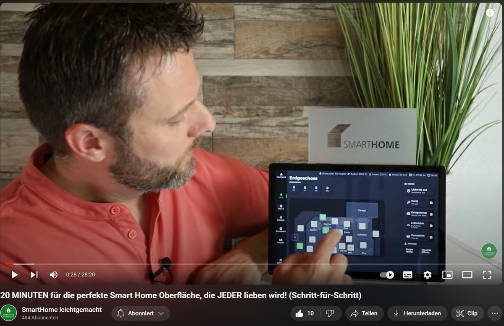

# Специальные виджеты Jaeger Design для ioBroker.vis 2.0

Видеоинструкции по использованию виджетов можно найти [здесь](https://www.youtube.com/playlist?list=PLddhldeLVrtl5Bhj6AAbkLabuIuyV0bVe) (на немецком языке).

Видео с виджетами benutzt werden können, kann man [hier](https://www.youtube.com/playlist?list=PLddhldeLVrtl5Bhj6AAbkLabuIuyV0bVe) finden.

## Kommerzielle Nutzung

Используйте этот переходник для более дорогой версии. Для настройки виджетов требуется дополнительная лицензия (действительная цена: 50 евро, включая MwSt.). Установка и тестирование в редакторе могут оказаться очень полезными.

## Übersicht zur Erstellung einer Smart Home Oberfläche mit dem "VIS-2 JAEGER Design Adaptor"

### Voraussetzungen

- Система Ein ioBroker
- Адаптер Der Jäger Design (около 50 евро)
- Grundkenntnisse im Umgang mit ioBroker

### Введение

Адаптер Jäger Design лежит в основе адаптера vis-2 и является удобным для использования, если вы хотите установить его с помощью щелчка и падения. Дополнительные виджеты можно использовать и использовать для создания умного дома.

### Grundaufbau der Oberfläche

Die Oberfläche besteht aus mehreren Bereichen:

- **Главное меню** : Ссылки находятся в том месте, где находится главное меню, и вы можете видеть, как это происходит.
- **Statusleiste** : Oben können verschiedene wichtige Statusanzeigen hinzugefügt werden.
- **Mittlerer Bereich** : Hier können Szenen, Aktionen und Hinweise angezeigt werden. Die rechte Seite - это свободный гештальтбар и канн Informationen wie Sicherheit, Wetter, Hausgeräte und Energieverbrauch anzeigen.

### Белеухтунг

Im Hauptmenü können verschiedene Stockwerke ausgewählt werden. Der Grundriss des Erdgeschosses zeigt alle Lichter, die durch Icons dargestellt werden. Некоторые значки могут отображаться только в том случае, если они используются, где и когда они затемнены. Нажмите на значок, чтобы открыть всплывающее окно с слайдером для отображения значка. Beleuchtungsszenen auf der rechten Seite können einfach abgerufen und auch Lichteinstellungen Gespeichert werden:

### Ролллен

В меню «Rollladen» можно включить функцию Beschattung gesehen werden. Значки отображаются в высоком разрешении и при нажатии на значок открываются всплывающие окна для изменения высоты и рамок.

### Энергия

В меню «Энергия» указана температура окружающей среды. Значки Zeigen die Ist- und Solltemperaturen sowie den Zustand der Heizung und Fenster an. Нажмите на значок, чтобы открыть всплывающее окно для изменения температуры и настройки температуры, чтобы активировать климатические условия или теплые условия.

### Безопасность

В меню «Sicherheit» можно нажать кнопку «Зустанд дер Фенстер». Geöffnete Fenster werden rot dargestellt.

### Дополнительные функции

Es können auch frei definierte Oberflächen erstellt werden, wie zB die Verbrauchsdarstellung des Adapters "consumer" or die Darstellung von Nightscout for Diabetes. В меню «Настройки» можно увидеть различные варианты выбора.

### Видеоуроки на YouTube

Для получения подробной информации и получения дополнительной информации см. ссылки на обучающие материалы YouTube.