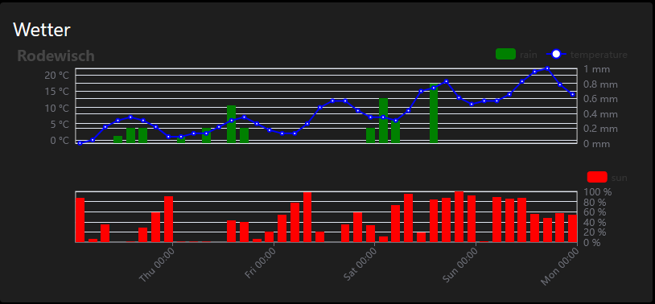
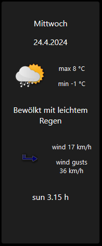
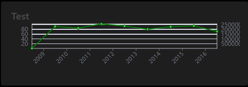
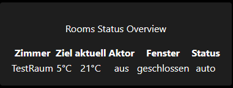
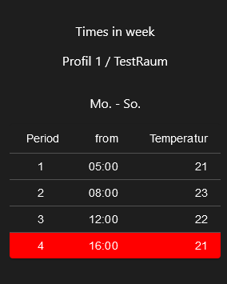
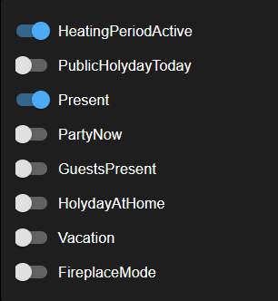
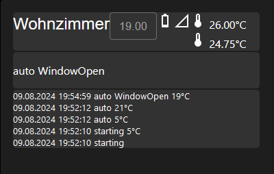
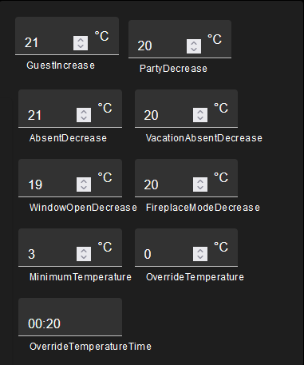
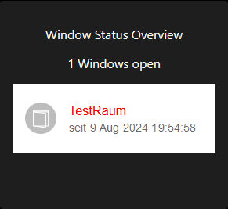

# IoBroker.vis-2-виджеты-погода-и-отопление

**Если вам понравилось, пожалуйста, рассмотрите возможность пожертвования:**

Этот vis-2-widget показывает данные прогноза погоды с DasWetter.com или weatherunderground.
Вам необходимо запустить DasWetter-Adapter или weatherunderground-Adapter в вашей системе.

## Погода
### Погода

* OID устанавливаются автоматически на основе общих настроек
* Метки оси x можно настроить в соответствии с [документом momentjs](http://momentjs.com/docs/#/displaying/format/)

### Погода день

* OID устанавливаются автоматически на основе общих настроек
* наборы иконок можно менять

## Общая диаграмма

### Входные данные для общей диаграммы
* «OID data serie» должен указывать на точку данных, например `sbfspot.0.xxxxxxxx.history.years`
* точка данных должна содержать пары ключ/значение, например

[{"year":"2008","value":7000},{"year":"2009","value":2309000},{"year":"2010","value":4445000},{"year":"2011","value":7019000},{"year":"2012","value":9371000},{"year":"2013","value":11393000},{"year":"2014","value":13666000},{"year":"2015","value":16034000},{"year":"2016","value":17826790}]

* можно автоматически рассчитать и показать разницу значений. Просто отметьте галочкой "расчет разницы" в настройках.

* поддерживает адаптер `sbfspot` и `ebus`: просто выберите экземпляр, и основные настройки будут выполнены автоматически

## Отопление (виджеты для адаптера HeatingControl)
На основе проекта [Питтини](https://github.com/Pittini/iobroker-heatingcontrol-vis) для старой версии VIS теперь доступны аналогичные виджеты для VIS-2.

### Обзор комнаты

### График отопления

### Общий параметр

### Комната

### Параметр профиля комнаты

### Обзор состояния окна

<!--

### **РАБОТА В ХОДЕ** -->

## Changelog
### 0.7.0 (2024-08-23)
 * (René) bug fix images
 * (René) Icons and translations
 * (René) Heating General Parameter: show paramter only if OID is set
 * (René) Heating Room Profile Parameter: show paramter only if OID is set
 * (Bluefox) Typos, Refactoring, Formating

### 0.6.0 (2024-08-18)
 * (René) widget set renamed again because adapter checker doesn't accept the name
 * (René) Icons and translations
 * (René) readme update
 * (René) heating time schedule widget overworked

### 0.5.0 (2024-08-08)
 * (René) widget Heating Room Status overview overworked (works only with HeatingControl@1.12.9)
 * (René) show number of open windows in Heating Window Status Overview
 * (René) widget Heating Room overworked

### 0.4.0 (2024-07-27)
 * (René) widget set renamed to weather and heating, because two widget sets are available
 * (René) bug fix icon in weather day widget
 * (René) heating and weather widgets sets are separeted
 * (René) Heating General Params Widget get and set values fixed
 * (René) Heating Room Profile Params Widget get and set values fixed

### 0.3.3 (2024-07-12)
 * (René) Heating Rooms Overview widget completed
 * (René) Heating Windows Status Overview widget completed
 * (René) Heating Room widget completed

### 0.3.2 (2024-06-30)
* (René) Heating General Params widget added
* (René) Heating Room widget adde
* (René) Heating Rooms Overview widget added
* (René) Heating Room Profile Params widget added
* (René) Heating Windows Status Overview widget added

### 0.3.1 (2024-06-08)
* (René) translations

### 0.3.0 (2024-06-08)
* (René) Heating TimeSchedule widget added

### 0.2.10 (2024-05-24)
* (René) general diagram widget: support ebus (needs ebus version 3.3.0)
* (René) general diagram widget: auto unit calculation as an option

### 0.2.9 (2024-05-23)
* (René) general diagram widget: x axis label format adjustable
* (René) general diagram widget: support sbfspot (needs sbfspot version 4.3.1)

### 0.2.8 (2024-05-19)
* (René) X axis label format adjustable

### 0.2.7 (2024-05-19)
* (René) adaption for weatherunderground
* (René) bug fix: show legend in graph again, was missing after translations
* (René) smaller bug fixes
* (René) dependencies updated

### 0.2.4 (2024-05-04)
* (René) ready for first deployment

### 0.2.1 (2024-05-01)
* (René) translations and icons

### 0.2.0 (2024-04-26)
* (René) initial release

## License
The MIT License (MIT)

Copyright (c) 2024 rg-engineering <info@rg-engineering.eu>

Permission is hereby granted, free of charge, to any person obtaining a copy
of this software and associated documentation files (the "Software"), to deal
in the Software without restriction, including without limitation the rights
to use, copy, modify, merge, publish, distribute, sublicense, and/or sell
copies of the Software, and to permit persons to whom the Software is
furnished to do so, subject to the following conditions:

The above copyright notice and this permission notice shall be included in
all copies or substantial portions of the Software.

THE SOFTWARE IS PROVIDED "AS IS", WITHOUT WARRANTY OF ANY KIND, EXPRESS OR
IMPLIED, INCLUDING BUT NOT LIMITED TO THE WARRANTIES OF MERCHANTABILITY,
FITNESS FOR A PARTICULAR PURPOSE AND NONINFRINGEMENT. IN NO EVENT SHALL THE
AUTHORS OR COPYRIGHT HOLDERS BE LIABLE FOR ANY CLAIM, DAMAGES OR OTHER
LIABILITY, WHETHER IN AN ACTION OF CONTRACT, TORT OR OTHERWISE, ARISING FROM,
OUT OF OR IN CONNECTION WITH THE SOFTWARE OR THE USE OR OTHER DEALINGS IN
THE SOFTWARE.