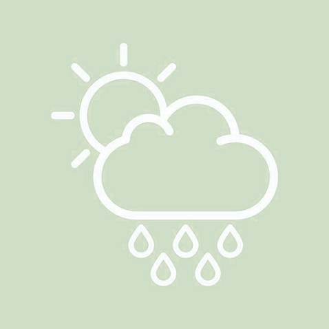

# ioBroker.vis-2-widgets-weather-and-heating

**Если вам понравилось, пожалуйста, рассмотрите возможность пожертвования:**

## погода

Этот виджет vis-2 отображает данные прогноза погоды с сайтов DasWetter.com или weatherunderground. Для его работы вам потребуется установленный на вашем компьютере адаптер DasWetter-Adapter или weatherunderground-Adapter.

### погода

- Идентификаторы OID устанавливаются автоматически на основе общих настроек.
- Метки оси X можно настроить в соответствии с [документацией Moment.js.](http://momentjs.com/docs/#/displaying/format/)

### погода в день

- Идентификаторы OID устанавливаются автоматически на основе общих настроек.
- Наборы иконок можно изменять.

### Виджет погоды Meteored

Дополнительную информацию см. в [разделе METEORED](https://www.daswetter.com/users/widget) .

Вам необходимо создать виджет на METEORED и получить для него ID. Этот ID необходимо указать в настройках виджета. Не забудьте добавить свой домен в белый список в настройках METEORED. В моем случае мне пришлось это сделать.`https://192.168.xxx.xxx:8082` чтобы запустить виджет.

## общая диаграмма

### входные данные для общего графика

- "Серия данных OID" должна указывать на точку данных, например, такую:`sbfspot.0.xxxxxxxx.history.years`
- Точка данных должна содержать пары ключ/значение, например:

\[{"year":"2008","value":7000},{"year":"2009","value":2309000},{"year":"2010","value":4445000},{"year":"2011","value":7019000},{"year":"2012","value":9371000},{"year":"2013","value":11393000},{"year":"2014","value":13666000},{"year":"2015","value":16034000},{"year":"2016","value":17826790}]

- Можно автоматически рассчитать и отобразить разницу значений. Просто поставьте галочку напротив «расчет разницы» в настройках.

- он поддерживает адаптер`sbfspot` и`ebus` Просто выберите экземпляр, и основные настройки будут выполнены автоматически.

## отопление (виджеты для адаптера HeatingControl)

На основе проекта [Питтини](https://github.com/Pittini/iobroker-heatingcontrol-vis) для старой версии VIS теперь доступны аналогичные виджеты и для VIS-2.

### Обзор номера

### График времени отопления

### Общий параметр

### Комната

### Профиль помещения Paeameter

### Обзор состояния окна

<!--
    ### **WORK IN PROGRESS**
-->

## Changelog
### 1.4.3 (2026-07-05)
* (René) dependencies updated

### 1.4.2 (2026-06-05)
* (René) see #264: decimal places for temperature values can now be configured in weather day widget 
* (René) decimal places for Y axis can now be configured in SourceAnalytics bar graph widget 
* (René) #263: bug fix to switch color for datepicker in dark mode

### 1.4.0 (2026-05-26)
* (René) see #174: unused empty space in weather widget removed
* (René) dependencies updated

### 1.3.0 (2026-01-03)
* (René) dependencies updated
* (René) update echarts@6.0.
* (H5N1v2) 41 icons for DasWetter@4.x (galeria7)
* (René) optimisations based on mui@7.x in WeatherDay-widget
* (René) weather widget shows now min and max temperature (if values available)

### 1.2.1 (2025-12-30)
* (René) bug fix deployment and dependencies updated
* (René) update to support DasWetter@4.x
known issue: Icons are not updated yet.
* (René, copilot) fixes based on Lint recommendation

[Older changelogs can be found there](https://github.com/rg-engineering/ioBroker.vis-2-widgets-weather-and-heating/blob/master/CHANGELOG_OLD.md)

## License
The MIT License (MIT)

Copyright (c) 2024-2026  rg-engineering <info@rg-engineering.eu>

Permission is hereby granted, free of charge, to any person obtaining a copy
of this software and associated documentation files (the "Software"), to deal
in the Software without restriction, including without limitation the rights
to use, copy, modify, merge, publish, distribute, sublicense, and/or sell
copies of the Software, and to permit persons to whom the Software is
furnished to do so, subject to the following conditions:

The above copyright notice and this permission notice shall be included in
all copies or substantial portions of the Software.

THE SOFTWARE IS PROVIDED "AS IS", WITHOUT WARRANTY OF ANY KIND, EXPRESS OR
IMPLIED, INCLUDING BUT NOT LIMITED TO THE WARRANTIES OF MERCHANTABILITY,
FITNESS FOR A PARTICULAR PURPOSE AND NONINFRINGEMENT. IN NO EVENT SHALL THE
AUTHORS OR COPYRIGHT HOLDERS BE LIABLE FOR ANY CLAIM, DAMAGES OR OTHER
LIABILITY, WHETHER IN AN ACTION OF CONTRACT, TORT OR OTHERWISE, ARISING FROM,
OUT OF OR IN CONNECTION WITH THE SOFTWARE OR THE USE OR OTHER DEALINGS IN
THE SOFTWARE.