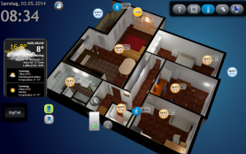

# Визуализация следующего поколения для ioBroker: vis-2
WEB визуализация для платформы ioBroker.

## Обзор
- [Требования к лицензии](#license-requirements)
- [Установка и документация](#installation--documentation)
- [Привязки объектов](#bindings-of-objects)
- [Фильтры](#фильтры)
- [Интерфейс управления](#control-interface)
- [Вид по умолчанию](#default-view)
- [Система разрешений](#permissions-system)
- [Настройки](#settings)
- [SVG и текущий цвет](#svg-and-currentcolor)

## Установка и документация
 

[Онлайн-демонстрации](https://iobroker.click/)

## Привязки объектов
Обычно у большинства виджетов есть атрибут ObjectID, который можно связать с некоторым значением идентификатора объекта.
Но есть и другой вариант привязки *любого* атрибута виджета к определенному ObjectID.

Просто запишите в атрибут `{object.id}`, например, `{hm-rpc.0.OEQ1880105.4.ACTUAL_TEMPERATURE}`, и он будет привязан к значению этого объекта.
Используя специальный формат, вы даже сможете выполнять с ним некоторые простые операции, например, умножение или форматирование.

Например, чтобы вычислить гипотенузу треугольника:

`{h:javascript.0.myCustom.height;w:javascript.0.myCustom.width;Math.max(20, Math.sqrt(h*h + w*w))}` будет интерпретироваться как функция:

```js
value = await (async function () {
    var h = (await getState('javascript.0.myCustom.height')).val;
    var w = (await getState('javascript.0.myCustom.width')).val;
    return Math.max(20, Math.sqrt(h * h + w * w));
})();
```

или

`{h:javascript.0.myCustom.height;w:javascript.0.myCustom.width;h*w}` просто умножит высоту на ширину.

Вы можете использовать *любые* функции JavaScript (браузера). Аргументы должны быть определены с помощью ':', в противном случае они будут интерпретированы как формула.

Будьте внимательны к типам. Все они определены как строки. Чтобы убедиться, что значение будет обработано как число, используйте функцию parseFloat.

Итак, наш расчет гипотенузы будет следующим:

```
{h:javascript.0.myCustom.height;w:javascript.0.myCustom.width;Math.max(20, Math.sqrt(Math.pow(parseFloat(h), 2) + Math.pow(parseFloat(w), 2)))}
```

### Устаревший формат
Паттен имеет следующий формат:

```
{objectID;operation1;operation2;...}
```

Поддерживаются следующие операции:

- `*` — умножение. Аргумент должен быть заключен в скобки, например, "*(4)". В этом примере мы умножаем значение на 4.
- `+` — сложение. Аргумент должен быть заключен в скобки, например, "+(4.5)". В этом примере мы добавляем значение 4.5.
- `-` — вычитание. Аргумент должен быть заключен в скобки, например, "-(-674.5)". В этом примере мы вычитаем из значения -674.5.
- `/` - деление. Аргумент должен быть заключен в скобки, например, "/(0.5)". В этом примере мы делим значение на 0.5.
- `%` - остаток от деления. Аргумент должен быть заключен в скобки, например, "%(5)". В этом примере мы берём остаток от деления на 5.
- `round` - округлить значение.
- `round(N)` - округляет значение до N знаков после точки, например, 34.678; round(1) => 34.7
- `hex` - преобразовать значение в шестнадцатеричное. Все буквы строчные.
- `hex2` - преобразовать значение в шестнадцатеричное. Все буквы строчные. Если значение меньше 16, добавляется начальный ноль.
- `HEX` - то же, что и hex, но в верхнем регистре.
- `HEX2` - то же, что и hex2, но в верхнем регистре.
- `date` - форматировать дату согласно заданному формату. Формат такой же, как в [iobroker.javascript](https://github.com/iobroker/iobroker.javascript/blob/master/README.md#formatdate)
- `min(N)` - если значение меньше N, берём N, иначе значение
- `max(M)` - если значение больше M, берётся M, иначе значение
- `sqrt` - квадратный корень
- `pow(n)` - степень числа N.
- `pow` - степень двойки.
- `floor` - Math.floor
- `ceil` - Math.ceil
- `json` — операция получения JSON или свойства объекта. Например, `{id;json(common.name.en)}`
- `random(R)` - Math.random() * R, или просто Math.random(), если нет аргумента
- `formatValue(decimals)` - форматировать значение в соответствии с системными настройками и использовать десятичные знаки
- `date(format)` — форматирует значение как дату. Формат выглядит так: "ГГГГ-ММ-ДД чч:мм:сс.сс".
- `momentDate(format, useTodayOrYesterday)` — форматирует значение как дату с помощью Moment.js. [Утверждённые форматы должны быть введены в соответствии с библиотекой moment.js](https://momentjs.com/docs/#/displaying/format/). При использовании `useTodayOrYesterday=true` формат `moment.js` `ddd`/`dddd` перезаписывается на `сегодня`/`вчера`.
- `array(element1,element2[,element3,element4])` - возвращает элемент индекса. Например: `{id.ack;array(ack is false,ack is true)}`

Вы можете использовать этот шаблон в любом тексте, например

```
My calculations with {objectID1;operation1;operation2;...} are {objectID2;operation3;operation4;...}
```

или расчеты цвета:

```
#{objectRed;/(100);*(255);HEX2}{objectGreen;HEX2}{objectBlue;HEX2}
```

Чтобы показать временную метку объекта, напишите `.ts` или `.lc` (для последнего изменения) в конце идентификатора объекта, например:

```
Last change: {objectRed.lc;date(hh:mm)}
```

### Специальные крепления
Существует ряд различных внутренних привязок для предоставления дополнительной информации в представлениях:

* `username` - показывает вошедшего в систему пользователя
* `view` - имя актуального представления
* `wname` - имя виджета
* `widget` — объект со всеми данными виджета. Может использоваться только в JS-части, например `{a:a;widget.data.name}`
* `widgetOid` — используйте OID виджета для назначения значения виджета в разделе назначения, например `{t:widgetOid.val;t}`
* `wid` - имя фактического виджета
* `язык` - может быть `de`, `en` или `ru`.
* `instance` - экземпляр браузера
* `login` - требуется ли вход в систему или нет (например, чтобы показать/скрыть кнопку выхода)
* `local_*` - если имя состояния начинается с `local_`, оно не будет передано в ioBroker, но обновит все виджеты, зависящие от этого состояния. (Локальная переменная для текущего сеанса браузера)

Примечание: чтобы использовать «:» в вычислениях (например, в строковой формуле), вместо этого используйте «::».

**Помните**, что определения стилей будут интерпретироваться как привязки, поэтому используйте `{{style: value}}` или просто

```
{
	style: value
}
```

для этого.

## Фильтры
Чтобы визуализировать на одном экране все виджеты, вы можете использовать фильтры, чтобы уменьшить количество виджетов, одновременно отображаемых на экране.

У каждого виджета есть поле `filter`. Если задать ему какое-либо значение, например, `light`, можно использовать другой виджет `(bars - filters, filter - dropdown)`, чтобы управлять активным фильтром.

## Интерфейс управления
Vis создает 3 переменные:

- `control.instance` - Здесь следует указать экземпляр браузера или `FFFFFFFF`, если необходимо контролировать каждый браузер.
- `control.data` — параметр команды. См. описание конкретной команды.
- `control.command` - Имя команды. Запись этой переменной запускает команду. Это означает, что перед записью команды необходимо подготовить «instance» и «data».

Команды:

* `alert` — показать окно оповещения в vis-2. Формат «control.data»: «message;title;jquery-icon». Заголовок и jquery-icon необязательны. Имена иконок можно найти [здесь](http://jqueryui.com/themeroller/). Чтобы показать иконку «ui-icon-info», введите `Message;;info`.
* `changeView` — переключиться на нужное представление. "control.data" должен содержать имя представления. Вы также можете указать имя проекта: `project/view`. Проект по умолчанию — `main`.
* `refresh` - перезагрузка vis-2, например после изменения проекта для перезагрузки во всех браузерах.
* `reload` - то же самое, что и refresh.
* `dialog` — показать диалоговое окно. Диалог должен существовать в представлении. Один из вариантов:

- `статический - HTML - Диалог`,
- `статичный - Значок - Диалог`,
- `контейнер - HTML - просмотр в jqui Dialog`,
- `container - ext cmd - view in jqui Dialog`,
- `контейнер - значок - просмотр в jqui Dialog`,
- `контейнер - кнопка - просмотр в диалоге jqui`.

`control.data` должен иметь идентификатор диалогового виджета, например, `w00056`.

* `dialogClose`
* `popup` — открывает новое окно браузера. Ссылка должна быть указана в `control.data`, например, http://google.com
* `playSound` - воспроизведение звукового файла. Ссылка на файл указывается в `control.data`, например, http://www.modular-planet.de/fx/marsians/Marsiansrev.mp3.

Вы можете загрузить свой файл в vis-2 и воспроизвести его, например, как `/vis-2.0/main/img/myFile.mp3`.

**Важно**: браузер не может воспроизводить аудио, пока пользователь не нажмёт хотя бы один раз на страницу. Это политика безопасности браузера. [Здесь](https://github.com/Hugo22O/chrome-autoplay) Подробнее см.

Если пользователь изменит вид или в начале, переменные будут заполнены vis-2 с

- `control.instance`: экземпляр браузера и `ack=true`
- `control.data`: имя проекта и представления в формате `project/view`, например `main/view` (и `ack=true`)
- `control.command`: `changedView` и `ack=true`

Вы можете записать JSON-строку или объект в `control.command` как `{instance: 'AABBCCDD', command: 'cmd', data: 'ddd'}`. В этом случае экземпляр и данные будут взяты из JSON-объекта.

Пример для адаптера JavaScript:

```js
setState('vis-2.0.control.command', { instance: '*', command: 'refresh', data: ''});
```

Если вы записываете JSON как строку, убедитесь, что ее можно анализировать, например, `{"instance": "*", "command": "refresh", "data": ""}`, обратите внимание на `"`.

## Вид по умолчанию
Вы можете задать нужное разрешение для каждого представления (Меню => Инструменты => Разрешение).
Это визуальная граница в режиме редактирования, показывающая размер экрана конкретного устройства. В режиме реального времени она не будет видна, и все виджеты за пределами границы будут видны.

Кроме того, вы можете определить, следует ли использовать это представление по умолчанию для данного разрешения.

Таким образом, при каждом вызове `index.html` (без `#viewName`) будет открываться наиболее подходящий для данного разрешения вид.
Если только один вид имеет флаг *"Default"*, то он будет открываться независимо от разрешения экрана или ориентации.

Например, вы можете создать два вида: «Альбомный-Мобильный» и «Книжный-Мобильный», и эти два вида будут автоматически переключаться при изменении ориентации или размера экрана.

Имеется вспомогательный виджет «basic - Screen Resolution», который показывает фактическое разрешение экрана и наиболее подходящий вид по умолчанию для этого разрешения.

## Система разрешений
### Проект
В диалоговом окне управления проектом вы можете настроить разрешения `read` и `write` для каждого пользователя ioBroker.

Флаг `read` означает, что проект доступен этому пользователю в среде выполнения.
Флаг `write` означает, что проект доступен этому пользователю в режиме редактирования.

При создании нового пользователя с помощью адаптера ioBroker Admin он по умолчанию будет иметь оба разрешения.

### Вид
Вы также можете указать, к каким представлениям пользователю разрешен доступ в режиме выполнения и редактирования.
Если одно из прав доступа не предоставлено на уровне проекта, указание их на уровне представления не имеет никакого эффекта, поскольку проект в целом будет недоступен.

Обратите внимание, что всякий раз, когда вы пытаетесь получить доступ к представлению, на которое у текущего пользователя нет разрешения, вместо этого пользователь увидит панель выбора проекта.

### Виджет
Если у пользователя нет прав `read`, виджет не будет отображаться в режиме выполнения. Если у пользователя нет прав `write`, виджет не будет отображаться в режиме редактирования.

## Настройки
### Перезагрузить, если сон длится дольше
Существует правило, согласно которому после некоторого периода отсутствия соединения вся страница VIS будет перезагружена для синхронизации проекта.
Вы можете настроить это в меню «Настройки...». Если установить интервал «никогда», страница не будет перезагружаться никогда.

### Интервал повторного подключения
Установите интервал между попытками подключения в случае разрыва соединения. Если установить 2 секунды, попытки установить соединение будут выполняться каждые 2 секунды.

### Темный экран повторного подключения
Иногда (ночью) требуется тёмный загрузочный экран. С помощью этой опции вы можете это настроить.

Обратите внимание, что эти настройки действительны только для повторного подключения, а не для первого подключения.


## SVG и текущий цвет
Ключевое слово currentColor в CSS позволяет элементам наследовать текущий цвет текста от родительского элемента.
Оно может быть особенно полезно в SVG (масштабируемой векторной графике), поскольку обеспечивает более динамичное оформление и упрощает интеграцию с HTML-контентом.

Вы можете использовать ключевое слово currentColor вместо конкретного значения цвета для любого свойства внутри SVG, принимающего значение цвета.
Вот простой пример с кругом в SVG:

```xml
<svg width="100" height="100" xmlns="http://www.w3.org/2000/svg">
    <circle cx="50" cy="50" r="40" fill="currentColor" />
</svg>
```

В этом случае, если SVG-элемент принимает цвет родительского элемента.
Например, если он используется в меню, а меню красное, круг будет красным.

## Разработка и отладка
Для внесения изменений в сам редактор vis-2, поиска ошибок и отладки необходимо выполнить следующие шаги.

1. Создайте форк репозитория iobroker/iobroker.vis-2 в своей учетной записи через пользовательский интерфейс GitHub.

2. Клонируйте репозиторий в каталог. Скопируйте URL-адрес вашего репозитория GitHub. Команда выглядит так:

```shell
git clone https://github.com/<your profile name>/ioBroker.vis-2.git
```

3. Откройте загруженный репозиторий с помощью вашей IDE.

4. Чтобы установить и загрузить все необходимые библиотеки, выполните следующую команду в терминале в корневом каталоге репозитория

```shell
npm run install-monorepo
```

5. Чтобы запустить редактор в браузере, выполните следующую команду.

Отдельно работающий экземпляр сервера iobroker должен быть доступен на порту 8082.

```shell
npm run start
```

- Отладка доступна в браузере, например Chrome F12
- при изменении файла поддерживается автоматическая перезагрузка редактора

## Задача
<!-- Заполнитель для следующей версии (в начале строки):

### **РАБОТА В ХОДЕ** -->

## Changelog
### 2.13.4 (2025-09-05)
* (@GermanBluefox) Added the basic methods for metro widgets again

### 2.13.3 (2025-08-27)
* (@GermanBluefox) Corrected loading of icon sets

### 2.13.2 (2025-08-26)
* (@GermanBluefox) Added support for older Android versions

### 2.13.1 (2025-08-25)
* (@GermanBluefox) Fixed loading of widgets on the cloud

### 2.13.0 (2025-08-24)
* (@GermanBluefox) Added possibility to define SVG icon sets from widgets sets

## License
To use this adapter in `ioBroker` you need to accept the source code license of the adapter. The source code of this adapter is available under the CC BY-NC license.

Additionally, you need a license to use the adapter. The following license editions are available on https://iobroker.net/www/pricing 
* **Community-License: Free for private use!**: Get a free license by registering an account on [https://iobroker.net](https://iobroker.net). The license if checked online against the ioBroker license server when the vis-2 adapter is started, so an online connection at this time point is required!
* **Private use Offline-License**: For paying a small support fee, you can get rid of the required online license check on adapter startup. **Only for Private use!**
* **Commercial License**: When using Vis in a commercial environment or selling Vis as part of ioBroker packages to your customers, this license is for you. License check is also not requiring an online connection.

## License
 Copyright (c) 2021-2025 Denis Haev, https://github.com/GermanBluefox <dogafox@gmail.com>,
  
 Creative Common Attribution-NonCommercial (CC BY-NC)

 http://creativecommons.org/licenses/by-nc/4.0/


Short content:
Licensees may copy, distribute, display and perform the work and make derivative works based on it only if they give the author or licensor the credits in the manner specified by these.
Licensees may copy, distribute, display, and perform the work and make derivative works based on it only for noncommercial purposes.
(Free for non-commercial use).