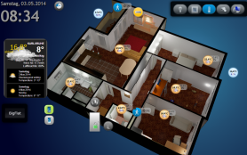

# Визуализация нового поколения для ioBroker: vis-2

Визуализация веб-контента для платформы ioBroker.

## Обзор

- [Требования к лицензированию](#license-requirements)
- [Установка и документация](#installation--documentation)
- [Связывание объектов](#bindings-of-objects)
- [Фильтры](#filters)
- [Интерфейс управления](#control-interface)
- [Вид по умолчанию](#default-view)
- [Навигация](#navigation)
- [Система разрешений](#permissions-system)
- [Настройки](#settings)
- [SVG и текущий цвет](#svg-and-currentcolor)

## Требования к лицензированию

Для использования этого адаптера в `ioBroker` Вам необходимо принять условия лицензии на исходный код адаптера. Исходный код этого адаптера распространяется под лицензией CC BY-NC.

Кроме того, для использования адаптера вам потребуется лицензия. Следующие варианты лицензий доступны по адресу <https://iobroker.net/www/pricing>

- **Лицензия сообщества: Бесплатно для частного использования!** : Получите бесплатную лицензию, зарегистрировав учетную запись на <https://iobroker.net> . Проверка лицензии выполняется онлайн на сервере лицензий ioBroker при запуске адаптера vis-2, поэтому в этот момент требуется подключение к интернету!
- **Автономная лицензия для частного использования** : За небольшую плату за поддержку вы можете избавиться от необходимости проверки лицензии онлайн при запуске адаптера. **Только для частного использования!**
- **Коммерческая лицензия** : Эта лицензия предназначена для использования Vis в коммерческих целях или продажи Vis в составе пакетов ioBroker вашим клиентам. Проверка лицензии также не требует подключения к интернету.

## Установка и документация



[Онлайн-демонстрации](https://iobroker.click/)

## Связывание объектов

Обычно большинство виджетов имеют атрибут ObjectID, и этот атрибут может быть связан с каким-либо значением идентификатора объекта. Но есть и другой способ привязать _любой_ атрибут виджета к определенному ObjectID.

Просто запишите в атрибут `{object.id}` например `{hm-rpc.0.OEQ1880105.4.ACTUAL_TEMPERATURE}` и оно будет привязано к значению этого объекта. При использовании специального формата можно даже выполнять с ним простые операции, например, умножение или форматирование.

Например, чтобы вычислить гипотенузу треугольника:

`{h:javascript.0.myCustom.height;w:javascript.0.myCustom.width;Math.max(20, Math.sqrt(h*h + w*w))}` будет интерпретировано как функция:

```js
value = await (async function () {
    var h = (await getState('javascript.0.myCustom.height')).val;
    var w = (await getState('javascript.0.myCustom.width')).val;
    return Math.max(20, Math.sqrt(h * h + w * w));
})();
```

или

`{h:javascript.0.myCustom.height;w:javascript.0.myCustom.width;h*w}` просто умножит высоту на ширину.

Вы можете использовать _любые_ функции JavaScript (браузера). Аргументы должны быть обозначены двоеточием (':'), в противном случае они будут интерпретированы как формула.

Будьте внимательны к типам. Все они определены как строки. Чтобы убедиться, что значение будет обрабатываться как число, используйте функцию parseFloat.

Таким образом, наш расчет гипотенузы будет выглядеть следующим образом:

```
{h:javascript.0.myCustom.height;w:javascript.0.myCustom.width;Math.max(20, Math.sqrt(Math.pow(parseFloat(h), 2) + Math.pow(parseFloat(w), 2)))}
```

### Устаревший формат

Паттен имеет следующий формат:

```
{objectID;operation1;operation2;...}
```

Поддерживаются следующие операции:

- `*` - умножение. Аргумент должен быть заключен в скобки, например, "\*(4)". В этом примере мы умножаем значение на 4.
- `+` - добавить. Аргумент должен быть заключен в скобки, например, "+(4.5)". В этом примере мы добавляем к значению 4.5.
- `-` - вычесть. Аргумент должен быть заключен в скобки, например, "-(-674.5)". В этом примере мы вычитаем из значения -674.5.
- `/` - деление. Аргумент должен быть заключен в скобки, например, "/(0.5)". В этом примере мы делим значение на 0.5.
- `%` - по модулю. Аргумент должен быть в скобках, например, "%(5)". В этом примере мы берем по модулю 5.
- `round` - округлить значение.
- `round(N)` - округлить значение на N знаков после запятой, например, 34.678;round(1) => 34.7
- `hex` - Преобразовать значение в шестнадцатеричное. Все буквы строчные.
- `hex2` - Преобразовать значение в шестнадцатеричное. Все буквы строчные. Если значение меньше 16, то будет добавлен ведущий ноль.
- `HEX` - то же самое, что и шестнадцатеричный код, но в верхнем регистре.
- `HEX2` - то же самое, что и hex2, но в верхнем регистре.
- `date` - Форматирует дату в соответствии с заданным форматом. Формат тот же, что и в [iobroker.javascript.](https://github.com/iobroker/iobroker.javascript/blob/master/README.md#formatdate)
- `min(N)` - Если значение меньше N, берём N, в противном случае значение
- `max(M)` - Если значение больше M, берём M, в противном случае — значение
- `sqrt` - квадратный корень
- `pow(n)` - степень Н.
- `pow` - степень двойки.
- `floor` - Math.floor
- `ceil` - Math.ceil
- `json` - операция для получения свойств JSON или объекта. Например, `{id;json(common.name.en)}`
- `random(R)` - Math.random() \* R, или просто Math.random(), если аргумента нет.
- `formatValue(decimals)` - отформатируйте значение в соответствии с системными настройками и используйте десятичные знаки.
- `date(format)` - Форматирование значения как даты. Формат: "ГГГГ-ММ-ДД чч:мм:сс.сс."
- `momentDate(format, useTodayOrYesterday)` — Форматирование значения как даты с использованием Moment.js. [Допустимые форматы должны быть введены в соответствии с библиотекой moment.js](https://momentjs.com/docs/#/displaying/format/) . `useTodayOrYesterday=true` тот `moment.js` формат `ddd` /`dddd` перезаписываются данными за сегодняшний день / вчерашний день
- `array(element1,element2[,element3,element4])` - возвращает элемент по индексу. Например: `{id.ack;array(ack is false,ack is true)}` Логическое значение принимает второй элемент, когда оно истинно, и первый, когда оно ложно, поэтому `{id;array(off,on)}` работает на выключателе

Этот шаблон можно использовать в любом тексте, например:

```
My calculations with {objectID1;operation1;operation2;...} are {objectID2;operation3;operation4;...}
```

или расчеты цвета:

```
#{objectRed;/(100);*(255);HEX2}{objectGreen;HEX2}{objectBlue;HEX2}
```

Чтобы отобразить метку времени объекта, напишите `.ts` или `.lc` (для последнего изменения) в конце идентификатора объекта, например:

```
Last change: {objectRed.lc;date(hh:mm)}
```

### Специальные переплеты

Существует ряд различных внутренних привязок для предоставления дополнительной информации в представлениях:

- `username` - отображает авторизованного пользователя
- `view` - название фактического вида
- `wname` - название виджета
- `widget` — это объект, содержащий все данные виджета. Может использоваться только в части JavaScript, например: `{a:a;widget.data.name}`
- `widgetOid` - Используйте OID виджета для присвоения значения виджету в разделе присвоения, например: `{t:widgetOid.val;t}`
- `wid` - название фактического виджета
- `language` - может быть `de`, `en` или `ru`.
- `instance` - экземпляр браузера
- `login` - требуется ли авторизация (например, чтобы показать/скрыть кнопку выхода).
- `local_*` - если название штата начинается с `local_` Это не будет передано в ioBroker, но все виджеты обновятся, в зависимости от этого состояния. (Локальная переменная для текущей сессии браузера)

Примечание: для использования символа ":" в вычислениях (например, в строковых формулах) используйте вместо него "::".

**Помните** , что определения стилей будут интерпретироваться как привязки, поэтому используйте `{{style: value}}` или просто

```
{
	style: value
}
```

для этого.

## Фильтры

Чтобы отобразить все виджеты на одном экране, можно использовать фильтры для уменьшения количества виджетов, одновременно отображаемых на экране.

Каждый виджет имеет поле `filter` Если вы зададите ему какое-либо значение, например... `light`, поэтому вы можете использовать другие виджеты. `(bars - filters, filter - dropdown)` для управления тем, какой фильтр фактически активен.

Записи `filter - dropdown` Виджеты (как кнопки, так и выпадающие списки) имеют CSS-класс. `vis-filter-item` а также текущие активные записи дополнительно. `vis-filter-item-active` Таким образом, их можно будет стилизовать в CSS проекта, например:

```css
/* buttons (horizontal / vertical) */
.vis-filter-item-active {
    background-color: #ff0000;
}

/* entries of the dropdown */
.vis-filter-item-active.Mui-selected {
    background-color: #ff0000;
}
```

Необходимо соблюдать два правила, поскольку активный элемент выпадающего списка дополнительно имеет класс. `Mui-selected`, и его собственный цвет фона более конкретен, чем `.vis-filter-item-active` один.

Пожалуйста, обрати внимание:

- Если для элемента в самом виджете задан цвет, он записывается как встроенный стиль и не может быть переопределен другим цветом. `color` Свойства из CSS проекта. Оставьте поле цвета пустым, если хотите задать цвет через CSS.
- Элементы выпадающего списка отображаются вне виджета (во всплывающем окне на уровне страницы), поэтому к ним можно обращаться только глобально, а не с помощью селектора для отдельного виджета, например, так: `#w00001 .vis-filter-item-active` Кнопки являются частью виджета и могут быть адресованы таким образом.

## Интерфейс управления

Vis создает 3 переменные:

- `control.instance` — Здесь следует указать экземпляр браузера или `FFFFFFFF` если каждый браузер должен контролироваться.
- `control.data` - Параметр для команды. См. описание конкретной команды.
- `control.command` - Название команды. Запишите в эту переменную имя команды, запускающей выполнение команды. Это означает, что перед выполнением команды необходимо подготовить "экземпляр" и "данные", содержащие необходимые данные.

Команды:

- `alert` - Отобразить всплывающее окно в vis-2. Файл "control.data" имеет следующий формат: "message;title;jquery-icon". Title и jquery-icon являются необязательными. Названия значков можно найти [здесь](http://jqueryui.com/themeroller/) . Чтобы отобразить значок "ui-icon-info", напишите `Message;;info`.
- `changeView` — Переключитесь на нужный режим просмотра. Файл "control.data" должен содержать имя режима просмотра. Вы также можете указать имя проекта. `project/view` Проект по умолчанию —`main`.
- `refresh` - Перезагрузить vis-2, например, после изменения проекта, чтобы он перезагружался во всех браузерах.
- `reload` — то же самое, что и обновление.
- `dialog` — Отобразить диалоговое окно. Диалоговое окно должно отображаться. Один из вариантов:

  - `static    - HTML    - Dialog`,
  - `static    - Icon    - Dialog`,
  - `container - HTML    - view in jqui Dialog`,
  - `container - ext cmd - view in jqui Dialog`,
  - `container - Icon    - view in jqui Dialog`,
  - `container - Button  - view in jqui Dialog`.

  `control.data` должен содержать идентификатор виджета диалога, например: `w00056`.
- `dialogClose`
- `popup` - открывает новое окно браузера. Ссылка должна быть указана в `control.data` например, <http://google.com>
- `playSound` - Воспроизвести звуковой файл. Ссылка на файл указана в `control.data` Например, <http://www.modular-planet.de/fx/marsians/Marsiansrev.mp3> . Вы можете загрузить свой собственный файл в Vis-2 и воспроизвести его, как, например, `/vis-2.0/main/img/myFile.mp3` **Важно** : браузер не сможет воспроизводить аудио, пока пользователь не кликнет хотя бы один раз на странице. Это политика безопасности браузера. Подробнее можно прочитать [здесь](https://github.com/Hugo22O/chrome-autoplay) .

Если пользователь изменит представление или в начале, переменные будут заполнены компонентом vis-2.

- `control.instance`: экземпляр браузера и `ack=true`
- `control.data`: название проекта и представления в форме `project/view` например `main/view` (и `ack=true`)
- `control.command`: `changedView` и `ack=true`

Вы можете записать строку JSON или объект в `control.command` как `{instance: 'AABBCCDD', command: 'cmd', data: 'ddd'}` В этом случае экземпляр и данные будут взяты из JSON-объекта.

Пример использования JavaScript-адаптера:

```js
setState('vis-2.0.control.command', { instance: '*', command: 'refresh', data: ''});
```

Если вы записываете JSON в виде строки, убедитесь, что она поддается разбору, например: `{"instance": "*", "command": "refresh", "data": ""}` обратите внимание на `"`.

## Вид по умолчанию

Для каждого элемента можно задать желаемое разрешение (Меню => Инструменты => Разрешение). В режиме редактирования это всего лишь визуальная рамка, показывающая размер экрана на конкретном устройстве. В режиме реального времени она не будет видна, и все виджеты за пределами рамки будут отображаться.

Кроме того, вы можете указать, должен ли этот вид использоваться по умолчанию для данного разрешения.

Поэтому каждый раз, когда `index.html` (без `#viewName` Если вызывается функция, будет открыт наиболее подходящий для данного разрешения вариант просмотра. Если флаг _"Default"_ установлен только для одного варианта просмотра, то этот вариант будет открыт независимо от разрешения или ориентации экрана.

Например, вы можете создать два режима просмотра: «Альбомная ориентация — Мобильная версия» и «Портативная ориентация — Мобильная версия», и эти два режима будут автоматически переключаться при изменении ориентации или размера экрана.

Вспомогательный виджет "Основные параметры - Разрешение экрана" отображает фактическое разрешение экрана и наиболее подходящий вариант отображения по умолчанию для этого разрешения.

## Навигация

Каждый виджет, ведущий к представлению — это `Go to view` опция виджетов jQui, `basic - HTML navigation` … - получает CSS-класс `vis-nav-active` при условии, что отображаемое представление совпадает с тем, на которое указывает указатель. Таким образом, элемент текущего представления может быть выделен в CSS проекта:

```css
.vis-nav-active button {
    border: 1px solid #0d72b8;
}
```

## Система разрешений

### Проект

В диалоговом окне управления проектом можно выполнить настройку. `read` и `write` права доступа для каждого пользователя ioBroker.

Он `read` Этот флаг означает, что проект доступен данному пользователю в среде выполнения. `write` Этот флаг означает, что проект доступен для данного пользователя в режиме редактирования.

При создании нового пользователя через адаптер ioBroker Admin по умолчанию ему будут предоставлены оба разрешения.

### Вид

Вы также можете указать, к каким представлениям пользователю разрешен доступ в режиме выполнения и в режиме редактирования. Если одно из прав доступа не предоставлено на уровне проекта, указание его на уровне представления не имеет никакого эффекта, поскольку проект в целом будет недоступен.

Обратите внимание, что при попытке доступа к представлению, к которому у текущего пользователя нет прав, он увидит панель выбора проекта.

### Виджет

Если у пользователя нет `read` Если у пользователя нет необходимых разрешений, виджет не будет отображаться во время выполнения. `write` Из-за ограничений по правам доступа виджет не будет отображаться в режиме редактирования.

## Настройки

### Перезагрузить, если сон длится дольше

Существует правило, согласно которому после некоторого периода отключения вся страница VIS будет перезагружена для синхронизации проекта. Вы можете настроить это в меню «Настройки...». Если вы установите интервал на «никогда», то страница никогда не будет перезагружаться.

### Интервал повторного подключения

Установите интервал между попытками подключения в случае разрыва соединения. Если вы установите 2 секунды, соединение будет устанавливаться каждые 2 секунды.

### Темный экран повторного подключения

Иногда (ночью) требуется темный экран загрузки. С помощью этой опции вы можете его настроить.

Обратите внимание, что эти настройки действительны только для повторного подключения, а не для первого подключения.


## SVG и текущий цвет

Ключевое слово currentColor в CSS позволяет элементам наследовать текущий цвет текста от родительского элемента. Это может быть особенно полезно в SVG (масштабируемой векторной графике), поскольку обеспечивает более динамичное оформление и упрощает интеграцию с HTML-контентом.

Вместо конкретного значения цвета для любого свойства внутри SVG, принимающего значение цвета, можно использовать ключевое слово currentColor. Вот простой пример с кругом в SVG:

```xml
<svg width="100" height="100" xmlns="http://www.w3.org/2000/svg">
    <circle cx="50" cy="50" r="40" fill="currentColor" />
</svg>
```

В этом случае, если цвет SVG-элемента совпадает с цветом родительского элемента. Например, если он используется в меню, и меню красное, то и круг будет красным.

## Разработка и отладка

Для внесения изменений в сам редактор vis-2, поиска ошибок и отладки необходимо выполнить следующие шаги.

1. Создайте форк репозитория iobroker/iobroker.vis-2 в своей учетной записи через пользовательский интерфейс GitHub.

2. Клонируйте репозиторий в директорию. Скопируйте URL-адрес из вашего репозитория GitHub. Команда выглядит так:

```shell
git clone https://github.com/<your profile name>/ioBroker.vis-2.git
```

3. Откройте загруженный репозиторий в вашей IDE.

4. Чтобы установить и загрузить все необходимые библиотеки, выполните следующую команду в терминале в корневом каталоге репозитория.

```shell
npm run install-monorepo
```

5. Чтобы запустить редактор в браузере, выполните следующую команду. Для этого необходимо, чтобы на порту 8082 был доступен уже запущенный отдельный экземпляр сервера iobroker.

```shell
npm run start
```

- Отладка доступна в браузере, например, в Chrome (клавиша F12).
- При изменении файла поддерживается автоматическая перезагрузка редактора.

## Все

- ИИ-помощник
- Navigation verbessern
- Концепция резервного копирования (История проекта)

<!--
    Placeholder for the next version (at the beginning of the line):
    ### **WORK IN PROGRESS**
-->

## Changelog
### **WORK IN PROGRESS**
* (@GermanBluefox) vis-2 brings two widget sets of its own for the devices of a house: **Relative**, where a widget is a tile that fills its cell of a section, and **Absolute**, where it is as large as it was dragged. Both show the same devices in the same style - the card, a quiet name over a big value, the control at the bottom edge, and every colour out of the theme, so the two new themes carry them as well - and a device is described once and comes out in both sets. The two sets are not the same widget in two sizes: a page with an absolute layout has a picture of the flat under it, so a device there is **a marker no bigger than a coin** - a ring in the colour of its state around a dark disc with its icon, glowing in that colour so it is found on a busy picture. What it shows follows the shape it is dragged to: wider than tall it is a capsule with the number beside the icon, square it shows the number alone because both would have to be too small, taller than wide it stands the icon over the number. Picking the state for one takes over what the object already knows - its name, its unit, its limits and the icon of its channel - so none of that has to be typed again, and a marker says as much or as little as it is told to: only its icon, the icon with the name under it, or both with the state as well.
* (@GermanBluefox) A widget attribute can be an icon **or** a picture, in one field: two buttons beside it open the picker of the standard small icons and the file browser of ioBroker, and whichever was chosen last is what the widget shows. The widgets of the sets `Relative` and `Absolute` name their icon that way In a section a widget is a card instead, in one of three arrangements: the name above the value, a single row, or a tile in the colour of its state. The first three devices are there: switch, measured value and blind. Neither set measures the box it ended up in, so neither can chase its own size the way the widgets of the material set did
* (@GermanBluefox) A page can be built out of the devices of the installation: `Add view` offers `From devices...`, which finds what the type detector knows, sorts it into the rooms - or the functions - it belongs to, and writes one page with a section per room, or a page per room with its entry in the navigation. Every device becomes a widget of `Basic` or `jQui`, so no other adapter is needed: what can be switched becomes a switch, what can be set a slider, what can be read a value. The names can be changed and single devices left out before anything is written, and all of it is one step of the undo
* (@GermanBluefox) The search of the palette looks at the widget sets as well, by their name and by their label: typing `metro` found nothing, because that is a set and not a widget
* (@GermanBluefox) A field that still holds `nothing_selected` - what a new widget is created with - shows `--`, and the dialog behind it opens with nothing selected instead of looking for an object of that name
* (@GermanBluefox) The widgets can be selected, moved and resized with a finger in the editor: every gesture runs on pointer events now instead of mouse events only, and what starts one does not scroll the page (after #658 by @typhosj)
* (@typhosj) Every signal image of a widget names its small icon again. The label was a word per index, of which there were three - the third of them read `[3]` - so the signals beyond them showed the raw key after six of them became possible (#562)
* (@typhosj) The tab of the editor keeps its own name and icon. The title and the favicon of the project name the runtime, and an editor tab that carried them could not be told apart from the runtime tab of the same project (#537)
* (@typhosj) A `border-radius` on a jQui widget is drawn again. Only the frame moves to the button inside the widget, so that it is not drawn twice - the radius stays on the widget as well, whose square background filled in the corners the button had rounded away (#663)
* (@GermanBluefox) The widget `Number` shows `--` instead of `NaN` when its object has no numeric value
* (@GermanBluefox) The editor scrolls the view by itself while a widget is dragged or resized near its edge, so a widget can reach a place that is out of sight
* (@GermanBluefox) A new view - and the first view of a new project - uses the grid layout with sections and starts with one empty section. Existing views keep their layout
* (@GermanBluefox) A widget can be dragged in the editor without selecting it first: the press selects it and moves it at once. A press that is only a click does not shift a widget by a pixel anymore
* (@GermanBluefox) The sections of the grid layout can be styled in the new attributes tab `Section`: header with title and icon, background, border, border radius, inner spacing, or the look of a panel. The tab shows the section of the selected widget, or the section clicked on. It is not offered while an absolute widget is selected, as such a widget has no section
* (@GermanBluefox) The labels of many attributes explain themselves in a tooltip with a picture: the responsive settings, grid, screen limit and navigation of a view, all attributes of a section, and the common CSS attributes of a widget (position, place, size, z-index, overflow, opacity, transform, border, padding, margin, shadow, visibility by view width)
* (@GermanBluefox) A button next to the title of the attributes switches their tabs between names and icons, so that all tabs fit into a narrow panel
* (@GermanBluefox) A section of the grid layout can be shown only to some user groups, only at some widths of the view, or only while a state fulfills a condition. The editor offers the condition and the value the way the state has them: true and false for a boolean, the list of a state with states, a number with its unit
* (@GermanBluefox) A section can be opened and closed by its header, can start closed, and can open and close by a condition on a state. The browser remembers what the user chose
* (@GermanBluefox) More attributes of a section: subtitle, bindings in the title, color, size and alignment of the title, color of the icon, a line below the header, a link to another view, background image, text color, shadow, glass effect, CSS class, width, a new row, the height of its row or a minimal one, and cells of its own size
* (@GermanBluefox) Every attribute of a section can be used as a binding, like every field of a widget: the link icon next to its label switches the input to the text of the binding, e.g. `{javascript.0.alarm}` as the border width. A number stays a number and a checkbox stays on or off, and the view shows the result at once
* (@GermanBluefox) The tabs of the open views can be put in another order by dragging them. The order is the one of the project, so it is there again the next time the editor is opened
* (@GermanBluefox) The button that opens the runtime shows the page that is being worked on. It used to open whatever page was selected when the editor was started, because the address was built once and never again
* (@GermanBluefox) A widget that fills the whole view could make the editor flicker: it grew a little too tall, the scrollbar of the work area appeared, the area became narrower, the widget became shorter, and the bar went again. The work area keeps the room for its scrollbar free now
* (@GermanBluefox) A project in which a widget has no widget set could not be opened in the built adapter: filling it in wrote into the project of the store, which is frozen, and the page died with `Cannot add property widgetSet, object is not extensible`. The repair works on a copy now
* (@GermanBluefox) The theme switcher offers the two new themes `modernDark` and `modernLight` as well, and its switch stays in the family it is in: a view on `modernLight` turns to `modernDark`, not to `dark`. The variant `Text` of the widget has a word in every language again
* (@GermanBluefox) The numbers 4 to 8 of the analog clock stood on their heads: they turned with the dial and did not turn back
* (@GermanBluefox) The history chart of the thermostat and of the static information is drawn by vis-2 itself now - a line or a step curve with its axes, a crosshair that reads the values, panning with the mouse and zooming with the wheel. echarts is not needed for it anymore and left the adapter
* (@GermanBluefox) Dragging the ring of the thermostat, the color wheel or a blind does not paint the text under the cursor blue anymore
* (@GermanBluefox) The RGB light moved into vis-2 as well. Its color wheel and the slider for the brightness are drawn by vis-2 itself now, and the second way of choosing - the palette - is the color picker of the ioBroker components, so the widget brings no color library of its own
* (@GermanBluefox) The attribute `instance` of a widget shows the icon of the adapter on the field itself, not only in the open list
* (@GermanBluefox) While a widget is dragged out of the palette, the section it would land in is marked. Over no section it becomes an absolute widget, as before, and nothing is marked
* (@GermanBluefox) An entry a widget set renders itself - the wizard of the material set, say - stands above the tiles of its set over the whole width, instead of being stretched into a tile as if it were a widget to drag
* (@GermanBluefox) The binding operation `array(...)` takes a boolean as well: true picks the second element, false the first. Until now such a binding - the example `{id.ack;array(…,…)}` of the documentation included - gave `undefined`
* (@GermanBluefox) The editor dims an empty section the same way as a hidden one, since the runtime leaves an empty section out, and says so when the cursor rests on it
* (@GermanBluefox) The name of a view in the narrow navigation menu is hidden again, instead of standing cut off beside its icon
* (@GermanBluefox) A section is selected by a click on it where no widget is, and moved to another place by dragging it from there - the other sections make room while it is dragged.
* (@GermanBluefox) The CSS attribute `display` of a view is not offered anymore in the grid layout, where it has no effect
* (@typhosj) `licenseInformation.link` points at the license editions now. For a non-free license that link is meant to name validity, shop and seller, which the source license file does not
* (@typhosj) A timestamp that arrives as a string is shown as a date again instead of `NaN:NaN:NaN`, and a value that cannot be parsed at all is shown as it is
* (@typhosj) A widget that leads to the view that is shown gets the CSS class `vis-nav-active`, so the current entry of a self-built navigation can be highlighted. The jQui buttons mark themselves by the active view now instead of the address of the browser, which they never noticed changing
* (@typhosj) The project setting `States Debounce Time` is applied again: the commands for one object ID are collected during that period. It had no effect at all, as the value was never read from the project
* (@typhosj) The switch of the `binary control` widget shows the state of the object again if no text and no icon are defined
* (@typhosj) `widgetOid` delivers the object ID of a widget inside a group again instead of the name of the group attribute
* (@typhosj) A view can show the navigation menu without being an entry of it: the new view setting `Hide this view in the menu`
* (@typhosj) A resize of the window does not leave the opened view anymore, unless that view offers itself for a resolution
* (@typhosj) Fixed the widget attributes keeping the groups of the previously selected widget after a view change
* (@typhosj) The view of a jQui dialog is drawn inside the dialog again and no longer over its title
* (@typhosj) Fixed the crash of the `bulb on/off` widget if the value of its object is `null`
* (@typhosj) An `iFrame` or `echarts` widget is transparent again in the dark mode. The CSS variables put `color-scheme: dark` on `:root`, and a browser paints an opaque canvas behind an iframe whose document declares itself transparent (#661)
* (@typhosj, @GermanBluefox) The content of a widget is not cut off anymore: `CssBaseline` is gone. It switched the whole document to `border-box` and painted the body, while the widgets - the built-in ones and those of other adapters alike - are laid out for the default `content-box` (#661)
* (@typhosj) The text of a `Fab` button is readable again in the dark mode. MUI writes `text.primary` into it as soon as the CSS variables are generated, which is white, although the background of the button stays light grey in both themes (#661)
* (@GermanBluefox) vis-2 uses MUI 9 and `@iobroker/gui-components` now, the successor of `@iobroker/adapter-react-v5`
* (@GermanBluefox) `@mui/styles` is gone: it does not exist beyond MUI 6 and vis-2 never used it. It stays in the shared modules of the module federation so that a widget set built against MUI 6 keeps its own copy
* (@GermanBluefox) Replaced the unmaintained `mui-nested-menu`, whose peer range ends at MUI 7, with an own sub menu entry built from MUI components
* (@GermanBluefox) Followed the MUI props that were consolidated into `slotProps` (`TransitionProps`, `TabIndicatorProps`, `InputLabelProps`, `PaperProps`) and the renamed `HelpOutline` icon
* (@GermanBluefox) vis-2 runs on React 19 now
* (@GermanBluefox) Replaced the unmaintained `react-beautiful-dnd` with its api-compatible fork `@hello-pangea/dnd`, which is the only one of the two that supports React 19
* (@GermanBluefox) Fixed the connectors of react-dnd being passed as a `ref`: React 19 takes what a ref callback returns as its cleanup function, and those connectors return a React element, so React would have tried to call an element on unmount
* (@GermanBluefox) Fixed the type of `window.VisMaterialIconSelector`, which named the state of the component instead of its properties
* (@GermanBluefox) A widget set that was built for an older React is recognized by its federation manifest and skipped with a readable message, instead of dying somewhere inside the module federation loader where no error boundary can catch it. As long as vis-2 itself runs on react 18 nothing is skipped
* (@GermanBluefox) Widget sets that were skipped are named in a dialog in the editor and in the runtime, so a view with missing widgets does not leave the user guessing. It is shown once per affected set
* (@GermanBluefox) Dropped the `mime` dependency; copied widget files are compared byte for byte instead of by type
* (@GermanBluefox) `@iobroker/types-vis-2`: `@iobroker/vis-2-widgets-react-dev` left the list of shared modules. vis-2 never provided it anyway, and bundled as a share it dragged its undeclared `@iobroker/adapter-react-v5` into the host build
* (@GermanBluefox) The check that skips widget sets built for an older React works on a real installation too: it asked for the federation manifest under `/vis-2/vis-2/...`, was always answered 404 and let every set through
* (@GermanBluefox) The build declares one placeholder remote (`vis2-dynamic-remotes.js`), which makes `@module-federation/vite` 1.21 treat vis-2 as the host it is. Without it the plugin deferred every shared module to the federation bootstrap and vis-2 died on `jsx is not a function` / `createCssVarsProvider is not a function`
* (@GermanBluefox) `@iobroker/types-vis-2`: `@mui/icons-material` and the i18n JSONs of `@iobroker/gui-components` are not shared modules anymore, and `moment` is one now. Since a shared entry is bundled as a whole namespace, the icons alone put all ~10700 of them into every vis-2 delivery although vis-2 uses 83 - the build shrinks from 11 MB to 5.9 MB. A widget set bundles the icons it really uses instead, which is what already happened for every set of an older MUI major
* (@GermanBluefox) Dropped the unused `echarts` and `echarts-for-react` dependencies of the editor
* (@GermanBluefox) A widget could not be dropped on a view anymore: the workspace wrapper carried no height, so the `height: 100%` of the canvas resolved to `auto` and the drop area collapsed to zero pixels. The workspace is a flex column now - the tabs take their height, the canvas takes the rest
* (@GermanBluefox) `@iobroker/types-vis-2`: `@mui/material` and `@mui/system` are singletons now instead of being versioned by the range of the consumer. A widget set built against 9.1.0 while vis-2 ships 9.1.2 used to carry its own copy; it renders with the MUI of vis-2 now, whatever patch or minor it was built against. Widget sets of an older MUI major are react 18 builds and are skipped before they are evaluated anyway
* (@GermanBluefox) The federation host uses the `loaded-first` share strategy, so a widget set cannot replace the shared react, MUI or gui-components of vis-2 with its own copy

### 2.15.0 (2026-08-16)
* (@GermanBluefox) Reworked the name plate of a widget in the editor: it is only as wide as its content, its buttons sit next to the name instead of on fixed positions that left a gap whenever a button was hidden, and the plate of a selected widget is drawn in the same blue as its frame
* (@GermanBluefox) The three buttons of the name plate have a tooltip now and no longer turn red and double their size when the cursor is over them
* (@GermanBluefox) The widget under the cursor is highlighted in blue instead of olive in the editor, in both themes
* (@GermanBluefox) Several selected widgets are marked with the same frame as a single one, only without the handles to resize them. They carried no mark at all before, as the frame is drawn by those handles
* (@GermanBluefox) Relative widgets can be reordered by dragging them again: a half transparent copy follows the cursor and a placeholder shows the slot the widget will land in. Dragging one never reordered anything before, because the gesture was not started for relative widgets at all
* (@GermanBluefox) Removed the arrow buttons and the re-order menu of the relative widgets, as dragging replaces them
* (@GermanBluefox) Moving and resizing a widget is rendered from the widget state now instead of being written into the DOM, which removes the duplicated geometry of the service and the can.js element
* (@GermanBluefox) Removed the dead `calculateRelativeWidgetPosition` callback from `onMove` and `WidgetReference`: it has been `null` since 2022 and was never called
* (@typhosj) The `view in widget 8` and `image 8` widgets show the view/image with the number of the value again
* (@typhosj) `vis.updateStates` does not write the states back to ioBroker anymore, like in vis-1
* (@typhosj) The `iFrame 8` widget shows the frame with the number of the value, also for a boolean object
* (@typhosj) Every copy of a group gets its own member widgets if several widgets are pasted at once
* (@typhosj) A binding can be used as the comparison value of the visibility condition
* (@typhosj) The application bar is not wider than the window anymore
* (@typhosj) Fixed the invisible content of the `tabs` widget if the tabs are placed vertically
* (@typhosj) The tabs of the `tabs` widget are as wide as their title now and can be scrolled on a touch device
* (@GermanBluefox) Shortened the values that a failing binding writes to the console: a widget with braces in its HTML produced hundreds of failing bindings, each printing the complete HTML, which buried every other error
* (@typhosj) Fixed the position of the vis-1 widgets in a view with a limited screen size
* (@typhosj) The `bulb on/off` widget writes numeric min/max values as a number and not as a string
* (@typhosj) Fixed `min`, `max` and `step` of the vis-1 widget attributes: they are optional and may be fractional
* (@typhosj) Fixed the doubled border of the jQui widgets: the border is drawn by the button only and not by the widget too
* (@typhosj) Fixed the missing attributes of a group: the sections could not be opened and the group attributes were not editable
* (@typhosj) Made the background color and the text color of the selected entry editable for the horizontal navigation menu. The new background color takes precedence over the color of the application bar, which the horizontal menu borrowed before, so a view that was switched from the vertical to the horizontal navigation can change its color once
* (@typhosj) Fixed the enumerable widget groups and fields that start at the index 0 and were not expanded
* (@typhosj) Added the MUI CSS variables (`--mui-palette-*`), so the theme colors can be adjusted with CSS
* (@typhosj) Fixed the overlapping entries of the horizontal navigation menu in a narrow window
* (@typhosj) Fixed the invalid HTML element IDs of the widgets shown in multiple views
* (@GermanBluefox) A widget that crashes while rendering does not take the whole view down anymore, but is replaced by a placeholder
* (@GermanBluefox) Added `react/jsx-runtime` and `react/jsx-dev-runtime` to the shared modules of the module federation, so a widget set uses the JSX runtime of vis-2 instead of bundling its own
* (@GermanBluefox) Fixed the shared modules `react-dom/client` and the i18n files of `adapter-react-v5` being dropped if a widget set passes its `package.json` to `moduleFederationShared()`
* (@GermanBluefox) `@mui/material`, `@mui/system`, `@mui/icons-material` and `@mui/styles` are shared per version now instead of as a singleton. A widget set that is rebuilt keeps its own MUI copy if it was built against another MUI major than vis-2, instead of being given the one of vis-2
* (@GermanBluefox) Added `@mui/private-theming` to the shared modules, so the theme of vis-2 also reaches a widget set that uses its own MUI major
* (@GermanBluefox) The widgeteria is not shown in the GUI anymore

### 2.14.4 (2026-08-10)
* (@typhosj) The entries of the horizontal navigation menu can be scrolled now instead of being cut off in a narrow window
* (@typhosj) Fixed the invalid HTML element IDs of the widgets shown in multiple views. Their IDs changed from `<view>_<widget>` to `v<view>_<widget>`, so a user script or CSS that addresses such a copy must be adapted
* (@typhosj) Fixed the double click on a widget shown in multiple views jumping to a wrong view
* (@typhosj) Show the text of the button widgets as entered and not upper cased
* (@GermanBluefox) Fixed the ignored "small" option of the `filter - dropdown` widget
* (@typhosj) Subscribed to object IDs that are the result of a binding
* (@typhosj) Fixed the ignored read-only option of the Bool SVG widget
* (@GermanBluefox) Fixed the position of a new group created inside another group
* (@typhosj) Fixed the position of the members when a nested group is dissolved
* (@GermanBluefox) Fixed "same width"/"same height" applying the sizes of a previously selected widget
* (@GermanBluefox) Fixed the widget selection when a stored selected widget does not exist anymore
* (@typhosj) Fixed dissolving a group deleting a member widget instead of the group
* (@GermanBluefox) The user permissions are now applied to widgets embedded via `getWidgetInWidget`, which can return `null` now
* (@typhosj) Fixed the user permissions being ignored for widgets inside a group
* (@typhosj) Added the CSS classes `vis-filter-item` and `vis-filter-item-active` to the `filter - dropdown` widget
* (@GermanBluefox) Fixed `exist`/`not exist` of signals evaluating the comparison value instead of the state value
* (@GermanBluefox) Fixed the signal condition if the state value is `null`
* (@typhosj) Fixed the URL attributes of the `iFrame 8` widget being subscribed as object IDs
* (@typhosj) Fixed the visibility condition if the state value is `null`

### 2.14.3 (2026-06-09)
* (@GermanBluefox) Applied the user-defined style to tplValueInput

### 2.14.0 (2026-05-29)
* (@GermanBluefox) Refactoring of the build process

### 2.13.19 (2026-04-27)
* (@GermanBluefox) Refactoring

### 2.13.17 (2026-03-29)
* (@GermanBluefox) Removed debug code for theme

## License
 Copyright (c) 2021-2026 Denis Haev, https://github.com/GermanBluefox <dogafox@gmail.com>,
  
 Creative Common Attribution-NonCommercial (CC BY-NC)

 http://creativecommons.org/licenses/by-nc/4.0/


Short content:
Licensees may copy, distribute, display and perform the work and make derivative works based on it only if they give the author or licensor the credits in the manner specified by these.
Licensees may copy, distribute, display, and perform the work and make derivative works based on it only for noncommercial purposes.
(Free for non-commercial use).