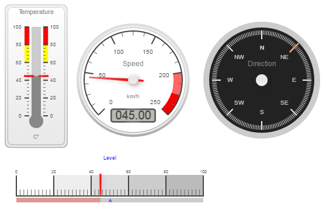

# IoBroker.vis-canvas-gauges

canvas-gauges — Датчики холста для ioBroker.vis 

В этом наборе виджетов используется очень подробная библиотека холстов от Mikhus. Спасибо Михусь.

Описание используемой библиотеки можно найти здесь: [https://canvas-gauges.com](https://canvas-gauges.com)

И на GitHub [здесь](https://github.com/Mikhus/canvas-gauges)

<!--

### **В РАБОТЕ** -->

## Changelog
### 1.0.1 (2022-09-05)
* (oweitman) Added workaround for firefox canvas problem

### 0.1.5 (2016-11-24)
* (bluefox) do not scan DOM at start

### 0.1.4 (2016-11-18)
* (bluefox) fix destroy of widgets

### 0.1.3 (2016-10-06)
* (bluefox) fix highlights if min not zero

### 0.1.2 (2016-09-30)
* (bluefox) translate english

### 0.1.0 (2016-09-26)
* (bluefox) initial checkin

## License
 Copyright (c) 2016-2022 bluefox https://github.com/GermanBluefox
 MIT