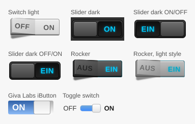

# ioBroker.vis-fancyswitch

`fancyswitch` - Виджеты переключателя, ползунка и качающейся кнопки для [ioBroker.vis](https://github.com/ioBroker/ioBroker.vis) и [ioBroker.vis-2](https://github.com/ioBroker/ioBroker.vis-2) , перенесенные с <http://papermashup.com/jquery-fancy-switch/> пользователем @ashleyford.

## вис и вис-2

Адаптер поставляет каждый виджет в двух экземплярах:

- **vis (vis-1)** использует набор виджетов EJS/jQuery в `widgets/fancyswitch.html`.
- **vis-2** использует набор виджетов React в `widgets/vis-2-widgets-fancyswitch/` построен из `src-widgets/`.

Оба варианта объявляют одни и те же идентификаторы виджетов (`tplFancySwitch1`, `tplFancyGivaIButton` …) и те же имена атрибутов, а vis-2 предпочитает виджет React виджету EJS. Поэтому проект, созданный с помощью vis, продолжает работать после перехода на vis-2 — виджеты просто отображаются с использованием реализации React, без jQuery, jQuery UI или плагина iButton.

Для работы виджетов React требуется vis-2 версии 2.12.8 или новее. При использовании более старых версий vis-2 применяются виджеты EJS.

## Всё нарисовано, ничто не является растровым изображением.

Ранее набор виджетов включал девять файлов PNG. Теперь все они генерируются в формате SVG из одного источника. `src-widgets/src/Components/fancyArt.ts`): спрайты, загружаемые набором vis-1, предварительный просмотр палитры vis-2, изображения из этой документации и значок адаптера. `npm run assets` После внесения изменений он снова пишет им.

Виджеты vis-2 отображают одно и то же изображение в одной строке и масштабируют его вместе с виджетом, поэтому переключатель остается четким при любом размере, а надписи, которые раньше были вдавлены в изображения, сохраняются. `OFF` /`ON`, `AUS` /`EIN`) — это настройки на данный момент.

## Документация

Каждый виджет со своими настройками: [Английский](/#/docs/adapterref/iobroker.vis-fancyswitch/docs/en/README.md) | [Немецкий](https://github.com/ioBroker/ioBroker.vis-fancyswitch/blob/master/docs/de/README.md)

<!--
	Placeholder for the next version (at the beginning of the line):
	### **WORK IN PROGRESS**
-->

## Changelog

### **WORK IN PROGRESS**

- (bluefox) All widgets were ported to vis-2 as React widgets, without jQuery, jQuery UI or the iButton plug-in
- (bluefox) All images are SVG now and are generated from one source, so the switches stay sharp at any size
- (bluefox) The labels of the switches (`OFF`/`ON`, `AUS`/`EIN`) can be changed - they used to be part of the image
- (bluefox) The switches move when they switch: the sliders slide over with knob and labels together, like a real
  sliding switch, and the rockers tip over through their middle position
- (bluefox) A boolean state is recognized as "on" again when "True value" is left at its default of `1`
- (bluefox) In "Schieber dunkel Ein/Aus" the halves now switch to the state their label shows; clicking `EIN`
  switched off before
- (bluefox) The toggle switch follows the theme of vis-2 and no longer needs the jQuery UI stylesheet; its
  coloured part grows towards "on" instead of being full while the switch is off
- (bluefox) All widgets offer "Read only"
- (bluefox) The widget palette of vis-2 shows a preview and a short description for every widget
- (bluefox) Added documentation for every widget (English and German)
- (bluefox) Added the settings of the widgets in eleven languages
- (bluefox) The adapter icon is an SVG now
- (bluefox) Replaced Grunt and Travis CI with GitHub Actions, ESLint, Prettier and the ioBroker release script

### 1.1.0 (2016-07-17)

- (Apollon77) Enhance handling of boolean and textual values for on/off

### 1.0.0 (2016-04-07)

- (bluefox) fix button Giva Labs iButton (other widgets did not work)

### 0.0.3 (2015-10-04)

- (bluefox) add version output

### 0.0.2 (2015-10-04)

- (bluefox) fix dependencies

### 0.0.1 (2015-10-04)

- (bluefox) initial checkin

## License

Copyright (c) 2013-2026 hobbyquaker https://github.com/hobbyquaker, bluefox https://github.com/GermanBluefox

Apache 2.0

The Giva Labs iButton plug-in of the vis-1 widget set is Copyright 2011 Giva, Inc.
(http://www.givainc.com/labs/), Apache 2.0.