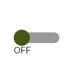

# IoBroker.vis-inventwo
## Виджеты для адаптера ioBroker.vis
Schalter, Slider, Tabellen, Regler, Checkboxen, Radiobuttons и многое другое...<br> Mit unserem Widgets-Set имеет свободную индивидуальную визуализацию, предназначенную для умного дома.


Аналоговый Урен [Дополнительная информация](https://github.com/inventwo/ioBroker.vis-inventwo/wiki/Universal-%26-Multi-Widget-Inhaltstypen)


Цифровой Урен [Дополнительная информация](https://github.com/inventwo/ioBroker.vis-inventwo/wiki/Universal-%26-Multi-Widget-Inhaltstypen)


Палитра цветов [Дополнительная информация](https://github.com/inventwo/ioBroker.vis-inventwo/wiki/Colorpicker)


###### ..аб v 2.0.0
<table><tr><td><center><b>Универсальный<br></b><br></td><td><center> <b>Мульти<br></b><br></td><td><center> <b>Изображение<br></b><br></td><td><center> <b>Стол<br></b> <br></td></tr><tr><td colspan=4></td></tr><tr><td><center><b>Список<br></b><br></td><td><center> <b>Шатер<br></b><br></td><td><center> <b>Переключатель<br></b><br></td><td><center> <b>Слайдер<br> вертикальный</b> <br></td></tr><tr><td colspan=4></td></tr><tr><td><center> <b>Слайдер<br> горизонтальный</b><br></td><td><center> <b>Цветслайдер<br> горизонтальный</b><br></td><td><center> <b>Цветслайдер<br> горизонтальный</b><br></td><td><center> <b>Переключить переключатель<br></b> <br></td></tr><tr><td colspan=4></td></tr><tr><td><center> <b>Основной переключатель<br></b><br></td><td><center> <b>Флажок/<br> Переключатель</b><br></td><td><center> <b>Палитра цветов<br></b><br></td></tr></table>

Mit Hilfe unserer Widgets lassen sich folgende Projekte verwirklichen. Zur Zeit befinden sich in unserem Адаптер NUR die reinen Schaltflächen (siehe oben). Uhr und Wetter stammen aus anderen Adaptern und müssen ggf. zusätzlich installiert werden.


---

## Unterstützung
Falls Dir unsere Arbeit gefällt und Du uns unterstützen möchtest, wir freuen uns über jede Spende.

(Dieser Link для доступа к PayPal-Konto und steht in keiner Verbindung zum ioBroker)

[](https://www.paypal.com/donate?hosted_button_id=7W6M3TFZ4W9LW)

---

## 3.3.2
- Исправлена ошибка

## 3.3.1
- Исправлена ошибка

## 3.3.0
- Новый виджет: конфигуратор Colorpicker для HEX, RGB, HSL, HSV и CIE/XY на основе [iro.js] (https://iro.js.org/)

## 3.2.8
- Radiobutton-List: Mehrzeilige/Mehrspaltige Darstellung möglich [#393](https://github.com/inventwo/ioBroker.vis-inventwo/issues/393)
- Таблица JSON: Textausrichtung für Kopfzeile hinzugefügt [#394](https://github.com/inventwo/ioBroker.vis-inventwo/issues/394)

## 3.2.7
- ИСПРАВЛЕНО: всплывающее окно schließt nicht bei Datenpunktwert

## 3.2.6
- JSON-Tabelle: Hintergrund pro Zeile in Abhängigkeit eines Wertes färben [#280](https://github.com/inventwo/ioBroker.vis-inventwo/issues/280)
- JSON-Tabelle: Standardsortierung einer Spalte [# 286] (https://github.com/inventwo/ioBroker.vis-inventwo/issues/286)
- Универсальный и мультивиджетный виджет ViewInPopUp: Прокрутите вид сверху [#344](https://github.com/inventwo/ioBroker.vis-inventwo/issues/344)
- Универсальный и мультивиджет HTTP: ссылка на новую вкладку geöffnet werden [#363] (https://github.com/inventwo/ioBroker.vis-inventwo/issues/363)

- ИСПРАВЛЕНО: JSON-Tabelle funktioniert nun auch wenn nur ein einzelnes Objekt statt Array mit Objekten im Datenpunkt steht [#319] (https://github.com/inventwo/ioBroker.vis-inventwo/issues/319)
- ИСПРАВЛЕНО: JSON-Tabelle: 10-stelliger Zeitstempel funktionierte nicht [#376] (https://github.com/inventwo/ioBroker.vis-inventwo/issues/376)

## 3.2.5
- Исправлена ошибка

## 3.2.4
- Исправлена ошибка

## 3.2.3
- Исправлена ошибка

## 3.2.2
- Исправлена ошибка

## 3.2.1
- Проблема с активатором Textfarbe behoben (#302)
- Проблема с Multi-Widget und unterschiedlichem Prüftyp behoben (#303)
- Проблема, связанная с просмотром во всплывающем окне (# 254)
- Navigationseffekte aus der Basisnavigation hinzugefügt (#304)
- Новый тип виджета «HTTP» для универсального и многофункционального виджета (# 249)
- Sichtbare Schritte für einfachen Slider hinzugefügt

## 3.2.0
- Активный/неактивный текст для универсального и мультивиджета
- Colorslider CIE Wert mit eckigen Klammern
- Fehler behoben, dass Schattenfarbe bei Universal- & Multiwidget nicht aktualisiert
- JSON Tabelle: Разнообразный и понятный текст

## 3.1.3
- Исправлена ошибка

## 3.1.2
- Исправлена ошибка

## 3.1.1
- Исправлена ошибка

## 3.1.0
- Новый виджет: Basisshalter
- Новый виджет: флажок/переключатель
- Исправление ошибок

## 3.0.11
- Исправлена ошибка

## 3.0.10
- Исправлена ошибка

## 3.0.9
- Исправлена ошибка

## 3.0.8
- Исправлена ошибка

## 3.0.7
- Исправлена ошибка

## 3.0.6
- Исправлена ошибка

## 3.0.5
- Исправлена ошибка

## 3.0.4
- Исправлена ошибка

## 3.0.3
- Исправлена ошибка

## 3.0.2
- Исправлена ошибка

## 3.0.1
- Исправлена ошибка

## 3.0.0
```diff
#### ACHTUNG ####
Nach dem Update sind die Icons vom Universal- und Multiwidget
nicht zu sehen, sind aber nicht weg! Damit diese wieder zu sehen sind müssen
die Widgets einmal EINZELN im Editor angeklickt werden.
```

- Beim Universal- und Multiwidget kann der Inhaltstyp geändert werden.
    - Inhaltstypen: Bild (стандартный), Analoge Uhr, Digitale Uhr и HTML/Text
    - Analoge und digitale Uhr: Farbe des Ziffernblatts под Zeiger kann frei gewählt werden, Zeitzone kann geändert werden
    - Statt dem Icon kann ein eigener Text oder ein Datenpunktwert per Binding angezeigt werden
- Vergleichsoperatoren Größer-Gelich und Kleiner-Gleich
- Канн PopUp для Datenpunk geöffnet werden
- Исправлена ошибка:
    - Colorslider unsichtbar wenn für CIE kein Wert vorhanden ist
    - Ссылки функционируют во всплывающем окне.
    - State Rückmeldedauer funktioniert nicht richtig

## 2.9.7
- Исправлена ошибка

## 2.9.6
- Исправлена ошибка

## 2.9.5
- Исправлена ошибка

## 2.9.4
- Исправлена ошибка

## 2.9.3
- Fehler mit PopUp behoben: Klick zum schließen wurde direkt nach Öffnen registriert und Klick löste Buttons Hinter dem PopUp aus
- Zustände wurden bei View in PopUp nicht richtig angezeigt

## 2.9.2
- Проблема с Datenpunkt zum Schließen де Popups behoben. АКТУНГ! Der Datenpunkt muss erneut ausgewählt werden

## 2.9.1
- Исправлена ошибка

## 2.9.0
- Multi-Widget-Status показывает неиспользованный виджет-Typ nach Datenpunkten oder Views prüfen
- Optionen Zum Automaticischen Schließen des Popups hinzugefügt
- Исправление ошибок

## 2.8.3
- Исправлена ошибка

## 2.8.2
- Проблема с Colorslider behoben: Wert wird nicht in Datenpunkt gesetzt, wenn "Wert bei Freigabe aktualisieren" aktiviert ist",

## 2.8.1
- Пользуйтесь: Color Slider RGB актуализируйте в Dp Änderung nicht (WICHTIG: Datenpunkte müssen neu ausgewählt werden!)

## 2.8.0
- Просмотр во всплывающем окне для универсального и многофункционального виджета
- Исправлена ошибка

## 2.7.11
- Исправлена ошибка

## 2.7.10
- Проблема с изображениями в универсальном и многофункциональном виджете
- Проблема с Bildwechesl im Universal und Multi Widget behoben

## 2.7.9
- Опция für die Bildgröße für das Image-Widget hinzugefügt
- Fehler von vorheriger Версия behoben

## 2.7.8
- Проблема с Textausrichtung behoben
- Проблема с Bildgröße im Image-Widget behoben

## 2.7.7
- Проблема с Bildgröße behoben
- Проблема с дем Farbregler behoben, dass der Wert beim loslassen nicht gespeichert wurde

## 2.7.6
- Проблема с Symbolfarbe für Navi-Widget behoben
- Проблема с Hervorhebung auf Touch-Geräten behoben
- Проблема с Radiobutton-Widget и Datentyp Zahlen behobenn

## 2.7.5
- JSON Tabelle farbliche Schwellenwerte für Zahlen
- Fehler beim Slider behoben wenn ungültiger Wert im Datenpunkt steht
- Fehler behoben: Signalbilder wurden mit eingefärbt
- Опция um Bildfarbe zu invertieren eingefügt, um Farbfilter zu umgehen
- Ползунок цвета не может быть изменен в HEX, RGB и CIE.

## 2.7.4
- Fehlende Übersetzung für Hover-Farben hinzugefügt

## 2.7.3
- Fehler beim Multi-State und mehreren Zuständen behoben
- Schatten und Rand Hover для кнопок hinzugefügt

## 2.7.2
- Фелер в Radiobutton mit Bildfarbe behoben
- Fehler behoben: Doppeltes klicken bei State mit Verweildauer
- Hovereffect для кнопок eingefügt
- Проблема с анализом слайдера.
- Слайдер Text anhängen möglich

## 2.7.1
- Исправлена ошибка

## 2.7.0
- Новый виджет: Farbslider
- JSON Tabelle Spaltenformat boolean und number
- JSON Tabelle Kopfzeile kann fixiert werden
- JSON Tabelle Fehler beim sortieren behoben
- JSON Table configurierbare Dummyzeile wenn JSON leer ist
- Фелер бехобен

## 2.6.0
- Универсальный и мультивиджет Vergleichsoperatoren gleich, größer, kleiner und nicht hinzugefügt
- Ползунок мин./макс.
- Slider Wert erst beim loslassen setzen
- Widget um Wert zu erhöhen oder zu senken
- JSON Tabelle Fehler mit Datum behoben

. JSON Table anzeige von Millisekunden moglich

- JSON Tabelle Platzhalter wenn Eintrag leer ist
- JSON Tabelle Spalten können per Klick sortiert werden

## 2.5.11
- Исправлена ошибка

## 2.5.10
- Исправлена ошибка

## 2.5.9
- Der Prozess der Bildfarbfilterung wurde geändert
- Die Bildfarbe kann jetzt ein Datenpunkt sein

## 2.5.8
- Исправлена ошибка

## 2.5.7
- Исправлена ошибка

## 2.5.6
- Исправлена ошибка

## 2.5.5
- Исправлена ошибка

## 2.5.4
- Исправление (состояние: doppeltes senden dese Wertes bei touch)

## 2.5.3
- Grauer Kippschalter hinzugefügt

## 2.5.2
- Исправлена ошибка

## 2.5.1
- Исправлена ошибка

## 2.5.0
- Kippschalter hinzugefügt
- Исправлена ошибка

## 2.4.3
- Исправлена ошибка

## 2.4.2
- Исправлена ошибка

## 2.4.1
- Исправлена ошибка

## 2.4.0
- Randstil zur JSON-Tabelle hinzugefügt
- Farbauswahö für Icons zu allen Widgets hinzugefügt
- Fehlerbehebung

## 2.3.2
- Fehler bei der Navigation mit dem Widget 'View in Widget' behoben

## 2.3.1
- Фелер в JSON Tabelle behoben

## 2.3.0
- Проблема behoben, bei dem Schaltflächen zweimal Werte senden
- Datum / Uhrzeit und Bildformat für Tabellenzellen hinzugefügt
- Универсальный и мульти-виджет-атрибут, который позволяет активировать виджет.

## 2.2.3
- Фелер в JSON Tabelle behoben

## 2.2.2
- Используйте Multi Widget behoben: Bilder und Text wechseln nicht bei Typ Navigation

## 2.2.1
- Fehler in JSON Tabelle behoben, wenn kein gültiges JSON-Object vorhanden ist
- Fehler в Value-List behoben: Wert wird nicht aktualisiert

## 2.2.0
- Datenpunktwerte werden jetzt bei allen Widgets im Editor angezigt
- Новый виджет: бегущая строка (Laufschrift)
- Универсальное и мультигосударственное Verweildauer hinzugefügt
- List Widget Abstand zwischen den Einträgen kann eingestell werden

## 2.1.0
- Datenpunktwerte werden im VIS Editor angzeigt!

## 2.0.1
- Übersetzungsfehler behoben
- Пограничный Фарбе Бехобен
- Widget-Untertitel behoben

## 2.0.0
- Переключатель, кнопка, навигация и фоновый виджет (необходимо использовать виджет) с помощью универсального виджета -> универсального виджета.
- Multi Widget -> wie das Universal, nur dass hier auf mehrere Datenpunkte und Werte geprüft werden kann (Ähnlich der Signalbild Funktion)
- Image Widget kann nun auf Datenpunkt prüfen
- Радиокнопки hinzugefügt
- Werteliste hinzugefügt (Kann Liste aus einem Datenpunkt oder manuell eingetragenem Text erstellen)

## 1.3.8
- Изменен шаг ползунка на десятичный
- Исправлена проблема с числовыми значениями

### 1.3.7
- Исправлена проблема с навигацией на сенсорных экранах

### 1.3.6
- Добавлена опция установки состояния для навигации
- Исправлена проблема с точками данных без конфига

### 1.3.5
- Добавлена частота обновления для таблицы

### 1.3.4
- Убраны иконки и фоны, изменен конфиг, Исправлена навигация

### 1.3.3
- Исправлена опция значения фонового виджета

### 1.3.2
- Исправлена ошибка

### 1.3.1
- Изменено цветовое поведение кнопки навигации.
- Добавлены новые иконки

### 1.3.0
- Добавлена JSON-таблица.
- Добавлена задержка для навигации
- Текст в кнопках теперь может быть HTML
- Добавлены новые иконки

### 1.2.3
- Добавлен активный цвет навигации
- Исправлен цвет состояния для переключения значений

## 1.2.2
- Исправление ошибки: значение ползунка, конфигурация

## 1.2.1
- Исправлен виджет Slider: разделен на два виджета (горизонтальный и вертикальный)

### 1.2.0
- Добавлен виджет изображения
- Добавлен ползунок для изменения радиуса границы для всех 4 углов (если эта версия является обновлением для вас, вам нужно нажать на каждую кнопку в виз-редакторе, чтобы вернуть углы по умолчанию)
- Добавлены новые иконки

### 1.1.1
- Исправлена ошибка

### 1.1.0
- Добавлен виджет слайдера
- Добавлена возможность зеркального отображения
- Добавлены новые иконки
- Изменены виджеты кнопок, чтобы использовать параметры шрифта и текста по умолчанию.

### 1.0.0
- Фон виджета и непрозрачность содержимого, переключатель может быть изменен с логического на значение, изменены значки с белого на черный, добавлен бесшовный фон.

### 0.1.2
- Исправление ошибок

...

### 0.1.1
- Исправление ошибок

...

### 0.1.0 (Erstveröffentlichung)
- изобретайте два виджета дизайна

...

### 0.0.1
- Die Idee ist geboren

---

## Changelog

## License

Copyright (c) 2022 [jkvarel](https://github.com/jkvarel) und [skvarel](https://github.com/skvarel) von [inventwo](https://github.com/inventwo)

MIT License (nur in englisch / englisch only)

Permission is hereby granted, free of charge, to any person obtaining a copy
of this software and associated documentation files (the "Software"), to deal
in the Software without restriction, including without limitation the rights
to use, copy, modify, merge, publish, distribute, sublicense, and/or sell
copies of the Software, and to permit persons to whom the Software is
furnished to do so, subject to the following conditions:

The above copyright notice and this permission notice shall be included in all
copies or substantial portions of the Software.

THE SOFTWARE IS PROVIDED "AS IS", WITHOUT WARRANTY OF ANY KIND, EXPRESS OR
IMPLIED, INCLUDING BUT NOT LIMITED TO THE WARRANTIES OF MERCHANTABILITY,
FITNESS FOR A PARTICULAR PURPOSE AND NONINFRINGEMENT. IN NO EVENT SHALL THE
AUTHORS OR COPYRIGHT HOLDERS BE LIABLE FOR ANY CLAIM, DAMAGES OR OTHER
LIABILITY, WHETHER IN AN ACTION OF CONTRACT, TORT OR OTHERWISE, ARISING FROM,
OUT OF OR IN CONNECTION WITH THE SOFTWARE OR THE USE OR OTHER DEALINGS IN THE
SOFTWARE.

---

Icons from Icons8 https://icons8.com/