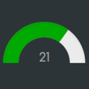

 ioBroker.vis-justgage


[](https://weblate.iobroker.net/engage/adapters/?utm_source=widget)</br> </br> **Версия:** </br> </br> **Тесты:** </br> [](https://github.com/iobroker-community-adapters/ioBroker.vis-justgage/actions/workflows/test-and-release.yml) [](https://github.com/iobroker-community-adapters/ioBroker.vis-justgage/actions/workflows/codeql.yml)

[простоГейдж](http://justgage.com/) Виджет для ioBroker.


## Параметры указателя
Существует возможность определить параметры указателя:

```
{
  "toplength": null,
  "bottomlength": null,
  "bottomwidth": null,
  "stroke": "none",
  "stroke_width": 0,
  "stroke_linecap": "square",
  "color": "#000000"
}
```

Это должен быть действительный объект JSON. Одиночные квоты не допускаются! Дополнительную информацию о параметрах указателя можно найти здесь: https://github.com/toorshia/justgage#pointer-options.

## Changelog
<!--
    Placeholder for the next version (at the beginning of the line):
    ### **WORK IN PROGRESS**
-->
### 2.0.0 (2023-10-24)

- (mcm1957) Adapter has been moved to iobroker-community-adapters organization
- (mcm1957) Dependencies have been updated

### 1.0.1 (2019-10-07)
- (bluefox) fixed min max

### 0.7.1 (2016-12-14)
- (Pmant) change max brightness to max brightness of initial color

### 0.7.0 (2016-12-14)
- (jens-maus) add value formatting
- (jens-maus) add value multiplier

### 0.6.1 (2016-11-25)
- (bluefox) Update justgage.js

### 0.6.0 (2016-07-31)
- (Pmant) add no-gradient-option to Justgage widget
- (Pmant) add full brightness option to Justgage widget
- (jens-maus) add missing unit fields

### 0.5.1 (2016-07-21)
- (jens-maus) fix auto fill max, min, unit

### 0.5.0 (2016-07-01)
- (Pmant) fix default indicator
- (Pmant) add option to change background-color instead of text-color
- (Pmant) add option to always set full brightness colors

### 0.4.2 (2016-06-05)
- (PArns) fix mid default vaule if max != 100 & min != 0

### 0.4.1 (2016-03-20)
- (bluefox) remove config

### 0.4.0 (2016-02-19)
- (Pmant) replace pow with sliders
- (bluefox) fix resize

### 0.3.0 (2016-02-16)
- (bluefox) fix error with two gauges at creation
- (bluefox) fix small errors
- (bluefox) add new widget: value & indication
- (bluefox) fill automatically max, min, unit

### 0.2.5 (2016-02-13)
- (Pmant) fix indicator
- (bluefox) add russian translations

### 0.2.2 (2016-02-12)
- (Pmant) possible donut fix

### 0.2.0 (2016-02-11)
- (Pmant) add indicator widget

### 0.1.1 (2016-02-10)
- (Pmant) initial checkin

## License

The MIT License (MIT)

Copyright (c) 2023 iobroker-community-adapters 
Copyright (c) 2015-2019 Pmant <patrickmo@gmx.de>

Permission is hereby granted, free of charge, to any person obtaining a copy
of this software and associated documentation files (the "Software"), to deal
in the Software without restriction, including without limitation the rights
to use, copy, modify, merge, publish, distribute, sublicense, and/or sell
copies of the Software, and to permit persons to whom the Software is
furnished to do so, subject to the following conditions:

The above copyright notice and this permission notice shall be included in all
copies or substantial portions of the Software.

THE SOFTWARE IS PROVIDED "AS IS", WITHOUT WARRANTY OF ANY KIND, EXPRESS OR
IMPLIED, INCLUDING BUT NOT LIMITED TO THE WARRANTIES OF MERCHANTABILITY,
FITNESS FOR A PARTICULAR PURPOSE AND NONINFRINGEMENT. IN NO EVENT SHALL THE
AUTHORS OR COPYRIGHT HOLDERS BE LIABLE FOR ANY CLAIM, DAMAGES OR OTHER
LIABILITY, WHETHER IN AN ACTION OF CONTRACT, TORT OR OTHERWISE, ARISING FROM,
OUT OF OR IN CONNECTION WITH THE SOFTWARE OR THE USE OR OTHER DEALINGS IN THE
SOFTWARE.