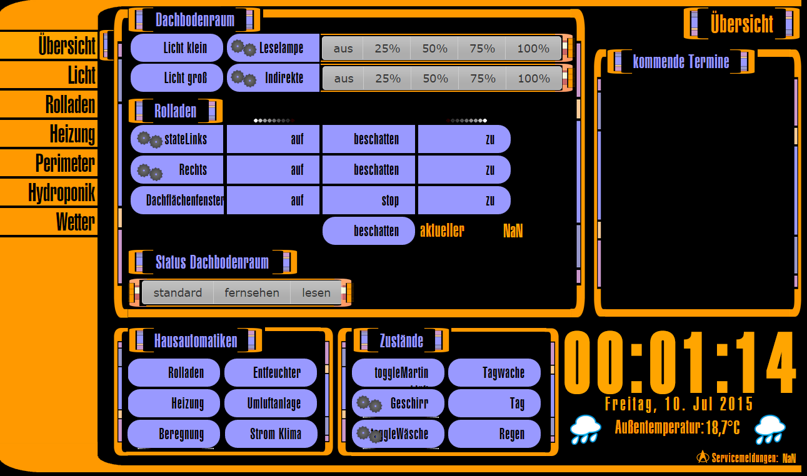

# IoBroker.vis-lcars
Наборы виджетов Lcars (Звездный путь) для ioBroker.vis 

Атрибуты кнопки: 

<!--

### **В РАБОТЕ** -->

## Changelog
### 1.1.1 (2023-06-14)
* (oelison) Added two color schemes: gray and light gray

### 1.0.4 (2017-10-04)
- (bluefox) fix render of state on slow devices

### 1.0.1 (2016-06-07)[README.md](..%2FioBroker.vis-hqwidgets%2FREADME.md)
- (ploebb) fix radius settings for firefox

### 1.0.0 (2016-04-04)
- (bluefox) fix colors in navigation widget

### 0.1.6 (2015-08-12)
- (bluefox) protect against double event: click and touchstart

### 0.1.4 (2015-07-23)
- (bluefox) fix nav button

### 0.1.2 (2015-07-10)
- (bluefox) fix link

### 0.0.1 (2015-07-09)
- (bluefox) initial checkin

## License
 Copyright (c) 2013-2023 hobbyquaker https://github.com/hobbyquaker, bluefox https://github.com/GermanBluefox
 MIT
