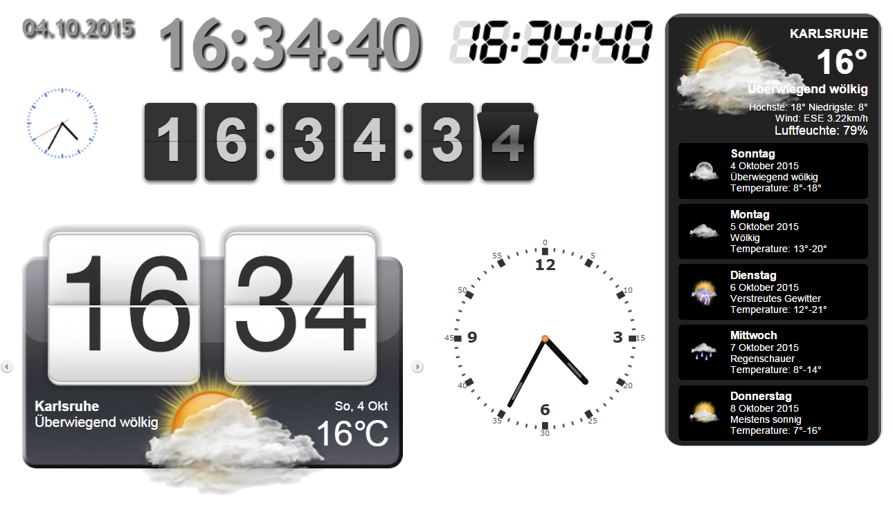

# IoBroker.vis-время и погода
timeandweather — виджеты времени и погоды для ioBroker.vis.

Использовал следующие пакеты:

- **CoolClock** http://randomibis.com/coolclock/ Саймона Бэрда (MIT)

  https://github.com/simonbaird/CoolClock/

- **jDigiClock** http://www.radoslavdimov.com/jquery-plugins/jquery-plugin-digiclock/ Радослав Димов (MIT и GPL)
- **zWeatherFeed** http://www.zazar.net/developers/jquery/zweatherfeed/ Zazar Ltd (MIT)
- **Сегментный дисплей** http://www.3quarks.com/en/SegmentDisplay (CC-3.0)
- **flipclock** http://flipclockjs.com/ (MIT)

  https://github.com/objectivehtml/FlipClock

<!-- Заполнитель для следующей версии (в начале строки):

### **В РАБОТЕ** -->

## Changelog
### **WORK IN PROGRESS**
* (bluefox) Made widgets to be compatible with vis2

### 1.2.2 (2022-07-05)
* (bluefox) Refactoring of build process done

### 1.2.1 (2022-07-05)
* (HeadCrash78) Fixed the icon display in custom weather forecast
* (bluefox) Refactoring of build process done

### 1.1.7 (2017-01-05)
* (bluefox) add update interval for weather

### 1.1.6 (2016-07-13)
* (bluefox) support of vis APP

### 1.1.4 (2016-06-28)
* (jens-maus) improved german translation of weather terms

### 1.1.3 (2016-06-23)
* (bluefox) enable widgets for https too

### 1.1.2 (2016-06-02)
* (bluefox) add weather custom widget

### 1.1.1 (2016-05-31)
* (bluefox) fix the slide in htc weather

### 1.1.0 (2016-04-16)
* (bluefox) add city name to display

### 0.1.0 (2016-02-10)
* (bluefox) fix typo with Dienstag=>Februar

### 0.0.1 (2015-10-04)
* (bluefox) initial checkin

## License
 Copyright (c) 2013-2022 bluefox https://github.com/GermanBluefox
 MIT