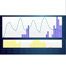

# ioBroker.vis-weather

**Если вам понравилось, пожалуйста, рассмотрите возможность пожертвования:**

Этот виджет отображает данные прогноза погоды с сайтов DasWetter.com или weatherunderground. Для его работы также необходим запущенный адаптер DasWetter-Adapter или weatherunderground-Adapter...

В WeatherUnderground необходимо включить прогноз на следующие 36 часов. На DasWetter.com необходимо включить одну из четырех структур данных прогноза. Вы можете выбрать ту, которую хотите отобразить.

## совместимость с vis-2

Этот виджет НЕ совместим с vis-2. Новая версия под названием [vis-2-widgets-weather](https://github.com/rg-engineering/ioBroker.vis-2-widgets-weather) находится в разработке.

## Примечания / вики

### Определить прогнозируемые часы

По умолчанию на диаграмме прогноза отображается прогноз на 40 часов (DasWetter) или 36 часов (wunderground). Если вы предпочитаете отображать, например, только прогноз на 10 часов, просто удалите ненужные OID в разделе oid\_groups в vis-edit.

### Идентификаторы OID не создаются автоматически при использовании DasWetter.

Обычно OID создаются автоматически при выборе экземпляра или структуры данных. Если вы получаете сообщение «Нет доступных OID», проверьте, используете ли вы параметр «NextDaysDetailed» в DasWetter. Возможно, вам потребуется включить параметр «NextDaysDetailed».

## известные проблемы

- Пожалуйста, создавайте запросы на [GitHub](https://github.com/rg-engineering/ioBroker.vis-weather/issues) , если обнаружите ошибки или пожелаете добавить новые функции.

## Changelog

<!--
  Placeholder for the next version (at the beginning of the line):
  ### **WORK IN PROGRESS**
-->
### 2.5.13 (2025-10-22)
* (René) changes based on adapter checker suggestions

### 2.5.12 (2025-06-02)
* (René) bug fix: widget was not shown at all sometimes

### 2.5.11 (2025-02-28)
* (René) changes requested by adapter checker
* (René) dependencies updated

### 2.5.10 (2024-05-28)
* (René) suggested changes by adapter checker

### 2.5.9 (2024-01-13)
* (René) dependencies update

### 2.5.6 (2022-08-18)
* (René) tooltip with value added as an option
* (René) flot update
* (René) dependencies update

### 2.5.5 (2021-11-07)
* (René) bug fix color of labels in widget

### 2.5.4 (2021-10-30)
* (René) see issue #37: avoid endless loop
* (René) update flot to 4.2.2

### 2.5.3 (2021-03-21)
* (René) dependencies updated

### 2.5.2 (2019-12-12)
* (René) some changes to make it compatible with widgets in sbfspot and ebus

### 2.5.1 (2019-12-08)
* (René) alignment of bars with marking
* (René) position of tick labels of Y axis changed

### 2.5.0 (2019-12-07)
* (René) see issue #20: scaling problem solved 
* (René) see issue #22: bugfix colors for axis labeling 
* (René) color adjustment for axis and tick lables 
* (René) more adjustments for ticks on Y axis
* (René) see issue #23: names for legend adjustable

### 2.4.0 (2019-10-31)
* (René) legend added

### 2.3.2 (2019-10-24)
* (René) add logs for issue #20
* (René) update flot to version 3.0

### 2.3.1 (2019-07-13)
* (René) bug fix: missing timer added

### 2.3.0 (2019-03-25)
* (René) markings added

### 2.2.2 (2018-12-30)
* (René) bug fix: If oid_date is not set when using weatherunderground, an unnecessary error message was issued and the plot was not shown

### 2.2.1 (2018-12-23)
* (René) bug fix issue #12: unnecessary code removed

### 2.2.0 (2018-08-25)
* (René) OID's for different data structures (only DasWetter 2.x)

### 2.1.1 (2018-08-24)
* (René) bug fixes

### 2.1.0 (2018-08-18)
* (René) support of 2.x of weatherundergruond

### 2.0.0
* (René) support of 2.x of daswetter.com

### 1.2.0
* (René) background color and border

### 1.1.2
* (René) Support of admin3

### 1.1.1
* (René) Y axis with units

### 1.1.0
* (René) logs auskommentiert
* (René) Berechnung min / max für Temperaturgraph optimiert
* (René) Y-Achse automatisch ausblenden, wenn Graph nicht dargestellt wird
* (gitbock) konfigurierbare Y-Achsen je Graph (anzeigen/nicht anzeigen)
* (gitbock) Y-Achsen Beschriftung in der Farbe des Graphen
* (gitbock) Max.-/Min Werte für Temperatur Y-Achse
* (gitbock) konfigurierbares Datumsformat für X-Achse

### 1.0.0
* (René) first stable version

### 0.0.7
* (René) bug fix for android app > 1.0.6
* (René) color adjustment for ticks and tick lable (from sbfspot)

### 0.0.6
* (René) css removed

### 0.0.5
* (René) number of labels on X axis adjustable

### 0.0.4
* (René) bug fixes

### 0.0.3
* (René) support of DasWetter.com and weatherunderground

### 0.0.2
* (René) bug fixes
	- in live mode nothing was shown

### 0.0.1
* (René) initial release

## License
MIT License

Copyright (c) 2017-2026 René G. <info@rg-engineering.eu>

Permission is hereby granted, free of charge, to any person obtaining a copy
of this software and associated documentation files (the "Software"), to deal
in the Software without restriction, including without limitation the rights
to use, copy, modify, merge, publish, distribute, sublicense, and/or sell
copies of the Software, and to permit persons to whom the Software is
furnished to do so, subject to the following conditions:

The above copyright notice and this permission notice shall be included in all
copies or substantial portions of the Software.

THE SOFTWARE IS PROVIDED "AS IS", WITHOUT WARRANTY OF ANY KIND, EXPRESS OR
IMPLIED, INCLUDING BUT NOT LIMITED TO THE WARRANTIES OF MERCHANTABILITY,
FITNESS FOR A PARTICULAR PURPOSE AND NONINFRINGEMENT. IN NO EVENT SHALL THE
AUTHORS OR COPYRIGHT HOLDERS BE LIABLE FOR ANY CLAIM, DAMAGES OR OTHER
LIABILITY, WHETHER IN AN ACTION OF CONTRACT, TORT OR OTHERWISE, ARISING FROM,
OUT OF OR IN CONNECTION WITH THE SOFTWARE OR THE USE OR OTHER DEALINGS IN THE
SOFTWARE.