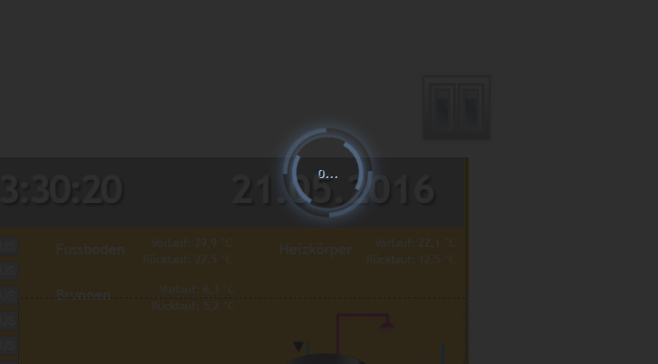

# Визуализация
WEB-визуализация для платформы ioBroker.

## Установка и документация
 

[Интернет-демонстрации](https://iobroker.click/)

## Привязки объектов
Обычно большинство виджетов имеют атрибут ObjectID, и этот атрибут может быть связан с некоторым значением идентификатора объекта.
Но есть еще один вариант, как привязать *любой* атрибут виджета к какому-либо ObjectID.

Просто введите в атрибут ```{object.id}```, и он будет привязан (не в режиме редактирования) к значению этого объекта.
Если вы используете специальный формат, вы даже можете выполнять с ним некоторые простые операции, например умножение или форматирование.
Паттен имеет следующий формат:

```
{objectID;operation1;operation2;...}
```

Поддерживаются следующие операции:

- `\ *` - умножение. Аргумент должен быть в скобках, например «* (4)». В этом примере мы умножаем значение на 4.
- `\ +` - добавить. Аргумент должен быть в скобках, например «+ (4.5)». В этом примере мы добавляем к значению 4.5.
- `\ -` - вычесть. Аргумент должен быть в скобках, например «- (- 674,5)». В этом примере мы вычитаем из значения -674,5.
- `/` - деление. Аргумент должен быть в скобках, например «/(0.5)». В этом примере мы делим значение на 0,5.
- `%` - по модулю. Аргумент должен быть в скобках, например «% (5)». В этом примере мы берем по модулю 5.
- `round` - округлить значение.
- `round (N)` - округлить значение с N разрядами после точки, например 34,678; круглый (1) => 34,7
- `hex` - преобразовать значение в шестнадцатеричное значение. Все буквы в нижнем регистре.
- `hex2` - преобразовать значение в шестнадцатеричное значение. Все буквы в нижнем регистре. Если значение меньше 16, то начальный ноль будет добавлен.
- `HEX` - то же, что и hex, но в верхнем регистре.
- `HEX2` - то же, что и hex2, но в верхнем регистре.
- `date` - форматировать дату согласно заданному формату. Формат такой же, как в [iobroker.javascript] (https://github.com/iobroker/iobroker.javascript/blob/master/README.md#formatdate)
- `min (N)` - если значение меньше N, взять N, иначе значение
- `max (M)` - если значение больше M, взять M, иначе значение
- `sqrt` - квадратный корень
- `pow (n)` - мощность N.
- `pow` - степень двойки.
- `пол` - Math.floor
- `ceil` - Math.ceil
- `random (R)` - Math.random () * R, или просто Math.random (), если нет аргумента
- `formatValue (decimals)` - форматировать значение в соответствии с настройками системы и использовать десятичные дроби
- `дата (формат)` - форматировать значение как дату. Формат такой: «ГГГГ-ММ-ДД чч: мм: сс.ссс».
- `momentDate (format, useTodayOrYesterday)` - форматировать значение как дату с помощью Moment.js. [Утвержденные форматы необходимо вводить в соответствии с библиотекой moment.js] (https://momentjs.com/docs/#/displaying/format/). При использовании `useTodayOrYesterday = true` формат momentjs` ddd` / `dddd` заменяется на сегодня / вчера.
- `array (element1, element2 [, element3, element4])` - возвращает элемент индекса. например: `{id.ack; array (ack - ложь, ack - истина)}`

Вы можете использовать этот шаблон в любом тексте, например

```
My calculations with {objectID1;operation1;operation2;...} are {objectID2;operation3;operation4;...}
```

или расчеты цвета:

```
#{objectRed;/(100);*(255);HEX2}{objectGreen;HEX2}{objectBlue;HEX2}
```

Чтобы показать временную метку объекта, напишите `.ts` или `.lc` (для последнего изменения) в конце идентификатора объекта, например:

```
Last change: {objectRed.lc;date(hh:mm)}
```

Есть еще одна возможность написать выкройку:

```
Hypotenuse of {height} and {width} = {h:height;w:width;Math.max(20, Math.sqrt(h*h + w*w))}
```

`{h:height;w:width;h*w}` будет интерпретироваться как функция:

```
value = (function () {
    var h = "10";
    var w = "20";
    return Math.max(20, Math.sqrt(h*h + w*w));
})();
```

Вы можете использовать *любые* функции javascript. Аргументы должны быть определены с помощью ":", в противном случае это будет интерпретировано как формула.

Позаботьтесь о типах. Все они определены как строки. Конечно, это значение будет рассматриваться как число с использованием функции parseFloat.

```
Hypotenuse of {height} and {width} = {h:height;w:width;Math.max(20, Math.sqrt(Math.pow(parseFloat(h), 2) + Math.pow(parseFloat(w), 2)))}
```

### Специальные привязки
Существует ряд различных внутренних привязок для предоставления дополнительной информации в представлениях:

* `username` - показывает авторизованного пользователя
* `view` - имя актуального просмотра
* `wname` - имя виджета
* `widget` - это объект со всеми данными виджета. Может использоваться только в части JS, например `{a: a; widget.data.name}`
* `wid` - имя актуального виджета
* `language` - может быть` de`, `en` или` ru`.
* `instance` - экземпляр браузера
* `login` - если вход требуется или нет (например, чтобы показать / скрыть кнопку выхода)
* `local_ *` - если имя состояния запускается с `local_`, оно не будет передано ioBroker, но обновит все виджеты, которые зависят от этого состояния. (Локальная переменная для текущего сеанса браузера)

Примечание: чтобы использовать ":" в вычислениях (например, в строковой формуле), используйте вместо этого "::".

** Помните **, что определения стилей будут интерпретироваться как привязки, поэтому используйте `{{style: value}}` или просто

```
{
	style: value
}
```

для этого.

## Фильтры
Чтобы визуализировать в одном представлении целое количество виджетов, вы можете использовать фильтры, чтобы уменьшить количество виджетов, одновременно отображаемых в представлении.

У каждого виджета есть поле `filter`. Если вы установите для него какое-то значение, например `light`, чтобы вы могли использовать другой виджет `(bars - filters, filter - dropdown)` для управления активным фильтром.

## Интерфейс управления
Vis создает 3 переменные:

- `control.instance` - здесь должен быть написан экземпляр браузера или` FFFFFFFF`, если каждый браузер должен контролироваться.
- `control.data` - параметр для команды. См. Описание конкретной команды.
- `control.command` - Имя команды. Запись в эту переменную запускает команду. Это означает, что перед записью команды необходимо подготовить «экземпляр» и «данные» с данными.

Команды:

* `alert` - показать окно с предупреждением в vis. «control.data» имеет следующий формат: «сообщение; заголовок; значок jquery». Заголовок и значок jquery необязательны. Названия значков можно найти [здесь] (http://jqueryui.com/themeroller/). Чтобы отобразить значок ui-icon-info, напишите `` Message ;; info``.
* `changeView` - переключиться на желаемый вид. "control.data" должно иметь имя представления. Вы также можете указать название проекта как «проект / представление». Проект по умолчанию - "главный".
* `refresh` - перезагрузить vis, например, после изменения проекта для перезагрузки во всех браузерах.
* `reload` - то же, что и обновление.
* `dialog` - Показать диалоговое окно. Диалог должен существовать на просмотре. Один из:

    - `static - HTML - Dialog`,
    - `static - Icon - Dialog`,
    - `контейнер - HTML - просмотр в диалоге jqui`,
    - `container - ext cmd - просмотреть в jqui Dialog`,
    - `контейнер - Значок - просмотр в диалоге jqui`,
    - `контейнер - Кнопка - просмотр в диалоге jqui`.

    `control.data` должен иметь идентификатор диалогового виджета, например `w00056`.

* `dialogClose`
* `popup` - открывает новое окно браузера. Ссылка должна быть указана в control.data, например http://google.com
* `playSound` - воспроизвести звуковой файл. Ссылка на файл указывается в control.data, например http://www.modular-planet.de/fx/marsians/Marsiansrev.mp3.

  Вы можете загрузить свой собственный файл в vis и позволить ему воспроизводиться, например, как `/vis.0/main/img/myFile.mp3`.

Если пользователь изменит представление или при запуске, переменные будут заполнены vis с

- `control.instance`: экземпляр браузера и` ack = true`
- `control.data`: название проекта и представления в форме` проект / представление`, например main / view (и ack = true)
- `control.command`:` changedView` и `ack = true`

Вы можете записать JSON-строку или объект в `control.command` как `{instance: 'AABBCCDD', command: 'cmd', data: 'ddd'}`. В этом случае экземпляр и данные будут взяты из объекта JSON.

Пример для адаптера javascript:

```
setState('vis.0.control.command', {"instance": "*", "command": "refresh", "data": ""});
```

## Вид по умолчанию
Вы можете определить для каждого вида желаемое разрешение (Меню => Инструменты => Разрешение). Это только визуальная рамка в режиме редактирования, чтобы показать вам размер экрана на каком-то конкретном устройстве. В режиме реального времени он не будет виден, и будут видны все виджеты за пределами границы.

Кроме того, вы можете определить, нужно ли использовать это представление по умолчанию для этого разрешения.

Таким образом, каждый раз, когда вызывается `index.html` (без `#viewName`), открывается вид, наиболее подходящий для этого разрешения.
Если только одно представление имеет флаг *"По умолчанию"* то это представление будет открыто независимо от разрешения или ориентации экрана.

Например. вы можете создать два представления «Пейзаж-Мобильный» и «Портрет-Мобильный», и эти два представления будут переключаться автоматически при изменении ориентации или размера экрана.

Существует вспомогательный виджет «Базовое - Разрешение экрана», который показывает фактическое разрешение экрана и наиболее подходящий вид по умолчанию для этого разрешения.

## Настройки
### Перезагрузите, если спите дольше, чем
Существует правило, что после некоторого периода отключения вся страница VIS будет перезагружена для синхронизации проекта.
Вы можете настроить его в меню «Настройки ...». Если вы установите интервал «никогда», страница никогда не будет перезагружена.

### Интервал повторного подключения
Установите интервал между попытками подключения при отключении. Если вы установите 2 секунды, он будет пытаться установить соединение каждые 2 секунды.

### Темный экран повторного подключения
Иногда (ночью) требуется темный экран загрузки. С помощью этой опции вы можете установить это.

Обратите внимание, что эти настройки действительны только для повторного подключения, а не для первого подключения.



<! - Заполнитель для следующей версии (в начале строки):

### __РАБОТА В ПРОЦЕССЕ__ ->
### 1.4.5 (2021-10-08)
* (jens-maus) Добавлена спецификация frame-src в заголовок content-security-policy, исправляющая проблемы блокировки содержимого, связанные с кадрами (например, с помощью приложения KioskPro для iOS).
* (bluefox) Показывает расширенные сообщения об ошибках при проверке лицензии
* (Scrounger) Исправление привязки oid видимости

### 1.4.4 (31.08.2021)
* (jobe451) Разрешено иметь ":" в идентификаторах объектов привязки.

### 1.4.3 (2021-07-11)
* (bluefox) Добавлена возможность проверки лицензии в автономном режиме (только один раз)

### 1.4.0 (2021-07-01)
* (bluefox) Изменен путь проверки сертификатов
* (thost96) исправления проблем, обнаруженных программой проверки адаптеров.

### 1.3.10 (25.05.2021)
* (bluefox) Исправлена поддержка admin5

### 1.3.9 (29.04.2021)
* (agav99) Добавлена поддержка локальных переменных браузера.
* (Scrounger) Исправлена ошибка для значений NULL и NaN по ширине и высоте
* (bluefox) Добавлена поддержка admin5

### 1.3.8 (03.03.2021)
* (bluefox) исправлено воспроизведение звуков в iOS Safari и Android.
* (Scrounger) visEditInspect: добавлено измерение формата
* (foxriver76) Замените travis и appveyor на действия GitHub
* (Excodibur) Разрешить загрузку ресурсов как blob
* (Excodibur) Разрешить загрузку ресурсов как blob

### 1.3.7 (2021-01-20)
* (Scrounger) Исправлена ошибка - привязка в строке JSON

### 1.3.6 (13 декабря 2020 г.)
* (twonky4) Исправлено: старая проблема с браузером.
* (rbaranga) Исправлено: воспроизведение звуков в iOS Safari
* (Scrounger) Добавлены необязательные аргументы для поддержки виджетов Material Design.

### 1.3.4 (04.10.2020)
* (foxriver76) Исправлена ошибка на старых устройствах

### 1.3.3 (21.09.2020)
* (bluefox) Вернуть настройки де-дребезга назад
* (bluefox) Исправлена ошибка с привязкой {username}
* (bluefox) Исправлена опция "показать последнее изменение"

### 1.3.1 (18.09.2020)
* (bluefox) Добавлена опция автофокуса для виджетов ввода

### 1.3.0 (17.09.2020)
* (foxriver76) на ожидающих getStates, попробуйте снова вместо drop
* (foxriver76) исправлены опечатки в файловом менеджере
* (Scrounger) Добавлен моментDate для привязок

### 1.2.12 (08.09.2020)
* (foxriver76) анализирует только массивы и объекты json, а не логические значения, обычные строки и т. д.

### 1.2.11 (25.08.2020)
* (bluefox) Исправлено сообщение об ошибке о ненайденном просмотре диаграммы.

### 1.2.10 (23.08.2020)
* (gsicilia82 / fceller) Строки JSON будут анализироваться в привязках VIS

### 1.2.9 (22.08.2020)
* (bluefox) Добавлена поддержка графиков

### 1.2.6 (22.03.2020)
* (bluefox) Добавлено улучшенное сообщение об ошибке, если лицензию не удалось разобрать

### 1.2.4 (11.02.2020)
* (bluefox) Виджет таблицы был расширен идентификатором выбранного объекта.

### 1.2.3 (14.12.2019)
* (bluefox) Внесены небольшие изменения в обработку лицензий

### 1.2.2 (27.10.2019)
* (bluefox) Подготовка для js-controller 2.0. Отметьте undefined и null.

### 1.2.1 (10.09.2019)
* (bluefox) исправлена загрузка файлов

### 1.2.0 (07.05.2019)
* (bluefox) добавить переводы

### 1.1.11 (07.02.2019)
* (bluefox) улучшить Bool HTML

### 1.1.10 (30.01.2019)
* Добавить китайскую поддержку

### 1.1.8 (29.10.2018)
* (bluefox) Исправлен диалог с файлом.

### 1.1.7 (24.07.2018)
* (bluefox) view8 исправлено

### 1.1.6 (18.07.2018)
* (bluefox) поддержка новых переменных (см. [Special bindings] (# special-bindings))
* (bluefox) исправить ошибку при изменении быстрого просмотра
* (bluefox) исправление "jqui - ctrl - IconState / val - Icon Bool"

### 1.1.5 (10.06.2018)
* (bluefox) показать дополнительную информацию, если виджет не может быть отображен
* (bluefox) исправлено сохранение виджетов, если у них есть привязки
* (bluefox) показать стек ошибок
* (bluefox) исправить привязку
* (Apollon77) исправление тестирования
* (bluefox) исправление для iobroker.pro и внешних настроек socket.io
* (bluefox) В привязки добавлена пользовательская переменная.
* (bluefox) Исправлены вкладки виджетов

### 1.1.4 (23.04.2018)
* (bluefox) исправить bool SVG

### 1.1.3 (12.04.2018)
* (bluefox) игнорировать щелчок при прокрутке на сенсорных устройствах
* (bluefox) удалить неправильное состояние vis.0.command
* (bluefox) исправить ошибку с jPlot
* (bluefox) улучшенное поведение виджета в режиме редактирования (базовый, jqui)
* Фикс диалога конфигурации

### 1.1.2 (02.02.2018)
* (bluefox) Исправление сохранения проекта
* (bluefox) Исправление селектора фона
* (bluefox) Исправление проблемы с нулевым указателем
* (bluefox) Исправление помощника выбора
* Обновить переводы

### 1.1.1 (07.01.2018)
* (bluefox) Исправлена проблема с изменением вида на сенсорных устройствах.

### 1.0.5 (19.11.2017)
* (bluefox) показать количество точек данных в каждом проекте

### 1.0.4 (22.10.2017)
* (bluefox) Добавить автозаполнение для просмотра параметров CSS
* (bluefox) изменить редактирование параметров фона просмотра CSS

### 1.0.3 (20.10.2017)
* (bluefox) Фикс парсинга недопустимых привязок
* (bluefox) добавить moment.js

### Релиз-кандидат 1.0.0 (13.10.2017)
* (bluefox) исправить обновления iframe и изображений
* (bluefox) исправить шрифты

### 0.15.7 (01.10.2017)
* (bluefox) позволяет обновлять изображения без дополнительных запросов (но работает только в некоторых очень специфических случаях)
* (bluefox) масштабирование окон iframe

### 0.15.5 (24.07.2017)
* (bluefox) Фикс загрузки виджетов

### 0.15.4 (19.07.2017)
* (bluefox) Добавить свайп

### 0.15.3 (12.07.2017)
* (bluefox) Добавить полноэкранный виджет
* (bluefox) Исправить виджет отметки времени

### 0.15.2 (07.07.2017)
* (bluefox) Исправить привязку, если она имеет "-" в OID

### 0.15.1 (30.06.2017)
* (bluefox) Исправить ошибку с контекстным меню
* (bluefox) Разрешить добавление класса для просмотра

### 0.15.0 (25.05.2017)
* (bluefox) исправить копию сгруппированных виджетов
* (bluefox) исправлена подписка при пустых состояниях

### 0.14.7 (19.05.2017)
* (bluefox) добавить шаблоны

### 0.14.6 (16.05.2017)
* (bluefox) Исправить ошибку при выборе групп
* (apollon77) исправить jqui-диалог для автооткрытия

### 0.14.3 (11.05.2017)
* (bluefox) исправить экспорт / импорт сгруппированных виджетов

### 0.14.2 (29.04.2017)
* (bluefox) Исправить ошибку установки

### 0.14.1 (27.04.2017)
* (bluefox) переместить бета-версию на главную
* (bluefox) исправлен выбор фильтра
* (bluefox) исправить ошибку, если некоторые представления не существуют
* (bluefox) исправить проблему привязки, например. "a: -45? 0" тоже была обнаружена как переменная.
* (bluefox) исправить некоторые размеры шрифтов
* (bluefox) исправить отмену
* (bluefox) исправить смену тем оформления
* (bluefox) оптимизировать загрузку страниц
* (bluefox) проверить лицензию
* (bluefox) исправить основные виды 8
* (bluefox) исправление выбора времени при открытии в диалоге

### 0.14.0 (10.04.2017)
* (bluefox) добавить обязательный ввод лицензии

### 0.12.7 (09.02.2017)
* (bluefox) подготовить бета-версию

### 0.12.6 (29.01.2017)
* (pmant) исправить копию просмотра
* (pmant) Улучшения в контекстном меню
* (pmant) Улучшение удобства использования для обоих раскрывающихся списков
* (bluefox) небольшое исправление перетаскивания

### 0.12.6 (29.01.2017)
* (pmant) добавить раскрывающееся меню в панель просмотра
* (pmant) сортировать селектор виджетов виджетов по имени
* (bluefox) исправить groupAttr в сигналах и видимости

### 0.12.2 (04.12.2016)
* (bluefox) исправить ошибки с группировкой

### 0.12.1 (30.11.2016)
* (bluefox) исправить ошибки с контейнерами

### 0.12.0 (24.11.2016)
* (bluefox) режим подписки для более быстрой загрузки состояния
* (bluefox) добавить группировку

### 0.10.15 (06.11.2016)
* (bluefox) удалить weather-adapter.html
* (bluefox) чистый config.js
* (bluefox) удалить старые виджеты
* (bluefox) улучшить аутентификацию в приложении
* (bluefox) разрешить создание экземпляра из вспомогательного виджета

### 0.10.14 (09.10.2016)
* (bluefox) исправить рендеринг виджетов
* (bluefox) работает над относительными позициями.
* (bluefox) уничтожить виджеты перед удалением просмотров

### 0.10.13 (23.09.2016)
* (bluefox) исправлены ошибки для iPad 1
* (bluefox) начать работу над относительными позициями

### 0.10.12 (16.09.2016)
* (bluefox) групповая видимость виджетов и представлений

### 0.10.11 (15.09.2016)
* (bluefox) исправление для iOS 10
* (bluefox) разрешить отключение групп для работы

### 0.10.10 (14.09.2016)
* (bluefox) добавить виджет text2speech
* (bluefox) попробуйте исправить проблему с iOS 10

### 0.10.9 (04.09.2016)
* (bluefox) принудительная поддержка веб-сокетов
* (bluefox) уничтожить неиспользуемые просмотры через 30 секунд
* (bluefox) не отображать средние ведущие линии, если показаны верхняя и нижняя части
* (bluefox) позвольте метке времени и последнему изменению отображать время как интервал

### 0.10.7 (09.07.2016)
* (bluefox) добавить настройки для перезагрузки vis
* (bluefox) добавить темный экран перезагрузки
* (bluefox) исправить интервал перезагрузки
* (bluefox) экспорт / импорт
* (bluefox) добавить глобальный скрипт
* (bluefox) добавить 'не существует' / 'не состоит' / 'существует' для сигнализации и видимости
* (bluefox) исправить OID в редакторе

### 0.10.5 (15.06.2016)
* (bluefox) исправлен диалог выбора идентификатора
* (bluefox) добавить выравнивание вспомогательных линий
* (bluefox) никогда не храните данные в режиме без редактирования

### 0.10.4 (14.06.2016)
* (bluefox) исправить перетаскивание и изменение размера
* (Патрик) исправить QuoJS
* (bluefox) поддержка миллисекунд в формате Дата
* (bluefox) поддержка getHistory
* (bluefox) поддержка экземпляров истории показа
* (bluefox) сетка
* (bluefox) добавить превью

### 0.10.3 (30.05.2016)
* (bluefox) обновить canJS
* (pmant) исправляет ошибки с диалогами на тачскринах
* (bluefox) атрибуты speedUP показывают при 300 мс
* (bluefox) исправлено нажатие на виджет, если сигнал активен

### 0.10.2 (24.05.2016)
* (bluefox) исправить виджеты с отметками времени

### 0.10.1 (23.05.2016)
* (bluefox) изменить версию

### 0.10.0 (23.05.2016)
* (bluefox) переводит
* (bluefox) исправить "не выбраны виджеты"
* (bluefox) изменить значки виджетов
* (bluefox) добавить сигналы
* (bluefox) добавить app.css для кордовы
* (bluefox) изменить предварительный просмотр значков
* (bluefox) показать свойства виджета как значок
* (bluefox) исправить ошибку с внешними командами
* (bluefox) добавить значок типов для предварительного просмотра
* (bluefox) поддержка редактирования на iPad1
* (bluefox) изменить настройки безопасности

## License
To use this adapter in ioBroker you need to accept the source code license of the adapter. The source code of this adapter is available under the CC BY-NC license.

Additionally, you need a license to use the adapter. The following license editions are available on https://iobroker.net/www/pricing 
* **Community-License: Free for private use!**: Get a free license by registering an account on https://iobroker.net . The license if checked online against the ioBroker license server when the vis adapter is started, so an online connection at this timepoint is required!
* **Private use Offline-License**: For paying a small support fee you can get rid of the required online license check on adapter startup. **Only for Private use!**
* **Commercial License**: When using Vis in a commercial environment or selling Vis as part of ioBroker packages to your customers this license is for you. License check is also not requiring an online connection.

## License
 Copyright (c) 2013-2021 bluefox, https://github.com/GermanBluefox <dogafox@gmail.com>,
 
 Copyright (c) 2013-2014 hobbyquaker, https://github.com/hobbyquaker <hobbyquaker@gmail.com>,
 
 Creative Common Attribution-NonCommercial (CC BY-NC)

 http://creativecommons.org/licenses/by-nc/4.0/


Short content:
Licensees may copy, distribute, display and perform the work and make derivative works based on it only if they give the author or licensor the credits in the manner specified by these.
Licensees may copy, distribute, display, and perform the work and make derivative works based on it only for noncommercial purposes.
(Free for non-commercial use).