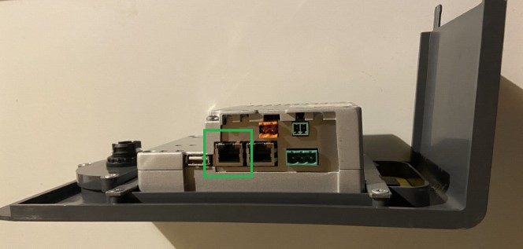

# IoBroker.waterkotte-easycon

## Адаптер Waterkotte-easycon для ioBroker
Чтение и запись параметров тепловых насосов Waterkotte EasyCon посредством запросов CGI. Протестировано с [Waterkotte EcoTouch Ai1 Geo](https://www.waterkotte.de/waermepumpen/ecotouch-ai1-geo-erdwaermepumpe-6-18kw) (модель 2017 г.).

## Функции
### Реализовано
- автоматическое считывание значений теплового насоса в зависимости от используемых функций (вода, отопление, охлаждение, фотогальваника, солнечная энергия, ...)

### Планируется
- уведомлять о тревогах теплового насоса
- написать значения
- читать и управлять расписаниями
- Готовность к SG, например, контроль целевых значений

## Использование
### Монтаж
Установите адаптер `waterkotte-easycon` из репозитория ioBroker.

### Подключение к тепловому насосу
В нижней части сенсорной панели расположены два порта RJ45. Доступ к ним можно получить, сняв переднюю крышку теплового насоса с помощью прилагаемого инструмента. Глядя вверх снизу, подключите кабель Ethernet к правому порту.

Проверьте свой маршрутизатор, чтобы узнать IP-адрес теплового насоса, и включите статический IP-адрес, чтобы адрес теплового насоса не менялся.

### Конфигурация
| Параметр | Описание |
| ------------------------------- | ------------------------------------------------------------------------------------- |
| IP-адрес | IP-адрес теплового насоса (см. [Подключение к тепловому насосу](#Connection-to-heat-pump)) |
| Пароль | По умолчанию `waterkotte` |
| Пароль | По умолчанию `водяной котте` |
| Удалить пробелы из идентификатора штата | Если `State format` равен `Path + Description`, все пробелы будут заменены на `_` |
| Удалить пробелы из идентификатора штата | Если «Формат состояния» — «Путь + Описание», все пробелы будут заменены на «_» |

#### Формат состояния
| Значение | Бесшрайбунг |
| ------------- | ----------------------------------------------------------------------------------------------------------------------------------------------------------------------------------- |
| `Path + ID` | Все названия состояний будут использовать идентификатор тега, например. `Heating.A32`, где `A32` — внутренний идентификатор тега `Target temperatur` напольного отопления |
| `Путь + Имя` | Во всех именах состояний будет использоваться имя тега, например. `Отопление.Заданное значение`. Включите «Удалить пробелы из идентификатора состояния», чтобы избежать пробелов в идентификаторах состояний (например, «Heating.Target_value») |

> Изменение `State format` или `Remove whitespace from state ID` приведет к удалению всех состояний экземпляра и созданию новой структуры.

## Changelog

<!--
    Placeholder for the next version (at the beginning of the line):
    ### **WORK IN PROGRESS**
-->
### 0.0.3 (2024-04-12)

-   (theknut) change update interval from milliseconds to seconds
-   (theknut) add axios timeout
-   (theknut) remove unused onStateChange handler
-   (theknut) logoff when adapter is unloaded

### 0.0.2 (2024-03-11)

-   (theknut) prepare for release

### 0.0.1 (2024-03-01)

-   (theknut) initial release

## License

MIT License

Copyright (c) 2024 theknut <theknutcoding@gmail.com>

Permission is hereby granted, free of charge, to any person obtaining a copy
of this software and associated documentation files (the "Software"), to deal
in the Software without restriction, including without limitation the rights
to use, copy, modify, merge, publish, distribute, sublicense, and/or sell
copies of the Software, and to permit persons to whom the Software is
furnished to do so, subject to the following conditions:

The above copyright notice and this permission notice shall be included in all
copies or substantial portions of the Software.

THE SOFTWARE IS PROVIDED "AS IS", WITHOUT WARRANTY OF ANY KIND, EXPRESS OR
IMPLIED, INCLUDING BUT NOT LIMITED TO THE WARRANTIES OF MERCHANTABILITY,
FITNESS FOR A PARTICULAR PURPOSE AND NONINFRINGEMENT. IN NO EVENT SHALL THE
AUTHORS OR COPYRIGHT HOLDERS BE LIABLE FOR ANY CLAIM, DAMAGES OR OTHER
LIABILITY, WHETHER IN AN ACTION OF CONTRACT, TORT OR OTHERWISE, ARISING FROM,
OUT OF OR IN CONNECTION WITH THE SOFTWARE OR THE USE OR OTHER DEALINGS IN THE
SOFTWARE.