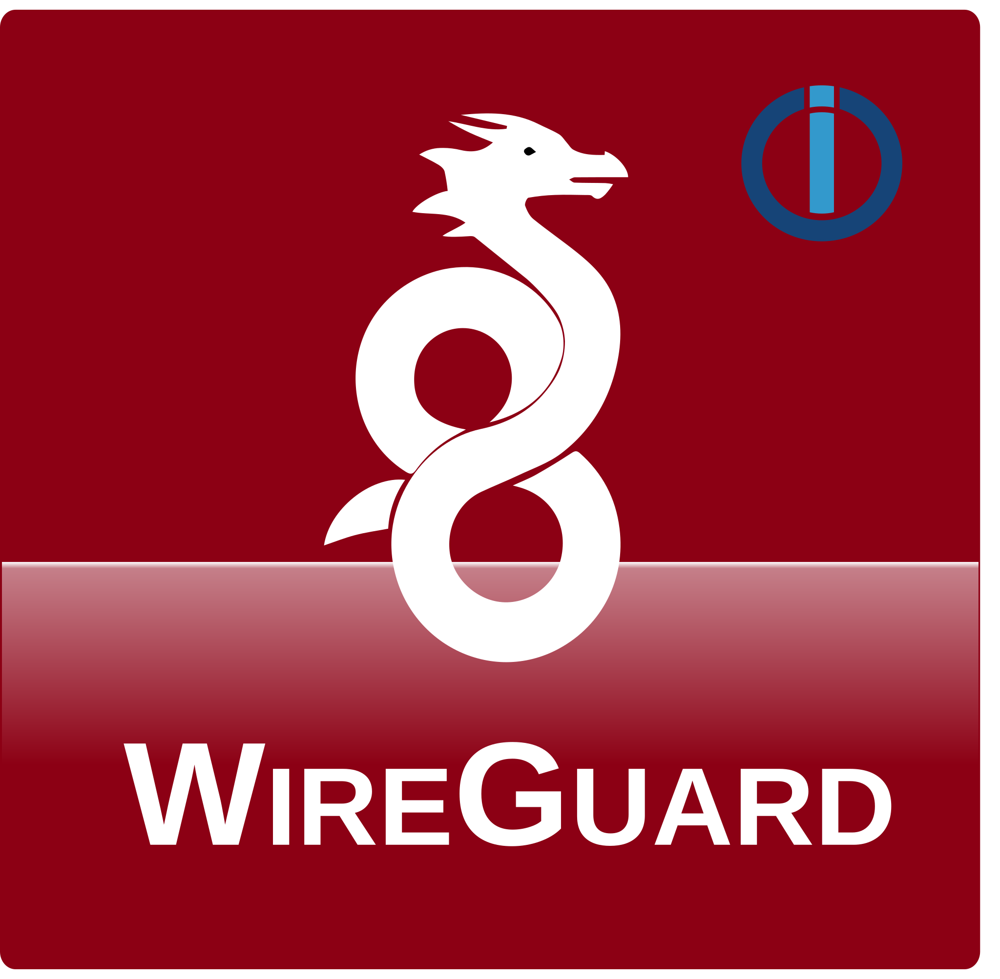
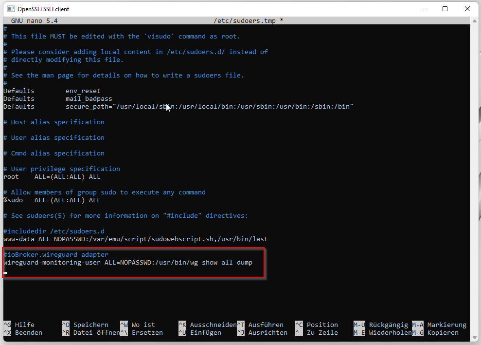

# ioBroker.wireguard



## Адаптер Wireguard для ioBroker

Подключайтесь к хостам WireGuard и получайте информацию о соединениях с другими узлами. Этот адаптер предназначен для мониторинга ваших хостов WireGuard. Он поддерживает как обычные установки, так и Docker.

> Если вам понравился этот адаптер, пожалуйста, поддержите меня.<br/>[](https://www.paypal.com/donate/?hosted_button_id=SPUDTXGNG2MYG)

## Предварительные требования

- На каждом хосте запущен SSH-сервер для мониторинга.
- Исполняемый файл wg (wg.exe в Windows) должен находиться в пути поиска.
- Имя пользователя и пароль пользователя, имеющего разрешение на выполнение команды wg.

## Этапы установки

- Проверьте, запущен ли на вашем хосте WireGuard SSH-сервер. Если нет — установите его. Если вы можете открыть командную строку с помощью PuTTY (или аналогичной программы), значит, у вас запущен SSH-сервер.
- Убедитесь, что пользователь, которого вы хотите использовать для этой задачи, имеет право на выполнение.`wg` (То же самое относится к Windows и Linux). **Этому пользователю необходимы права администратора!**
- Подводя итог тесту: откройте удаленную командную строку, войдите в систему и выполните команду.`wg show` Команда. Если вы получили корректный результат, значит, работа завершена, и вы можете использовать эти данные для запуска адаптера.
- Выполните это для каждого хоста, который вы хотите отслеживать.
- Установите адаптер и настройте его.

## Параметры конфигурации

Поскольку WireGuard внутренне использует для идентификации узлов только открытые ключи, которые довольно неудобно читать и распознавать людям, была добавлена страница перевода. Вы можете добавить туда открытые ключи и имена, чтобы интегрировать их в дерево объектов.

- Главная страница
  - Имя: Просто символическое имя для хоста, поскольку оно удобнее и лучше запоминается, чем его IP-адрес.
  - Адрес хоста: IP-адрес хоста. Также можно использовать полное доменное имя (FQDN) или DNS-имя. Если вы используете WireGuard и ioBroker на одном хосте, вы можете просто использовать`localhost` в качестве IP-адреса.
  - Порт: Номер порта вашего SSH-сервера. По умолчанию: 22.
  - Пользователь: Пользователь, выполняющий скрипт на хосте (данные будут храниться в зашифрованном виде).
  - Пароль: Пароль для этого пользователя (будет храниться в зашифрованном виде)
  - sudo: указывает, следует ли выполнять команду wg с использованием sudo или нет (требуется корректная конфигурация sudoers! -> см. \[подсказки по безопасности])
  - Docker: Выполняет`docker exec` Команда для подключения к серверу Wireguard внутри контейнера Docker. Пожалуйста, проверьте, соответствует ли она вашим потребностям, или вы можете переключиться на поддерживаемый контейнер.
  - Интервал опроса: пауза между каждым опросом в секундах (также задержит первый запуск после начала работы адаптера)
  - Контейнер: Название вашего контейнера Docker. Часто используется "wireguard", но может отличаться, особенно если на одном сервере запущено несколько контейнеров.
- Страница перевода
  - Открытый ключ: Открытый ключ одного из ваших коллег.
  - Название группы: Символическое имя для этого узла.
- страница файлов конфигурации
  - Имя: Должно совпадать с именем на главной странице.
  - Интерфейс: Имя интерфейса, хранящегося в этом конфигурационном файле (wg0, wg1, ...)
  - Файл конфигурации: полный путь и имя файла конфигурации для этого интерфейса (/etc/wireguard/wg0.conf, ...)

### Выполняемая команда из командной строки зависит от флажков:

- Флажок не отмечен:`wg show all dump` будет выполнено (для пользователей с правами root и при использовании SetUID-бита)
- Флажок Sudo установлен:`sudo wg show all dump` будет выполнена (работает с соответствующей строкой sudoers)
- Флажок Docker установлен:`docker exec -it wireguard /usr/bin/wg show all dump` будет выполнено
- Флажки Sudo и Docker отмечены:`sudo docker exec -it wireguard /usr/bin/wg show all dump` будет выполнено

> Если вы используете WireGuard в контейнере Docker, я предполагаю, что вы достаточно хорошо знакомы с обеими технологиями и концепциями безопасности, чтобы настроить вашу систему для выполнения показанных команд таким образом, чтобы не запрашивался пароль.

### Docker

В принципе, все сказанное об обычной установке применимо и к Docker, и работает оно аналогично. За исключением необходимых флажков для выполнения нужной команды и строки sudoers. Если вы используете WireGuard внутри контейнера Docker, вам могут потребоваться строки sudoers, похожие на эти:

```
<wg-monitoring-user> ALL=NOPASSWD:/usr/bin/docker exec -it wireguard /usr/bin/wg show all dump
<wg-monitoring-user> ALL=NOPASSWD:/usr/bin/docker exec -it wireguard /usr/bin/wg set * peer * remove
<wg-monitoring-user> ALL=NOPASSWD:/usr/bin/docker exec -it wireguard /usr/bin/wg set * peer * allowed-ips *
<wg-monitoring-user> ALL=NOPASSWD:/usr/bin/docker exec -it wireguard /usr/bin/wg syncconf * * 
```

Этот адаптер ожидает указание имени.`wireguard` для вашего контейнера WireGuard и`wg` команда в`/usr/bin/` внутри контейнера. В настоящее время эти значения нельзя изменить.

## Как это работает

- Информация о подключении адаптера используется для индикации того, что как минимум один интерфейс WireGuard находится в сети и о нём сообщается.`wg show all` Если ни один интерфейс Wireguard не находится в сети, никаких сообщений не поступает. В этом случае регистрируется ошибка, и индикатор состояния адаптеров загорается желтым.
- Этот адаптер открывает SSH-оболочку на каждом настроенном хосте и выполняет команду.`wg show all dump` Команда запускает оболочку и анализирует результат.
- Поскольку каждый открытый ключ уникален, адаптер использует их для преобразования открытого ключа в удобные для пользователя, читаемые и узнаваемые имена.
- К сожалению, WireGuard сам по себе не предоставляет информацию о состоянии "подключения". Он предоставляет только информацию о последнем рукопожатии. Поскольку рукопожатия обычно происходят каждые 120 секунд, этот адаптер вычисляет состояние подключения именно таким образом, предполагая, что соединение установлено, если последнее рукопожатие было получено менее чем за 130 секунд до этого.

## Советы по безопасности

> Настоятельно рекомендую использовать sudoers в Linux!

Эти рекомендации по безопасности в основном основаны на Linux, поскольку его система безопасности сложнее, чем у Windows. На сервере Windows вам просто потребуется использовать пользователя с правами администратора. Поскольку`wg` Для выполнения этой команды (которая используется для получения состояния WireGuard) требуются права администратора. Тщательно продумайте, что вы делаете и как настраиваете пользователя в конфигурации. Для максимально возможной защиты этих учетных данных как имя пользователя, так и пароль зашифрованы.

В принципе, существует три способа выполнения команды:

- Используйте пользователя с правами администратора (root или аналогичного). Это сработает, но сделает весь ваш сервер уязвимым в случае потери/кражи учетных данных.
- Использование SetUID-бита: Установив этот бит (насколько я понял), каждый пользователь может выполнить помеченный файл с правами администратора без необходимости ввода пароля. **Это касается и хакеров** . Таким образом, установка этого бита в команде wg раскрывает всю мощь команды wg. Если хотите, выполните команду.`chmod u+s /usr/bin/wg` в качестве администратора.
- Использование sudoers: С моей точки зрения, наиболее безопасный способ — создать нового простого пользователя с базовыми привилегиями и добавить в файл sudoers простую строку, которая позволит этому пользователю выполнять необходимую команду без ввода пароля — и ТОЛЬКО ЭТУ команду. Пожалуйста, обратитесь к документации вашего дистрибутива для получения подробной информации о редактировании файла sudoers и использовании visudo. На скриншоте ниже показано, что необходимо добавить в файл.`wireguard-monitoring-user` — это пользователь по вашему выбору. Остальное должно быть точно так, как вы видите.
  ```
  #iobroker.wireguard adapter
  wireguard-monitoring-user ALL=NOPASSWD:/usr/bin/wg show all dump
  wireguard-monitoring-user ALL=NOPASSWD:/usr/bin/wg set * peer * remove
  wireguard-monitoring-user ALL=NOPASSWD:/usr/bin/wg set * peer * allowed-ips *
  wireguard-monitoring-user ALL=NOPASSWD:/usr/bin/wg syncconf * * 
  ```
  Эта настройка позволяет`<wireguard-monitoring-user>` на`ALL` хосты для выполнения`wg show all dump` команда из каталога`/usr/bin/` (Возможно, потребуется изменить в вашем дистрибутиве) без необходимости ввода пароля (`NOPASSWD` ).

## известные проблемы

- никто

## sentry.io

Этот адаптер использует sentry.io для сбора информации о сбоях и автоматического сообщения о них автору. Для этого используется [плагин ioBroker.sentry](https://github.com/ioBroker/plugin-sentry) . Подробную информацию о том, что делает плагин, какая информация собирается и как отключить его, если вы не хотите предоставлять автору информацию о сбоях, вы можете найти на [домашней странице плагина](https://github.com/ioBroker/plugin-sentry) .

### Отказ от ответственности

Данный проект никак не связан с WireGuard. Название WireGuard и логотип WireGuard используются только для обозначения этого проекта и являются собственностью их владельцев. Они не являются частью данного проекта.

## Авторские права

Авторские права (c) 2025 grizzelbee <open.source@hingsen.de>

## Changelog
### 1.8.0 (2025-02-15)
- (grizzelbee) Upd: [#137](https://github.com/Grizzelbee/ioBroker.wireguard/issues/137)minor fixes for adapter checker
- (grizzelbee) Upd: Dependencies got updated
- (grizzelbee) Upd: Removed snyk
- (grizzelbee) Fix: [#138](https://github.com/Grizzelbee/ioBroker.wireguard/issues/138) moved  to eslint 9 and fixed new lint errors
- (grizzelbee) Fix: [#119](https://github.com/Grizzelbee/ioBroker.wireguard/issues/119) Fixed log warning "invalid JsonConfig"

### 1.7.0 (2024-10-01)
- (grizzelbee) Upd: Dependencies got updated
- (grizzelbee) Fix: [#120](https://github.com/Grizzelbee/ioBroker.wireguard/issues/120) Fixed some issues mentioned by adapter-checker

### 1.6.4 (2024-05-08)
- (grizzelbee) Upd: Dependencies got updated

### 1.6.3 (2024-04-16)
* (grizzelbee) Upd: Dependencies got updated
* (grizzelbee) Fix: Removed annoying warning when setting null or undefined values (introduced in v1.6.2)
* (grizzelbee) Upd: Requiring at least admin v6.13.16

### 1.6.2 (2024-03-26)
* (grizzelbee) Upd: Dependencies got updated
* (grizzelbee) Fix: fixed sentry issues WIREGUARD-2B & WIREGUARD-2C
* (grizzelbee) Upd: Adapter requires at least node 18.x

### 1.6.1 (2023-09-14)
* (mcm1957) Fix: [#90](https://github.com/Grizzelbee/ioBroker.wireguard/pull/90) adapter-core 3.x.x is known to fail during installation at node 14 as npm 6 fails to install peerDependencies. So this adapter requires node 16 or newer
* (grizzelbee) Upd: Dependencies got updated
* (grizzelbee) Upd: removed some old news entries in io-package file

### 1.5.11 (2023-08-30)
* (grizzelbee) Fix: [#88](https://github.com/Grizzelbee/ioBroker.wireguard/issues/88) Avoid warning: Cannot read properties of undefined (reading 'at') when user- or devicename is empty

### 1.5.10 (2023-08-17)
* (grizzelbee) Fix: Adapter doesn't crash anymore when user or device name is missing in config.

### 1.5.9 (2023-08-12)
* (grizzelbee) Fix: First device of any user was missing in users viewing
* (grizzelbee) New: Added an icon to peers, users, peer and user

### 1.5.8 (2023-08-11)
* (grizzelbee) Fix: Interface is now correctly set to offline if host is not reachable.

### 1.5.7 (2023-08-10)
* (grizzelbee) Fix: Added missing icon file
* (grizzelbee) Fix: Some fixes to make iobroker.adapterchecker happy
* (grizzelbee) Fix: Another icon fix

### 1.5.2 (2023-08-09)
* (grizzelbee) Fix: Adapter does not crash anymore when host isn't reachable
* (grizzelbee) Fix: Added .releaseconfig file 
* (grizzelbee) Fix: Added icon to interface-device
* (grizzelbee) Fix: Some fixes to make iobroker.adapterchecker happy

### 1.5.1 (2023-08-08)
* (grizzelbee) Fix: [#65](https://github.com/Grizzelbee/ioBroker.wireguard/issues/65) No names in object tree
* (grizzelbee) Fix: [#64](https://github.com/Grizzelbee/ioBroker.wireguard/issues/64) Online state of interface isn't set correctly if more than one server is queried
* (grizzelbee) Upd: Dependencies got updated

### 1.5.0 (2023-06-27)
* (grizzelbee) Deprecated: The current peer name/description will be dropped in one of the next versions. So please move over to Username/Device config.
* (grizzelbee) New: Splitted Peer names in config in user and device names; So that you are able to group devices by user
* (grizzelbee) New: Some new data fields: connectedPeers, connectedPeersCount, connectedUsers, connectedUsersCount and connection states per user
* (grizzelbee) Fix:  [#61](https://github.com/Grizzelbee/ioBroker.wireguard/issues/61) Fixed continuous recreation of objects
* (grizzelbee) Upd: Dependencies got updated
* (grizzelbee) Upd: Dropped support for NodeJS 12
* (grizzelbee) Upd: Added support for NodeJS 18

### 1.4.1 (2022-10-26)
* (grizzelbee) New: Showing number of currently connected peers for each interface

### 1.4.0 (2022-09-09)
* (grizzelbee) New: [#37](https://github.com/Grizzelbee/ioBroker.wireguard/issues/37) Added config options for port and docker container name
* (grizzelbee) Chg: Moved over to new jsonConfig Admin UI

### 1.3.2 (2022-09-07)
* (grizzelbee) New: [#38](https://github.com/Grizzelbee/ioBroker.wireguard/issues/38) Fixed "Adapter doesn't come online" bug caused by pseudo-tty settings

### 1.3.1 (2022-06-26)
* (grizzelbee) New: [#33](https://github.com/Grizzelbee/ioBroker.wireguard/issues/33) Added button to resume a single peer

### 1.3.0 (2022-06-25)
* (grizzelbee) New: [#33](https://github.com/Grizzelbee/ioBroker.wireguard/issues/33) Added buttons to suspend single and restore all peers of an interface
* (grizzelbee) Chg: Changed polling log entry from info to debug 
* (grizzelbee) Upd: dependencies got updated

### 1.2.1 (2022-04-24)
* (grizzelbee) Fixed: [#20](https://github.com/Grizzelbee/ioBroker.wireguard/issues/20) Fixed a bug in tty linking which prevented docker option to work.

### 1.2.0 (2022-04-21)
* (grizzelbee) New: [#20](https://github.com/Grizzelbee/ioBroker.wireguard/issues/20) Added support for WireGuard inside a docker container

### 1.1.3 (2022-03-31)
* (grizzelbee) New: Fixed sentry error [WIREGUARD-1](https://sentry.io/organizations/grizzelbee/issues/3027754005/events/?project=6215712)
* (grizzelbee) New: Fixed sentry error [WIREGUARD-H](https://sentry.io/organizations/grizzelbee/issues/3129951381/events/?project=6215712)
* (grizzelbee) New: Fixed sentry error [WIREGUARD-C](https://sentry.io/organizations/grizzelbee/issues/3036902024/events/?project=6215712)
* (grizzelbee) Upd: dependencies got updated

### 1.1.2 (2022-03-17)
* (grizzelbee) New: Added donate button
* (grizzelbee) Upd: dependency update

### 1.1.1 (2022-03-13)
* (grizzelbee) Upd: Changed titleLang from WireGuard to WireGuard monitoring
* (grizzelbee) Upd: dependency update

### 1.1.0 (2022-03-06)
* (grizzelbee) New: Added support for sudo when using a proper sudoers rule
* (grizzelbee) Upd: Documentation update regarding security
* (grizzelbee) Upd: dependency update

### 1.0.0 (2022-02-25)
* (grizzelbee) New: Added individual online state indicator for each interface
* (grizzelbee) fix: Improved some data roles
* (grizzelbee) fix: Improved documentation

### v0.9.5 (2022-02-22)
* (grizzelbee) New: dropped use of wg-json script - not needed anymore
* (grizzelbee) New: making internal use of wg show all dump command and self parsing the result
* (grizzelbee) New: Added windows support by using the wg show all command
* (grizzelbee) Upd: moved dependency **admin** to globalDependency as requested during adapter review

### v0.9.2 (2022-02-20)
* (grizzelbee) Fix: removed unnecessary secret from index_m.html file
* (grizzelbee) Fix: Using info.connection of adapter to indicate that at least one interface is online.
* (grizzelbee) Fix: Updated adapter icon

### v0.9.1 (2022-02-19)
* (grizzelbee) New: Improved optical quality of admin page - no technical improvements

### v0.9.0 (2022-02-18)
* (grizzelbee) New: Improved documentation
* (grizzelbee) New: Username and password for WireGuard hosts are getting encrypted now

### v0.8.0 (2022-02-17)
* (grizzelbee) New: admin extended with second page
* (grizzelbee) New: data file is getting parsed
* (grizzelbee) New: data tree is getting populated
* (grizzelbee) New: entire basic functionality is implemented
* (grizzelbee) New: added plugin sentry

### v0.2.0 (2022-02-16)
* (grizzelbee) New: admin is working as expected
* (grizzelbee) New: first steps in backend

### v0.1.0 (2022-02-14)
* (grizzelbee) working on admin

### v0.0.1
* (grizzelbee) initial release

## License
MIT License


Permission is hereby granted, free of charge, to any person obtaining a copy
of this software and associated documentation files (the "Software"), to deal
in the Software without restriction, including without limitation the rights
to use, copy, modify, merge, publish, distribute, sublicense, and/or sell
copies of the Software, and to permit persons to whom the Software is
furnished to do so, subject to the following conditions:

The above copyright notice and this permission notice shall be included in all
copies or substantial portions of the Software.

THE SOFTWARE IS PROVIDED "AS IS", WITHOUT WARRANTY OF ANY KIND, EXPRESS OR
IMPLIED, INCLUDING BUT NOT LIMITED TO THE WARRANTIES OF MERCHANTABILITY,
FITNESS FOR A PARTICULAR PURPOSE AND NONINFRINGEMENT. IN NO EVENT SHALL THE
AUTHORS OR COPYRIGHT HOLDERS BE LIABLE FOR ANY CLAIM, DAMAGES OR OTHER
LIABILITY, WHETHER IN AN ACTION OF CONTRACT, TORT OR OTHERWISE, ARISING FROM,
OUT OF OR IN CONNECTION WITH THE SOFTWARE OR THE USE OR OTHER DEALINGS IN THE
SOFTWARE.