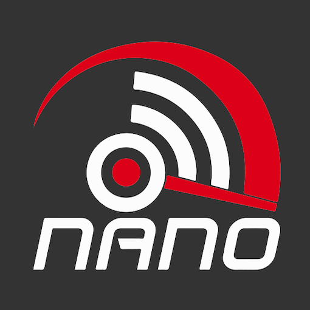

# IoBroker.wlanthermo-nano
**Тесты:** 

## Адаптер wlanthermo-nano для ioBroker
[WLANThermo Nano](https://github.com/WLANThermo-nano/WLANThermo_nano_Software/wiki "WLANThermo Nano"), цифровое преимущество для вашего барбекю.

## Часовой
**Этот адаптер использует библиотеки Sentry для автоматического сообщения разработчикам об исключениях и ошибках в коде.** Для получения более подробной информации и сведений о том, как отключить отправку сообщений об ошибках, см. [Документация по плагину Sentry](https://github.com/ioBroker/plugin-sentry#plugin-sentry)! Отправка сообщений Sentry используется начиная с js-controller 3.0.

## Конфигурация
Адаптер можно установить и настроить через административный интерфейс.
Пожалуйста, введите IP-адрес, имя пользователя и пароль в конфигурации экземпляра.

## Задачи
* [ ] Реализовать автоматическое обнаружение устройств
* [ ] Оптимизировать настройки питмастера, сделать состояния доступными для записи только в соответствующем режиме, в противном случае — только для чтения.

## Присоединяйтесь к серверу Discord, чтобы обсудить все аспекты интеграции ioBroker и WlanThermo!

## Поддержите меня
Если вам нравится моя работа, пожалуйста, не стесняйтесь сделать личное пожертвование (это личная ссылка для пожертвований DutchmanNL, не имеющая отношения к проекту ioBroker!). 

## Changelog

<!--
	Placeholder for the next version (at the beginning of the line):
	### __WORK IN PROGRESS__
-->
### __WORK IN PROGRESS__
* (DutchmanNL) Dependencies updated to current versions
* (DutchmanNL) Maintenance: raise Node.js to 22, modernise CI and release tooling, update dependencies, resolve repository checker findings
* (DutchmanNL) Admin settings are translated again: added the missing admin/i18n files for all 11 supported languages, including Ukrainian, and the device table column headers are now translated too

### 0.2.1 (2022-06-08) - Initialization error for Nano V1 solved
* (DutchmanNL) Initialization error for Nano V1 solved
* (DutchmanNL) Error logging and reporting improved

### 0.2.0 (2022-06-04) - PitMaster Control & ESP32 support
* (DutchmanNL) Support multiple devices
* (DutchmanNL) Refactor code to TypeScript
* (DutchmanNL) Error/debug logging Improved
* (DutchmanNL) Added data points for features
* (DutchmanNL) Test & Release workflow updated
* (DutchmanNL) Added indicator for connection status
* (DutchmanNL) Reconnecting to offline devices improved
* (DutchmanNL) Allow alarm to be activated / disabled #6
* (DutchmanNL) Allow control of pitmaster & system settings
* (DutchmanNL) Ensure support of all WLANThermo-Nano Devices
* (DutchmanNL) Implemented dropdown menu for Pitmaster to select available profiles
* (DutchmanNL) Added data points for PID profiles including capability to change profile settings

### 0.1.2
* (DutchmanNL) Support multiple devices

### 0.1.1
* (DutchmanNL) Code optimisation
* (DutchmanNL) Implement state_attr.js to handle state options outside of source code
* (DutchmanNL) Optimised state creation in 1 function
* (DutchmanNL) Small cleanups

### 0.1.0
* (DutchmanNL) remove color settngs from pitmaster

### 0.0.9
* (DutchmanNL) optimize pid profile setting

### 0.0.8
* (DutchmanNL) fix post command for pitmaster

### 0.0.7
* (DutchmanNL) State unit fixes
* (DutchmanNL) start integration of pidmaster
* (DutchmanNL) rename  type  to modus for pitmaster

### 0.0.6
* (DutchmanNL) make type and alarm selectable with dropdown

### 0.0.5
* (DutchmanNL) add  capability to change sensors

### 0.0.4
* (DutchmanNL) Fix issue with password set
* (DutchmanNL) Implemented new states for config (reboot/update/checkupdate)
* (DutchmanNL) Change  configuration (way of ip-adress, also dyndns now supported)

### 0.0.3
* (DutchmanNL) implement secure storage of login credentials (required to enable setting changes later)

### 0.0.2
* (DutchmanNL) initial release

## License
MIT License

Copyright (c) 2019-2026 DutchmanNL <oss@DrozmotiX.eu>

Permission is hereby granted, free of charge, to any person obtaining a copy
of this software and associated documentation files (the "Software"), to deal
in the Software without restriction, including without limitation the rights
to use, copy, modify, merge, publish, distribute, sublicense, and/or sell
copies of the Software, and to permit persons to whom the Software is
furnished to do so, subject to the following conditions:

The above copyright notice and this permission notice shall be included in all
copies or substantial portions of the Software.

THE SOFTWARE IS PROVIDED "AS IS", WITHOUT WARRANTY OF ANY KIND, EXPRESS OR
IMPLIED, INCLUDING BUT NOT LIMITED TO THE WARRANTIES OF MERCHANTABILITY,
FITNESS FOR A PARTICULAR PURPOSE AND NONINFRINGEMENT. IN NO EVENT SHALL THE
AUTHORS OR COPYRIGHT HOLDERS BE LIABLE FOR ANY CLAIM, DAMAGES OR OTHER
LIABILITY, WHETHER IN AN ACTION OF CONTRACT, TORT OR OTHERWISE, ARISING FROM,
OUT OF OR IN CONNECTION WITH THE SOFTWARE OR THE USE OR OTHER DEALINGS IN THE
SOFTWARE.