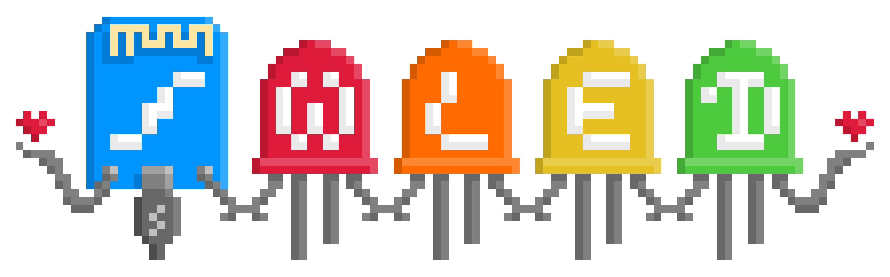

# ioBroker.wled

**Этот адаптер использует данную услугу.`Sentry.io` Для автоматического сообщения мне, как разработчику, об исключениях, ошибках в коде и новых схемах устройств.** Подробнее см. ниже!

## WLED-адаптер для ioBroker

Быстрая и многофункциональная реализация веб-сервера на базе ESP8266/ESP32 для управления светодиодами NeoPixel (WS2812B, WS2811, SK6812, APA102) или чипсетами на основе SPI, такими как WS2801!

[WLED — проект на GitHub](https://github.com/Aircoookie/WLED) от @Aircoookie

## Инструкции

Адаптер автоматически пытается найти устройства WLED в вашей сети, используя службы Bonjour.\
&#x20;Известные проблемы: Сети с разделением VLAN в большинстве случаев не маршрутизируют широковещательный трафик, что означает, что автоматическое определение будет завершаться неудачей.

Не беспокойтесь, в этом случае вы можете добавить устройство вручную по IP-адресу.

1. Убедитесь, что ваше устройство WLED работает и доступно по сети.
2. Установите адаптер
3. Настройте интервалы времени для опроса данных и циклов автоматического определения.\
   &#x20;4 - A) Запустите адаптер, устройства должны быть обнаружены автоматически.\
   &#x20;4 - B) Если пункт A не сработает, используйте кнопку «Добавить устройство» и укажите IP-адрес устройства.
4. Адаптер будет немедленно отправлять изменения и опрашивать данные каждые x секунд (настраивается).

## Функции

### Методы контроля

Адаптер предоставляет несколько способов управления вашими светодиодными устройствами:

1. **Стандартные состояния** — используйте отдельные состояния для регулировки яркости, цвета, эффектов и т. д.
2. **JSON-команды** — отправка полных JSON-команд через`action` состояние для расширенного управления
3. **Отправка команд HTTP API без использования исходных данных** — отправка устаревших команд HTTP API через`rawCommand` состояние

### Использование необработанных команд HTTP API

Для опытных пользователей, которым необходимо отправлять необработанные команды HTTP API (устаревшая версия).`/win` (конечная точка), вы можете использовать`rawCommand` состояние:

```javascript
// Example: Set brightness to 255, effect to 0, and colors
setState('wled.0.XXXXXXXXXXXX.rawCommand', 'A=255&FX=0&R=255&G=0&B=0');

// Example: Complex command with multiple parameters
setState('wled.0.XXXXXXXXXXXX.rawCommand', 'SM=0&SS=0&SV=2&S=15&S2=299&GP=7&SP=30&RV=0&SB=255&A=255&W=255&R2=0&G2=0&B2=0&W2=&FX=0&T=1');
```

**Примечание:**`rawCommand` Состояние предназначено для сложных сценариев использования и совместимости с устаревшим HTTP API WLED. Для большинства сценариев использования стандартные состояния или команды JSON (через`action` рекомендуются.

Общие параметры необработанной команды:

- `A` - Общая яркость (0-255)
- `R` ,`G` ,`B` - Основные значения цвета RGB (0-255)
- `R2` ,`G2` ,`B2` - Значения вторичного цвета RGB (0-255)
- `W` ,`W2` - Значения белого канала (0-255)
- `FX` - Идентификатор эффекта
- `SX` - Эффективная скорость
- `IX` - Интенсивность эффекта
- `FP` - Идентификатор палитры
- `T` - Время перехода

Полный список параметров см. в [документации по HTTP API WLED](https://kno.wled.ge/interfaces/http-api/) .

### Управление сегментами через sendTo

Адаптер обеспечивает мощные возможности управления сегментами посредством`sendTo` команды, позволяющие динамически добавлять и удалять сегменты из вашего JavaScript-кода:

#### Добавление сегментов

```javascript
// Add a new segment to a WLED device
sendTo('wled.0', 'addSegment', {
    deviceId: 'AABBCCDDEEFF',  // Device MAC address
    segmentId: 1,              // Segment ID (0-based)
    start: 0,                  // Start LED
    stop: 10,                  // Stop LED (exclusive)
    on: true,                  // Optional: Turn segment on/off
    bri: 255,                  // Optional: Brightness (0-255)
    fx: 0,                     // Optional: Effect ID
    sx: 128,                   // Optional: Effect speed
    ix: 128,                   // Optional: Effect intensity
    pal: 0,                    // Optional: Color palette
    col: [[255,0,0],[0,255,0],[0,0,255]]  // Optional: Colors (RGB arrays)
}, (result) => {
    if (result.success) {
        console.log('Segment added successfully: ' + result.message);
    } else {
        console.error('Failed to add segment: ' + result.error);
    }
});
```

#### Удаление сегментов

```javascript
// Delete a segment from a WLED device
sendTo('wled.0', 'deleteSegment', {
    deviceId: 'AABBCCDDEEFF',  // Device MAC address
    segmentId: 1               // Segment ID to delete
}, (result) => {
    if (result.success) {
        console.log('Segment deleted successfully: ' + result.message);
    } else {
        console.error('Failed to delete segment: ' + result.error);
    }
});
```

**Параметры:**

- `deviceId` (обязательно): MAC-адрес вашего WLED-устройства (например, 'AABBCCDDEEFF')
- `segmentId` (обязательно): Идентификатор сегмента (нумерация начинается с 0)
- Для`addSegment` :
  - `start` (необязательно): Первый светодиод в сегменте, по умолчанию равен 0
  - `stop` (необязательно): Последний светодиод в сегменте (исключая другие), по умолчанию — 1
  - `on` (необязательно): Включение/выключение сегмента
  - `bri` (опционально): Яркость (0-255)
  - `fx` (необязательно): ID эффекта
  - `sx` (опционально): Скорость действия эффекта (0-255)
  - `ix` (необязательно): Интенсивность эффекта (0-255)
  - `pal` (необязательно): Идентификатор цветовой палитры
  - `col` (необязательно): Массив массивов цветов RGB

**Примечание:** Адаптер автоматически обрабатывает обмен данными через WebSocket (если доступен) или HTTP API и обновляет состояние устройства после операций с сегментами.

## Поддержите меня

Если вам нравится моя работа, пожалуйста, не стесняйтесь сделать личное пожертвование.\
&#x20;(Это личная ссылка для пожертвований DutchmanNL, не имеющая отношения к проекту ioBroker!)\
[](http://paypal.me/DutchmanNL)

## Что такое Sentry.io и какая информация передается на серверы этой компании?

Sentry.io — это сервис для разработчиков, позволяющий получать обзор ошибок в их приложениях. И именно это реализовано в данном адаптере.

Когда адаптер зависает или возникает другая ошибка в коде, это сообщение об ошибке, которое также появляется в журнале ioBroker, отправляется в Sentry. Если вы разрешили iobroker GmbH собирать диагностические данные, то в них также включается ваш идентификатор установки (это просто уникальный идентификатор **без** какой-либо дополнительной информации о вас, электронной почте, имени и т. д.). Это позволяет Sentry группировать ошибки и показывать, сколько уникальных пользователей затронуто такой ошибкой. Все это помогает мне предоставлять безошибочные адаптеры, которые практически никогда не зависают.

## Для разработчиков

### Автоматизированное развертывание

Этот адаптер использует GitHub Actions с **функцией NPM Trusted Publishing** для автоматического развертывания.

Для устранения неполадок при развертывании, связанных с поддержкой системы, см. [файл docs/DEPLOYMENT\_SETUP.md](https://github.com/DrozmotiX/ioBroker.wled/blob/main/docs/DEPLOYMENT_SETUP.md) :

- Проверка конфигурации доверенной публикации на npmjs.com
- Необходимые настройки рабочего процесса и имени задания.
- Устранение ошибок аутентификации
- Тестирование развертывания с использованием предварительных версий.

## Changelog
<!--
    Placeholder for the next version (at the beginning of the line):
    ### __WORK IN PROGRESS__
-->
### __WORK IN PROGRESS__
* (DutchmanNL) Maintenance: use adapter timer API (this.setTimeout/this.clearTimeout) so all timers are cleared on unload
* (DutchmanNL) Maintenance: translated the delete device confirmation message into all supported languages
* (DutchmanNL) Maintenance: raise Node.js to 22, modernise CI and release tooling, update dependencies, resolve repository checker findings
* (DutchmanNL) **CI/CD**: Fixed deployment failure by adding missing sentry-version-prefix parameter to GitHub Actions workflow
* (DutchmanNL) **CI/CD**: Updated GitHub Copilot instructions template from v0.4.2 to v0.5.6 - adds ESLint configuration, translation management, lint-first CI/CD workflow guidance
* (DutchmanNL) Dependencies updated to current versions

### 0.9.2 (2026-02-16)
* (DutchmanNL) solve auto deployment issues

### 0.9.0 (2026-02-15)
* (DutchmanNL) **NEW**: Added segment management via sendTo commands - dynamically add and delete WLED segments
* (DutchmanNL) **NEW**: Added Hue Sync control - synchronize WLED colors with Philips Hue lights (hp state: 0-99, 0=off)
* (DutchmanNL) **NEW**: Added Reboot control - restart WLED device remotely (rb state: boolean button)
* (DutchmanNL) **NEW**: Added Realtime UDP control - toggle reception of realtime UDP data (rd state: boolean switch)
* (DutchmanNL) **NEW**: Added support for sending raw HTTP API commands via `rawCommand` state (fixes #677)
* (DutchmanNL) **FIXED**: Corrected online/offline state detection - `_online` state now properly contains boolean values resolves #654
* (DutchmanNL) **FIXED**: Ensure backend processes and stop when device is deleted in ioBroker object tree (fixes #615)
* (DutchmanNL) **ENHANCED**: Reduced code complexity by extracting validation helpers to separate module (lib/validation.js) #777
* (DutchmanNL) **TESTING**: Added comprehensive unit tests for validation helpers (49 test cases covering edge cases and error handling)
* (DutchmanNL) **CI/CD**: Fixed automated deployment failure by removing unused build step for JavaScript-only adapter

### 0.8.0 (2026-02-15)
* (ticaki) allow sending of raw json from state
* (DutchmanNL) **FIXED**: Implement proper Bonjour browser cleanup in onUnload() to prevent resource leaks
* (DutchmanNL) **CI/CD**: Migrated deployment workflow to NPM Trusted Publishing (OIDC) for enhanced security

### 0.7.3 (2024-10-26)
* (HaggardFFM) allow write on segments, solves #688 #706
* (DutchmanNL) Fixed error when a device is not available Solves #698

### 0.7.2 (2023-10-31) - Improve online visibility of devices
* (DutchmanNL) Show online state of device in object tree
* (DutchmanNL) Bugfix: Update online state correctly in situation connection is lost, fixes #611
* (DutchmanNL) Reset brightness to 0 and on to false during adapter start and if a device disconnects, fixes #565

[Older changelogs can be found there](https://github.com/DrozmotiX/ioBroker.wled/blob/main/CHANGELOG_OLD.md)

## License
MIT License

Copyright (c) 2024-2026 DutchmanNL <oss@drozmotix.eu>

Permission is hereby granted, free of charge, to any person obtaining a copy
of this software and associated documentation files (the "Software"), to deal
in the Software without restriction, including without limitation the rights
to use, copy, modify, merge, publish, distribute, sublicense, and/or sell
copies of the Software, and to permit persons to whom the Software is
furnished to do so, subject to the following conditions:

The above copyright notice and this permission notice shall be included in all
copies or substantial portions of the Software.

THE SOFTWARE IS PROVIDED "AS IS", WITHOUT WARRANTY OF ANY KIND, EXPRESS OR
IMPLIED, INCLUDING BUT NOT LIMITED TO THE WARRANTIES OF MERCHANTABILITY,
FITNESS FOR A PARTICULAR PURPOSE AND NONINFRINGEMENT. IN NO EVENT SHALL THE
AUTHORS OR COPYRIGHT HOLDERS BE LIABLE FOR ANY CLAIM, DAMAGES OR OTHER
LIABILITY, WHETHER IN AN ACTION OF CONTRACT, TORT OR OTHERWISE, ARISING FROM,
OUT OF OR IN CONNECTION WITH THE SOFTWARE OR THE USE OR OTHER DEALINGS IN THE
SOFTWARE.