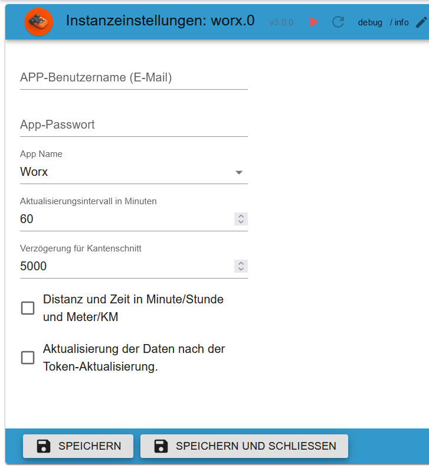

# Адаптер ioBroker.worx
# Краткое содержание
- [Настройки экземпляра](#instance-settings)
- [Информация о входе в систему JSON](#login-infos-worx0logininfo)
- [Все папки](#папка)
- [activityLog (Wire и Vision)](#activitylog-wire-and-vision)
- [области (провод)](#области-провод)
- [календарь (провод)](#календарь-провод)
- [календарь (Vision)](#calendar-vision)
- [модули (Провода и Видение)](#modules-wire-and-vision)
- [газонокосилка (Wire and Vision)](#mower-wire-and-vision)
    - [info_mqtt (Draht und Vision)](#info_mqtt-wire-and-vision)
- [Дополнительная информация о зрении](#additionally-for-vision)
- [Ограничение скорости](#rate-limiting)
- [Пример блочной отправки MultiZonesJson Vision](#example-blockly-sendmultizonesjson-vision)

## Важная информация
🟢 Пауза 1,1 секунды между 2 активными операциями переключения</br> 🔴 Без задержки и следующая активная операция также без задержки

недействительный</br> 🟢🟢🟢

действительный</br> 🟢1,1🟢1,1🟢

недействительный</br> 🔴🔴🟢🟢

действителен</br> 🔴🔴🟢1,1🟢

недействительный</br> 🔴🟢🔴🟢

действителен</br> 🔴🟢1,1🔴🟢

## Описание
### Настройки экземпляра
[Краткое содержание](#summary)

- `App Email`: Ваше имя пользователя приложения (адрес электронной почты)
- `Пароль приложения`: Ваш пароль приложения
- `Название приложения`: выберите свое устройство
- `Интервал обновления в минутах` Интервал обновления всех данных (возможен диапазон от 10 до 1440)
- `Задержка для EdgeCut`: Когда следует начать работу EdgeCut (например, 5 секунд до начала работы газона)
- `Расстояние и время в мин и м`: ч и км по умолчанию
- `Обновление данных MQTT после обновления токена.`: Загружает данные Worx после обновления токена.
- `Отображать ошибки в уведомлениях (для всех устройств)`: включение/выключение уведомлений для всех устройств (можно включить/выключить для каждого устройства в разделе «Объекты»)
- `Удалить данные сеанса` Если у вас возникли проблемы со входом в систему, удалите текущий сеанс.
- `Сбросить счетчик входов` Сбросить счетчик входов
- `Лимит запросов в день (50–180)`: Ограничьте количество запросов в день. Это запросы к API, например, заданный интервал и обновления после токена обновления (в настройках экземпляра). Каждый перезапуск генерирует 4 запроса. Кроме того, 1 запрос о состоянии прошивки и запросы журнала активности (каждое изменение статуса/ошибки газонокосилки). Установите это значение равным 100 цифрам и проверьте, сколько запросов было отправлено в 23:55. Затем введите это число + 10.
- `Ограничение запросов в течение 10 минут (4-15)`: Ограничение запросов API - Sollte auf 4 stehen da sonst ein Neustart nicht möglich wäre.
- «Лимит MQTT в день (1–250 профессиональных устройств)»: запросить ограничение MQTT. Die Auswahl ist pro Geräte.
- «Ограничение перезагрузок в день (1-10)»: защищает от неизвестных и нежелательных перезагрузок адаптера.
- `MQTT-Verbindung auswählen`:
- `Alte AWS-Verbindung`: Используется старое MQTT-соединение. Недостаток: каждые 20 минут происходит принудительное отключение, а восстановление соединения занимает 1 секунду.
- `Neue AWS-Verbindung`: используется новое MQTT-подключение. Недостаток: подключение разрывается и восстанавливается каждый час из-за токена. В случае ошибки модуля автоматически используется старое подключение.
    - `MQTT5-Verbindung (derzeit nicht verfügbar)`: в настоящее время недоступно. После этого будет использовано старое соединение.

</br> </br> 

### Информация для входа `worx.0.loginInfo`
[Краткое содержание](#summary)

```json
{
    "loginCounter": 1, // Login counter
    "loginDiff": [1741458177709], // Time difference of the last 10 logins
    "lastLoginTimestamp": 1741458177709, // Last login as timestamp
    "lastLoginDate": "2025-03-08T18:22:57.710Z", // Last login as ISO string WITHOUT time zone
    "refreshCounter": 1, // Counter for refreshToken (reset on restart)
    "refreshHistory": [1741516809807], // History refreshToken as timestamp
    "lastRefreshTimestamp": 1741459690942, // Last refreshToken as timestamp
    "lastRefreshDate": "2025-03-08T18:48:10.942Z", // Last refreshToken as ISO String WITHOUT time zone
    "nextRefreshTimestamp": 1743548215943, // Next refreshToken as timestamp
    "nextRefreshDate": "2025-04-01T22:56:55.943Z", // Next refreshToken as ISO String WITHOUT time zone
    "lastError": "", // Last error message
    "errorHistory": [], // History errors as timestamp
    "errorCounter": 0, // Counter of error messages (reset on restart)
    "lastErrorTimestamp": 0, // Last error message as timestamp
    "lastErrorDate": "" // Last error message as ISO string WITHOUT time zone
}
```

### Папка
[Краткое содержание](#summary)

- `activityLog`: Журнал вашей активности (Wire & Vision / возможно управление)
- `areas`: Области (возможно проводное управление)
- `multiZones`: Мультизоны (возможно видение/управление)
- `календарь`: Расписание (Wire & Vision / возможно управление)
- `Модули`: Ваш(и) модуль(и) (проводка и зрение / возможно управление)
- `mower`: Ваша газонокосилка (возможно проводное и визуальное управление)
- `product`: Все свойства устройства (Wire & Vision / только для чтения)
- `rawMqtt`: Все данные из облака (Wire & Vision / только для чтения)


### ActivityLog (Провода и Видение)
[Краткое содержание](#summary)

- `last_update`: Последнее обновление в виде метки времени (Wire & Vision / только для чтения)
- `manuell_update`: Загружает текущий журнал активности (автоматически после изменения статуса - Wire & Vision / управление возможно)
- `payload`: Журнал активности в виде таблицы JSON (для VIS или Blockly)


### Области (провод)
[Краткое содержание](#summary)

- `actualArea`: Текущая
- `actualAreaIndicator`: Начало следующей зоны массива
- `area_0`: Начало зоны 1 в метрах (массив=0) (изменяемо) 🟢
- `area_1`: Начало зоны 2 в метрах (массив=1) (изменяемо) 🟢
- `area_2`: Начало зоны 3 в метрах (массив=2) (изменяемо) 🟢
- `area_3`: Начало зоны 4 в метрах (массив=3) (изменяемо) 🟢
- `startSequence`: начало зоны массива (события 0-9), например, начало только в зоне 3 [2,2,2,2,2,2,2,2,2,2] (изменяемо) 🟢
- `zoneKeeper`: безопасное вождение в узких зонах пересечения (области должны быть созданы) (начиная с версии прошивки 3.30) (изменяемо) 🟢


### Календарь (Wire)
[Краткое содержание](#summary)

- Например, установка времени на среду
- `wednesday.borderCut`: С обрезкой границ или без нее (изменение значения без задержки) (изменяемо) 🔴
- `wednesday.startTime`: Время начала чч:мм (0-23/0-59), например 09:00 (изменить значение без задержки) (изменяемо) 🔴
- `wednesday.workTime`: Рабочее время в минутах (180 мин = 3 ч), например, 30 = время окончания 09:30 (изменение значения без задержки) (изменяемо) 🔴
- `calJson_sendto`: Если все состояния установлены, нажмите кнопку для отправки (с задержкой 1,1 секунды). Газонокосилка будет косить 30 минут (можно изменить) 🟢
- `calJson_tosend`: Эти данные отправляются в Mqtt (график кошения устанавливается автоматически). Вы также можете создать этот JSON самостоятельно. (изменяемо) 🟢
- `calendar.calJson`: Массив для еженедельного плана кошения. Вы также можете создать этот МАССИВ самостоятельно. (график кошения 1/устанавливается автоматически — только для проводной сети) (изменяемый) 🔴
- `calendar.calJson2`: Массив для еженедельного плана кошения. Вы также можете создать этот МАССИВ самостоятельно. (график кошения 2/устанавливается автоматически — только для проводной сети) (изменяемый) 🔴


### Календарь (Vision)
[Краткое содержание](#summary)

- Например, установка времени на пятницу.
- Стандартно создаются 2 временных интервала. Если в приложении создано 3 временных интервала, в ioBroker также будет создано 3 временных интервала. При уменьшении количества интервалов до 2 временные интервалы будут удалены в ioBroker. День с наибольшим количеством временных интервалов используется в качестве эталонного для всех дней.
- `friday.time_0.borderCut`: С обрезкой границ или без нее (изменение значения без задержки) (изменяемо) 🔴
- `friday.time_0.startTime`: Время начала чч:мм (0-23/0-59), например 09:00 (изменить значение без задержки) (изменяемо) 🔴
- `friday.time_0.workTime`: Рабочее время в минутах (180 мин = 3 ч), например, 30 = Время окончания 09:30 (Изменить значение без задержки) (изменяемо) 🔴
- `friday.time_0.enabled_time`: Активировать или деактивировать время. (устанавливается без задержки) (можно изменить) 🔴
- `friday.time_0.zones`: К каким зонам следует приближаться, например, Пример [1,2,3] (устанавливается без задержки) (можно изменить) 🔴
- `calJson_sendto`: Если все состояния установлены, установите для этой кнопки значение true. Газонокосилка будет косить 30 минут! (изменяемо) 🟢
- `calJson_tosend`: Этот JSON автоматически заполняется и отправляется в Mqtt. Конечно, вы также можете создать его самостоятельно. (изменяемо) 🔴
- `add_timeslot`: добавляется дополнительный временной интервал. Неиспользуемые временные интервалы удаляются после перезапуска. (изменяемо) 🔴

 

### Пример временного интервала (Vision)
- `calJson_tosend` Этот JSON-код будет отправлен 1 раз в воскресенье и удалит все остальные дни. Необходимо всегда отправлять данные за всю неделю. 🔴

```json
[
    {
        "e": 1, // 0=deactivated/1=activated - Set 0 for deactivated this slot
        "d": 0, // Days 0=sunday, 1=monday, 2=tuesday, 3=wednesday, 4=thursday, 5=friday, 6=saturday
        "s": 360, // Start time in minutes 06:00 (360/60) - (320/60 = 5 hours and 20 minutes)
        "t": 180, // Mowing time in minutes = End time 09:00 (180/60) - (200/60 = 3 hours and 20 minutes)
        "cfg": {
            "cut": {
                "b": 1, // 0=without BorderCut/1=with BorderCut
                "z": [1] // Which zones [1,2,6]
            }
        }
    }
]
```

### Модули (Wire и Vision)
[Краткое содержание](#summary)

- Модуль «Вне предела» (проводка и зрение)
- `DF.OLMSwitch_Cutting`: предотвращает наезд на магнитную ленту - true-on/false-off
- `DF.OLMSwitch_FastHoming`: Быстрый возврат к зарядной станции - с использованием ярлыков, созданных с помощью магнитных полос - true-вкл/false-выкл

- Модуль ACS (только проводной)
- `US.ACS`: Включить или отключить ACS - 1-вкл/0-выкл 🟢
- `US.ACS_Status`: Статус из модуля ACS (только чтение)

- Модуль EA (только Vision)
- `EA.height`: Регулировка высоты деки косилки от 30 до 60 с шагом 5 мм 🟢

- Модуль HL (только Vision)
- `HL.status`: Статус головного света (только чтение)
- `HL.enabled`: Фары установлены да = 1/нет = 0 🟢
- `HL.on`: Дневной свет = 0/Темнота = 1 🟢

  

### Газонокосилка (Wire и Vision)
[Краткое содержание](#summary)

- `AutoLock`: автоматическая блокировка, включена/выключена ложно (проводная и визуальная/изменяемая) 🟢
- `AutoLockTimer`: Таймер автоматической блокировки макс. 10 минут с шагом 30 секунд (проводной и Vision/изменяемый) 🟢
- `batteryChargeCycle`: Цикл заряда аккумулятора (проводной и Vision/только для чтения)
- `batteryCharging`: зарядка аккумулятора false->no/true->yes (провод и Vision/только для чтения)
- `batteryState`: Состояние батареи в % (проводная связь и Vision/только для чтения)
- `batteryTemperature`: Температура аккумулятора в градусах Цельсия (проводная связь и Vision/только для чтения)
- `batteryVoltage`: Напряжение батареи в вольтах (провод и Vision/только для чтения)
- `cameraStatus`: Состояние камеры 0=ОК/1=Ошибка (Видение/только чтение)
- `cameraError`: Ошибка камеры 0=OK/1=Ошибка (Vision/только чтение)
- `cutOverSlabs`: Вырезать перекрытия вкл = true / выкл = false (Vision/изменяемо) 🟢
- `direction`: Направление в градусах (провод и Vision/только для чтения)
- `edgecut`: запуск EdgeCut (провод и Vision/сменный) 🟢
- `error`: Сообщение об ошибке от газонокосилки (провод и Vision/только для чтения)

```json
{
    "states": {
        "0": "No error", //(Draht & Vision & RTK)
        "1": "Trapped", //(Draht & Vision & RTK-Body)
        "2": "Lifted", //(Draht & Vision & RTK-Body)
        "3": "Wire missing", //(Draht)
        "4": "Outside boundary", //(Draht & Vision & RTK-Body)
        "5": "Rain delay", //(Draht & Vision & RTK-Body)
        "6": "Close door to cut grass", //(Draht)
        "7": "Close door to go home", //(Draht)
        "8": "Blade motor fault", //(Draht & Vision & RTK-Body)
        "9": "Wheel motor fault", //(Draht & Vision & RTK-Body)
        "10": "Trapped timeout fault", //(Draht & Vision & RTK-Body)
        "11": "Upside down", //(Draht & Vision & RTK-Body)
        "12": "Battery low", //(Draht & Vision & RTK)
        "13": "Wire reversed", //(Draht)
        "14": "Charge error", //(Draht & Vision & RTK-Body)
        "15": "Home search timeout", //(Draht & Vision)
        "16": "Wifi locked", //(Draht & Vision)
        "17": "Battery over temperature", //(Draht & Vision & RTK)
        "18": "Dummy model", //(Draht)
        "19": "Battery trunk open timeout", //(Draht & Vision)
        "20": "Wire signal out of sync", //(Draht)
        "100": "Charging station docking error", //(RTK-Body)
        "101": "HBI error", //(RTK-Body)
        "102": "OTA upgrade error", //(Vision & RTK)
        "103": "Map error", //(RTK)
        "104": "Excessive slope", //(RTK-Body)
        "105": "Unreachable zone", //(RTK-Body)
        "106": "Unreachable charging station", //(RTK-Body)
        "107": "Calibration needed", //(RTK-Head)
        "108": "Insufficient sensor data", //(RTK)
        "109": "Training start disallowed", //(RTK)
        "110": "Camera error", //(Vision)
        "111": "Lawn exploration required", //(Vision)
        "112": "Mapping exploration failed", //(Vision)
        "113": "RFID reader error", //(Vision)
        "114": "Headlight error", //(Vision)
        "115": "Missing charging station", //(RTK-Body)
        "116": "Blade height adjustment blocked", //(Vision & RTK-Body)
        "117": "Unsupported blade height", //(Vision & RTK-Body)
        "118": "Manual firrnware upgrade required", //(Vision & RTK-Body)
        "119": "Area limit exceeded", //(RTK-Body)
        "120": "Charging station undocking error" //(RTK-Body)
    }
}
```


- `firmware`: Текущая установленная прошивка (проводная и Vision/только для чтения)
- `firmware_available`: Доступная прошивка (проводная и Vision/только для чтения)
- `firmware_available_all`: Последняя доступная прошивка в формате JSON. Этот JSON будет обновлен при появлении нового обновления (wire & Vision/только для чтения).

```json
{
    "mandatory": false,
    "product": {
        "uuid": "1236ll8d-0000-0000-9999-07ff6690003f",
        "version": "3.30.0+1",
        "released_at": "2023-05-24",
        "changelog": "•\tSupport for new models \tWR166E and WR184E\n•\tImproved Grass cutting coverage\n•\tImproved ACS\n•\tAdded Zone Keeper function (need to be enabled by app)\n•\tImproved wheel torque algorithm\n• \tNew FML firmware\n•\tFixed \"FML\" and \"Radiolink\" Activation problem\n•\tFixed some translations error\n•\tRain delay can now be cleared pressing START / HOME button, (1 minute after countdown has started)\n•\tImproved PRO Battery management\n• \tImproved boundary wire recognition\n• \tFixed border cut when zones are active\n• \tNew wifi firmware for board HW REV > 7\n\nThe Worx Landroid team would like to thank our amazing beta testers, with hundreds of hours of their own free time to make this firmware possible."
    }
}
```

- `firmware_available_date`: Дата доступной прошивки - Фиктивная 1970-01-01, если адаптер переустановлен и обновление недоступно (проводная и Vision/только для чтения)
- Значение `firmware_body` из dat.fw (Vision/только для чтения)
- `firmware_head` Значение из dat.head.fw (Vision/только для чтения)
- `firmware_update_start`: Запуск обновления прошивки в 2 шага - см. ниже `firmware_update_start_approved` (провод и Vision/изменяемый) 🔴
- `firmware_update_start_approved`: Запустить обновление прошивки - `firmware_update_start` должно быть установлено в значение true (провод и Vision/изменяемый) 🟢
- `gradient`: Градиент в градусах (провод и Vision/только для чтения)
- `inclination`: Наклон в градусах (проводной и Vision/только для чтения)
- `last_command`: Последний запрос от iobroker или APP в виде таблицы JSON (wire & Vision/только для чтения)
- `last_update` Последнее обновление (проводка и Vision/только для чтения)
- `last_update_connection` Какое соединение (Mqtt или Cloud / wire & Vision / readonly)
- `mowTimeExtend`: Увеличение времени кошения в % Диапазон: -100%->100% (проводной/изменяемый) 🟢
- `mowerActive`: false для приостановки кошения на 60 минут и true для остановки кошения, паузы и режима вечеринки (проводной/изменяемый) 🟢
- `mqtt_update`: обновление данных Mqtt макс. 150/день (проводные и Vision/изменяемые) 🟢
- `mqtt_update_count`: счетчик обновлений данных Mqtt (проводная связь и Vision/только для чтения)
- `notification`: включение или отключение уведомлений через JS-контроллер. Выводятся сообщения об офлайн-состоянии и ошибках. (Дизайн и концепция/изменяемые) 🔴
- `notification_excluded`: Какие идентификаторы ошибок не следует отображать (разделяйте идентификаторы запятыми [IDS](#error-ids)) 🔴

</br> 

- `oneTimeJson`: однократная стрижка в формате JSON (wire & Vision/changeable)

```json
{
    "wtm": 60, //Minutes
    "bc": 0 //0=w/o bordercut 1=with bordercut or use the next State
}
```

- `oneTimeStart`: однократный запуск кошения «Сначала установите oneTimeWithBorder, oneTimeWorkTime и oneTimeZones для Vision» — с задержкой в 1,1 секунды (провод и Vision/изменяемая) 🟢
- `oneTimeWithBorder`: С bordercut - изменение значения без задержки (проводное и Vision/изменяемое) 🔴
- `oneTimeWorkTime`: рабочее время макс. 8 ч с шагом 30 минут - изменение значения без задержки (проводное и Vision/изменяемое) 🔴
- `oneTimeZones`: Установить зоны [1,2,4] (Vision/изменяемо) 🔴
- `online`: Газонокосилка онлайн (провод и Vision/только чтение)
- `partyModus`: включение/выключение Partymodus (проводное и Vision/изменяемое) 🟢
- `partyModeTimer`: Ограничить режим вечеринки определённым временем. Возможные значения: от 1 до 1440 минут. Чтобы отключить режим вечеринки, установите для параметра `partyMode` значение «false». Режим вечеринки не отображается в приложении, но таймер ведёт обратный отсчёт. (Проводной/изменяемый) 🟢
- `pause`: включение/выключение тормоза газонокосилки (проводное и Vision/изменяемое) 🟢
- `reset_battery_time`: сброс заряда аккумулятора в 2 этапа (проводной и визуальный/изменяемый) 🔴
- `reset_battery_time_approved`: Подтверждение сброса заряда батареи - `reset_battery_time` должно быть установлено в значение true (проводное и визуальное/изменяемое) 🔴
- `reset_blade_time`: сброс времени работы лезвия в 2 этапа (проводной и визуальный/изменяемый) 🔴
- `reset_blade_time_approved`: подтвердить сброс рабочего времени лезвия - `reset_battery_time` должно быть установлено в значение true (провод и зрение/изменяемое) 🔴


- `rfidStatus`: Состояние RF-датчика 0=ОК/1=Ошибка (только зрение/чтение)
- `sendCommand`: Отправить команду cmd (проводную и Vision/изменяемую) 🟢

### Отправить команды
```json
{
    "states": {
        "1": "Start", //(wire & Vision & RTK)
        "2": "Stop", //(wire & Vision & RTK)
        "3": "Home", //(wire & Vision & RTK)
        "4": "Follow border", //(wire & Vision & RTK)
        "5": "Wi-Fi Lock", //(wire & Vision unknown)
        "6": "Wi-Fi Unlock", //(wire & Vision)
        "7": "Reset Log", //(wire & Vision & RTK)
        "8": "Pause over border", //(wire & Vision)
        "9": "Safe go home", //(wire & Vision unknown)
        "10": "Start once", //(Vision)
        "100": "Pairing command", //(Vision)
        "101": "Border Cut", //(Vision & RTK)
        "102": "Resume cutting", //(RTK)
        "103": "Start driving", //(Draht & Vision & RTK)
        "104": "Stop driving" //(Draht & Vision & RTK)
    }
}
```

- `state`: True для запуска газонокосилки и False для остановки газонокосилки (провод и Vision/изменяемый)
- `status`: Статус газонокосилки (провод и Vision/только чтение)

### Идентификаторы статуса
```json
{
    "states": {
        "0": "IDLE", //(wire & Vision & RTK-Body)
        "1": "Home", //(wire & Vision & RTK-Body)
        "2": "Start sequence", //(wire)
        "3": "Leaving home", //(wire & Vision & RTK-Body)
        "4": "Following border", //(wire)
        "5": "Searching home", //(wire & Vision & RTK-Body)
        "6": "Searching border", //(wire & Vision)
        "7": "Mowing", //(wire & Vision & RTK-Body)
        "8": "Lifted", //(wire & Vision & RTK-Body)
        "9": "Trapped", //(wire & Vision & RTK-Body)
        "10": "Blade blocked", //(wire & Vision & RTK-Body)
        "11": "Debug", //(wire)
        "12": "Driving", //(wire & Vision)
        "13": "Digital fence escape", //(wire & Vision)
        "30": "Going home", //(wire & Vision)
        "31": "Zone training", //(wire & Vision)
        "32": "Border Cut", //(wire & Vision)
        "33": "Searching zone", //(wire & Vision)
        "34": "Pause", //(wire & Vision)
        "100": "Map training (completable)", //(RTK-Head)
        "101": "Map processing", //(RTK)
        "102": "Upgrading firmware", //(RTK)
        "103": "Moving to zone", //(RTK-Body)
        "104": "Going home", //(RTK-Body)
        "105": "Ready for training", //(RTK-Head)
        "106": "Map download in progress", //(RTK)
        "107": "Map upload in progress", //(RTK-Head)
        "108": "Map training paused", //(RTK-Head)
        "109": "Map training (not completable)", //(RTK-Head)
        "110": "Border crossing", //(Vision)
        "111": "Exploring lawn", //(Vision)
        "112": "Moving to recovery point", //(RTK-Body)
        "113": "Waiting for position", //(RTK-Body)
        "114": "Map training (driving)", //(Vision & RTK-Body)
        "115": "Map training (rolling back)" //(Vision)
    }
}
```

- `крутящий момент`: Диапазон крутящего момента колеса -50->50 (провод и Vision/изменяемый) 🟢
- `totalBladeTime`: Общее время работы лезвия (проводное и Vision/только чтение)
- `totalDistance`: Общее расстояние (проводное и Vision/только для чтения)
- `totalTime`: Общее рабочее время (проводка и Vision/только чтение)
- `waitRain`: задержка из-за дождя макс. 12 ч с шагом 30 минут и 0 для выключения (проводная и Vision/изменяемая) 🟢
- `waitRainCountdown` Запустить обратный отсчет, когда датчик изменит состояние с мокрого на сухое (проводной/только для чтения) (Vision отключен)
- `waitRainSensor` Статус 0 для сухого и 1 для влажного (провод/только чтение) (Vision отключен)
- `wifiQuality`: Качество Wi-Fi (проводной и Vision/только для чтения)

```json
{
    "rain": {
        "s": 0, // 0 for dry and 1 for wet (Wire & Vision)
        "cnt": 59 // Start countdown when changing from s=1 wet to s=0 dry - rain was detected (Wire & Vision)
    }
}
```


### Дополнительно для зрения
[Краткое содержание](#summary)

- Мультизоны
- `multiZones.zones.zone_1.borderDistance`: Расстояние до края при резке в мм - допускается 50 мм, 100 мм, 150 мм и 200 мм - Устанавливается с помощью Blockly без задержки - Изменение записывается в `multiZones.multiZones` (vision/changeable) 🔴
- `multiZones.zones.zone_1.chargingStation`: 1 Если в этой зоне найдена зарядная станция. 0 — если зарядной станции нет. - Устанавливается с помощью Blockly без задержки. - Изменение записывается в `multiZones.multiZones` (видимый/изменяемый) 🔴
- `multiZones.zones.zone_1.cutOverBorder`: 1 для проезда по плитам, если они обнаружены, в противном случае 0. Устанавливается с помощью Blockly без задержки - Изменение записывается в `multiZones.multiZones` (Vision /changeable) 🔴
- `multiZones.zones.zone_1.zone_id`: Нумерация - Начинается с 1 - (только для просмотра/чтение) 🔴
- `multiZones.passages.passage_01.tagIdFrom`: идентификатор RFID zoneIdFrom - устанавливается с помощью Blockly без задержки - изменение записывается в `multiZones.multiZones` (vision/changeable) 🔴
- `multiZones.passages.passage_01.tagIdTo`: идентификатор RFID zoneIdTo - устанавливается с помощью Blockly без задержки - изменение записывается в `multiZones.multiZones` (vision/changeable) 🔴
- `multiZones.passages.passage_01.zoneIdFrom`: Зона из (зона должна быть zoneIdFrom < zoneIdTo) - Устанавливается с помощью Blockly без задержки - Изменения записываются в `multiZones.multiZones` (видимость/изменяемость) 🔴
- `multiZones.passages.passage_01.zoneIdTo`: Зона закрыта (zoneIdTo должно быть > zoneIdFrom) - Устанавливается с помощью Blockly без задержки - Изменения записываются в `multiZones.multiZones` (vision/changeable) 🔴
- `multiZones.multiZones`: Многозонный JSON (Vision/изменяемый) [Пример](#example-blockly-sendMultiZonesJson-vision) 🔴
- `multiZones.sendMultiZonesJson`: Отправлять изменения в Worx с задержкой 1,1 секунды (vision/changeable) 🟢

Пример:

```json
{
    "mz": {
        "p": [
            // Passages between zones
            {
                "z1": 1, // Zone from (must z1 < z2)
                "z2": 2, // Zone to (must z2 > z1)
                "t1": "E000000000000000", // RFID id from z1
                "t2": "E0000000KKKKKKKK" // RFID id from z2
            }
        ],
        "s": [
            // The zones themselves
            {
                "id": 1, // Numbering - Start with 1
                "c": 1, // 1 if the charging station is in this zone. 0 for no charging station.
                "cfg": {
                    "cut": {
                        "bd": 100, // Edge cut the distance to the edge in mm - allowed 50mm, 100mm, 150mm and 200mm
                        "ob": 0 // 1 for driving over slabs if they are detected, otherwise 0. Different per-zone is not allowed
                    }
                }
            },
            {
                "id": 2, // Numbering
                "c": 0, // 1 if the charging station is in this zone. 0 for no charging station.
                "cfg": {
                    "cut": {
                        "bd": 100, // Edge cut the distance to the edge in mm - allowed 50mm, 100mm, 150mm and 200mm
                        "ob": 0 // 1 for driving over slabs if they are detected, otherwise 0. Different per-zone is not allowed
                    }
                }
            }
        ]
    }
}
```

По умолчанию без зоны:

```json
{
    "mz": {
        "p": [],
        "s": [
            {
                "id": 1,
                "c": 1,
                "cfg": {
                    "cut": {
                        "bd": 150,
                        "ob": 0
                    }
                }
            }
        ]
    }
}
```


- Газонокосилка
- `log_improvement`: Отправлять журнал улучшений в worx отключить/включить (изменяемо) 🟢
- `log_troubleshooting`: Отправлять журнал устранения неполадок в worx отключить/включить (изменяемо) 🟢


- Газонокосилка
- `paused`: Приостановленное расписание в минутах (изменяемо) 🟢


### Info_mqtt (Провода и Видение)
[Краткое содержание](#summary)

- `incompleteOperationCount`: Общее количество операций, отправленных в соединение, которые ещё не завершены. Неподтверждённые операции являются подмножеством этого числа.
- `incompleteOperationSize`: общий размер пакетов операций, отправленных в соединение, но ещё не завершённых. Неподтверждённые операции являются его подмножеством.
- `unackedOperationCount`: Общее количество операций, отправленных на сервер и ожидающих соответствующего ACK перед завершением.
- `unackedOperationSize`: общий размер пакета операций, которые были отправлены на сервер и ожидают соответствующего ACK перед своим завершением.
- `last_update`: Последнее обновление с токена
- `next_update`: Следующее обновление с токена
- `online`: Состояние MQTT-соединения (false=offline/true=online)


### Ограничение скорости
[Краткое содержание](#summary)

- Значение worx.0.blocking

Блокировка будет автоматически снята через 24 часа. При следующем обновлении токена всё будет сброшено.

```json
{
    "block": false, // true = 429 too many request is activ
    "start": 0, // Start of the blocking as a timestamp
    "time": "", // With time zone
    "retry-after": 0 // How long you are blocked
}
```

- Значение worx.0.requestsrateLimit

Счетчики можно изменить вручную, чтобы исключить преждевременные блокировки.

```json
{
    "apiCounter": 6, // API request per day
    "apiLast": 1751483518418, // Last API request as timestamp
    "apiTime": "2025-07-02T19:11:58.418Z", // Last API request with time zone
    "apiRequest": [
        // All API requests
        {
            "count": 1,
            "request": "https://api.worxlandroid.com/api/v2/product-items?status=1&gps_status=1",
            "time": "2025-07-02T19:11:58.418Z"
        },
        {
            "count": 2,
            "request": "https://api.worxlandroid.com/api/v2/product-items/xxx/firmware-upgrade",
            "time": "2025-07-02T19:11:58.895Z"
        },
        {
            "count": 3,
            "request": "https://api.worxlandroid.com/api/v2/product-items/xxx/activity-log",
            "time": "2025-07-02T19:11:59.130Z"
        },
        {
            "count": 4,
            "request": "https://api.worxlandroid.com/api/v2/products",
            "time": "2025-07-02T19:11:59.364Z"
        },
        {
            "count": 5,
            "request": "https://api.worxlandroid.com/api/v2/users/me",
            "time": "2025-07-02T19:12:00.318Z"
        },
        {
            "count": 6,
            "request": "https://id.worx.com/oauth/token?",
            "time": "2025-07-03T18:12:46.628Z"
        }
    ],
    "mqttDevice": {
        // MQTT Counter per device
        "xxxF3": {
            "mqttCount": 6, // Counter MQTT commands
            "mqttLast": 1751651797646, // Last command with time zone
            "mqttTime": "2025-07-04T17:56:37.646Z", // Letzter Kommando mit Zeitzone
            "mqttBlock": true, // true = Kommandos deaktiviert / false = Kommandos aktiv
            "mqttRequest": [
                // Last commands
                {
                    "count": 1,
                    "message": "{\"id\":23210,\"cmd\":0,\"lg\":\"de\",\"sn\":\"xxx\",\"tm\":\"21:12:00\",\"dt\":\"02/07/2025\"}",
                    "time": "2025-07-02T19:12:00.811Z"
                },
                {
                    "count": 2,
                    "message": "{\"id\":58731,\"cmd\":0,\"lg\":\"de\",\"sn\":\"xxx\",\"tm\":\"20:12:49\",\"dt\":\"03/07/2025\"}",
                    "time": "2025-07-03T18:12:49.586Z"
                },
                {
                    "count": 3,
                    "message": "{\"id\":3925,\"cmd\":0,\"lg\":\"de\",\"sn\":\"xxx\",\"tm\":\"20:20:41\",\"dt\":\"03/07/2025\"}",
                    "time": "2025-07-03T18:20:41.579Z"
                },
                {
                    "count": 4,
                    "message": "{\"id\":3265,\"cmd\":0,\"lg\":\"de\",\"sn\":\"xxx\",\"tm\":\"21:10:19\",\"dt\":\"03/07/2025\"}",
                    "time": "2025-07-03T19:10:19.292Z"
                },
                {
                    "count": 5,
                    "message": "{\"id\":28606,\"cmd\":0,\"lg\":\"de\",\"sn\":\"xxx\",\"tm\":\"21:11:20\",\"dt\":\"03/07/2025\"}",
                    "time": "2025-07-03T19:11:20.634Z"
                },
                {
                    "count": 6,
                    "message": "{\"id\":12891,\"cmd\":0,\"lg\":\"de\",\"sn\":\"xxx\",\"tm\":\"19:56:37\",\"dt\":\"04/07/2025\"}",
                    "time": "2025-07-04T17:56:37.646Z"
                }
            ]
        },
        "xxxE2": {
            "mqttCount": 0,
            "mqttLast": 0,
            "mqttBlock": false,
            "mqttRequest": []
        },
        "xxxC5": {
            "mqttCount": 0,
            "mqttLast": 0,
            "mqttBlock": false,
            "mqttRequest": []
        },
        "xxx2F": {
            "mqttCount": 0,
            "mqttLast": 0,
            "mqttBlock": false,
            "mqttRequest": []
        }
    },
    "mqttDay": "27-4", // calendar week-day. When changing everything is reset
    "restartCount": 6, // Counter restart adapter
    "restartLast": 1751569817003, // Last restart
    "restartTime": "2025-07-03T19:10:17.003Z", // Last restart with time zone
    "day": "27-4" // calendar week-day. When changing everything is reset
}
```


### Пример блочного sendMultiZonesJson Vision
[Краткое содержание](#summary)

```
<xml xmlns="https://developers.google.com/blockly/xml">
  <variables>
    <variable id="${]4s$w?n24Az}=7iAIY">mz</variable>
    <variable id="o.FQ]_Xa!tHn2T7Ak{Pt">value</variable>
    <variable id="/@E4iFRMr:x+u?{7yFlB">test</variable>
    <variable id="jxTInS{}mk_)WJa[:,fA">i</variable>
  </variables>
  <block type="procedures_defcustomnoreturn" id="u:w*aBH!92nydG0Mu.1-" x="-87" y="-87">
    <mutation statements="false">
      <arg name="mz" varid="${]4s$w?n24Az}=7iAIY"></arg>
      <arg name="value" varid="o.FQ]_Xa!tHn2T7Ak{Pt"></arg>
    </mutation>
    <field name="NAME">set_bd</field>
    <field name="SCRIPT">bXouY2ZnLmN1dC5iZCA9IDE1MA==</field>
    <comment pinned="false" h="80" w="160">Beschreibe diese Funktion …</comment>
  </block>
  <block type="variables_set" id="jiP0218}2,Y]B]RdKD~`" x="-87" y="-35">
    <field name="VAR" id="/@E4iFRMr:x+u?{7yFlB">test</field>
    <value name="VALUE">
      <block type="convert_json2object" id=";Ef{FHk_~heeozyHFxci">
        <value name="VALUE">
          <block type="get_value" id="LMfldD:[D4%}yWE8,N0y">
            <field name="ATTR">val</field>
            <field name="OID">worx.0.xxxxxxxxxxxxxxxxxxxx.multiZones.sendMultiZonesJson</field>
          </block>
        </value>
      </block>
    </value>
    <next>
      <block type="controls_forEach" id="D{XG==q$flbH?32eX%D(">
        <field name="VAR" id="jxTInS{}mk_)WJa[:,fA">i</field>
        <value name="LIST">
          <block type="get_attr" id="b~2/cb$WhEj*9i6,(ey5">
            <value name="PATH">
              <shadow type="text" id="+n~;GfHf{,#D!5D}H+m=">
                <field name="TEXT">s</field>
              </shadow>
            </value>
            <value name="OBJECT">
              <block type="variables_get" id="YloS$N%I=6[yk;loD*1O">
                <field name="VAR" id="/@E4iFRMr:x+u?{7yFlB">test</field>
              </block>
            </value>
          </block>
        </value>
        <statement name="DO">
          <block type="procedures_callcustomnoreturn" id="er{Pwq:Y7n_I|CQoup,|">
            <mutation name="set_bd">
              <arg name="mz"></arg>
              <arg name="value"></arg>
            </mutation>
            <value name="ARG0">
              <block type="variables_get" id="(-_i0(y:W}U_x?s(7k%4">
                <field name="VAR" id="jxTInS{}mk_)WJa[:,fA">i</field>
              </block>
            </value>
            <value name="ARG1">
              <block type="math_number" id="{2u/=v!k|yJsOesq[CU^">
                <field name="NUM">150</field>
              </block>
            </value>
            <next>
              <block type="debug" id="b1}}DmS-[_W:+Y+$|%)r">
                <field name="Severity">log</field>
                <value name="TEXT">
                  <shadow type="text" id="7wx?ca_U[S~8DA4}*RXx">
                    <field name="TEXT">test</field>
                  </shadow>
                  <block type="variables_get" id="_zz;w64g-!E$zX$]pvyI">
                    <field name="VAR" id="/@E4iFRMr:x+u?{7yFlB">test</field>
                  </block>
                </value>
              </block>
            </next>
          </block>
        </statement>
        <next>
          <block type="debug" id="o[S0+1%{oLU+r:03tz7=">
            <field name="Severity">log</field>
            <value name="TEXT">
              <shadow type="text" id="7wx?ca_U[S~8DA4}*RXx">
                <field name="TEXT">test</field>
              </shadow>
              <block type="variables_get" id="tjqxQ(MO|CR~/Xq5;Pm[">
                <field name="VAR" id="/@E4iFRMr:x+u?{7yFlB">test</field>
              </block>
            </value>
            <next>
              <block type="control" id="C^lZ^SNIQ#,vh}?hSG_O">
                <mutation xmlns="http://www.w3.org/1999/xhtml" delay_input="false"></mutation>
                <field name="OID">worx.0.xxxxxxxxxxxxxxxxxxxx.multiZones.sendMultiZonesJson</field>
                <field name="WITH_DELAY">FALSE</field>
                <value name="VALUE">
                  <block type="convert_object2json" id="z)EXA+%8lB4K#7!Hp1V%">
                    <field name="PRETTIFY">FALSE</field>
                    <value name="VALUE">
                      <block type="variables_get" id="C4np)gS@^Y*?-0I+R6+r">
                        <field name="VAR" id="/@E4iFRMr:x+u?{7yFlB">test</field>
                      </block>
                    </value>
                  </block>
                </value>
              </block>
            </next>
          </block>
        </next>
      </block>
    </next>
  </block>
</xml>

<xml xmlns="https://developers.google.com/blockly/xml">
  <variables>
    <variable id="${]4s$w?n24Az}=7iAIY">mz</variable>
    <variable id="o.FQ]_Xa!tHn2T7Ak{Pt">value</variable>
    <variable id="/@E4iFRMr:x+u?{7yFlB">test</variable>
    <variable id="jxTInS{}mk_)WJa[:,fA">i</variable>
  </variables>
  <block type="procedures_defcustomnoreturn" id="u:w*aBH!92nydG0Mu.1-" x="-87" y="-87">
    <mutation statements="false">
      <arg name="mz" varid="${]4s$w?n24Az}=7iAIY"></arg>
      <arg name="value" varid="o.FQ]_Xa!tHn2T7Ak{Pt"></arg>
    </mutation>
    <field name="NAME">set_bd</field>
    <field name="SCRIPT">bXouY2ZnLmN1dC5iZCA9IDE1MA==</field>
    <comment pinned="false" h="80" w="160">Beschreibe diese Funktion …</comment>
  </block>
  <block type="variables_set" id="jiP0218}2,Y]B]RdKD~`" x="-87" y="-35">
    <field name="VAR" id="/@E4iFRMr:x+u?{7yFlB">test</field>
    <value name="VALUE">
      <block type="convert_json2object" id=";Ef{FHk_~heeozyHFxci">
        <value name="VALUE">
          <block type="get_value" id="LMfldD:[D4%}yWE8,N0y">
            <field name="ATTR">val</field>
            <field name="OID">worx.0.xxxxxxxxxxxxxxxxxxxx.multiZones.sendMultiZonesJson</field>
          </block>
        </value>
      </block>
    </value>
    <next>
      <block type="controls_forEach" id="D{XG==q$flbH?32eX%D(">
        <field name="VAR" id="jxTInS{}mk_)WJa[:,fA">i</field>
        <value name="LIST">
          <block type="get_attr" id="b~2/cb$WhEj*9i6,(ey5">
            <value name="PATH">
              <shadow type="text" id="+n~;GfHf{,#D!5D}H+m=">
                <field name="TEXT">s</field>
              </shadow>
            </value>
            <value name="OBJECT">
              <block type="variables_get" id="YloS$N%I=6[yk;loD*1O">
                <field name="VAR" id="/@E4iFRMr:x+u?{7yFlB">test</field>
              </block>
            </value>
          </block>
        </value>
        <statement name="DO">
          <block type="procedures_callcustomnoreturn" id="er{Pwq:Y7n_I|CQoup,|">
            <mutation name="set_bd">
              <arg name="mz"></arg>
              <arg name="value"></arg>
            </mutation>
            <value name="ARG0">
              <block type="variables_get" id="(-_i0(y:W}U_x?s(7k%4">
                <field name="VAR" id="jxTInS{}mk_)WJa[:,fA">i</field>
              </block>
            </value>
            <value name="ARG1">
              <block type="math_number" id="{2u/=v!k|yJsOesq[CU^">
                <field name="NUM">150</field>
              </block>
            </value>
            <next>
              <block type="debug" id="b1}}DmS-[_W:+Y+$|%)r">
                <field name="Severity">log</field>
                <value name="TEXT">
                  <shadow type="text" id="7wx?ca_U[S~8DA4}*RXx">
                    <field name="TEXT">test</field>
                  </shadow>
                  <block type="variables_get" id="_zz;w64g-!E$zX$]pvyI">
                    <field name="VAR" id="/@E4iFRMr:x+u?{7yFlB">test</field>
                  </block>
                </value>
              </block>
            </next>
          </block>
        </statement>
        <next>
          <block type="debug" id="o[S0+1%{oLU+r:03tz7=">
            <field name="Severity">log</field>
            <value name="TEXT">
              <shadow type="text" id="7wx?ca_U[S~8DA4}*RXx">
                <field name="TEXT">test</field>
              </shadow>
              <block type="variables_get" id="tjqxQ(MO|CR~/Xq5;Pm[">
                <field name="VAR" id="/@E4iFRMr:x+u?{7yFlB">test</field>
              </block>
            </value>
            <next>
              <block type="control" id="C^lZ^SNIQ#,vh}?hSG_O">
                <mutation xmlns="http://www.w3.org/1999/xhtml" delay_input="false"></mutation>
                <field name="OID">worx.0.xxxxxxxxxxxxxxxxxxxx.multiZones.sendMultiZonesJson</field>
                <field name="WITH_DELAY">FALSE</field>
                <value name="VALUE">
                  <block type="convert_object2json" id="z)EXA+%8lB4K#7!Hp1V%">
                    <field name="PRETTIFY">FALSE</field>
                    <value name="VALUE">
                      <block type="variables_get" id="C4np)gS@^Y*?-0I+R6+r">
                        <field name="VAR" id="/@E4iFRMr:x+u?{7yFlB">test</field>
                      </block>
                    </value>
                  </block>
                </value>
              </block>
            </next>
          </block>
        </next>
      </block>
    </next>
  </block>
</xml>
```

### Или
```
<xml xmlns="https://developers.google.com/blockly/xml">
  <variables>
    <variable id="2#Mf$#JFCN9Nw2F2L[?=">x</variable>
    <variable id="fNt-C|86(glunJ:-t=dK">p</variable>
    <variable id="Rci4:iMYXzjoI2k]P^X)">s</variable>
    <variable id="[t-srB,I/UkXaWBk4*A*">list</variable>
    <variable id="]WA|%5f=H9^9uiLc;KS[">new_json</variable>
  </variables>
  <block type="procedures_defcustomreturn" id="@Y/LobsPw4k!jQb)fI!." x="88" y="13">
    <mutation statements="false">
      <arg name="x" varid="2#Mf$#JFCN9Nw2F2L[?="></arg>
      <arg name="p" varid="fNt-C|86(glunJ:-t=dK"></arg>
      <arg name="s" varid="Rci4:iMYXzjoI2k]P^X)"></arg>
    </mutation>
    <field name="NAME">json</field>
    <field name="SCRIPT">eFsicCJdID0gcDsNCnhbInMiXSA9IHM7DQpyZXR1cm4geA==</field>
    <comment pinned="false" h="80" w="160">Describe this function...</comment>
  </block>
  <block type="variables_set" id="WAsPqIMv;bh95{7~Y!D!" x="88" y="63">
    <field name="VAR" id="[t-srB,I/UkXaWBk4*A*">list</field>
    <value name="VALUE">
      <block type="convert_json2object" id="S5uRAnpcGp/7*1b,aum~">
        <value name="VALUE">
          <block type="text" id="}n3]_HIP*7y5GMEo-!c3">
            <field name="TEXT">{p:[],s:[]}</field>
          </block>
        </value>
      </block>
    </value>
    <next>
      <block type="variables_set" id="Kf#KkskB7l|uDiI!(fjq">
        <field name="VAR" id="]WA|%5f=H9^9uiLc;KS[">new_json</field>
        <value name="VALUE">
          <block type="procedures_callcustomreturn" id="K;OJHrji~09PeJ33q.gl">
            <mutation name="json">
              <arg name="x"></arg>
              <arg name="p"></arg>
              <arg name="s"></arg>
            </mutation>
            <value name="ARG0">
              <block type="variables_get" id="ipM^e+~#-hoo0(047Ybo">
                <field name="VAR" id="[t-srB,I/UkXaWBk4*A*">list</field>
              </block>
            </value>
            <value name="ARG1">
              <block type="lists_create_with" id="HJIZHLc]lL0Tgqe$E~Ul">
                <mutation items="0"></mutation>
              </block>
            </value>
            <value name="ARG2">
              <block type="lists_create_with" id="JH=jADj%lYJ(:7%v[o+3">
                <mutation items="1"></mutation>
                <value name="ADD0">
                  <block type="convert_json2object" id="@5BT0}WJ`srV89LD5h?D">
                    <value name="VALUE">
                      <block type="text" id="=.e.D[I2IQ{u!4;(-D-,">
                        <field name="TEXT">{"id":1,"c":1,"cfg":{"cut":{"bd":150,"ob":1}}}</field>
                      </block>
                    </value>
                  </block>
                </value>
              </block>
            </value>
          </block>
        </value>
        <next>
          <block type="control" id="k$;?LM/[x-TbZ^m=F4}i">
            <mutation xmlns="http://www.w3.org/1999/xhtml" delay_input="false"></mutation>
            <field name="OID">worx.0.xxxxxxxxxx.multiZones.sendMultiZonesJson</field>
            <field name="WITH_DELAY">FALSE</field>
            <value name="VALUE">
              <block type="convert_object2json" id="b~2Bz}OiNg{V]!QgN^J7">
                <field name="PRETTIFY">FALSE</field>
                <value name="VALUE">
                  <block type="variables_get" id="b|+SOSd+ZD@*XHPGu*I(">
                    <field name="VAR" id="]WA|%5f=H9^9uiLc;KS[">new_json</field>
                  </block>
                </value>
              </block>
            </value>
          </block>
        </next>
      </block>
    </next>
  </block>
</xml>
```

### Или напрямую
```
{"p": [],"s": [{"id": 1, "c": 1, "cfg": {"cut": {"bd": 100, "ob": 1}}}]}
```


### Не разрешено
 

## Changelog
### 3.2.7 (2025-08-16)

- (Lucky-ESA) MQTT connection selection added
- (Lucky-ESA) Rate limit selection added in instance settings
- (Lucky-ESA) Admin 7.6.17 required

### 3.2.6 (2025-06-29)

- (Lucky-ESA) Added rate limit for API request

### 3.2.5 (2025-06-25)

- (Lucky-ESA) MQTT connection changed

### 3.2.4 (2025-06-14)

- (Lucky-ESA) TypeError native_excluded fixed

### 3.2.3 (2025-06-05)

- (Lucky-ESA) All Sentry issues fixed
- (Lucky-ESA) Add new mowers without adapter restart

## License

MIT License

Copyright (c) 2023-2025 TA2k <tombox2020@gmail.com>

Permission is hereby granted, free of charge, to any person obtaining a copy
of this software and associated documentation files (the "Software"), to deal
in the Software without restriction, including without limitation the rights
to use, copy, modify, merge, publish, distribute, sublicense, and/or sell
copies of the Software, and to permit persons to whom the Software is
furnished to do so, subject to the following conditions:

The above copyright notice and this permission notice shall be included in all
copies or substantial portions of the Software.

THE SOFTWARE IS PROVIDED "AS IS", WITHOUT WARRANTY OF ANY KIND, EXPRESS OR
IMPLIED, INCLUDING BUT NOT LIMITED TO THE WARRANTIES OF MERCHANTABILITY,
FITNESS FOR A PARTICULAR PURPOSE AND NONINFRINGEMENT. IN NO EVENT SHALL THE
AUTHORS OR COPYRIGHT HOLDERS BE LIABLE FOR ANY CLAIM, DAMAGES OR OTHER
LIABILITY, WHETHER IN AN ACTION OF CONTRACT, TORT OR OTHERWISE, ARISING FROM,
OUT OF OR IN CONNECTION WITH THE SOFTWARE OR THE USE OR OTHER DEALINGS IN THE
SOFTWARE.