# Адаптер ioBroker.worx
## Описание
### Настройки экземпляра
- «Электронная почта приложения»: ваше имя пользователя приложения (электронная почта).
- `Пароль приложения`: ваш пароль приложения.
- «Имя приложения»: выберите свое устройство.
- «Задержка для EdgeCut»: когда должен запускаться EdgeCut (например, 5 секунд до газона)

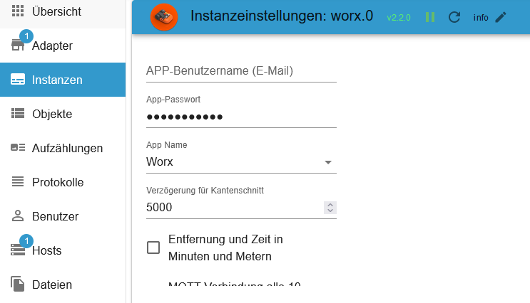

- `Расстояние и время в минутах и м`: по умолчанию ч и км.
- «Пинг-соединение MQTT каждые 10 минут».: Просто для проверки. Пожалуйста, не более 1 часа!
- `Обновление данных MQTT после обновления токена`: загружает данные Worx после обновления токена. 24 дополнительных запроса в день/устройства.

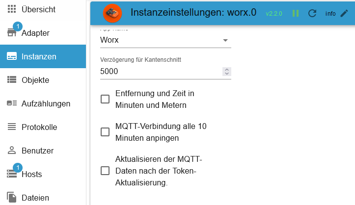

### Папка
- `activityLog`: журнал вашей активности (возможен контроль)
- `области`: Области (возможно управление)
- `календарь`: расписание (возможно управление)
- `Модули`: Ваш модуль(и) (возможно управление)
- `косилка`: Ваша косилка (возможно управление)
- `product`: все свойства ваших устройств (только чтение).
- `rawMqtt`: все данные из облака (только чтение).


###Журнал активности (Wire и Vision)
- `last_update`: последнее обновление как временная метка.
- `manuell_update`: загружает текущий журнал активности (автоматически после изменения статуса)
- `полезная нагрузка`: журнал активности в виде таблицы JSON (для VIS или Blockly).

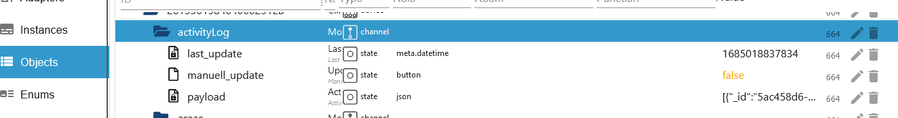

### Области (без обзора)
- `actualArea`: Текущий
- `actualAreaIndicator`: начало следующей зоны массива.
- `area_0`: начало зоны 1 в метрах (массив=0) (изменяемо)
- `area_1`: начало зоны 2 в метрах (массив=1) (изменяемо)
- `area_2`: начало зоны 3 в метрах (массив=2) (изменяемо)
- `area_3`: Начало зоны 4 в метрах (массив=3) (изменяемо)
- `startSequence`: начало зоны массива (события 0-9), например. Запуск только в зоне 3 [2,2,2,2,2,2,2,2,2,2] (изменяемо)
- `zoneKeeper`: Безопасное вождение в узких зонах пересечения (Области должны быть созданы) (начиная с прошивки 3.30) (изменяемо)

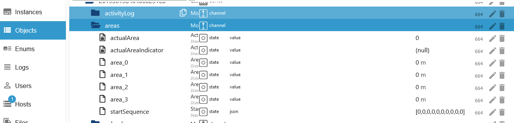

###календарь (Проводной)
- Например. установка времени на среду

    - `wednesday.borderCut`: с обрезанием рамки или без него (изменить значение без задержки) (изменяемо)
    - `wednesday.startTime`: время начала чч:мм (0-23/0-59), например 09:00 (Изменить значение без задержки) (изменяемо)
    - `wednesday.workTime`: рабочее время в минутах (180 минут = 3 часа), например 30 = Конец 09:30 (Изменить значение без задержки) (изменяемо)
    - `calJson_sendto`: если все состояния установлены, нажмите кнопку для отправки (с задержкой 1,1 секунды). Теперь газонокосилка будет косить в течение 30 минут (можно изменить).
    - `calJson_tosend`: эти данные отправляются в Mqtt (оба графика кошения устанавливаются автоматически). Вы также можете создать этот JSON самостоятельно. (Сменный)
    - `calendar.calJson`: массив для еженедельного плана кошения. Вы также можете создать этот МАССИВ самостоятельно. (график кошения 1/устанавливается автоматически - только для проволоки) (изменяемый)
    - `calendar.calJson2`: массив для еженедельного плана кошения. Вы также можете создать этот МАССИВ самостоятельно. (график кошения 2/устанавливается автоматически – только для проволоки) (изменяемый)

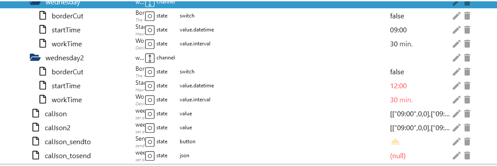

###календарь (видение)
- Например. установка времени на пятницу
- Стандартно создаются 2 временных интервала. Если в приложении созданы 3 слота, 3 также будут созданы в ioBroker. Если его снова уменьшить до 2, эти слоты будут удалены в ioBroker. День с наибольшим количеством слотов используется в качестве эталона для всех дней.

    - `friday.time_0.borderCut`: с обрезанием рамки или без него (изменить значение без задержки) (изменяемо)
    - `friday.time_0.startTime`: время начала чч:мм (0-23/0-59), например. 09:00 (Изменить значение без задержки) (изменяемо)
    - `friday.time_0.workTime`: рабочее время в минутах (180 минут = 3 часа), например 30 = Конец 09:30 (Изменить значение без задержки) (изменяемо)
    - `friday.time_0.enabled_time`: активировать или деактивировать время. При деактивации временной интервал удаляется (устанавливается без задержки) (можно изменить)
    - `friday.time_0.zones`: к каким зонам следует приближаться, например Пример [1,2,3] (устанавливается без задержки) (можно изменить)
    - `calJson_sendto`: если все состояния установлены, установите для этой кнопки значение true (с задержкой 1,1). Теперь газонокосилка будет косить 30 минут! (Сменный)
    - `calJson_tosend`: этот JSON автоматически заполняется, а затем отправляется в Mqtt. Конечно, вы также можете создать его самостоятельно. (Сменный)
    - `add_timeslot`: добавляется дополнительный временной интервал. Неиспользуемые временные интервалы удаляются после перезагрузки. (Сменный)

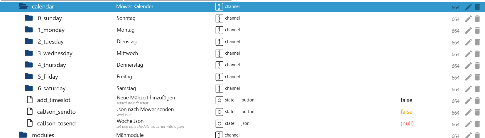 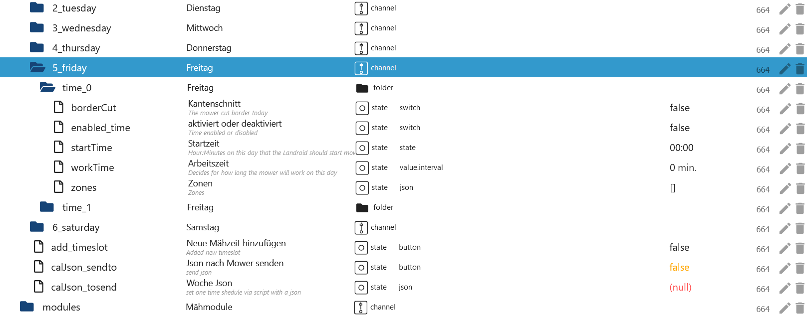

### Пример временного интервала (Vision)
- `calJson_tosend` Этот JSON будет введен 1 раз в воскресенье и удалит все остальные дни. Вся неделя всегда должна быть представлена.

```json
[
    {
        "e": 1, // 0=deactivated/1=activated - Set 0 for deactivated this slot
        "d": 0, // Days 0=sunday, 1=monday, 2=tuesday, 3=wednesday, 4=thursday, 5=friday, 6=saturday
        "s": 360, // Start time in minutes 06:00 (360/60) - (320/60 = 5 hours and 20 minutes)
        "t": 180, // Mowing time in minutes = End time 09:00 (180/60) - (200/60 = 3 hours and 20 minutes)
        "cfg": {
            "cut": {
                "b": 1, // 0=without BorderCut/1=with BorderCut
                "z": [1] // Which zones [1,2,6]
            }
        }
    }
]
```

### Модулей (Wire и Vision)
- Модуль Off Limit (провод и зрение)

    - `DF.OLMSwitch_Cutting`: предотвращает перетирание магнитной ленты - истинное включение/ложное выключение.
    - `DF.OLMSwitch_FastHoming`: быстрый возврат на зарядную станцию - истинное включение/ложное выключение.

- Модуль ACS (только проводной)

    - `US.ACS`: включить или отключить ACS - 1-вкл./0-выкл.
    - `US.ACS_Status`: статус модуля ACS.

- Модуль EA (только Vision)

    - `EA.height`: регулировка высоты деки косилки от 30 до 60 с шагом 5 мм.

- Модуль HL (только Vision)
    - `HL.status`: индикатор состояния фары.
    - `HL.enabled`: фара установлена да = 1/нет = 0
    - `HL.on`: Дневной свет = 0/Тьма = 1

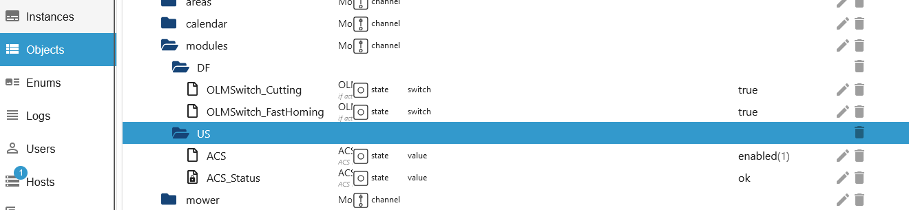 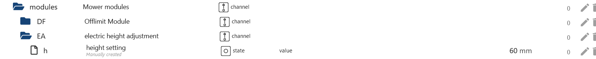 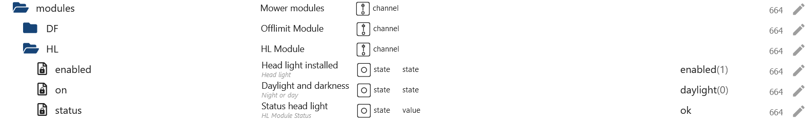

### Косилка (Wire и Vision)
- «AutoLock»: автоматическая блокировка истинного включения/ложного выключения (проводное и визуальное/изменяемое)
- `AutoLockTimer`: максимальная автоматическая блокировка таймера. 10 минут с шагом 30 секунд (проводное и Vision/сменное)
- `batteryChargeCycle`: цикл зарядки аккумулятора (проводное и Vision/только чтение)
- `batteryCharging`: зарядка аккумулятора ложная->нет/истина->да (проводное и Vision/только чтение)
- `batteryState`: состояние батареи в % (проводное и Vision/только чтение)
- `batteryTemperature`: температура батареи в градусах Цельсия (проводное и Vision/только чтение)
- `batteryVoltage`: напряжение батареи в Вольтах (проводное и Vision/только чтение)
- `cutOverSlabs`: разрезание плит включено = true / выключено = false (видение/изменяемое)
- `direction`: направление в градусах (провод и видение/только чтение)
- `edgecut`: запуск EdgeCut (проволока и Vision/сменный)
- `error`: сообщение об ошибке от газонокосилки (провод и Vision/только чтение)

```json
{
    "states": {
        "0": "No error", //(wire & Vision)
        "1": "Trapped", //(wire & Vision unknown)
        "2": "Lifted", //(wire & Vision)
        "3": "Wire missing", //(wire & Vision unknown)
        "4": "Outside wire", //(wire & Vision unknown)
        "5": "Raining", //(wire & Vision)
        "6": "Close door to mow", //(wire & Vision)
        "7": "Close door to go home", //(wire & Vision)
        "8": "Blade motor blocked", //(wire & Vision)
        "9": "Wheel motor blocked", //(wire & Vision)
        "10": "Trapped timeout", //(wire & Vision)
        "11": "Upside down", //(wire & Vision)
        "12": "Battery low", //(wire & Vision)
        "13": "Reverse wire", //(wire & Vision unknown)
        "14": "Charge error", //(wire & Vision)
        "15": "Timeout finding home", //(wire & Vision)
        "16": "Mower locked", //(wire & Vision)
        "17": "Battery over temperature", //(wire & Vision)
        "18": "dummy model", //(wire & Vision)
        "19": "Battery trunk open timeout", //(wire & Vision)
        "20": "wire sync", //(wire & Vision unknown)
        "21": "msg num", //(wire & Vision)
        "110": "Camera error" //(Vision)
    }
}
```


- `firmware`: текущая установленная прошивка (проводное и Vision/только чтение).
- `firmware_available`: доступная прошивка (проводное и Vision/только чтение)
- «firmware_available_all»: последняя доступная прошивка в формате JSON. Этот JSON будет обновляться при появлении нового обновления (проводное и Vision/только чтение).

```json
{
    "mandatory": false,
    "product": {
        "uuid": "1236ll8d-0000-0000-9999-07ff6690003f",
        "version": "3.30.0+1",
        "released_at": "2023-05-24",
        "changelog": "•\tSupport for new models \tWR166E and WR184E\n•\tImproved Grass cutting coverage\n•\tImproved ACS\n•\tAdded Zone Keeper function (need to be enabled by app)\n•\tImproved wheel torque algorithm\n• \tNew FML firmware\n•\tFixed \"FML\" and \"Radiolink\" Activation problem\n•\tFixed some translations error\n•\tRain delay can now be cleared pressing START / HOME button, (1 minute after countdown has started)\n•\tImproved PRO Battery management\n• \tImproved boundary wire recognition\n• \tFixed border cut when zones are active\n• \tNew wifi firmware for board HW REV > 7\n\nThe Worx Landroid team would like to thank our amazing beta testers, with hundreds of hours of their own free time to make this firmware possible."
    }
}
```

- `firmware_available_date`: дата доступной прошивки - Dummy 1970-01-01, когда адаптер переустановлен и обновление недоступно (проводное и Vision/только чтение)
- Значение `firmware_body` из dat.fw (Vision/только для чтения)
- Значение `firmware_head` из dat.head.fw (Vision/только для чтения)
- «firmware_update_start»: запустить обновление прошивки в 2 этапа — см. ниже «firmware_update_start_approved» (проводное и Vision/изменяемое)
- «firmware_update_start_approved»: запустить обновление прошивки. Для параметра «firmware_update_start» должно быть установлено значение «истина» (проводное и Vision/изменяемое)
- `gradient`: градиент в градусах (проводное и Vision/только чтение)
- `inclination`: наклон в градусах (проводное и Vision/только чтение)
- `last_command`: последний запрос от iobroker или приложения в виде таблицы JSON (проводное и Vision/только чтение)
- `mowTimeExtend`: увеличение времени кошения в %. Диапазон: -100%->100% (проводной/изменяемый).
- `mowerActive`: приостановить план кошения (проводной/изменяемый)
- `mqtt_update`: макс. обновление данных Mqtt. 150/день (проводной и Vision/сменный)
- `mqtt_update_count`: счетчик обновления данных Mqtt (проводное и Vision/только чтение)

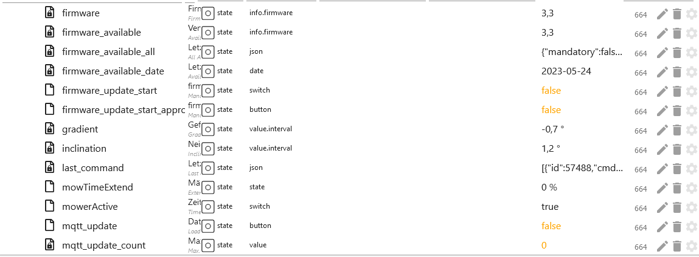

- `oneTimeJson`: однократное покос в формате JSON (проводное и Vision/изменяемое)

```json
{
    "wtm": 60, //Minutes
    "bc": 0 //0=w/o bordercut 1=with bordercut or use the next State
}
```

- `oneTimeStart`: однократный запуск кошения «Сначала установите oneTimeWithBorder, oneTimeWorkTime и oneTimeZones для Vision» — с задержкой 1,1 секунды (проводное и Vision/изменяемое)
- `oneTimeWithBorder`: с обрамлением - изменение значения без задержки (проводное и Vision/изменяемое)
- `oneTimeWorkTime`: Макс. рабочее время. 8 часов с шагом 30 минут — изменение значения без задержки (проводное и Vision/изменяемое)
- `oneTimeZones`: установить зоны [1,2,4] (видение/изменяемые)
- «онлайн»: газонокосилка онлайн (проводное и Vision/только чтение)
- `partyModus`: включение/выключение Partymodus (проводное и Vision/изменяемое)
- «Пауза»: включение/выключение прерывания газонокосилки (проводное и Vision/изменяемое)
- `reset_battery_time`: сброс заряда батареи в 2 этапа (проводной и визуальный/сменный)
- `reset_battery_time_approved`: подтвердите сброс заряда батареи. Для `reset_battery_time` должно быть установлено значение true (проводное и визуальное/изменяемое)
- `reset_blade_time`: сброс рабочего времени лезвия в 2 этапа (провод и зрение/изменяемое)
- `reset_blade_time_approved`: подтвердите сброс рабочего времени лезвия. - `reset_battery_time` должно быть установлено в значение true (проводное и визуальное/изменяемое)

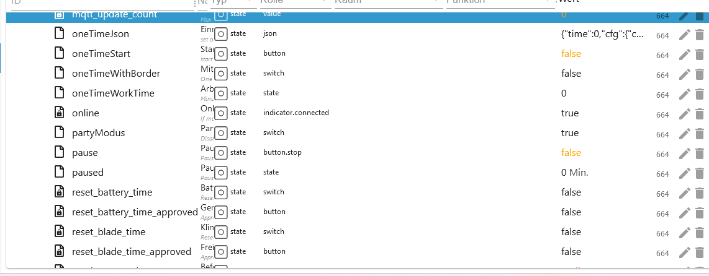

- `sendCommand`: отправить команду cmd (проводное и Vision/изменяемое)

```json
{
    "states": {
        "1": "Start", //(wire & Vision)
        "2": "Stop", //(wire & Vision)
        "3": "Home", //(wire & Vision)
        "4": "Start Zone Taining", //(wire & Vision unknown)
        "5": "Lock", //(wire & Vision unknown)
        "6": "Unlock", //(wire & Vision)
        "7": "Restart Robot", //(wire & Vision)
        "8": "pause when follow wire", //(wire & Vision unknown)
        "9": "safe homing" //(wire & Vision unknown)
    }
}
```

- `state`: True для запуска газонокосилки и False для остановки косилки (проводное и Vision/изменяемое)
- `status`: статус газонокосилки (проводное и Vision/только чтение)

```json
{
    "states": {
        "0": "IDLE", //(wire & Vision)
        "1": "Home", //(wire & Vision)
        "2": "Start sequence", //(wire & Vision)
        "3": "Leaving home", //(wire & Vision)
        "4": "Follow wire", //(wire & Vision unknown)
        "5": "Searching home", //(wire & Vision)
        "6": "Searching wire", //(wire & Vision unknown)
        "7": "Mowing", //(wire & Vision)
        "8": "Lifted", //(wire & Vision)
        "9": "Trapped", //(wire & Vision)
        "10": "Blade blocked", //(wire & Vision)
        "11": "Debug", //(wire & Vision)
        "12": "Remote control", //(wire & Vision)
        "13": "escape from off limits", //(wire & Vision)
        "30": "Going home", //(wire & Vision)
        "31": "Zone training", //(wire & Vision)
        "32": "Border Cut", //(wire & Vision)
        "33": "Searching zone", //(wire & Vision)
        "34": "Pause" //(wire & Vision)
    }
}
```

- «крутящий момент»: диапазон крутящего момента колеса -50->50 (проводной и Vision/сменный)
- `totalBladeTime`: общее время работы блейда (проводное и Vision/только чтение)
- `totalDistance`: общее расстояние (провод и зрение/только чтение)
- `totalTime`: общее время работы (проводное и Vision/только чтение)
- `waitRain`: Макс. задержка дождя. 12 часов с шагом 30 минут (проводное и Vision/сменное)
- `waitRainCountdown` Начать обратный отсчет, когда датчик переключится с влажного на сухой (проводное и Vision/только чтение)
- Состояние `waitRainSensor` 0 для сухого и 1 для влажного (проводное и Vision/только чтение)
- `wifiQuality`: качество Wi-Fi (проводное и Vision/только чтение)

```json
{
    "rain": {
        "s": 0, // 0 for dry and 1 for wet (Wire & Vision)
        "cnt": 59 // Start countdown when changing from s=1 wet to s=0 dry - rain was detected (Wire & Vision)
    }
}
```


### Дополнительно для зрения
-   Область
    - `rfid`: общая площадь (только чтение)
    - `startSequence`: многозонный JSON (видение/изменяемый) [Пример](#example-blockly-startsequence-vison)

Пример:

```json
{
    "mz": {
        "p": [
            // Passages between zones
            {
                "z1": 1, // Zone from (must z1 < z2)
                "z2": 2, // Zone to (must z2 > z1)
                "t1": "E000000000000000", // RFID id from z1
                "t2": "E0000000KKKKKKKK" // RFID id from z2
            }
        ],
        "s": [
            // The zones themselves
            {
                "id": 1, // Numbering - Start with 1
                "c": 1, // 1 if the charging station is in this zone. 0 for no charging station.
                "cfg": {
                    "cut": {
                        "bd": 100, // bordercut in mm - allowed 10mm, 15mm und 20mm
                        "ob": 0 // 1 for driving over slabs if they are detected, otherwise 0. Different per-zone is not allowed
                    }
                }
            },
            {
                "id": 2, // Numbering
                "c": 0, // 1 if the charging station is in this zone. 0 for no charging station.
                "cfg": {
                    "cut": {
                        "bd": 100, // bordercut in mm
                        "ob": 0 // 1 for driving over slabs if they are detected, otherwise 0. Different per-zone is not allowed
                    }
                }
            }
        ]
    }
}
```

По умолчанию без зоны:

```json
{
    "mz": {
        "p": [],
        "s": [
            {
                "id": 1,
                "c": 1,
                "cfg": {
                    "cut": {
                        "bd": 150,
                        "ob": 0
                    }
                }
            }
        ]
    }
}
```


- Косилка
    - `log_improvement`: отправлять журнал улучшений в worx, отключить/включить (изменяемо)
    - `log_troubleshooting`: отправлять журнал устранения неполадок в worx, отключить/включить (изменяемо)


- Косилка
    - `paused`: приостановленное расписание в минутах (изменяемое)


### Info_mqtt (Wire и Vision)
- `incompleteOperationCount`: общее количество операций, отправленных на соединение, которые еще не завершены. Неподдерживаемые операции являются подмножеством этого.
- `incompleteOperationSize`: общий размер пакета операций, отправленных на соединение, которые еще не завершены. Неподдерживаемые операции являются подмножеством этого.
- `unackedOperationCount`: общее количество операций, которые были отправлены на сервер и ожидают соответствующего подтверждения, прежде чем они могут быть завершены.
- `unackedOperationSize`: общий размер пакетов операций, которые были отправлены на сервер и ожидают соответствующего подтверждения, прежде чем они могут быть завершены.
- `last_update`: последнее обновление токена.
- `next_update`: следующее обновление токена.
- `online`: состояние соединения MQTT (false=оффлайн/true=онлайн)

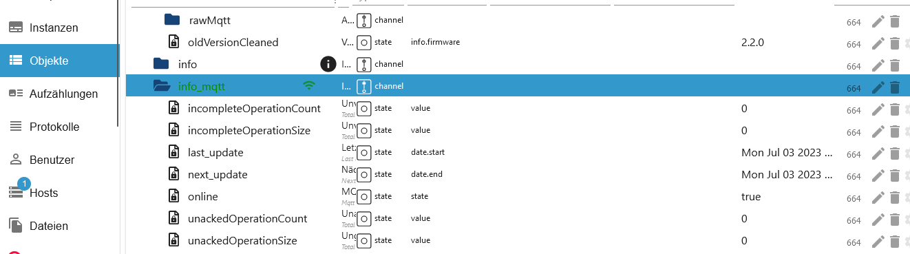

### Пример Blockly startsequence Vision
```
<xml xmlns="https://developers.google.com/blockly/xml">
  <variables>
    <variable id="${]4s$w?n24Az}=7iAIY">mz</variable>
    <variable id="o.FQ]_Xa!tHn2T7Ak{Pt">value</variable>
    <variable id="/@E4iFRMr:x+u?{7yFlB">test</variable>
    <variable id="jxTInS{}mk_)WJa[:,fA">i</variable>
  </variables>
  <block type="procedures_defcustomnoreturn" id="u:w*aBH!92nydG0Mu.1-" x="-87" y="-87">
    <mutation statements="false">
      <arg name="mz" varid="${]4s$w?n24Az}=7iAIY"></arg>
      <arg name="value" varid="o.FQ]_Xa!tHn2T7Ak{Pt"></arg>
    </mutation>
    <field name="NAME">set_bd</field>
    <field name="SCRIPT">bXouY2ZnLmN1dC5iZCA9IDE1MA==</field>
    <comment pinned="false" h="80" w="160">Beschreibe diese Funktion …</comment>
  </block>
  <block type="variables_set" id="jiP0218}2,Y]B]RdKD~`" x="-87" y="-35">
    <field name="VAR" id="/@E4iFRMr:x+u?{7yFlB">test</field>
    <value name="VALUE">
      <block type="convert_json2object" id=";Ef{FHk_~heeozyHFxci">
        <value name="VALUE">
          <block type="get_value" id="LMfldD:[D4%}yWE8,N0y">
            <field name="ATTR">val</field>
            <field name="OID">worx.0.xxxxxxxxxxxxxxxxxxxx.areas.startSequence</field>
          </block>
        </value>
      </block>
    </value>
    <next>
      <block type="controls_forEach" id="D{XG==q$flbH?32eX%D(">
        <field name="VAR" id="jxTInS{}mk_)WJa[:,fA">i</field>
        <value name="LIST">
          <block type="get_attr" id="b~2/cb$WhEj*9i6,(ey5">
            <value name="PATH">
              <shadow type="text" id="+n~;GfHf{,#D!5D}H+m=">
                <field name="TEXT">s</field>
              </shadow>
            </value>
            <value name="OBJECT">
              <block type="variables_get" id="YloS$N%I=6[yk;loD*1O">
                <field name="VAR" id="/@E4iFRMr:x+u?{7yFlB">test</field>
              </block>
            </value>
          </block>
        </value>
        <statement name="DO">
          <block type="procedures_callcustomnoreturn" id="er{Pwq:Y7n_I|CQoup,|">
            <mutation name="set_bd">
              <arg name="mz"></arg>
              <arg name="value"></arg>
            </mutation>
            <value name="ARG0">
              <block type="variables_get" id="(-_i0(y:W}U_x?s(7k%4">
                <field name="VAR" id="jxTInS{}mk_)WJa[:,fA">i</field>
              </block>
            </value>
            <value name="ARG1">
              <block type="math_number" id="{2u/=v!k|yJsOesq[CU^">
                <field name="NUM">150</field>
              </block>
            </value>
            <next>
              <block type="debug" id="b1}}DmS-[_W:+Y+$|%)r">
                <field name="Severity">log</field>
                <value name="TEXT">
                  <shadow type="text" id="7wx?ca_U[S~8DA4}*RXx">
                    <field name="TEXT">test</field>
                  </shadow>
                  <block type="variables_get" id="_zz;w64g-!E$zX$]pvyI">
                    <field name="VAR" id="/@E4iFRMr:x+u?{7yFlB">test</field>
                  </block>
                </value>
              </block>
            </next>
          </block>
        </statement>
        <next>
          <block type="debug" id="o[S0+1%{oLU+r:03tz7=">
            <field name="Severity">log</field>
            <value name="TEXT">
              <shadow type="text" id="7wx?ca_U[S~8DA4}*RXx">
                <field name="TEXT">test</field>
              </shadow>
              <block type="variables_get" id="tjqxQ(MO|CR~/Xq5;Pm[">
                <field name="VAR" id="/@E4iFRMr:x+u?{7yFlB">test</field>
              </block>
            </value>
            <next>
              <block type="control" id="C^lZ^SNIQ#,vh}?hSG_O">
                <mutation xmlns="http://www.w3.org/1999/xhtml" delay_input="false"></mutation>
                <field name="OID">worx.0.xxxxxxxxxxxxxxxxxxxx.areas.startSequence</field>
                <field name="WITH_DELAY">FALSE</field>
                <value name="VALUE">
                  <block type="convert_object2json" id="z)EXA+%8lB4K#7!Hp1V%">
                    <field name="PRETTIFY">FALSE</field>
                    <value name="VALUE">
                      <block type="variables_get" id="C4np)gS@^Y*?-0I+R6+r">
                        <field name="VAR" id="/@E4iFRMr:x+u?{7yFlB">test</field>
                      </block>
                    </value>
                  </block>
                </value>
              </block>
            </next>
          </block>
        </next>
      </block>
    </next>
  </block>
</xml>

<xml xmlns="https://developers.google.com/blockly/xml">
  <variables>
    <variable id="${]4s$w?n24Az}=7iAIY">mz</variable>
    <variable id="o.FQ]_Xa!tHn2T7Ak{Pt">value</variable>
    <variable id="/@E4iFRMr:x+u?{7yFlB">test</variable>
    <variable id="jxTInS{}mk_)WJa[:,fA">i</variable>
  </variables>
  <block type="procedures_defcustomnoreturn" id="u:w*aBH!92nydG0Mu.1-" x="-87" y="-87">
    <mutation statements="false">
      <arg name="mz" varid="${]4s$w?n24Az}=7iAIY"></arg>
      <arg name="value" varid="o.FQ]_Xa!tHn2T7Ak{Pt"></arg>
    </mutation>
    <field name="NAME">set_bd</field>
    <field name="SCRIPT">bXouY2ZnLmN1dC5iZCA9IDE1MA==</field>
    <comment pinned="false" h="80" w="160">Beschreibe diese Funktion …</comment>
  </block>
  <block type="variables_set" id="jiP0218}2,Y]B]RdKD~`" x="-87" y="-35">
    <field name="VAR" id="/@E4iFRMr:x+u?{7yFlB">test</field>
    <value name="VALUE">
      <block type="convert_json2object" id=";Ef{FHk_~heeozyHFxci">
        <value name="VALUE">
          <block type="get_value" id="LMfldD:[D4%}yWE8,N0y">
            <field name="ATTR">val</field>
            <field name="OID">worx.0.xxxxxxxxxxxxxxxxxxxx.areas.startSequence</field>
          </block>
        </value>
      </block>
    </value>
    <next>
      <block type="controls_forEach" id="D{XG==q$flbH?32eX%D(">
        <field name="VAR" id="jxTInS{}mk_)WJa[:,fA">i</field>
        <value name="LIST">
          <block type="get_attr" id="b~2/cb$WhEj*9i6,(ey5">
            <value name="PATH">
              <shadow type="text" id="+n~;GfHf{,#D!5D}H+m=">
                <field name="TEXT">s</field>
              </shadow>
            </value>
            <value name="OBJECT">
              <block type="variables_get" id="YloS$N%I=6[yk;loD*1O">
                <field name="VAR" id="/@E4iFRMr:x+u?{7yFlB">test</field>
              </block>
            </value>
          </block>
        </value>
        <statement name="DO">
          <block type="procedures_callcustomnoreturn" id="er{Pwq:Y7n_I|CQoup,|">
            <mutation name="set_bd">
              <arg name="mz"></arg>
              <arg name="value"></arg>
            </mutation>
            <value name="ARG0">
              <block type="variables_get" id="(-_i0(y:W}U_x?s(7k%4">
                <field name="VAR" id="jxTInS{}mk_)WJa[:,fA">i</field>
              </block>
            </value>
            <value name="ARG1">
              <block type="math_number" id="{2u/=v!k|yJsOesq[CU^">
                <field name="NUM">150</field>
              </block>
            </value>
            <next>
              <block type="debug" id="b1}}DmS-[_W:+Y+$|%)r">
                <field name="Severity">log</field>
                <value name="TEXT">
                  <shadow type="text" id="7wx?ca_U[S~8DA4}*RXx">
                    <field name="TEXT">test</field>
                  </shadow>
                  <block type="variables_get" id="_zz;w64g-!E$zX$]pvyI">
                    <field name="VAR" id="/@E4iFRMr:x+u?{7yFlB">test</field>
                  </block>
                </value>
              </block>
            </next>
          </block>
        </statement>
        <next>
          <block type="debug" id="o[S0+1%{oLU+r:03tz7=">
            <field name="Severity">log</field>
            <value name="TEXT">
              <shadow type="text" id="7wx?ca_U[S~8DA4}*RXx">
                <field name="TEXT">test</field>
              </shadow>
              <block type="variables_get" id="tjqxQ(MO|CR~/Xq5;Pm[">
                <field name="VAR" id="/@E4iFRMr:x+u?{7yFlB">test</field>
              </block>
            </value>
            <next>
              <block type="control" id="C^lZ^SNIQ#,vh}?hSG_O">
                <mutation xmlns="http://www.w3.org/1999/xhtml" delay_input="false"></mutation>
                <field name="OID">worx.0.xxxxxxxxxxxxxxxxxxxx.areas.startSequence</field>
                <field name="WITH_DELAY">FALSE</field>
                <value name="VALUE">
                  <block type="convert_object2json" id="z)EXA+%8lB4K#7!Hp1V%">
                    <field name="PRETTIFY">FALSE</field>
                    <value name="VALUE">
                      <block type="variables_get" id="C4np)gS@^Y*?-0I+R6+r">
                        <field name="VAR" id="/@E4iFRMr:x+u?{7yFlB">test</field>
                      </block>
                    </value>
                  </block>
                </value>
              </block>
            </next>
          </block>
        </next>
      </block>
    </next>
  </block>
</xml>
```

### Или
```
<xml xmlns="https://developers.google.com/blockly/xml">
  <variables>
    <variable id="2#Mf$#JFCN9Nw2F2L[?=">x</variable>
    <variable id="fNt-C|86(glunJ:-t=dK">p</variable>
    <variable id="Rci4:iMYXzjoI2k]P^X)">s</variable>
    <variable id="[t-srB,I/UkXaWBk4*A*">list</variable>
    <variable id="]WA|%5f=H9^9uiLc;KS[">new_json</variable>
  </variables>
  <block type="procedures_defcustomreturn" id="@Y/LobsPw4k!jQb)fI!." x="88" y="13">
    <mutation statements="false">
      <arg name="x" varid="2#Mf$#JFCN9Nw2F2L[?="></arg>
      <arg name="p" varid="fNt-C|86(glunJ:-t=dK"></arg>
      <arg name="s" varid="Rci4:iMYXzjoI2k]P^X)"></arg>
    </mutation>
    <field name="NAME">json</field>
    <field name="SCRIPT">eFsicCJdID0gcDsNCnhbInMiXSA9IHM7DQpyZXR1cm4geA==</field>
    <comment pinned="false" h="80" w="160">Describe this function...</comment>
  </block>
  <block type="variables_set" id="WAsPqIMv;bh95{7~Y!D!" x="88" y="63">
    <field name="VAR" id="[t-srB,I/UkXaWBk4*A*">list</field>
    <value name="VALUE">
      <block type="convert_json2object" id="S5uRAnpcGp/7*1b,aum~">
        <value name="VALUE">
          <block type="text" id="}n3]_HIP*7y5GMEo-!c3">
            <field name="TEXT">{p:[],s:[]}</field>
          </block>
        </value>
      </block>
    </value>
    <next>
      <block type="variables_set" id="Kf#KkskB7l|uDiI!(fjq">
        <field name="VAR" id="]WA|%5f=H9^9uiLc;KS[">new_json</field>
        <value name="VALUE">
          <block type="procedures_callcustomreturn" id="K;OJHrji~09PeJ33q.gl">
            <mutation name="json">
              <arg name="x"></arg>
              <arg name="p"></arg>
              <arg name="s"></arg>
            </mutation>
            <value name="ARG0">
              <block type="variables_get" id="ipM^e+~#-hoo0(047Ybo">
                <field name="VAR" id="[t-srB,I/UkXaWBk4*A*">list</field>
              </block>
            </value>
            <value name="ARG1">
              <block type="lists_create_with" id="HJIZHLc]lL0Tgqe$E~Ul">
                <mutation items="0"></mutation>
              </block>
            </value>
            <value name="ARG2">
              <block type="lists_create_with" id="JH=jADj%lYJ(:7%v[o+3">
                <mutation items="1"></mutation>
                <value name="ADD0">
                  <block type="convert_json2object" id="@5BT0}WJ`srV89LD5h?D">
                    <value name="VALUE">
                      <block type="text" id="=.e.D[I2IQ{u!4;(-D-,">
                        <field name="TEXT">{"id":1,"c":1,"cfg":{"cut":{"bd":150,"ob":1}}}</field>
                      </block>
                    </value>
                  </block>
                </value>
              </block>
            </value>
          </block>
        </value>
        <next>
          <block type="control" id="k$;?LM/[x-TbZ^m=F4}i">
            <mutation xmlns="http://www.w3.org/1999/xhtml" delay_input="false"></mutation>
            <field name="OID">worx.0.xxxxxxxxxx.areas.startSequence</field>
            <field name="WITH_DELAY">FALSE</field>
            <value name="VALUE">
              <block type="convert_object2json" id="b~2Bz}OiNg{V]!QgN^J7">
                <field name="PRETTIFY">FALSE</field>
                <value name="VALUE">
                  <block type="variables_get" id="b|+SOSd+ZD@*XHPGu*I(">
                    <field name="VAR" id="]WA|%5f=H9^9uiLc;KS[">new_json</field>
                  </block>
                </value>
              </block>
            </value>
          </block>
        </next>
      </block>
    </next>
  </block>
</xml>
```

### Или прямой
```
{"p": [],"s": [{"id": 1, "c": 1, "cfg": {"cut": {"bd": 100, "ob": 1}}}]}
```

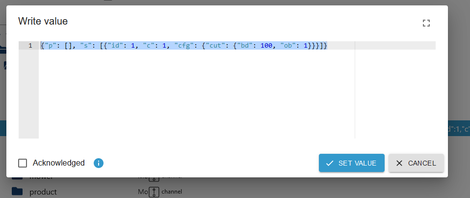

### Не допускается
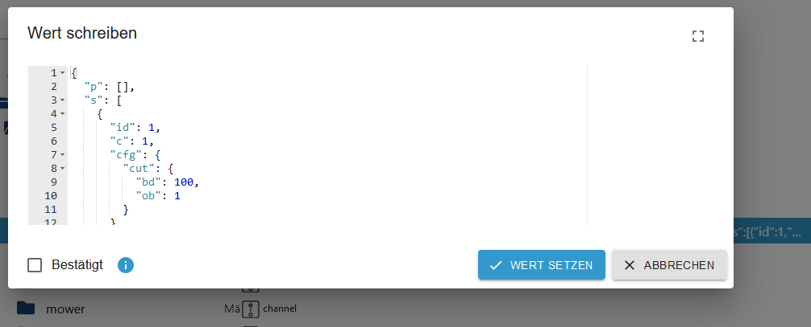  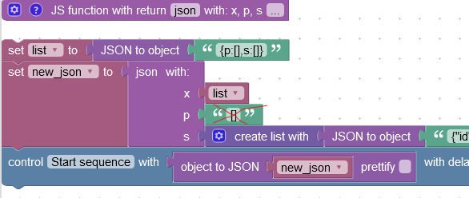

## Changelog

### **WORK IN PROGRESS**

-   (Lucky-ESA) Fixed Sentry messages
-   (Lucky-ESA) Catch publish crash
-   (Lucky-ESA) Added for Vision electric height adjustment
-   (Lucky-ESA) Added for Vision new calendar
-   (Lucky-ESA) Added head light
-   (Lucky-ESA) Added cut over slabs
-   (Lucky-ESA) Node 18 required
-   (Lucky-ESA) Catch aws_cer error and use old mqtt connection
-   (Lucky-ESA) Added rain wait countdown

### 2.3.4 (2023-10-19)

-   (Lucky-ESA) Fixed folder without raw
-   (Lucky-ESA) Changed Loglevel at refresh token
-   (Lucky-ESA) Fixed restriction vision bordercut
-   (Lucky-ESA) Fixed check json vision startsequence

### 2.3.3 (2023-09-25)

-   (Lucky-ESA) Added cmd wifi lock for Vision
-   (Lucky-ESA) Fixed [#761](https://github.com/iobroker-community-adapters/ioBroker.worx/issues/761)
-   (Lucky-ESA) Added sequence for Vision
-   (Lucky-ESA) Checking working hours and locktime
-   (Lucky-ESA) Fixed incorrect log message for firmware update

### 2.3.2 (2023-07-21)

-   (Lucky-ESA) Wrong folder for areas
-   (Lucky-ESA) New data points can only be read

### 2.3.1 (2023-07-20)

-   (Lucky-ESA) Added Firmware Update
-   (Lucky-ESA) Deleted board info request - Worx disabled endpoint
-   (Lucky-ESA) Added reset blade time and battery time
-   (Lucky-ESA) Added ping after refresh token
-   (Lucky-ESA) Added german description
-   (TA2k) Changed firmware request
-   (Lucky-ESA) Changed auth-endpoint
-   (Lucky-ESA) Some bug fixes
-   (Lucky-ESA) Fix unique mqtt clientid
-   (Lucky-ESA) Fix [#704](https://github.com/iobroker-community-adapters/ioBroker.worx/issues/704)
-   (Lucky-ESA) readme.md translated [#703](https://github.com/iobroker-community-adapters/ioBroker.worx/issues/703)
-   (Lucky-ESA) New Mqtt connection Fix [#590](https://github.com/iobroker-community-adapters/ioBroker.worx/issues/590)

### 2.2.0 (2023-06-27)

-   (Lucky-ESA) Removed mowerActive for Vision
-   (Lucky-ESA) Add Vision paused schedule
-   (Lucky-ESA) Add Vision partyModus
-   (Lucky-ESA) Fix ping request Vision
-   (Lucky-ESA) Fix send message inheritance
-   (Lucky-ESA) Fix [#684](https://github.com/iobroker-community-adapters/ioBroker.worx/issues/684)
-   (Lucky-ESA) Fix deviceArray inheritance
-   (Lucky-ESA) Add Vision mowers w/o Status & Error message
-   (Lucky-ESA) Add ZoneKeeper for previous mowers

### 2.1.3

-   (TA2k) Add ping option in the instance settings

### 2.1.2

-   (TA2k) Improve reconnection for multiple mower

### 2.1.1

-   (TA2k) Change reconnection times

### 2.1.0

-   (TA2k) Move Calendar setState to one Json and other fixes to prevent blocking because of too many sending requests

### 2.0.3

-   (TA2k) Add manual refresh. Fix empty status and firmware format. Reduce info logs.

### 2.0.1

-   (TA2k) Adapter rewritten. Added product info and activity log. rawMqtt values improved and compatible with Node v18.

### 1.7.0 (2022-09-28)

-   (TA2k) fix login

### 1.6.6 (2022-06-25)

-   (MeisterTR) fix edgecut

### 1.6.5 (2022-06-19)

-   (Apollon77) Remove logic to set a 0/0/0 nutrition level when deactivated again as it was in pre 1.6 versions also on second place

### 1.6.4 (2022-06-18)

-   (Apollon77) Remove logic to set a 0/0/0 nutrition level when deactivated again as it was in pre 1.6 versions
-   (Apollon77) fix error cases reported by Sentry

### 1.6.3 (2022-06-17)

-   (Apollon77) fix some error cases reported by Sentry

### 1.6.2 (2022-06-17)

-   (TA2k) fix issues introduced in 1.6.0

### 1.6.1 (2022-06-17)

-   (Apollon77) fix some error cases reported by Sentry

### 1.6.0 (2022-06-16)

-   (Apollon77) fix some error cases reported by Sentry

### 1.5.5 (2021-09-29)

-   (MeisterTR) fix error

### 1.5.0 (2021-09-26)

-   (MeisterTR) many fixes
-   (MeisterTR) add torque control
-   (MeisterTR) fixed States

### 1.4.3 (2021-07-25)

-   (MeisterTR) fix Partymode detection

### 1.4.2 (2021-07-24)

-   (MeisterTR) fix bug with OLMSwitch_Cutting
-   (MeisterTR) fix bug with PartyMode
-   (TA2k) fix error with wrong serialnumber (please delete all objects manually)
-   (MeisterTR) fix bug in autolock function

### 1.4.1 (2021-07-06)

-   (MeisterTR) fix bug in sendCommand (please remove state manually)

### 1.4.0 (2021-07-05)

-   (TA2k) update testing
-   (TA2k) add gps coordinates
-   (TA2k) add new status states
-   (TA2k) add new Autolock states
-   (TA2k) add new OffLinits states

### 1.3.7 (03.06.2021)

-   (TA2k) type fixes

### 1.3.6 (27.05.2021)

-   (MeisterTR) bugfixes
-   (MeisterTR) better errorhandling

### 1.2.9 (02.12.2020)

-   (MeisterTR) add sentry
-   (MeisterTR) Bugfix (error type of sc... again) (IOBROKER-WORX-3)

### 1.2.4 (15.11.2020)

-   (MeisterTR) Bugfix (error type of sc...)
-   (MeisterTR) change Testing to git

### 1.2.3 (29.08.2020)

-   (MeisterTR) add option to crate a Json Obj to set mowtime with scripts
-   (MeisterTR) add option to disable weather
-   (MeisterTR) add double Shedule, oneTimeShedule, PartyMode
-   (MeisterTR) fix setIntervall => setTimeout
-   (MeisterTR) fix error with Meter and Min. in Config
-   (MeisterTR) add Kress and Landxcape

### 1.0.0 (03.12.2019)

-   (MeisterTR) bump Version
-   (MeisterTR) transfer to community

### 0.4.0 (03.08.2019)

-   (MeisterTR) fix multimower
-   (MeisterTR) change loglevel
-   (MeisterTR) fix online Status

### 0.3.1 (12.06.2019)

-   (MeisterTR) add delay for edgecut in config
-   (MeisterTR) fix mowtime error

### 0.2.0 (01.06.2019)

-   (MeisterTR) add border
-   (MeisterTR) fix small errors
-   (MeisterTR) code cleanup

### 0.0.1

-   (MeisterTR) initial release

## License

MIT License

Copyright (c) 2023-2024 TA2k <tombox2020@gmail.com>

Permission is hereby granted, free of charge, to any person obtaining a copy
of this software and associated documentation files (the "Software"), to deal
in the Software without restriction, including without limitation the rights
to use, copy, modify, merge, publish, distribute, sublicense, and/or sell
copies of the Software, and to permit persons to whom the Software is
furnished to do so, subject to the following conditions:

The above copyright notice and this permission notice shall be included in all
copies or substantial portions of the Software.

THE SOFTWARE IS PROVIDED "AS IS", WITHOUT WARRANTY OF ANY KIND, EXPRESS OR
IMPLIED, INCLUDING BUT NOT LIMITED TO THE WARRANTIES OF MERCHANTABILITY,
FITNESS FOR A PARTICULAR PURPOSE AND NONINFRINGEMENT. IN NO EVENT SHALL THE
AUTHORS OR COPYRIGHT HOLDERS BE LIABLE FOR ANY CLAIM, DAMAGES OR OTHER
LIABILITY, WHETHER IN AN ACTION OF CONTRACT, TORT OR OTHERWISE, ARISING FROM,
OUT OF OR IN CONNECTION WITH THE SOFTWARE OR THE USE OR OTHER DEALINGS IN THE
SOFTWARE.