# Адаптер ioBroker.worx
# Краткое содержание
- [Настройки экземпляра](#instance-settings)
- [Информация для входа в систему в формате JSON](#login-infos-worx0logininfo)
- [Все папки](#папка)
- [activityLog (Wire and Vision)](#activitylog-wire-and-vision)
- [areas (wire)](#areas-wire)
- [календарь (wire)](#calendar-wire)
- [календарь (Видение)](#календарь-видение)
- [модули (Wire и Vision)](#modules-wire-and-vision)
- [газонокосилка (Wire and Vision)](#mower-wire-and-vision)
    - [info_mqtt (Draht und Vision)](#info_mqtt-wire-and-vision)
- [Дополнительная информация о зрении](#additionally-for-vision)
- [Ограничение скорости](#rate-limiting)
- [Пример отправки многозонных данных в формате JSON с помощью Blockly](#example-blockly-sendmultizonesjson-vision)

## Важная информация
🟢 Пауза 1,1 секунды между двумя активными операциями переключения</br> 🔴 Нет задержки, и следующая активная операция также происходит без задержки

недействительно</br> 🟢🟢🟢

действителен</br> 🟢1,1🟢1,1🟢

недействительно</br> 🔴🔴🟢🟢

действителен</br> 🔴🔴🟢1,1🟢

недействительно</br> 🔴🟢🔴🟢

действителен</br> 🔴🟢1,1🔴🟢

## Описание
### Настройки экземпляра
[Краткое содержание](#summary)

- `Электронная почта приложения`: Ваше имя пользователя (электронная почта) приложения.
- `Пароль приложения`: Ваш пароль от приложения
- `Название приложения`: выберите ваше устройство
- `Интервал обновления в минутах` Интервал обновления всех данных (возможен диапазон от 10 до 1440)
- `Задержка для EdgeCut`: Когда должна начаться обрезка краев газона (например, 5 секунд для газона)
- `Расстояние и время в минутах и метрах`: по умолчанию в часах и километрах.
- `Обновление данных MQTT после обновления токена`: Загружает данные Worx после обновления токена.
- `Отображать ошибки через уведомления (для всех устройств)`: Включить/выключить уведомления для всех устройств (можно включить/выключить для каждого устройства отдельно в разделе «Объекты»).
— Удалите данные сессии. Если у вас возникли проблемы со входом в систему, удалите текущую сессию.
- `Сбросить счетчик входов в систему` Сбросить счетчик входов в систему
- `Лимит запросов в день (50-180)`: Ограничьте количество запросов в день. Это запросы к API, например, установленный интервал и обновления после обновления токена (в настройках экземпляра). Каждый перезапуск генерирует 4 запроса. Дополнительно 1 запрос на статус прошивки и запросы журнала активности (каждое изменение статуса/ошибки газонокосилки). Установите значение на 100 цифр и проверьте, сколько запросов было отправлено в 23:55. Затем введите это число + 10.
- `Ограничение запросов в течение 10 минут (4-15)`: Ограничение запросов API - Sollte auf 4 stehen da sonst ein Neustart nicht möglich wäre.
- «Лимит MQTT в день (1–250 профессиональных устройств)»: запросить ограничение MQTT. Die Auswahl ist pro Geräte.
- `Ограничение на количество перезагрузок в день (1-10)`: Защищает от неизвестных и нежелательных перезагрузок адаптера.
- `MQTT-Verbindung auswählen`:
- `Alte AWS-Verbindung`: Используется старое соединение MQTT. Недостаток: Принудительное отключение происходит каждые 20 минут, а восстановление соединения занимает 1 секунду.
- `Neue AWS-Verbindung`: Используется новое MQTT-соединение. Недостаток: Соединение разрывается и восстанавливается каждый час из-за токена. Если модуль обнаруживает ошибку, автоматически используется старое соединение.
    - `MQTT5-Verbindung (derzeit nicht verfügbar)`: в настоящее время недоступно. После этого будет использовано старое соединение.

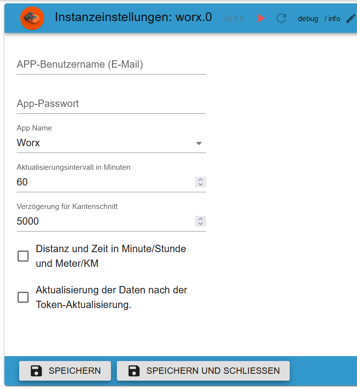</br> </br> 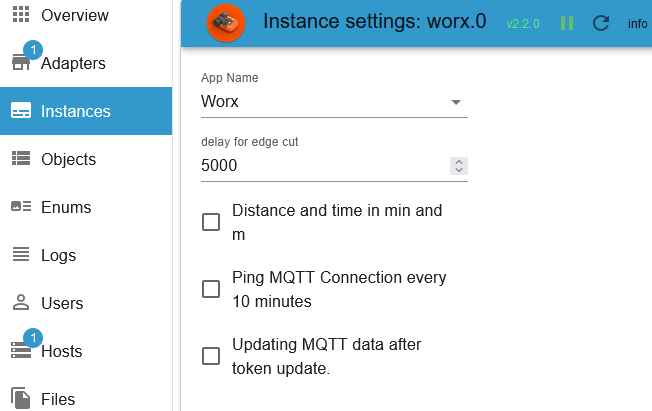

### Информация для входа `worx.0.loginInfo`
[Краткое содержание](#summary)

```json
{
    "loginCounter": 1, // Login counter
    "loginDiff": [1741458177709], // Time difference of the last 10 logins
    "lastLoginTimestamp": 1741458177709, // Last login as timestamp
    "lastLoginDate": "2025-03-08T18:22:57.710Z", // Last login as ISO string WITHOUT time zone
    "refreshCounter": 1, // Counter for refreshToken (reset on restart)
    "refreshHistory": [1741516809807], // History refreshToken as timestamp
    "lastRefreshTimestamp": 1741459690942, // Last refreshToken as timestamp
    "lastRefreshDate": "2025-03-08T18:48:10.942Z", // Last refreshToken as ISO String WITHOUT time zone
    "nextRefreshTimestamp": 1743548215943, // Next refreshToken as timestamp
    "nextRefreshDate": "2025-04-01T22:56:55.943Z", // Next refreshToken as ISO String WITHOUT time zone
    "lastError": "", // Last error message
    "errorHistory": [], // History errors as timestamp
    "errorCounter": 0, // Counter of error messages (reset on restart)
    "lastErrorTimestamp": 0, // Last error message as timestamp
    "lastErrorDate": "" // Last error message as ISO string WITHOUT time zone
}
```

### Папка
[Краткое содержание](#summary)

- `activityLog`: Журнал вашей активности (Wire & Vision / возможно управление)
- `areas`: Области (возможна проводная связь/управление)
- `multiZones`: Многозонная архитектура (возможно визуальное отображение/управление)
- `календарь`: Расписание (возможно управление по проводам и видеосвязи)
- `Модули`: Ваш(и) модуль(и) (Возможно подключение по проводам и видео / управление)
- `Косилка`: Ваша косилка (проводная и визуальная система управления / возможно управление)
- `product`: Все свойства устройства (Wire & Vision / только для чтения)
- `rawMqtt`: Все данные из облака (Wire & Vision / только для чтения)

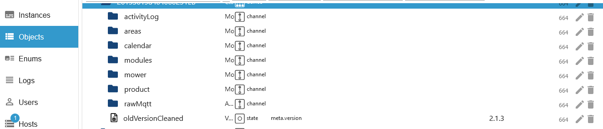

### Журнал активности (Wire and Vision)
[Краткое содержание](#summary)

- `last_update`: Последнее обновление в виде метки времени (Wire & Vision / только для чтения)
- `manuell_update`: Загружает журнал текущей активности (автоматически после изменения статуса - Wire & Vision / возможно управление)
- `payload`: Журнал активности в формате JSON-таблицы (для VIS или Blockly)

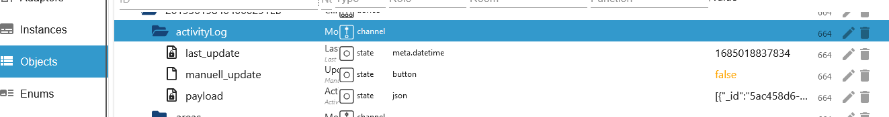

### Области (провод)
[Краткое содержание](#summary)

- `actualArea`: Текущая
- `actualAreaIndicator`: Начало следующей зоны массива
- `area_0`: Начало зоны 1 в метрах (массив=0) (изменяемо) 🟢
- `area_1`: Начало зоны 2 в метрах (массив=1) (изменяемо) 🟢
- `area_2`: Начало зоны 3 в метрах (массив=2) (изменяемо) 🟢
- `area_3`: Начало зоны 4 в метрах (массив=3) (изменяемо) 🟢
- `startSequence`: Начальная зона массива (0-9 событий), например, запуск только в зоне 3 [2,2,2,2,2,2,2,2,2,2] (изменяемо) 🟢
- `zoneKeeper`: Безопасное движение в узких зонах пересечения (необходимо создать зоны) (начиная с версии прошивки 3.30) (можно изменить) 🟢

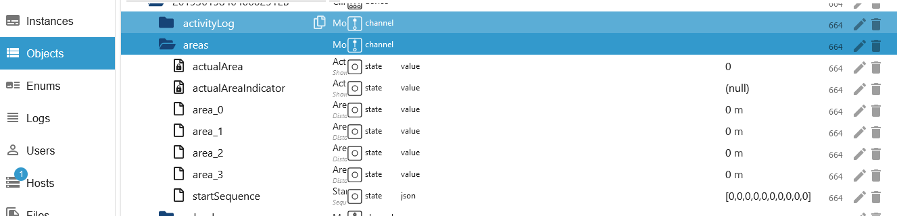

### Календарь (Wire)
[Краткое содержание](#summary)

- Например, установка времени на среду.
- `wednesday.borderCut`: С параметром bordercut или без него (Изменение значения без задержки) (изменяемо) 🔴
- `wednesday.startTime`: Время начала в чч:мм (0-23/0-59), например, 09:00 (Изменить значение без задержки) (изменяемое) 🔴
- `wednesday.workTime`: Рабочее время в минутах (180 мин = 3 ч), например, 30 = время окончания 09:30 (Изменить значение без задержки) (изменяемо) 🔴
- `calJson_sendto`: Если все состояния заданы, нажмите кнопку для отправки (с задержкой в 1,1 секунды). Косилка будет косить в течение 30 минут (время можно изменить) 🟢
- `calJson_tosend`: Эти данные отправляются в MQTT (расписание кошения устанавливается автоматически). Вы также можете создать этот JSON самостоятельно (можно изменить). 🟢
- `calendar.calJson`: Массив для еженедельного плана кошения. Вы также можете создать этот массив самостоятельно. (Расписание кошения 1/устанавливается автоматически - только для проводов) (изменяемый) 🔴
- `calendar.calJson2`: Массив для еженедельного плана кошения. Вы также можете создать этот массив самостоятельно. (Расписание кошения 2/устанавливается автоматически - только для проводов) (изменяемый) 🔴

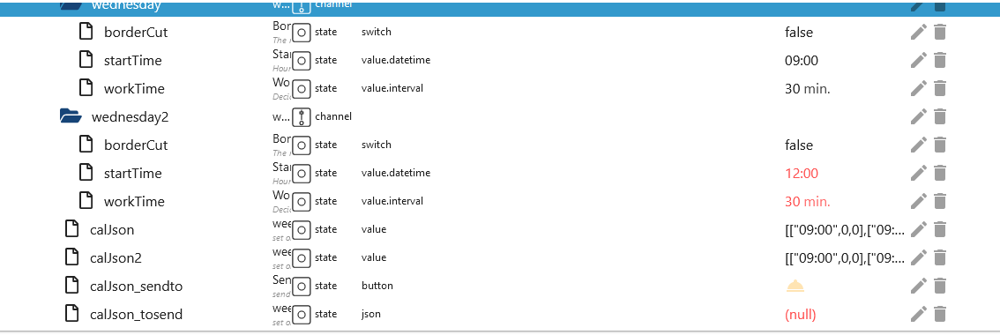

### Календарь (Видение)
[Краткое содержание](#summary)

- Например, установка времени на пятницу.
— По умолчанию создается 2 временных интервала. Если в приложении создано 3 интервала, то 3 будут созданы и в ioBroker. Если их количество снова уменьшится до 2, эти интервалы будут удалены в ioBroker. День с наибольшим количеством интервалов используется в качестве эталона для всех дней.
- `friday.time_0.borderCut`: С параметром bordercut или без него (Изменение значения без задержки) (изменяемо) 🔴
- `friday.time_0.startTime`: Время начала в чч:мм (0-23/0-59), например, 09:00 (Изменить значение без задержки) (изменяемое) 🔴
- `friday.time_0.workTime`: Рабочее время в минутах (180 мин = 3 ч), например, 30 = Время окончания 09:30 (Изменить значение без задержки) (изменяемо) 🔴
- `friday.time_0.enabled_time`: Активировать или деактивировать время. (устанавливается без задержки) (можно изменить) 🔴
- `friday.time_0.zones`: Какие зоны следует использовать, например, [1,2,3] (устанавливается без задержки) (можно изменить) 🔴
- `calJson_sendto`: Если заданы все состояния, установите для этой кнопки значение true. Теперь газонокосилка будет косить 30 минут! (изменяемо) 🟢
- `calJson_tosend`: Этот JSON-файл автоматически заполняется и отправляется в MQTT. Конечно, вы также можете создать его самостоятельно (можно изменить). 🔴
- `add_timeslot`: Добавляется дополнительный временной интервал. Неиспользуемые временные интервалы удаляются после перезапуска. (изменяемо) 🔴

 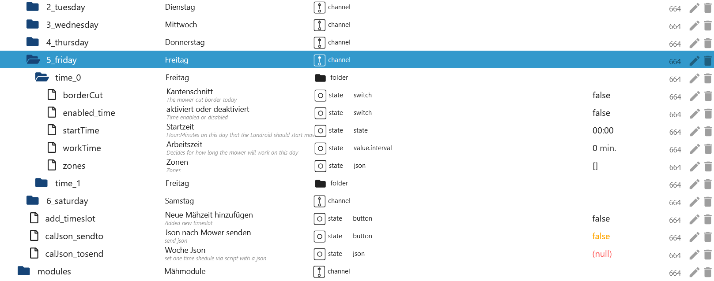

### Пример временного интервала (Vision)
- `calJson_tosend` Этот JSON-файл будет введен один раз в воскресенье и удален за все остальные дни. Необходимо всегда отправлять данные за всю неделю. 🔴

```json
[
    {
        "e": 1, // 0=deactivated/1=activated - Set 0 for deactivated this slot
        "d": 0, // Days 0=sunday, 1=monday, 2=tuesday, 3=wednesday, 4=thursday, 5=friday, 6=saturday
        "s": 360, // Start time in minutes 06:00 (360/60) - (320/60 = 5 hours and 20 minutes)
        "t": 180, // Mowing time in minutes = End time 09:00 (180/60) - (200/60 = 3 hours and 20 minutes)
        "cfg": {
            "cut": {
                "b": 1, // 0=without BorderCut/1=with BorderCut
                "z": [1] // Which zones [1,2,6]
            }
        }
    }
]
```

### Модули (проводные и визуальные)
[Краткое содержание](#summary)

- Модуль "Запретная зона" (проводной и визуальный)
- `DF.OLMSwitch_Cutting`: Предотвращает наезд на магнитную ленту - true-on/alf-off
- `DF.OLMSwitch_FastHoming`: Быстрый возврат к зарядной станции с использованием ярлыков на основе магнитных полос - true-on/false-off

- Модуль ACS (только проводное соединение)
- `US.ACS`: Включение или выключение ACS - 1-вкл/0-выкл 🟢
- `US.ACS_Status`: Статус из модуля ACS (только для чтения)

- Модуль EA (только для Vision)
- `EA.height`: Регулировка высоты косилки от 30 до 60 мм с шагом 5 мм 🟢

- Модуль HL (только для Vision)
- `HL.status`: Состояние фар (только для чтения)
- `HL.enabled`: Фара установлена, да = 1/нет = 0 🟢
- `HL.on`: Дневной свет = 0/Темнота = 1 🟢

- Модуль NL (только для Vision Cloud)
- `NL.error`: Код ошибки (код неизвестен) (только для чтения)
- `NL.status`: Статус модуля NearLink ok/err (только для чтения)
- `NL.connection_X.mac`: MAC-адрес (только для чтения)
- `NL.connection_X.rssi`: RSSI (только для чтения)
- `NL.connection_X.type`: Тип (только для чтения)
- `NL.connection_X.vers`: Версия прошивки (только для чтения)
- `NL.connection_X.wifi_rssi`: Уровень сигнала Wi-Fi (только для чтения)
- `NL.connection_X.wifi_stat`: Статус Wi-Fi (только для чтения)

   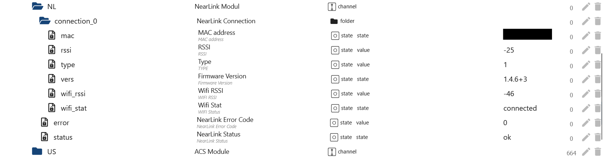

### Газонокосилка (Wire and Vision)
[Краткое содержание](#summary)

- `AutoLock`: Автоматическая блокировка (вкл/выкл) (проводная и визуальная/изменяемая) 🟢
- `AutoLockTimer`: Таймер автоматической блокировки до 10 минут с шагом в 30 секунд (проводной и визуальный/изменяемый) 🟢
- `batteryChargeCycle`: Цикл зарядки батареи (проводной и Vision/только для чтения)
- `batteryCharging`: Зарядка батареи false->no/true->yes (проводное и визуальное подключение/только для чтения)
- `batteryState`: Состояние батареи в % (проводное и видео/только для чтения)
- `batteryTemperature`: Температура батареи в градусах Цельсия (проводное и видео/только для чтения)
- `batteryVoltage`: Напряжение батареи в вольтах (проводное и визуальное/только для чтения)
- `cameraStatus`: Статус камеры 0=OK/1=Ошибка (Vision/readonly)
- `cameraError`: Ошибка камеры 0=OK/1=Error (Vision/readonly)
- `cutOverSlabs`: Включение/выключение функции "Обрезка плит" = true / выключение = false (Vision/changeable) 🟢
- `direction`: Направление в градусах (проводное и видео/только для чтения)
- `edgecut`: Запуск EdgeCut (проводной и визуальный/изменяемый) 🟢
- `error`: Сообщение об ошибке от газонокосилки (wire & Vision/readonly)

```json
{
    "states": {
        "0": "No error", //(Draht & Vision & RTK)
        "1": "Trapped", //(Draht & Vision & RTK-Body)
        "2": "Lifted", //(Draht & Vision & RTK-Body)
        "3": "Wire missing", //(Draht)
        "4": "Outside boundary", //(Draht & Vision & RTK-Body)
        "5": "Rain delay", //(Draht & Vision & RTK-Body)
        "6": "Close door to cut grass", //(Draht)
        "7": "Close door to go home", //(Draht)
        "8": "Blade motor fault", //(Draht & Vision & RTK-Body)
        "9": "Wheel motor fault", //(Draht & Vision & RTK-Body)
        "10": "Trapped timeout fault", //(Draht & Vision & RTK-Body)
        "11": "Upside down", //(Draht & Vision & RTK-Body)
        "12": "Battery low", //(Draht & Vision & RTK)
        "13": "Wire reversed", //(Draht)
        "14": "Charge error", //(Draht & Vision & RTK-Body)
        "15": "Home search timeout", //(Draht & Vision)
        "16": "Wifi locked", //(Draht & Vision)
        "17": "Battery over temperature", //(Draht & Vision & RTK)
        "18": "Dummy model", //(Draht)
        "19": "Battery trunk open timeout", //(Draht & Vision)
        "20": "Wire signal out of sync", //(Draht)
        "100": "Charging station docking error", //(RTK-Body)
        "101": "HBI error", //(RTK-Body)
        "102": "OTA upgrade error", //(Vision & RTK)
        "103": "Map error", //(RTK)
        "104": "Excessive slope", //(RTK-Body)
        "105": "Unreachable zone", //(RTK-Body)
        "106": "Unreachable charging station", //(RTK-Body)
        "107": "Calibration needed", //(RTK-Head)
        "108": "Insufficient sensor data", //(RTK)
        "109": "Training start disallowed", //(RTK)
        "110": "Camera error", //(Vision)
        "111": "Lawn exploration required", //(Vision)
        "112": "Mapping exploration failed", //(Vision)
        "113": "RFID reader error", //(Vision)
        "114": "Headlight error", //(Vision)
        "115": "Missing charging station", //(RTK-Body)
        "116": "Blade height adjustment blocked", //(Vision & RTK-Body)
        "117": "Unsupported blade height", //(Vision & RTK-Body)
        "118": "Manual firrnware upgrade required", //(Vision & RTK-Body)
        "119": "Area limit exceeded", //(RTK-Body)
        "120": "Charging station undocking error" //(RTK-Body)
    }
}
```


- `firmware`: Текущая установленная прошивка (проводная и машинная/только для чтения)
- `firmware_available`: Доступная прошивка (для проводного и визуального доступа/только для чтения)
- `firmware_available_all`: Последняя доступная версия прошивки в формате JSON. Этот JSON будет обновлен, когда станет доступно новое обновление (для Wire и Vision/только для чтения).

```json
{
    "mandatory": false,
    "product": {
        "uuid": "1236ll8d-0000-0000-9999-07ff6690003f",
        "version": "3.30.0+1",
        "released_at": "2023-05-24",
        "changelog": "•\tSupport for new models \tWR166E and WR184E\n•\tImproved Grass cutting coverage\n•\tImproved ACS\n•\tAdded Zone Keeper function (need to be enabled by app)\n•\tImproved wheel torque algorithm\n• \tNew FML firmware\n•\tFixed \"FML\" and \"Radiolink\" Activation problem\n•\tFixed some translations error\n•\tRain delay can now be cleared pressing START / HOME button, (1 minute after countdown has started)\n•\tImproved PRO Battery management\n• \tImproved boundary wire recognition\n• \tFixed border cut when zones are active\n• \tNew wifi firmware for board HW REV > 7\n\nThe Worx Landroid team would like to thank our amazing beta testers, with hundreds of hours of their own free time to make this firmware possible."
    }
}
```

- `firmware_available_date`: Дата доступности прошивки - Заглушка 1970-01-01, когда адаптер переустанавливается и обновление недоступно (проводной и видео/только для чтения)
- Значение `firmware_body` из файла dat.fw (Vision/readonly)
- Значение `firmware_head` из файла dat.head.fw (Vision/readonly)
- `firmware_update_start`: Запуск обновления прошивки в 2 этапа - см. ниже `firmware_update_start_approved` (wire & Vision/changeable) 🔴
- `firmware_update_start_approved`: Запуск обновления прошивки - `firmware_update_start` должен быть установлен в значение true (wire & Vision/changeable) 🟢
- `gradient`: Градиент в градусах (для проводного и компьютерного зрения/только для чтения)
- `наклон`: Наклон в градусах (для проводного и визуального/только для чтения)
- `last_command`: Последний запрос от iobroker или приложения в формате JSON (wire & Vision/readonly)
- `last_update` Последнее обновление (wire & Vision/readonly)
- `last_update_connection` Какое соединение (MQTT или облачное / проводное и Vision/только для чтения)
- `mowTimeExtend`: Увеличение времени кошения в % Диапазон: -100%->100% (проводной/изменяемый) 🟢
- `mowerActive`: false для приостановки кошения на 60 минут и true для остановки кошения, паузы и режима вечеринки (проводной/изменяемый) 🟢
- `mqtt_update`: Обновление данных MQTT максимум 150 раз в день (через Wire и Vision/изменяемо) 🟢
- `mqtt_update_count`: Счетчик обновления данных MQTT (через Wire и Vision/только для чтения)
- `notification`: Включение или отключение уведомлений через контроллер JavaScript. Выводятся сообщения об отсутствии на сайте и об ошибках. (Дизайн и концепция/изменяемо) 🔴
- `notification_excluded`: Какие идентификаторы ошибок не должны отображаться (идентификаторы разделяются запятыми [IDS](#error-ids)) 🔴

</br> 

- `oneTimeJson`: Одноразовое скашивание в формате JSON (wire & Vision/changeable)

```json
{
    "wtm": 60, //Minutes
    "bc": 0 //0=w/o bordercut 1=with bordercut or use the next State
}
```

- `oneTimeStart`: Единовременный запуск кошения. «Сначала установите oneTimeWithBorder, oneTimeWorkTime и oneTimeZones для Vision» — с задержкой в 1,1 секунды (провод и Vision/изменяемая) 🟢
- `oneTimeWithBorder`: С помощью bordercut - Изменение значения без задержки (wire & Vision/changeable) 🔴
- `oneTimeWorkTime`: Максимальное рабочее время 8 часов с шагом в 30 минут - Изменение значения без задержки (wire & Vision/changeable) 🔴
- `oneTimeZones`: Установить зоны [1,2,4] (Видимость/изменяемые) 🔴
- `online`: Газонокосилка онлайн (проводное соединение и Vision/только для чтения)
- `partyModus`: Включение/выключение режима вечеринки (провод и видимость/изменяемо) 🟢
- `partyModeTimer`: Ограничивает время работы режима вечеринки определенным значением. Возможно значение от 1 до 1440 минут. - Можно снова отключить, установив `partyMode` в значение «false». Режим вечеринки не отображается в приложении, но таймер продолжает обратный отсчет. (Wire/changeable) 🟢
- `пауза`: Включение/выключение тормоза газонокосилки (провод и Vision/сменный) 🟢
- `reset_battery_time`: сброс заряда батареи в 2 этапа (проводной и визуальный/сменный) 🔴
- `reset_battery_time_approved`: Подтвердите сброс заряда батареи - `reset_battery_time` должен быть установлен в значение true (проводное и визуальное подключение/изменяемое) 🔴
- `reset_blade_time`: сброс времени работы лезвия в 2 этапа (провод и визуальный контроль/изменяемый) 🔴
- `reset_blade_time_approved`: подтвердить время работы лезвия после сброса - `reset_battery_time` должен быть установлен в значение true (проводное и визуальное управление/изменяемое) 🔴

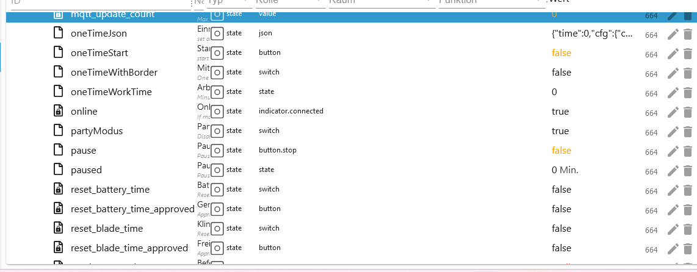

- `rfidStatus`: Статус радиочастотного датчика 0=OK/1=Ошибка (визуальное отображение/только для чтения)
- `sendCommand`: Отправить команду cmd (wire & Vision/changeable) 🟢

### Отправка команд
```json
{
    "states": {
        "1": "Start", //(wire & Vision & RTK)
        "2": "Stop", //(wire & Vision & RTK)
        "3": "Home", //(wire & Vision & RTK)
        "4": "Follow border", //(wire & Vision & RTK)
        "5": "Wi-Fi Lock", //(wire & Vision unknown)
        "6": "Wi-Fi Unlock", //(wire & Vision)
        "7": "Reset Log", //(wire & Vision & RTK)
        "8": "Pause over border", //(wire & Vision)
        "9": "Safe go home", //(wire & Vision unknown)
        "10": "Start once", //(Vision)
        "100": "Pairing command", //(Vision)
        "101": "Border Cut", //(Vision & RTK)
        "102": "Resume cutting", //(RTK)
        "103": "Start driving", //(Draht & Vision & RTK)
        "104": "Stop driving" //(Draht & Vision & RTK)
    }
}
```

- `state`: True для запуска косилки и False для остановки косилки (проводное и визуальное управление/изменяемое)
- `status`: Состояние газонокосилки (проводное и визуальное/только для чтения)

### Идентификаторы статуса
```json
{
    "states": {
        "0": "IDLE", //(wire & Vision & RTK-Body)
        "1": "Home", //(wire & Vision & RTK-Body)
        "2": "Start sequence", //(wire)
        "3": "Leaving home", //(wire & Vision & RTK-Body)
        "4": "Following border", //(wire)
        "5": "Searching home", //(wire & Vision & RTK-Body)
        "6": "Searching border", //(wire & Vision)
        "7": "Mowing", //(wire & Vision & RTK-Body)
        "8": "Lifted", //(wire & Vision & RTK-Body)
        "9": "Trapped", //(wire & Vision & RTK-Body)
        "10": "Blade blocked", //(wire & Vision & RTK-Body)
        "11": "Debug", //(wire)
        "12": "Driving", //(wire & Vision)
        "13": "Digital fence escape", //(wire & Vision)
        "30": "Going home", //(wire & Vision)
        "31": "Zone training", //(wire & Vision)
        "32": "Border Cut", //(wire & Vision)
        "33": "Searching zone", //(wire & Vision)
        "34": "Pause", //(wire & Vision)
        "100": "Map training (completable)", //(RTK-Head)
        "101": "Map processing", //(RTK)
        "102": "Upgrading firmware", //(RTK)
        "103": "Moving to zone", //(RTK-Body)
        "104": "Going home", //(RTK-Body)
        "105": "Ready for training", //(RTK-Head)
        "106": "Map download in progress", //(RTK)
        "107": "Map upload in progress", //(RTK-Head)
        "108": "Map training paused", //(RTK-Head)
        "109": "Map training (not completable)", //(RTK-Head)
        "110": "Border crossing", //(Vision)
        "111": "Exploring lawn", //(Vision)
        "112": "Moving to recovery point", //(RTK-Body)
        "113": "Waiting for position", //(RTK-Body)
        "114": "Map training (driving)", //(Vision & RTK-Body)
        "115": "Map training (rolling back)" //(Vision)
    }
}
```

- `крутящий момент`: Диапазон крутящего момента колеса -50->50 (проводной и визуальный/сменный) 🟢
- `totalBladeTime`: Общее время работы лезвия (проводное и визуальное/только для чтения)
- `totalDistance`: Общее расстояние (по проводам и в режиме просмотра/только для чтения)
- `totalTime`: Общее время работы (проводное и машинное/только для чтения)
- `waitRain`: Задержка сигнала дождя до 12 часов с шагом в 30 минут, 0 часов при выключении (проводная и Vision/сменная версия) 🟢
- `waitRainCountdown` Запустить обратный отсчет, когда датчик перейдет из состояния "влажный" в состояние "сухой" (только для чтения/проводное подключение) (Vision отключен)
- `waitRainSensor` Статус 0 для сухого состояния и 1 для влажного (проводное/только для чтения) (Vision отключен)
- `wifiQuality`: Качество Wi-Fi (проводное и видео/только для чтения)

```json
{
    "rain": {
        "s": 0, // 0 for dry and 1 for wet (Wire & Vision)
        "cnt": 59 // Start countdown when changing from s=1 wet to s=0 dry - rain was detected (Wire & Vision)
    }
}
```

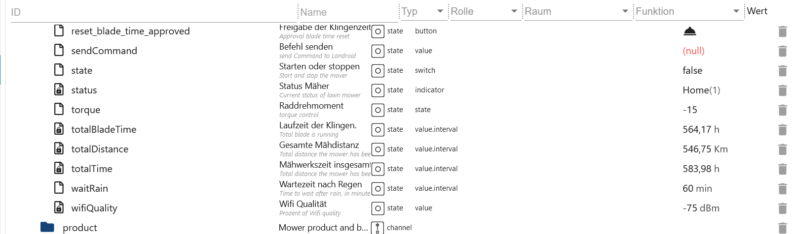

### Дополнительно для зрения
[Краткое содержание](#summary)

- Многозонные
- `multiZones.zones.zone_1.borderDistance`: При обрезке бордюра расстояние до края в мм - допустимые значения: 50 мм, 100 мм, 150 мм и 200 мм - устанавливается с помощью Blockly без задержки - изменение записывается в `multiZones.multiZones` (vision/changeable) 🔴
- `multiZones.zones.zone_1.chargingStation`: 1, если зарядная станция найдена в этой зоне. 0, если зарядной станции нет. - Устанавливается с помощью Blockly без задержки. - Изменение записывается в `multiZones.multiZones` (vision/changeable) 🔴
- `multiZones.zones.zone_1.cutOverBorder`: 1 — проезд по плитам при их обнаружении, в противном случае — 0. Устанавливается с помощью Blockly без задержки. Изменение записывается в `multiZones.multiZones` (Vision /changeable) 🔴
- `multiZones.zones.zone_1.zone_id`: Нумерация - Начинается с 1 - (только для просмотра/чтения) 🔴
- `multiZones.passages.passage_01.tagIdFrom`: RFID-идентификатор зоны zoneIdFrom - Устанавливается с помощью Blockly без задержки - Изменение записывается в `multiZones.multiZones` (видимый/изменяемый) 🔴
- `multiZones.passages.passage_01.tagIdTo`: RFID-идентификатор зоны zoneIdTo - Устанавливается с помощью Blockly без задержки - Изменение записывается в `multiZones.multiZones` (vision/changeable) 🔴
- `multiZones.passages.passage_01.zoneIdFrom`: Зона из (должен zoneIdFrom < zoneIdTo) - Устанавливается с помощью Blockly без задержки - Изменение записывается в `multiZones.multiZones` (vision/changeable) 🔴
- `multiZones.passages.passage_01.zoneIdTo`: Зона закрыта (должен zoneIdTo > zoneIdFrom) - Устанавливается с помощью Blockly без задержки - Изменение записывается в `multiZones.multiZones` (vision/changeable) 🔴
- `multiZones.multiZones`: JSON для мультизон (Vision/changeable) [Пример](#example-blockly-sendMultiZonesJson-vision) 🔴
- `multiZones.sendMultiZonesJson`: Отправляет изменения в Worx с задержкой в 1,1 секунды (vision/changeable) 🟢

Пример:

```json
{
    "mz": {
        "p": [
            // Passages between zones
            {
                "z1": 1, // Zone from (must z1 < z2)
                "z2": 2, // Zone to (must z2 > z1)
                "t1": "E000000000000000", // RFID id from z1
                "t2": "E0000000KKKKKKKK" // RFID id from z2
            }
        ],
        "s": [
            // The zones themselves
            {
                "id": 1, // Numbering - Start with 1
                "c": 1, // 1 if the charging station is in this zone. 0 for no charging station.
                "cfg": {
                    "cut": {
                        "bd": 100, // Edge cut the distance to the edge in mm - allowed 50mm, 100mm, 150mm and 200mm
                        "ob": 0 // 1 for driving over slabs if they are detected, otherwise 0. Different per-zone is not allowed
                    }
                }
            },
            {
                "id": 2, // Numbering
                "c": 0, // 1 if the charging station is in this zone. 0 for no charging station.
                "cfg": {
                    "cut": {
                        "bd": 100, // Edge cut the distance to the edge in mm - allowed 50mm, 100mm, 150mm and 200mm
                        "ob": 0 // 1 for driving over slabs if they are detected, otherwise 0. Different per-zone is not allowed
                    }
                }
            }
        ]
    }
}
```

По умолчанию без зоны:

```json
{
    "mz": {
        "p": [],
        "s": [
            {
                "id": 1,
                "c": 1,
                "cfg": {
                    "cut": {
                        "bd": 150,
                        "ob": 0
                    }
                }
            }
        ]
    }
}
```

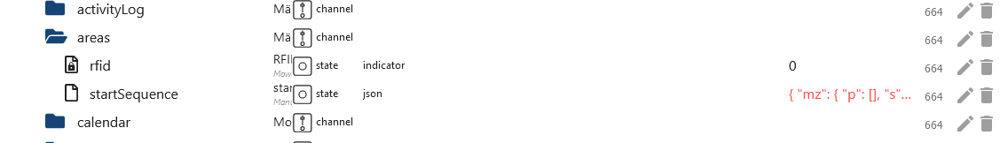

- Газонокосилка
- `log_improvement`: Отправлять журнал улучшений в worx (отключить/включить, можно изменить) 🟢
- `log_troubleshooting`: Отправлять журнал устранения неполадок в worx (отключить/включить, можно изменить) 🟢

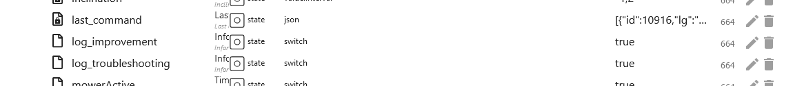

- Газонокосилка
- `paused`: Расписание приостановлено в минутах (можно изменить) 🟢

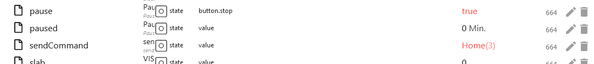

### Info_mqtt (Wire and Vision)
[Краткое содержание](#summary)

- `incompleteOperationCount`: Общее количество операций, отправленных в соединение, которые еще не завершены. Неподтвержденные операции являются подмножеством этого числа.
- `incompleteOperationSize`: Общий размер пакетов операций, отправленных в соединение, которые еще не были завершены. Неподтвержденные операции являются подмножеством этого размера.
- `unackedOperationCount`: Общее количество операций, отправленных на сервер и ожидающих соответствующего подтверждения (ACK) перед их завершением.
- `unackedOperationSize`: Общий размер пакетов операций, отправленных на сервер и ожидающих соответствующего подтверждения (ACK) перед их завершением.
- `last_update`: Последнее обновление токена
- `next_update`: Следующее обновление из токена
- `online`: Статус подключения MQTT (false=offline/true=online)

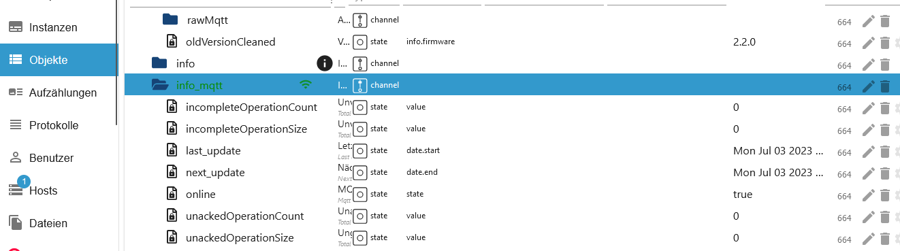

### Ограничение скорости
[Краткое содержание](#summary)

- Value worx.0.blocking

Блокировка будет автоматически снята через 24 часа. При следующем обновлении токена все настройки будут сброшены.

```json
{
    "block": false, // true = 429 too many request is activ
    "start": 0, // Start of the blocking as a timestamp
    "time": "", // With time zone
    "retry-after": 0 // How long you are blocked
}
```

- Значение worx.0.requestsrateLimit

Счетчики можно изменять вручную, чтобы снять преждевременные блокировки.

```json
{
    "apiCounter": 6, // API request per day
    "apiLast": 1751483518418, // Last API request as timestamp
    "apiTime": "2025-07-02T19:11:58.418Z", // Last API request with time zone
    "apiRequest": [
        // All API requests
        {
            "count": 1,
            "request": "https://api.worxlandroid.com/api/v2/product-items?status=1&gps_status=1",
            "time": "2025-07-02T19:11:58.418Z"
        },
        {
            "count": 2,
            "request": "https://api.worxlandroid.com/api/v2/product-items/xxx/firmware-upgrade",
            "time": "2025-07-02T19:11:58.895Z"
        },
        {
            "count": 3,
            "request": "https://api.worxlandroid.com/api/v2/product-items/xxx/activity-log",
            "time": "2025-07-02T19:11:59.130Z"
        },
        {
            "count": 4,
            "request": "https://api.worxlandroid.com/api/v2/products",
            "time": "2025-07-02T19:11:59.364Z"
        },
        {
            "count": 5,
            "request": "https://api.worxlandroid.com/api/v2/users/me",
            "time": "2025-07-02T19:12:00.318Z"
        },
        {
            "count": 6,
            "request": "https://id.worx.com/oauth/token?",
            "time": "2025-07-03T18:12:46.628Z"
        }
    ],
    "mqttDevice": {
        // MQTT Counter per device
        "xxxF3": {
            "mqttCount": 6, // Counter MQTT commands
            "mqttLast": 1751651797646, // Last command with time zone
            "mqttTime": "2025-07-04T17:56:37.646Z", // Letzter Kommando mit Zeitzone
            "mqttBlock": true, // true = Kommandos deaktiviert / false = Kommandos aktiv
            "mqttRequest": [
                // Last commands
                {
                    "count": 1,
                    "message": "{\"id\":23210,\"cmd\":0,\"lg\":\"de\",\"sn\":\"xxx\",\"tm\":\"21:12:00\",\"dt\":\"02/07/2025\"}",
                    "time": "2025-07-02T19:12:00.811Z"
                },
                {
                    "count": 2,
                    "message": "{\"id\":58731,\"cmd\":0,\"lg\":\"de\",\"sn\":\"xxx\",\"tm\":\"20:12:49\",\"dt\":\"03/07/2025\"}",
                    "time": "2025-07-03T18:12:49.586Z"
                },
                {
                    "count": 3,
                    "message": "{\"id\":3925,\"cmd\":0,\"lg\":\"de\",\"sn\":\"xxx\",\"tm\":\"20:20:41\",\"dt\":\"03/07/2025\"}",
                    "time": "2025-07-03T18:20:41.579Z"
                },
                {
                    "count": 4,
                    "message": "{\"id\":3265,\"cmd\":0,\"lg\":\"de\",\"sn\":\"xxx\",\"tm\":\"21:10:19\",\"dt\":\"03/07/2025\"}",
                    "time": "2025-07-03T19:10:19.292Z"
                },
                {
                    "count": 5,
                    "message": "{\"id\":28606,\"cmd\":0,\"lg\":\"de\",\"sn\":\"xxx\",\"tm\":\"21:11:20\",\"dt\":\"03/07/2025\"}",
                    "time": "2025-07-03T19:11:20.634Z"
                },
                {
                    "count": 6,
                    "message": "{\"id\":12891,\"cmd\":0,\"lg\":\"de\",\"sn\":\"xxx\",\"tm\":\"19:56:37\",\"dt\":\"04/07/2025\"}",
                    "time": "2025-07-04T17:56:37.646Z"
                }
            ]
        },
        "xxxE2": {
            "mqttCount": 0,
            "mqttLast": 0,
            "mqttBlock": false,
            "mqttRequest": []
        },
        "xxxC5": {
            "mqttCount": 0,
            "mqttLast": 0,
            "mqttBlock": false,
            "mqttRequest": []
        },
        "xxx2F": {
            "mqttCount": 0,
            "mqttLast": 0,
            "mqttBlock": false,
            "mqttRequest": []
        }
    },
    "mqttDay": "27-4", // calendar week-day. When changing everything is reset
    "restartCount": 6, // Counter restart adapter
    "restartLast": 1751569817003, // Last restart
    "restartTime": "2025-07-03T19:10:17.003Z", // Last restart with time zone
    "day": "27-4" // calendar week-day. When changing everything is reset
}
```


### Пример Blockly sendMultiZonesJson Vision
[Краткое содержание](#summary)

```
<xml xmlns="https://developers.google.com/blockly/xml">
  <variables>
    <variable id="${]4s$w?n24Az}=7iAIY">mz</variable>
    <variable id="o.FQ]_Xa!tHn2T7Ak{Pt">value</variable>
    <variable id="/@E4iFRMr:x+u?{7yFlB">test</variable>
    <variable id="jxTInS{}mk_)WJa[:,fA">i</variable>
  </variables>
  <block type="procedures_defcustomnoreturn" id="u:w*aBH!92nydG0Mu.1-" x="-87" y="-87">
    <mutation statements="false">
      <arg name="mz" varid="${]4s$w?n24Az}=7iAIY"></arg>
      <arg name="value" varid="o.FQ]_Xa!tHn2T7Ak{Pt"></arg>
    </mutation>
    <field name="NAME">set_bd</field>
    <field name="SCRIPT">bXouY2ZnLmN1dC5iZCA9IDE1MA==</field>
    <comment pinned="false" h="80" w="160">Beschreibe diese Funktion …</comment>
  </block>
  <block type="variables_set" id="jiP0218}2,Y]B]RdKD~`" x="-87" y="-35">
    <field name="VAR" id="/@E4iFRMr:x+u?{7yFlB">test</field>
    <value name="VALUE">
      <block type="convert_json2object" id=";Ef{FHk_~heeozyHFxci">
        <value name="VALUE">
          <block type="get_value" id="LMfldD:[D4%}yWE8,N0y">
            <field name="ATTR">val</field>
            <field name="OID">worx.0.xxxxxxxxxxxxxxxxxxxx.multiZones.sendMultiZonesJson</field>
          </block>
        </value>
      </block>
    </value>
    <next>
      <block type="controls_forEach" id="D{XG==q$flbH?32eX%D(">
        <field name="VAR" id="jxTInS{}mk_)WJa[:,fA">i</field>
        <value name="LIST">
          <block type="get_attr" id="b~2/cb$WhEj*9i6,(ey5">
            <value name="PATH">
              <shadow type="text" id="+n~;GfHf{,#D!5D}H+m=">
                <field name="TEXT">s</field>
              </shadow>
            </value>
            <value name="OBJECT">
              <block type="variables_get" id="YloS$N%I=6[yk;loD*1O">
                <field name="VAR" id="/@E4iFRMr:x+u?{7yFlB">test</field>
              </block>
            </value>
          </block>
        </value>
        <statement name="DO">
          <block type="procedures_callcustomnoreturn" id="er{Pwq:Y7n_I|CQoup,|">
            <mutation name="set_bd">
              <arg name="mz"></arg>
              <arg name="value"></arg>
            </mutation>
            <value name="ARG0">
              <block type="variables_get" id="(-_i0(y:W}U_x?s(7k%4">
                <field name="VAR" id="jxTInS{}mk_)WJa[:,fA">i</field>
              </block>
            </value>
            <value name="ARG1">
              <block type="math_number" id="{2u/=v!k|yJsOesq[CU^">
                <field name="NUM">150</field>
              </block>
            </value>
            <next>
              <block type="debug" id="b1}}DmS-[_W:+Y+$|%)r">
                <field name="Severity">log</field>
                <value name="TEXT">
                  <shadow type="text" id="7wx?ca_U[S~8DA4}*RXx">
                    <field name="TEXT">test</field>
                  </shadow>
                  <block type="variables_get" id="_zz;w64g-!E$zX$]pvyI">
                    <field name="VAR" id="/@E4iFRMr:x+u?{7yFlB">test</field>
                  </block>
                </value>
              </block>
            </next>
          </block>
        </statement>
        <next>
          <block type="debug" id="o[S0+1%{oLU+r:03tz7=">
            <field name="Severity">log</field>
            <value name="TEXT">
              <shadow type="text" id="7wx?ca_U[S~8DA4}*RXx">
                <field name="TEXT">test</field>
              </shadow>
              <block type="variables_get" id="tjqxQ(MO|CR~/Xq5;Pm[">
                <field name="VAR" id="/@E4iFRMr:x+u?{7yFlB">test</field>
              </block>
            </value>
            <next>
              <block type="control" id="C^lZ^SNIQ#,vh}?hSG_O">
                <mutation xmlns="http://www.w3.org/1999/xhtml" delay_input="false"></mutation>
                <field name="OID">worx.0.xxxxxxxxxxxxxxxxxxxx.multiZones.sendMultiZonesJson</field>
                <field name="WITH_DELAY">FALSE</field>
                <value name="VALUE">
                  <block type="convert_object2json" id="z)EXA+%8lB4K#7!Hp1V%">
                    <field name="PRETTIFY">FALSE</field>
                    <value name="VALUE">
                      <block type="variables_get" id="C4np)gS@^Y*?-0I+R6+r">
                        <field name="VAR" id="/@E4iFRMr:x+u?{7yFlB">test</field>
                      </block>
                    </value>
                  </block>
                </value>
              </block>
            </next>
          </block>
        </next>
      </block>
    </next>
  </block>
</xml>

<xml xmlns="https://developers.google.com/blockly/xml">
  <variables>
    <variable id="${]4s$w?n24Az}=7iAIY">mz</variable>
    <variable id="o.FQ]_Xa!tHn2T7Ak{Pt">value</variable>
    <variable id="/@E4iFRMr:x+u?{7yFlB">test</variable>
    <variable id="jxTInS{}mk_)WJa[:,fA">i</variable>
  </variables>
  <block type="procedures_defcustomnoreturn" id="u:w*aBH!92nydG0Mu.1-" x="-87" y="-87">
    <mutation statements="false">
      <arg name="mz" varid="${]4s$w?n24Az}=7iAIY"></arg>
      <arg name="value" varid="o.FQ]_Xa!tHn2T7Ak{Pt"></arg>
    </mutation>
    <field name="NAME">set_bd</field>
    <field name="SCRIPT">bXouY2ZnLmN1dC5iZCA9IDE1MA==</field>
    <comment pinned="false" h="80" w="160">Beschreibe diese Funktion …</comment>
  </block>
  <block type="variables_set" id="jiP0218}2,Y]B]RdKD~`" x="-87" y="-35">
    <field name="VAR" id="/@E4iFRMr:x+u?{7yFlB">test</field>
    <value name="VALUE">
      <block type="convert_json2object" id=";Ef{FHk_~heeozyHFxci">
        <value name="VALUE">
          <block type="get_value" id="LMfldD:[D4%}yWE8,N0y">
            <field name="ATTR">val</field>
            <field name="OID">worx.0.xxxxxxxxxxxxxxxxxxxx.multiZones.sendMultiZonesJson</field>
          </block>
        </value>
      </block>
    </value>
    <next>
      <block type="controls_forEach" id="D{XG==q$flbH?32eX%D(">
        <field name="VAR" id="jxTInS{}mk_)WJa[:,fA">i</field>
        <value name="LIST">
          <block type="get_attr" id="b~2/cb$WhEj*9i6,(ey5">
            <value name="PATH">
              <shadow type="text" id="+n~;GfHf{,#D!5D}H+m=">
                <field name="TEXT">s</field>
              </shadow>
            </value>
            <value name="OBJECT">
              <block type="variables_get" id="YloS$N%I=6[yk;loD*1O">
                <field name="VAR" id="/@E4iFRMr:x+u?{7yFlB">test</field>
              </block>
            </value>
          </block>
        </value>
        <statement name="DO">
          <block type="procedures_callcustomnoreturn" id="er{Pwq:Y7n_I|CQoup,|">
            <mutation name="set_bd">
              <arg name="mz"></arg>
              <arg name="value"></arg>
            </mutation>
            <value name="ARG0">
              <block type="variables_get" id="(-_i0(y:W}U_x?s(7k%4">
                <field name="VAR" id="jxTInS{}mk_)WJa[:,fA">i</field>
              </block>
            </value>
            <value name="ARG1">
              <block type="math_number" id="{2u/=v!k|yJsOesq[CU^">
                <field name="NUM">150</field>
              </block>
            </value>
            <next>
              <block type="debug" id="b1}}DmS-[_W:+Y+$|%)r">
                <field name="Severity">log</field>
                <value name="TEXT">
                  <shadow type="text" id="7wx?ca_U[S~8DA4}*RXx">
                    <field name="TEXT">test</field>
                  </shadow>
                  <block type="variables_get" id="_zz;w64g-!E$zX$]pvyI">
                    <field name="VAR" id="/@E4iFRMr:x+u?{7yFlB">test</field>
                  </block>
                </value>
              </block>
            </next>
          </block>
        </statement>
        <next>
          <block type="debug" id="o[S0+1%{oLU+r:03tz7=">
            <field name="Severity">log</field>
            <value name="TEXT">
              <shadow type="text" id="7wx?ca_U[S~8DA4}*RXx">
                <field name="TEXT">test</field>
              </shadow>
              <block type="variables_get" id="tjqxQ(MO|CR~/Xq5;Pm[">
                <field name="VAR" id="/@E4iFRMr:x+u?{7yFlB">test</field>
              </block>
            </value>
            <next>
              <block type="control" id="C^lZ^SNIQ#,vh}?hSG_O">
                <mutation xmlns="http://www.w3.org/1999/xhtml" delay_input="false"></mutation>
                <field name="OID">worx.0.xxxxxxxxxxxxxxxxxxxx.multiZones.sendMultiZonesJson</field>
                <field name="WITH_DELAY">FALSE</field>
                <value name="VALUE">
                  <block type="convert_object2json" id="z)EXA+%8lB4K#7!Hp1V%">
                    <field name="PRETTIFY">FALSE</field>
                    <value name="VALUE">
                      <block type="variables_get" id="C4np)gS@^Y*?-0I+R6+r">
                        <field name="VAR" id="/@E4iFRMr:x+u?{7yFlB">test</field>
                      </block>
                    </value>
                  </block>
                </value>
              </block>
            </next>
          </block>
        </next>
      </block>
    </next>
  </block>
</xml>
```

### Или
```
<xml xmlns="https://developers.google.com/blockly/xml">
  <variables>
    <variable id="2#Mf$#JFCN9Nw2F2L[?=">x</variable>
    <variable id="fNt-C|86(glunJ:-t=dK">p</variable>
    <variable id="Rci4:iMYXzjoI2k]P^X)">s</variable>
    <variable id="[t-srB,I/UkXaWBk4*A*">list</variable>
    <variable id="]WA|%5f=H9^9uiLc;KS[">new_json</variable>
  </variables>
  <block type="procedures_defcustomreturn" id="@Y/LobsPw4k!jQb)fI!." x="88" y="13">
    <mutation statements="false">
      <arg name="x" varid="2#Mf$#JFCN9Nw2F2L[?="></arg>
      <arg name="p" varid="fNt-C|86(glunJ:-t=dK"></arg>
      <arg name="s" varid="Rci4:iMYXzjoI2k]P^X)"></arg>
    </mutation>
    <field name="NAME">json</field>
    <field name="SCRIPT">eFsicCJdID0gcDsNCnhbInMiXSA9IHM7DQpyZXR1cm4geA==</field>
    <comment pinned="false" h="80" w="160">Describe this function...</comment>
  </block>
  <block type="variables_set" id="WAsPqIMv;bh95{7~Y!D!" x="88" y="63">
    <field name="VAR" id="[t-srB,I/UkXaWBk4*A*">list</field>
    <value name="VALUE">
      <block type="convert_json2object" id="S5uRAnpcGp/7*1b,aum~">
        <value name="VALUE">
          <block type="text" id="}n3]_HIP*7y5GMEo-!c3">
            <field name="TEXT">{p:[],s:[]}</field>
          </block>
        </value>
      </block>
    </value>
    <next>
      <block type="variables_set" id="Kf#KkskB7l|uDiI!(fjq">
        <field name="VAR" id="]WA|%5f=H9^9uiLc;KS[">new_json</field>
        <value name="VALUE">
          <block type="procedures_callcustomreturn" id="K;OJHrji~09PeJ33q.gl">
            <mutation name="json">
              <arg name="x"></arg>
              <arg name="p"></arg>
              <arg name="s"></arg>
            </mutation>
            <value name="ARG0">
              <block type="variables_get" id="ipM^e+~#-hoo0(047Ybo">
                <field name="VAR" id="[t-srB,I/UkXaWBk4*A*">list</field>
              </block>
            </value>
            <value name="ARG1">
              <block type="lists_create_with" id="HJIZHLc]lL0Tgqe$E~Ul">
                <mutation items="0"></mutation>
              </block>
            </value>
            <value name="ARG2">
              <block type="lists_create_with" id="JH=jADj%lYJ(:7%v[o+3">
                <mutation items="1"></mutation>
                <value name="ADD0">
                  <block type="convert_json2object" id="@5BT0}WJ`srV89LD5h?D">
                    <value name="VALUE">
                      <block type="text" id="=.e.D[I2IQ{u!4;(-D-,">
                        <field name="TEXT">{"id":1,"c":1,"cfg":{"cut":{"bd":150,"ob":1}}}</field>
                      </block>
                    </value>
                  </block>
                </value>
              </block>
            </value>
          </block>
        </value>
        <next>
          <block type="control" id="k$;?LM/[x-TbZ^m=F4}i">
            <mutation xmlns="http://www.w3.org/1999/xhtml" delay_input="false"></mutation>
            <field name="OID">worx.0.xxxxxxxxxx.multiZones.sendMultiZonesJson</field>
            <field name="WITH_DELAY">FALSE</field>
            <value name="VALUE">
              <block type="convert_object2json" id="b~2Bz}OiNg{V]!QgN^J7">
                <field name="PRETTIFY">FALSE</field>
                <value name="VALUE">
                  <block type="variables_get" id="b|+SOSd+ZD@*XHPGu*I(">
                    <field name="VAR" id="]WA|%5f=H9^9uiLc;KS[">new_json</field>
                  </block>
                </value>
              </block>
            </value>
          </block>
        </next>
      </block>
    </next>
  </block>
</xml>
```

или напрямую
```
{"p": [],"s": [{"id": 1, "c": 1, "cfg": {"cut": {"bd": 100, "ob": 1}}}]}
```

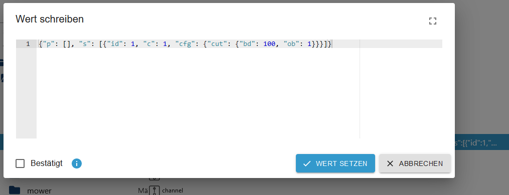

### Запрещено
 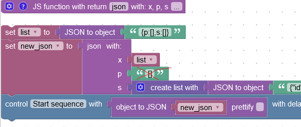

## Changelog

### **WORK IN PROGRESS**

- (copilot) Adapter requires node.js >= 22 now
- (Lucky-ESA) MQTT connection status display fixed
- (Lucky-ESA) NearLink module added to Vision Cloud
- (Lucky-ESA) Objects from Protocol 1 changed to read-only

### 3.3.0 (2026-04-12)

- (copilot) Adapter requires admin >= 7.7.22 now
- (Lucky-ESA) Dependencies updated
- (Lucky-ESA) Error HTTP 405 fixed
- (Lucky-ESA) Preparation Vision Cloud Mower
- (Lucky-ESA) Sentry Error from "Vision Cloud" fixed

### 3.2.7 (2025-08-16)

- (Lucky-ESA) MQTT connection selection added
- (Lucky-ESA) Rate limit selection added in instance settings
- (Lucky-ESA) Admin 7.6.17 required

### 3.2.6 (2025-06-29)

- (Lucky-ESA) Added rate limit for API request

### 3.2.5 (2025-06-25)

- (Lucky-ESA) MQTT connection changed

### 3.2.4 (2025-06-14)

- (Lucky-ESA) TypeError native_excluded fixed

[Older changelogs can be found there](CHANGELOG_OLD.md)

## License

MIT License

Copyright (c) 2026 iobroker-community-adapters <iobroker-community-adapters@gmx.de>  
Copyright (c) 2023-2025 TA2k <tombox2020@gmail.com>

Permission is hereby granted, free of charge, to any person obtaining a copy
of this software and associated documentation files (the "Software"), to deal
in the Software without restriction, including without limitation the rights
to use, copy, modify, merge, publish, distribute, sublicense, and/or sell
copies of the Software, and to permit persons to whom the Software is
furnished to do so, subject to the following conditions:

The above copyright notice and this permission notice shall be included in all
copies or substantial portions of the Software.

THE SOFTWARE IS PROVIDED "AS IS", WITHOUT WARRANTY OF ANY KIND, EXPRESS OR
IMPLIED, INCLUDING BUT NOT LIMITED TO THE WARRANTIES OF MERCHANTABILITY,
FITNESS FOR A PARTICULAR PURPOSE AND NONINFRINGEMENT. IN NO EVENT SHALL THE
AUTHORS OR COPYRIGHT HOLDERS BE LIABLE FOR ANY CLAIM, DAMAGES OR OTHER
LIABILITY, WHETHER IN AN ACTION OF CONTRACT, TORT OR OTHERWISE, ARISING FROM,
OUT OF OR IN CONNECTION WITH THE SOFTWARE OR THE USE OR OTHER DEALINGS IN THE
SOFTWARE.