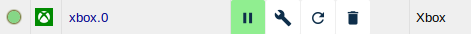
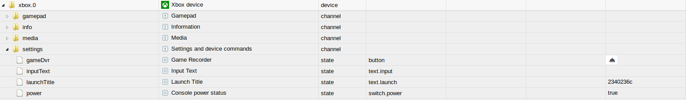

# Адаптеры Xbox
Адаптер Xbox позволяет интегрировать игровую консоль Xbox One или Xbox One X в систему ioBroker.

## Обзор
### Игровая приставка Xbox One
Xbox One — это игровая консоль, разработанная Microsoft, на которой можно играть в популярные в настоящее время видеоигры. Кроме того, Xbox One может управлять различными компонентами системы домашнего кинотеатра и позволяет использовать приложения Microsoft.<br/> Дальнейшими версиями Xbox One в настоящее время являются Xbox One X и Xbox One S, которые предлагают те же функции, что и исходная консоль, но с улучшенной производительностью.

### Адаптеры Xbox
Адаптер Xbox можно настроить для одной консоли Xbox One, что позволяет управлять и считывать информацию.<br/> Адаптер автоматически создает все команды и состояния в виде объектов. Большая часть статусов также может быть прочитана, например. B. текущий заголовок, состояние включения и т. д. Путем специальной записи или чтения созданных объектов их состояние можно изменить, а действия можно инициировать или запросить.

## Требования перед установкой
1. Перед добавлением адаптера в хост-системе должен быть установлен как минимум Python 3.5.

быть установлен.

2. Если Xbox нужно включить через адаптер,

['Режим быстрой загрузки](https://support.xbox.com/de-DE/xbox-one/console/learn-about-power-modes) необходимо настроить в консоли.

## Благодарности
Большое спасибо [Команда Открыть Xbox](https://openxbox.org/) за разработку и предоставление [xbox-остальный-сервер](https://github.com/OpenXbox/xbox-smartglass-rest-python) и связанных библиотек.

## Монтаж
Экземпляр адаптера устанавливается из административного интерфейса ioBroker. Подробные инструкции по необходимым шагам установки можно найти здесь (TODO:ССЫЛКА).<br/><br/> После завершения установки экземпляра адаптера автоматически открывается окно конфигурации.

## Конфигурация
<br/> <span style="color:grey">*Интерфейс администратора*</span>

| поле | Описание |
|:-------------|:-------------|
|Xbox Live ID |Здесь следует ввести Live ID Xbox, который можно найти в настройках консоли.|
|IP |Здесь следует ввести IP-адрес консоли.|
|Аутентификация в Xbox Live|Если флажок установлен, адрес электронной почты и пароль будут использоваться для входа в Xbox Live.|
|Адрес электронной почты|Здесь следует ввести адрес электронной почты учетной записи Xbox Live.|
|Пароль |Здесь следует ввести соответствующий пароль для учетной записи Xbox Live.|

После завершения настройки выйдите из диалогового окна настройки с помощью `SPEICHERN UND SCHLIEßEN`.
Затем это приводит к перезапуску адаптера.

## Экземпляров
В результате установки адаптера в разделе `Instanzen` был создан активный экземпляр адаптера Xbox.<br/><br/> <br/> <span style="color:grey">*Первый случай*</span>

На сервере ioBroker можно создать несколько экземпляров адаптера Xbox. Также можно подключиться к нескольким серверам ioBroker одновременно. Если несколько устройств должны управляться сервером ioBroker, для каждого Xbox необходимо создать один экземпляр.<br/><br/> Активирован ли адаптер или подключен к Xbox, отображается цветом поля состояния экземпляра. Если указатель мыши указывает на символ, отображается дополнительная подробная информация.

## Объекты адаптера
В разделе `Objekte` вся информация и действия, поддерживаемые Xbox, перечислены в виде древовидной структуры. Кроме того, также сообщается, гладко ли работает связь с Xbox.

</br> <span style="color:grey">*Элементы адаптера Xbox*</span>

Объекты подразделяются в соответствии с каналом ниже.
Каждая точка данных указана со связанным с ней типом данных и разрешениями. Поскольку это кнопка, описание типа и прав опущено.
Разрешения могут быть на чтение (R) или на запись (W). Каждая точка данных может быть как минимум прочитана (R), в то время как другие также могут быть записаны. Для поиска конкретной точки данных мы рекомендуем использовать комбинацию клавиш «STRG + F».

### Каналы: Информация
* информация.связь

    |Тип данных|Разрешение|
    |:---:|:---:|
    |логический|R|

   *Индикатор только для чтения, который активен, когда ioBroker подключен к Xbox.*

* info.currentTitles

    |Тип данных|Разрешение|
    |:---:|:---:|
    |строка|Р|

* Строка JSON только для чтения, состоящая из пар ключ-значение. Ключ — это имя беговой дорожки, а Значение — это идентификатор дорожки, преобразованный в шестнадцатеричный формат. Этот идентификатор можно использовать для запуска нужного заголовка с помощью состояния settings.launchTitle.*

* info.activeTitleName

    |Тип данных|Разрешение|
    |:---:|:---:|
    |строка|Р|

    *Содержит название активного заголовка (заголовок впереди) в виде строки.*

* информация.activeTitleId

    |Тип данных|Разрешение|
    |:---:|:---:|
    |строка|Р|

    *Содержит идентификатор дорожки переднего плана, преобразованный в шестнадцатеричный формат в виде строки.*

* info.activeTitleImage

    |Тип данных|Разрешение|
    |:---:|:---:|
    |строка|Р|

    *Содержит ссылку на обложку заголовка на переднем плане в виде строки.*

* info.activeTitleType

    |Тип данных|Разрешение|
    |:---:|:---:|
    |строка|Р|

    *Содержит тип заголовка, который находится на переднем плане в виде строки, доступной только для чтения, например. 'Игра'.*

* информация.тег игрока

    |Тип данных|Разрешение|
    |:---:|:---:|
    |строка|Р|

    * Строковое значение, содержащее тег игрока аутентифицированной в данный момент учетной записи.*

* информация.gamerscore

  |Тип данных|Разрешение|
  |:---:|:---:|
  |число|R|

  *Числовое значение, содержащее игровой счет текущей аутентифицированной учетной записи.*

* info.installedApplications

  |Тип данных|Разрешение|
  |:---:|:---:|
  |строка|Р|

  *Строка, содержащая через запятую список установленных приложений. DLC исключены.*

* информация.аутентифицирована

    |Тип данных|Разрешение|
    |:---:|:---:|
    |логический|R|

    * Логическое значение, которое принимает значение true, если аутентификация в Xbox Live прошла успешно, в противном случае — значение false.*

### Каналы: Настройки
* настройки.мощность

    |Тип данных|Разрешение|
    |:---:|:---:|
    |логический|чтение/запись|

* Логическое значение, которое можно использовать для включения и выключения Xbox. Это значение также служит индикатором того, включена Xbox или нет.*

* settings.launchTitle/launchStoreTitle

    |Тип данных|Разрешение|
    |:---:|:---:|
    |строка|чтение/запись|

*Установив в качестве строкового значения шестнадцатеричный идентификатор заголовка, можно запустить заголовок на Xbox.
ID названия активной игры можно узнать по состоянию info.currentTitles.
Состояние будет подтверждено, как только оно будет отправлено на Xbox, что не означает, что команда была выполнена.*

   *Пример:*

```javascript
setState('settings.launchTitle', '2340236c', false); // Starte Red Dead Redemption 2
```

   *`launchStoreTitle` позволяет задавать осмысленные имена*

* настройки.inputText

    |Тип данных|Разрешение|
    |:---:|:---:|
    |строка|чтение/запись|

*Описывая состояние строки, текст может быть вставлен в активное поле ввода, например. B. отправить личное сообщение или ввести код.
Состояние будет подтверждено, как только оно будет отправлено на Xbox, что не означает, что команда была выполнена.*

   *Пример:*

```javascript
setState('settings.inputText', 'H1 M8 h0w d0 u do?', false); // Versendet einen nerdigen Text
```

* настройки.gameDvr

    |Тип данных|Разрешение|
    |:---:|:---:|
    |строка|W|

* Строка, доступная для записи, которая записывает определенное время игры. Состояние доступно, если в настройках была выполнена аутентификация.
Кроме того, аутентифицированная учетная запись должна быть зарегистрирована в Xbox, а игра должна быть на переднем плане.

    *Пример:*

```javascript
setState('settings.gameDvr', '-60,30', false); // zeichne die letzten 60 Sekunden bis zu den nächsten 30 Sekunden auf (90 Sekunden gesamt)
```

### Канал: Геймпад
* геймпад.а

   *Имитирует кнопку A контроллера.*

* геймпад.b

   *Имитирует кнопку B контроллера.*

* геймпад.x

   *Имитирует кнопку X контроллера.*

* геймпад.у

   *Имитирует кнопку Y контроллера.*

* геймпад.очистить

   *Имитирует кнопку «Очистить» контроллера.*

* геймпад.dPadDown

   *Имитирует кнопку DPAD вниз на контроллере.*

* геймпад.dPadUp

   *Имитирует кнопку DPAD вверх контроллера.*

* геймпад.dPadRight

   *Имитирует правую кнопку DPAD на контроллере.*

* геймпад.dPadLeft

   *Имитирует левую кнопку DPAD на контроллере.*

* геймпад.регистрация

   *Имитирует кнопку «Зарегистрироваться» на контроллере.*

* геймпад.leftShoulder

   *Имитирует нажатие левой плечевой кнопки контроллера.*

* геймпад.правое плечо

   *Имитирует нажатие правой плечевой кнопки контроллера.*

* геймпад.leftThumbstick

   *Имитирует нажатие левого стика на контроллере.*

* геймпад.rightThumbstick

   *Имитирует нажатие правого джойстика на контроллере.*

* геймпад.меню

   *Имитирует кнопку меню контроллера.*

* геймпад.nexus

   *Имитирует кнопку Nexus (Xbox) на контроллере.*

* геймпад.вид

   *Имитирует кнопку «Просмотр» на контроллере.*

### Канал: СМИ
* медиа.искать

    |Тип данных|Разрешение|
    |:---:|:---:|
    |число|Ч/З|

*Числовое значение для перехода к определенной точке медиаконтента. Состояние подтверждается, как только оно поступает на сервер, что не означает, что оно действительно выполнено.*

* медиа.плей

   *Кнопка для воспроизведения медиаконтента.*

* медиа.пауза

   *Кнопка для приостановки медиаконтента.*

* media.playPause

   *Комбинированная кнопка воспроизведения/паузы для медиаконтента.*

* медиа.назад

   *Кнопка «Назад» для медиаконтента.*

* media.channelDown

   *Кнопка, которая переключает канал медиаконтента вниз.*

* media.channelUp

   *Кнопка, которая переключает канал медиаконтента вверх.*

* медиа.fastForward

   *Кнопка для быстрой перемотки медиаконтента.*

* медиа.меню

   *Кнопка меню для медиа-контента.*

* media.nextTrack

   *Кнопка для перехода к следующей дорожке при воспроизведении медиаконтента.*

* media.previousTrack

   *Кнопка для перехода к предыдущей дорожке при воспроизведении медиаконтента.*

* медиа.запись

   *Кнопка записи для медиаконтента.*

* медиа.перемотка

   *Кнопка для перемотки медиаконтента.*

* медиа.стоп

   *Кнопка остановки для медиаконтента.*

* медиа.представление

   *Кнопка просмотра медиаконтента.*

### Папка: Друзья
Для каждого друга создается канал, в котором есть несколько состояний только для чтения.

## Changelog
<!--
	Placeholder for the next version (at the beginning of the line):
	### __WORK IN PROGRESS__
-->
### 1.0.0 (2022-09-09)
* (foxriver76) updated dependencies
* (foxriver76) see previous beta versions

### 1.0.0-beta.10 (2022-08-20)
* (foxriver76) we now determine correct store locale for germany if system language is "de"

### 1.0.0-beta.9 (2022-08-07)
* (foxriver76) we fixed `activeTitleName` of applications which have no short title

### 1.0.0-beta.8 (2022-08-03)
* (foxriver76) removed unused messagebox

### 1.0.0-beta.7 (2022-08-02)
* (foxriver76) we have revived acknowledgment flag for power on state

### 1.0.0-beta.6 (2022-08-02)
* (foxriver76) we are now synchronizing friends

### 1.0.0-beta.5 (2022-08-01)
* (foxriver76) fixed `activeTitleImage` which is now the cover and always an url
* (foxriver76) optimized `launchStoreTitle` by preventing API calls for DLCs
* (foxriver76) added gamerscore as state (synched every 10 minutes)
* (foxriver76) added list of installed applications to a new state

### 1.0.0-beta.4 (2022-07-30)
* (foxriver76) we have optimized `launchStoreTitle` to check for installed apps first
* (foxriver76) we have optimized error logging

### 1.0.0-beta.2 (2022-07-30)
* (foxriver76) added `launchStoreTitle` state to launch apps by their names

### 1.0.0-beta.1 (2022-07-29)
* (foxriver76) fixed missing state objects

### 1.0.0-beta.0 (2022-07-29)
* (foxriver76) complete TypeScript rewrite
* (foxriver76) removed Python dependencies by siwtching to Xbox API written in Node.js
* (foxriver76) fixed title launch (closes #39)
* (foxriver76) fixed Xbox Live Auth (closes #63)

### 0.7.10 (2022-05-20)
* (foxriver76) fixed error with mising admin ui on new installations

### 0.7.9 (2022-05-20)
* (foxriver76) fixed wrong default value of `media.seek` (closes #113)

### 0.7.8 (2022-02-20)
* (foxriver76) we now set `unsafePerm` flag to ensure compatibility with future controller
* (foxriver76) updated dependencies

### 0.7.7 (2021-04-18)
* (foxriver76) do not log rest server logging on levels above debug, so it can be activated when needed

### 0.7.6 (2021-03-29)
* (foxriver76) added `requests` package as pip dev
* (foxriver76) added logging for rest server

### 0.7.3 (2020-12-25)
* (foxriver76) fixed debug logging on discovery

### 0.7.2 (2020-11-23)
* (foxriver76) removed logging of error on adapter stoppage due to rest server termination
* (foxriver76) removed warn logging for debugging
* (foxriver76) fixed currentTitles and activeTitle states

### 0.7.0 (2020-11-04)
* (foxriver76) replaced deprecated requests module by axios
* (foxriver76) migrated to xbox-smartglass 1.3
* (foxriver76) removed Python3.6 support 
* (foxriver76) event based rest server startage (faster and more robust)
* (foxriver76) GameDVR now supports custom time

### 0.6.9 (2020-11-02)
* (foxriver76) dependency upgrade, fixes installation problems

### 0.6.8 (2020-09-24)
* (foxriver76) minor optimization

### 0.6.5 (2020-05-28)
* (foxriver76) fixed problem with auth-only states

### 0.6.4 (2020-05-11)
* (foxriver76) compatibility with controller v3

### 0.6.3 (2020-04-02)
* (foxriver76) try specific python versions first on install
* (foxriver76) bump dependency, because of auth bug in smartglass

### 0.6.1 (2020-03-17)
* (foxriver76) fixes for compact mode compatibility
* (foxriver76) more translations added
* (foxriver76) minor optimizations

### 0.6.0 (2020-03-01)
* (foxriver76) dependency upgrade (smartglass has been refactored)
* __python 3.6 required!__

### 0.5.12 (2020-01-17)
* (foxriver76) let js-controller know which apt packages are required

### 0.5.11 (2019-11-27)
* (foxriver76) we not try to install apt packages any longer if already installed

### 0.5.8
* (foxriver76) increased stopTimeout to successfully shut down adapter on windows based systems
* (foxriver76) now using setStateChanged instead of own implementation

### 0.5.7
* (foxriver76) fix gamertag not set if no state on the object exists yet

### 0.5.6
* (foxriver76) if still logged in dont log warning/set auth false anymore
* (foxriver76) on logout only set auth to false, but keep gamertag

### 0.5.5
* (foxriver76) minor optimizations

### 0.5.3
* (foxriver76) improve log message quality
* (foxriver76) more promisification
* (foxriver76) minor fix for compact mode

### 0.5.0
* (foxriver76) support of compact mode
* (foxriver76) fixes and optimizations

### 0.4.4
* (foxriver76) small fixes and optimizations

### 0.4.2
* (foxriver76) use adapter-core module

### 0.4.1
* (foxriver76) minor type fix

### 0.4.0
* (foxriver76) Seek converted to number, to jump to specific position
* (foxriver76) try reauthentication when auth gets lost

### 0.3.0
* (foxriver76) new state activeTitleType added
* (foxriver76) minor fixes
* (foxriver76) authentication for 2 factor auth added

### 0.2.2
* (foxriver76) minor fix when currentTitles empty, activeTitle states should be too
* (foxriver76) dont set info.connection on power off, because will be
self detected and prevents reconnection on shutdown

### 0.2.1
* (foxriver76) minor fix on state name

### 0.2.0
* (foxriver76) Authentication for Xbox Live added
* (foxriver76) When logged in current titles contains the correct title full name
* (foxriver76) Added decryption and encryption
* (foxriver76) minor fixes
* (foxriver76) Added new states

### 0.1.7
* (foxriver76) rest-server will now be stopped on windows unload too
* (foxriver76) enhanced windows debug logging

### 0.1.6
* (foxriver76) fix rest-server start on win when nopy not in own node_modules folder

### 0.1.5
* (foxriver76) starting rest-server on windows fixed
* (foxriver76) stopping rest-server on windows fixed

### 0.1.4
* (foxriver76) set info.connection and settings.power to false on unload
* (foxriver76) not only rely on ping to check if xbox is on, use available too

### 0.1.3
* (foxriver76) minor fix
* (foxriver76) bump smartglass-rest requirement to 0.9.7
* (foxriver76) enables pwoer on for not multicastable consoles
* (foxriver76) only use discovery when Xbox disconnected and online

### 0.1.2
* (foxriver76) fix when currentTitles is empty

### 0.1.1
* (foxriver76) minor fixes
* (foxriver76) explicit require versions of python deps
* (foxriver76) fix for power on, when Xbox not in broadcast network

### 0.1.0
* (foxriver76) brought back live id to settings
* (foxriver76) input text state to enter text in an open text field
* (foxriver76) ability to find consoles which are not available via broadcast
* (foxriver76) info state for active titles & launch title state

### 0.0.13
* (foxriver76) minor fix
* (foxriver76) restart adapter on rest server error
* (foxriver76) log when losing connection without ping

### 0.0.12
* (foxriver76) when console unavailable, also do not connect
* (foxriver76) debug logging for unavailable console
* (foxriver76) only set power states on change

### 0.0.11
* (foxriver76) minor connection fix

### 0.0.10
* (foxriver76) when status is connecting, don't connect again

### 0.0.9
* (foxriver76) LiveID is not necessary anymore

### 0.0.8
* (foxriver76) If reconnect attempts fail often in a row, only log it once
* (foxriver76) removed unneeded objects from io-package and adjusted title

### 0.0.6
* (foxriver76) Stop making connect requests when already connected
* (foxriver76) more user friendly logging
* (foxriver76) more robustness in nopys path

### 0.0.5
* (foxriver76) using relative paths for starting server
* (foxriver76) adding commands for windows
* (foxriver76) enhanced installation manual

### 0.0.4
* (foxriver76) automatically install required Debian packages
* (foxriver76) updated Readme
* (foxriver76) make installation for Windows possible
* (foxriver76) improved logging
* (foxriver76) detect OS

### 0.0.3
* (foxriver76) fixed state handling
* (foxriver76) using ping to check consoles power status instead of connection
* (foxriver76) stop powering on if it is unsuccessful for 15 seconds
* (foxriver76) restarting adapter when REST snpm erver is down

### 0.0.2
* (foxriver76) fixed endpoints
* (foxriver76) automated installation of dependencies
* (foxriver76) readme updated
* (foxriver76) code optimized

### 0.0.1
* (foxriver76) initial release

## License
The MIT License (MIT)

Copyright (c) 2018-2022 Moritz Heusinger <moritz.heusinger@gmail.com>

Permission is hereby granted, free of charge, to any person obtaining a copy
of this software and associated documentation files (the "Software"), to deal
in the Software without restriction, including without limitation the rights
to use, copy, modify, merge, publish, distribute, sublicense, and/or sell
copies of the Software, and to permit persons to whom the Software is
furnished to do so, subject to the following conditions:

The above copyright notice and this permission notice shall be included in
all copies or substantial portions of the Software.

THE SOFTWARE IS PROVIDED "AS IS", WITHOUT WARRANTY OF ANY KIND, EXPRESS OR
IMPLIED, INCLUDING BUT NOT LIMITED TO THE WARRANTIES OF MERCHANTABILITY,
FITNESS FOR A PARTICULAR PURPOSE AND NONINFRINGEMENT. IN NO EVENT SHALL THE
AUTHORS OR COPYRIGHT HOLDERS BE LIABLE FOR ANY CLAIM, DAMAGES OR OTHER
LIABILITY, WHETHER IN AN ACTION OF CONTRACT, TORT OR OTHERWISE, ARISING FROM,
OUT OF OR IN CONNECTION WITH THE SOFTWARE OR THE USE OR OTHER DEALINGS IN
THE SOFTWARE.