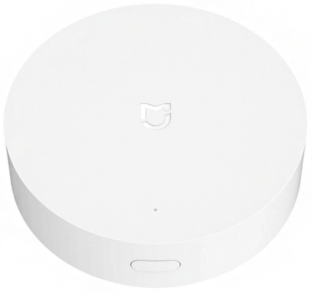
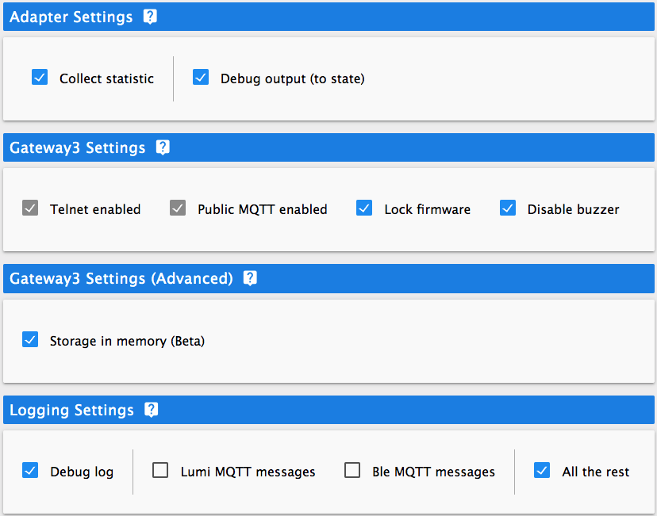

# IoBroker.xiaomi-шлюз3

## Адаптер Xiaomi-gateway3 ioBroker
Этот адаптер позволяет ioBroker связываться с Xiaomi Gateway 3 и использовать его для управления устройствами Xiaomi.
Адаптер связывается со шлюзом по протоколу MQTT (подключается к встроенному брокеру MQTT). Однако вам необходимо соединить свой шлюз и устройства с помощью Mi Home (Cloud).

## Ранняя версия
Адаптер пока находится в стадии разработки. Но уже имеет готовый функционал.

Для успешной разработки адаптера требуется помощь сообщества, в основном в тестировании адаптера и устройств.

## Спасибо
Большая часть кода основана на [AlexxIT](https://github.com/AlexxIT) проект [XiaomiGateway3](https://github.com/AlexxIT/XiaomiGateway3) и переписана с него.

## Как ты можешь помочь?
Прежде всего, вы можете просто установить адаптер, использовать его и сообщать о любых проблемах.

Кроме того, если у вас много различных устройств, вы можете помочь улучшить их поддержку, включив опцию `Debug output (to state)` (см. ниже) и предоставив мне вывод отладки через несколько дней после сбора данных отладки.

## Оборудование и ограничения

Адаптер поддерживает работу `Xiaomi Gateway 3 (ZNDMWG03LM and ZNDMWG02LM)` на оригинальной прошивке следующих версий:

- `v1.5.0_0026` (разработано на ней)
- `v1.5.0_0102` (аналог `1.5.0_0026`, но не тестировался)

Вы можете прошить шлюз кастомной или стоковой прошивкой следующих версий: [вики](https://github.com/AlexxIT/XiaomiGateway3/wiki).

__*!!Внимание:*__ Версии встроенного ПО ниже `1.4.7_0000` адаптера не поддерживаются и не будут поддерживаться. Поддержка версий ниже `v1.5.0_0026` не гарантируется.

## Поддерживаемые устройства
- [x] Проверено
- [ ] Не испытано

### ZigBee-устройства
- [ ] Лампа Акара (ZNLDP12LM)
- [ ] Кнопка Акара (WXKG11LM)
- [ ] Куб Акара (MFKZQ01LM)
- [ ] Занавес Акара (ZNCLDJ11LM)
- [ ] Занавес Aqara B1 (ZNCLDJ12LM)
- [ ] Дверной замок Aqara S1 (ZNMS11LM)
- [ ] Дверной замок Aqara S2 (ZNMS12LM)
- [ ] Дверной замок Aqara S2 Pro (ZNMS12LM)
- [x] Дверной датчик Aqara (MCCGQ11LM)
- [ ] Двойная настенная кнопка Aqara (WXKG02LM)
- [ ] Двойная настенная кнопка Aqara D1 (WXKG07LM)
- [ ] Двойной настенный выключатель Aqara (QBKG03LM, QBKG12LM)
- [ ] Двойной настенный выключатель Aqara D1 (QBKG22LM, QBKG24LM)
- [ ] Двойной настенный выключатель Aqara E1 (QBKG39LM, QBKG41LM)
- [ ] Двойной настенный выключатель Aqara H1 (WS-EUK02)
- [ ] Двойной настенный выключатель Aqara для США (WS-USC04)
- [x] Датчик движения Акара (RTCGQ11LM)
- [ ] Четыре кнопки Aqara Opple (WXCJKG12LM)
- [ ] Акара Opple MX480 (XDD13LM)
- [ ] Акара Opple MX650 (XDD12LM)
- [ ] Aqara Opple Six Button (WXCJKG13LM)
- [ ] Две кнопки Aqara Opple (WXCJKG11LM)
- [ ] Вилка Aqara (SP-EUC01)
- [ ] Прецизионный датчик движения Aqara (RTCGQ13LM)
- [ ] Реле Акара (LLKZMK11LM)
- [ ] Реле Aqara T1 (DLKZMK11LM,SSM-U01,SSM-U02)
- [ ] Роликовая тень Aqara (ZNGZDJ11LM)
- [ ] Роликовый оттенок Aqara E1 (ZNJLBL01LM)
- [ ] Кнопка встряхивания Aqara (WXKG12LM)
- [ ] Одностенная кнопка Aqara (WXKG03LM)
- [ ] Одностенная кнопка Aqara D1 (WXKG06LM)
- [ ] Одностенный выключатель Aqara (QBKG04LM, QBKG11LM)
- [ ] Одностенный выключатель Aqara D1 (QBKG21LM, QBKG23LM)
- [ ] Одностенный выключатель Aqara E1 (QBKG38LM, QBKG40LM)
- [ ] Одностенный выключатель Aqara H1 (WS-EUK01)
- [ ] Розетка Aqara (QBCZ11LM)
- [x] Датчик Aqara TH (WSDCGQ11LM, WSDCGQ12LM)
- [ ] Монитор качества воздуха Aqara TVOC (VOCKQJK11LM)
- [ ] Термостат Aqara S2 (KTWKQ03ES)
- [ ] Тройной настенный выключатель Aqara D1 (QBKG25LM, QBKG26LM)
- [ ] Датчик вибрации Aqara (DJT11LM)
- [ ] Датчик утечки воды Aqara (SJCGQ11LM)
- [ ] Датчик газа Honeywell (JTQJ-BF-01LM/BW)
- [ ] Датчик дыма Honeywell (JTYJ-GD-01LM/BW)
- [ ] Лампа IKEA E14 (LED1649C5)
- [ ] IKEA Лампа E14 400 лм (LED1536G5)
- [ ] IKEA Лампа E27 1000 лм (LED1623G12)
- [ ] IKEA Лампа E27 950 лм (LED1546G12)
- [ ] IKEA Лампа E27 980 лм (LED1545G12)
- [ ] Лампа ИКЕА ГУ10 400 лм (LED1537R6,LED1650R5)
- [ ] Кнопка Xiaomi (WXKG01LM)
- [x] Дверной датчик Xiaomi (MCCGQ01LM)
- [ ] Датчик освещенности Xiaomi (GZCGQ01LM)
- [ ] Датчик движения Xiaomi (RTCGQ01LM)
- [x] Штекер Xiaomi (ZNCZ02LM)
- [ ] Xiaomi Plug EU (ZNCZ04LM)
- [ ] Xiaomi Plug TW (ZNCZ03LM)
- [ ] Штекер Xiaomi США (ZNCZ12LM)
- [ ] Датчик Xiaomi TH (WSDCGQ01LM)

### BLE-устройства
- [ ] Дверной замок Aqara N100 (ZNMS16LM)
- [ ] Дверной замок Aqara N200 (ZNMS17LM)
- [ ] Датчик дыма Honeywell (JTYJ-GD-03MI)
- [ ] Будильник Xiaomi (CGD1)
- [ ] Дверной замок Xiaomi (MJZNMS02LM, XMZNMST02YD)
- [ ] Датчик двери Xiaomi 2 (MCCGQ02HL)
- [ ] Уход за цветами Xiaomi (HHCCJCY01)
- [ ] Цветочный горшок Xiaomi (HHCCPOT002)
- [ ] Волшебный куб Xiaomi (XMMF01JQD)
- [ ] Средство от комаров Xiaomi (WX08ZM)
- [x] Датчик движения Xiaomi 2 (RTCGQ02LM)
- [ ] Xiaomi Night Light 2 (MJYD02YL-A)
- [ ] Дверной датчик Xiaomi Qingping (CGH1)
- [ ] Датчик движения Xiaomi Qingping (CGPR1)
- [ ] Xiaomi Qingping TH Lite (CGDK2)
- [ ] Датчик Xiaomi Qingping TH (CGG1)
- [ ] Сейф Xiaomi (BGX-5/X1-3001)
- [x] Часы Xiaomi TH (LYWSD02MMC)
- [ ] Датчик Xiaomi TH (LYWSDCGQ/01ZM)
- [x] Датчик Xiaomi TH 2 (LYWSD03MMC)
- [ ] Зубная щетка Xiaomi T500 (MES601)
- [ ] Датчик утечки воды Xiaomi (SJWS01LM)
- [ ] Часы Xiaomi ZenMeasure (MHO-C303)
- [ ] Xiaomi ZenMeasure TH (MHO-C401)
- [ ] Кнопка Yeelight S1 (YLAI003)

_**Примечание.** У устройств BLE может не быть состояний в первый раз после сопряжения, потому что я не знаю спецификаций устройств и пока не определил свойства для всех устройств. Состояния будут добавлены, когда устройство обновит соответствующие свойства. Я надеюсь, что со временем исправлю это с вашей помощью._

## Конфигурация
Для подключения шлюза вам необходимо получить IP и TOKEN шлюза. Вы можете сделать это вручную или из облака.

_**Внимание!** Возникла проблема с получением устройств из облака. Я пока не понимаю, связана ли эта проблема с кодом или с облаком, однако вы должны попытаться получить (нажать кнопку) устройства несколько раз (пока вы, наконец, не получите), на данный момент._

Также вам необходимо выбрать команду telnet open (в большинстве случаев вариант №2). Вы можете проверить соединение и telnet с помощью кнопок.

* Пинг здесь на самом деле не пинг. Это больше проверка доступности устройства.*

 

У вас есть несколько вариантов настройки адаптера и шлюза.

### Настройки адаптера
- [x] __Собрать статистику__ 

Адаптер собирает статистику о сообщениях устройств zigbee: сколько получено, сколько пропущено и т. д. Статистика сохраняется для каждого устройства и может быть просмотрена на странице «вкладка» (из бокового меню).  _**Примечание.** Адаптер сбрасывает статистику при перезапуске._

- [x] __Вывод отладки (в состояние)__ 

Адаптер будет выводить некоторую отладочную информацию в состояние для каждого устройства.

### Основные настройки шлюза 3
- [x] __Telnet включен__ 

Включено по умолчанию и должно оставаться включенным. Здесь просто для информации.

- [x] __Общедоступный MQTT включен__ 

Включено по умолчанию и должно оставаться включенным. Здесь просто для информации.

- [x]__Блокировка прошивки__ 

Установите true (или false), чтобы отключить (или включить) возможность обновления прошивки шлюза.

- [x] __Отключить зуммер__ 

Установите true, чтобы отключить раздражающие сигналы зуммера, или false, чтобы включить все сигналы.

### Расширенные настройки шлюза 3
- [x] __Хранение в памяти (бета)__ 

Переместите файлы БД устройств в память. Это может улучшить работу zigbee и bluetooth устройств. __*Но может произойти потеря некоторых данных. Используйте на свой страх и риск.*__

### Параметры ведения журнала
- [x] __Журнал отладки__ 

Включите ведение журнала отладки. Если отключено, другие параметры ведения журнала не действуют.

- [x] __Сообщения Lumi MQTT__ 

Включить ведение журнала сообщений MQTT устройств Lumi (zigbee).

- [x] __Бле сообщения MQTT__ 

Включить ведение журнала сообщений MQTT устройств BLE.

- [x] __Все остальное__ 

Включите все остальные сообщения адаптера.

## Вкладка
### Статистика

- Статистика по умолчанию не загружается. Вы должны использовать кнопку «ОБНОВИТЬ», чтобы обновить статистику на странице.

- Также вы можете очистить статистику с помощью кнопки `ОЧИСТИТЬ`. На самом деле это не очищает статистику как есть. Вы просто очищаете состояния, которые содержат статистику. Это может быть полезно в случае перезапуска адаптера, поскольку состояния ioBroker не очищаются при перезапуске.

_**Внимание:** Вы должны иметь в виду, что на самом деле это не статистика сообщений zigbee между шлюзом и устройством (статистика протокола zigbee). Это статистика сообщений, которые получает адаптер. Что это значит? Никаких различий для адаптера нет: шлюз не получает сообщение от устройства или сам адаптер не получает сообщение от шлюза (по MQTT). И если по каким-либо причинам (например, проблема с подключением к Wi-Fi) адаптер не получает сообщения от шлюза, он интерпретирует эти сообщения как пропущенные, но на самом деле zigbee в порядке._

## Changelog
<!--
    Placeholder for the next version (at the beginning of the line):
    ### **WORK IN PROGRESS**
-->
### 0.3.1 (2022-01-17)
* Bug fixes and code improvements
* Improved support firmware 1.5.1_0032 and some devices

### 0.3.0 (2021-12-10)
* Improved adapter logging

### 0.2.0 (2021-12-07)
* Added states classes and rewrote code with using them
* Added tab-page of adapter
* Added zigbee (lumi) devices statistic
* A lot of code improvements

### 0.1.0 (2021-11-09)
* (Evgenii Abramov) Added support for BLE devices (needed tests)
* (Evgenii Abramov) Improvements for zigbee and BLE support
* (Evgenii Abramov) Added output for debug purpose
* (Evgenii Abramov) A lot of code improvements

### 0.0.1-alpha.0 (2021-10-13)
* (Evgenii Abramov) Initial release

## License
MIT License

Copyright (c) 2022 Evgenii Abramov <john.abramov@gmail.com>

Permission is hereby granted, free of charge, to any person obtaining a copy
of this software and associated documentation files (the "Software"), to deal
in the Software without restriction, including without limitation the rights
to use, copy, modify, merge, publish, distribute, sublicense, and/or sell
copies of the Software, and to permit persons to whom the Software is
furnished to do so, subject to the following conditions:

The above copyright notice and this permission notice shall be included in all
copies or substantial portions of the Software.

THE SOFTWARE IS PROVIDED "AS IS", WITHOUT WARRANTY OF ANY KIND, EXPRESS OR
IMPLIED, INCLUDING BUT NOT LIMITED TO THE WARRANTIES OF MERCHANTABILITY,
FITNESS FOR A PARTICULAR PURPOSE AND NONINFRINGEMENT. IN NO EVENT SHALL THE
AUTHORS OR COPYRIGHT HOLDERS BE LIABLE FOR ANY CLAIM, DAMAGES OR OTHER
LIABILITY, WHETHER IN AN ACTION OF CONTRACT, TORT OR OTHERWISE, ARISING FROM,
OUT OF OR IN CONNECTION WITH THE SOFTWARE OR THE USE OR OTHER DEALINGS IN THE
SOFTWARE.