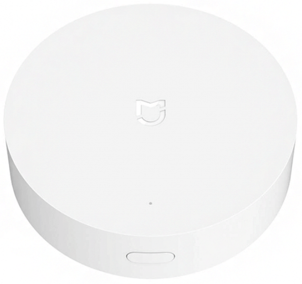
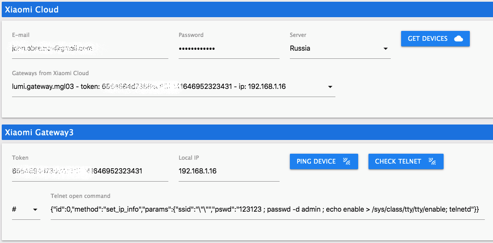
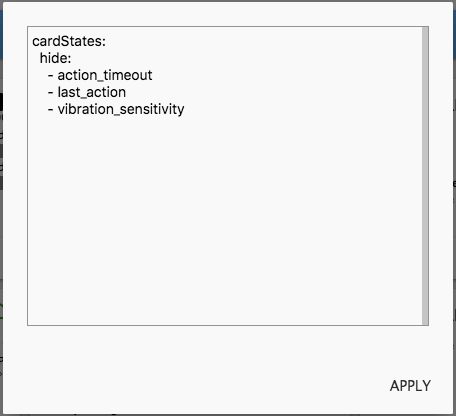

# ioBroker.xiaomi-gateway3

## Адаптер Xiaomi-gateway3 ioBroker

Этот адаптер позволяет ioBroker взаимодействовать с Xiaomi Gateway 3 и использовать его для управления устройствами Xiaomi. Адаптер взаимодействует со шлюзом по протоколу MQTT (он подключается к встроенному MQTT-брокеру). Однако вам необходимо выполнить сопряжение шлюза и устройств через Mi Home (Cloud).

## Ранняя версия

Адаптер пока находится на стадии разработки, но уже обладает готовым функционалом.

Для успешной разработки адаптеров необходима помощь сообщества, в основном в тестировании адаптеров и устройств.

## Спасибо

Значительная часть кода основана на проекте [AlexxIT](https://github.com/AlexxIT) [XiaomiGateway3](https://github.com/AlexxIT/XiaomiGateway3) и переписана на его основе.

## Чем вы можете помочь?

Во-первых, вы можете просто установить адаптер, использовать его и сообщить о любых проблемах.

Кроме того, если у вас много разных устройств, вы можете помочь улучшить их поддержку, включив соответствующую опцию.`Debug output (to state)` (см. ниже) и предоставьте мне отладочный вывод через несколько дней после сбора отладочных данных.

## Аппаратное обеспечение и ограничения

Адаптер поддерживает`Xiaomi Gateway 3 (ZNDMWG03LM and ZNDMWG02LM)` Работает на оригинальной прошивке следующих версий:

- `v1.5.0_0026` (разработано на его основе)
- `v1.5.0_0102` (аналогично)`1.5.0_0026` (но не тестировалось)

Вы можете прошить шлюз пользовательской или стандартной прошивкой следующих версий: [wiki](https://github.com/AlexxIT/XiaomiGateway3/wiki) .

**_!!Внимание:_** Версии прошивки ниже`1.4.7_0000` Адаптер не поддерживает и не будет поддерживаться. Поддержка версий ниже указанной.`v1.5.0_0026` не гарантировано.

## Поддерживаемые устройства

- [x] Проверено
- [ ] Не тестировалось

### Устройства Zigbee

- [ ] Луковица акары (ZNLDP12LM)
- [ ] Кнопка Aqara (WXKG11LM)
- [ ] Кубик Aqara (MFKZQ01LM)
- [x] Занавес Aqara (ZNCLDJ11LM)
- [ ] Шторы Aqara B1 (ZNCLDJ12LM)
- [ ] Дверной замок Aqara S1 (ZNMS11LM)
- [ ] Дверной замок Aqara S2 (ZNMS12LM)
- [ ] Дверной замок Aqara S2 Pro (ZNMS12LM)
- [x] Датчик открытия двери Aqara (MCCGQ11LM)
- [ ] Двустенная кнопка Aqara (WXKG02LM)
- [ ] Двустенная кнопка Aqara D1 (WXKG07LM)
- [ ] Двойной настенный выключатель Aqara (QBKG03LM, QBKG12LM)
- [ ] Двойной настенный выключатель Aqara D1 (QBKG22LM, QBKG24LM)
- [ ] Двойной настенный выключатель Aqara E1 (QBKG39LM, QBKG41LM)
- [ ] Двойной настенный выключатель Aqara H1 (WS-EUK02)
- [ ] Двойной настенный выключатель Aqara (WS-USC04) для США
- [x] Датчик движения Aqara (RTCGQ11LM)
- [ ] Четырехкнопочный пульт дистанционного управления Aqara Opple (WXCJKG12LM)
- [ ] Aqara Opple MX480 (XDD13LM)
- [ ] Aqara Opple MX650 (XDD12LM)
- [ ] Aqara Opple Six Button (WXCJKG13LM)
- [ ] Aqara Opple Two Button (WXCJKG11LM)
- [ ] Вилка Aqara (SP-EUC01)
- [ ] Высокоточный датчик движения Aqara (RTCGQ13LM)
- [ ] Эстафета Акара (LLKZMK11LM)
- [ ] Ретранслятор Aqara T1 (DLKZMK11LM,SSM-U01,SSM-U02)
- [x] Роликовые шторы Акара (ZNGZDJ11LM)
- [ ] Роликовый оттенок Aqara E1 (ZNJLBL01LM)
- [ ] Кнопка встряхивания Aqara (WXKG12LM)
- [ ] Настенная кнопка Aqara (WXKG03LM)
- [ ] Настенная кнопка Aqara D1 (WXKG06LM)
- [ ] Одностенный выключатель Aqara (QBKG04LM, QBKG11LM)
- [ ] Настенный выключатель Aqara D1 (QBKG21LM, QBKG23LM)
- [ ] Настенный выключатель Aqara E1 (QBKG38LM, QBKG40LM)
- [ ] Настенный выключатель Aqara H1 (WS-EUK01)
- [ ] Розетка Aqara (QBCZ11LM)
- [x] Датчик Aqara TH (WSDCGQ11LM,WSDCGQ12LM)
- [ ] Монитор качества воздуха Aqara TVOC (VOCKQJK11LM)
- [ ] Термостат Aqara S2 (KTWKQ03ES)
- [ ] Тройной настенный выключатель Aqara D1 (QBKG25LM, QBKG26LM)
- [ ] Вибрационный датчик Aqara (DJT11LM)
- [ ] Датчик протечки воды Aqara (SJCGQ11LM)
- [ ] Газовый датчик Honeywell (JTQJ-BF-01LM/BW)
- [ ] Датчик дыма Honeywell (JTYJ-GD-01LM/BW)
- [ ] Лампочка IKEA E14 (LED1649C5)
- [ ] Лампа IKEA E14 400 лм (LED1536G5)
- [ ] Лампа IKEA E27 1000 лм (LED1623G12)
- [ ] Лампа IKEA E27 950 лм (LED1546G12)
- [ ] Лампа IKEA E27 980 лм (LED1545G12)
- [ ] Лампа IKEA GU10 400 лм (LED1537R6, LED1650R5)
- [x] Кнопка Xiaomi (WXKG01LM)
- [x] Датчик открытия двери Xiaomi (MCCGQ01LM)
- [ ] Датчик освещенности Xiaomi (GZCGQ01LM)
- [ ] Датчик движения Xiaomi (RTCGQ01LM)
- [x] Вилка Xiaomi (ZNCZ02LM)
- [ ] Вилка Xiaomi EU (ZNCZ04LM)
- [ ] Вилка Xiaomi Plug TW (ZNCZ03LM)
- [ ] Вилка Xiaomi для США (ZNCZ12LM)
- [ ] Датчик TH от Xiaomi (WSDCGQ01LM)

### BLE-устройства

- [ ] Дверной замок Aqara N100 (ZNMS16LM)
- [ ] Дверной замок Aqara N200 (ZNMS17LM)
- [ ] Детектор дыма Honeywell (JTYJ-GD-03MI)
- [ ] Будильник Xiaomi (CGD1)
- [ ] Дверной замок Xiaomi (MJZNMS02LM, XMZNMST02YD)
- [ ] Датчик открытия двери Xiaomi 2 (MCCGQ02HL)
- [ ] Xiaomi Flower Care (HHCCJCY01)
- [ ] Цветочный горшок Xiaomi (HHCCPOT002)
- [ ] Волшебный куб Xiaomi (XMMF01JQD)
- [ ] Средство от комаров Xiaomi (WX08ZM)
- [x] Датчик движения Xiaomi Motion Sensor 2 (RTCGQ02LM)
- [ ] Ночник Xiaomi 2 (MJYD02YL-A)
- [ ] Датчик двери Xiaomi Цинпин (CGH1)
- [ ] Датчик движения Xiaomi Цинпин (CGPR1)
- [ ] Xiaomi Цинпин TH Lite (CGDK2)
- [ ] Датчик Xiaomi Qingping TH (CGG1)
- [ ] Сейф Xiaomi (BGX-5/X1-3001)
- [x] Часы Xiaomi TH Clock (LYWSD02MMC)
- [ ] Датчик Xiaomi TH (LYWSDCGQ/01ZM)
- [x] Xiaomi TH Sensor 2 (LYWSD03MMC)
- [ ] Зубная щетка Xiaomi T500 (MES601)
- [ ] Датчик протечки воды Xiaomi (SJWS01LM)
- [ ] Часы Xiaomi ZenMeasure (MHO-C303)
- [x] Xiaomi ZenMeasure TH (MHO-C401)
- [ ] Кнопка Yeelight S1 (YLAI003)

_**Примечание:** После сопряжения устройства BLE могут не иметь состояний, поскольку я не знаю их характеристик и пока не определил свойства для всех устройств. Состояния будут добавлены, когда устройство обновит соответствующие свойства. Надеюсь, со временем я смогу это исправить с вашей помощью._

## Описание некоторых штатов

### `Button long press`

Для кнопочных устройств можно увидеть комбинацию двух состояний (например).`long_press` и`long_timeout` Как это работает? Кнопки, поддерживающие длительное нажатие, отправляют сообщение при нажатии и при отпускании. Иногда может возникнуть ситуация, когда кнопка не отправляет сообщение при отпускании. В этом случае`timeout` Это должно помочь "освободить" состояние.

По умолчанию`timeout` Значение состояния не установлено и`long_press` Кнопка будет отпущена через 1 секунду после начала удержания, даже если вы продолжаете её удерживать. Если вы это настроите`long_timeout` Истечение времени ожидания -1 будет полностью проигнорировано, и состояние будет "освобождено" только сообщением от кнопки.

В большинстве случаев разумно установить`timeout` до небольшого значения, например, 4 или 5 секунд.

### `Occupancy` и`Occupancy timeout`

Датчики движения RTCGQ11LM и другие имеют задержку (тайм-аут) после обнаружения движения от 5 до 60 секунд (в зависимости от версии и модификаций). Это означает, что в течение этого периода новое движение не может быть обнаружено (технически датчик не отправляет сообщение).

`occupancy`Становится _**истинным,**_ когда датчик обнаруживает движение, и остается _**таковым**_ .

Цель`occupancy_timeout` установлен`occupancy` Значение _**false устанавливается**_ , когда датчик может снова отправлять сообщения. По умолчанию`occupancy_timeout` не задано и`occupancy` Через 60 секунд значение снова станет _**«нет»**_ . Если у вашего датчика другая задержка, лучше установить другое значение.`occupancy_timeout` до этого значения задержки.

Если вы хотите, чтобы значение возвращалось к _**false**_ сразу после обнаружения движения, вы можете установить соответствующее значение.`occupancy_timeout` до 1 секунды.

## Конфигурация

Для подключения шлюза необходимо получить IP-адрес и токен шлюза. Это можно сделать вручную или через облако.

Также вам нужно выбрать команду открытия telnet (в большинстве случаев вариант №2). Проверить соединение и подключиться к telnet можно с помощью кнопок.

_Здесь используется не совсем ping, а скорее проверка доступности устройства._

 

У вас есть несколько вариантов настройки адаптера и шлюза.

### Настройки адаптера

- [x] **Собрать статистику**  Адаптер собирает статистику о сообщениях, поступающих от устройств Zigbee: сколько получено, сколько пропущено и т. д. Статистика сохраняется в состоянии каждого устройства и может быть просмотрена на вкладке (из бокового меню).  _**Примечание:** Адаптер сбрасывает статистику при перезапуске._

- [x] **Отладочный вывод (в состояние)**  Адаптер будет выводить некоторую отладочную информацию в состояние каждого устройства.

### Основные настройки Gateway3

- [x] **Telnet включен**  Включено по умолчанию и должно оставаться включенным. Это просто для информации.

- [x] **Включен публичный MQTT**  Включено по умолчанию и должно оставаться включенным. Это просто для информации.

- [x] **Блокировка прошивки**  Установите значение true (или false), чтобы отключить (или включить) возможность обновления прошивки шлюза.

- [x] **Отключить звуковой сигнал**  Установите значение true, чтобы отключить надоедливые звуковые сигналы, или false, чтобы включить все сигналы.

### Расширенные настройки Gateway3

- [x] **Хранение в оперативной памяти (бета-версия)**  Переместите файлы баз данных устройств в оперативную память. Это может улучшить работу устройств Zigbee и Bluetooth. **_Однако это может привести к потере части данных. Используйте на свой страх и риск._**

### Настройки ведения журнала

_**Примечание:** Чтобы увидеть отладочные сообщения в журнале ioBroker, необходимо установить соответствующий параметр.`debug` уровень логирования для адаптера ниже`Instances` страница (включить экспертный режим)_

- [x] **Сообщения Lumi MQTT**  Включить отладочное логирование сообщений MQTT на устройствах Lumi (Zigbee).

- [x] **Сообщения Ble MQTT**  Включить отладочное логирование сообщений MQTT на устройствах BLE.

- [x] **Все остальное**  Включите отладочное логирование всех остальных сообщений адаптера.

- [x] **Удалите спам**  Включить удаление повторяющихся сообщений. Если одинаковые сообщения об ошибках повторяются несколько раз, они будут скрыты, а через 1 час отобразится общее количество.

## Вкладка

### Устройства

 

На устройствах есть карты памяти.`devices` Страница, на которой вы можете увидеть некоторую информацию об устройстве, текущие значения состояния и управлять некоторыми из них.

Также вы можете изменить`friendly name` устройства.

_**Примечание:** На данный момент эта страница имеет базовый функционал. В будущем он будет расширен._

### Конфигурация устройства

Вы можете задать некоторые параметры для настройки устройства (и карты устройства), написав конфигурацию в формате YAML. Доступные параметры описаны ниже в таблице. Вы можете вызвать окно настройки устройства (окно с текстовым полем ввода) с помощью`Config` указать в меню.

#### Параметры конфигурации устройства

| Поле            | Тип     | Описание                                                                                    |
| --------------- | ------- | ------------------------------------------------------------------------------------------- |
| cardStates      | Словарь | Этот словарь содержит параметры состояний карты устройства.                                 |
| cardStates.hide | Список  | Список состояний (идентификаторов состояний), которые необходимо скрыть с карты устройства. |

### Статистика

- Статистика по умолчанию не загружается. Вам нужно использовать кнопку.`RELOAD` Обновить статистику на странице.

- Также вы можете очистить статистику с помощью кнопки.`CLEAR` Это фактически не очищает статистику, как она есть. Вы просто очищаете состояния, которые содержат статистику. Это может быть полезно в случае перезапуска адаптера, поскольку состояния ioBroker не очищаются при перезапуске.

_**Внимание:** следует помнить, что это не статистика сообщений Zigbee между шлюзом и устройством (статистика протокола Zigbee). Это статистика сообщений, которые получает адаптер. Что это значит? Для адаптера нет разницы, получает ли шлюз сообщение от устройства или сам адаптер не получает сообщение от шлюза (по протоколу MQTT). И если по какой-либо причине (например, из-за проблем с подключением Wi-Fi) адаптер не получает сообщения от шлюза, он интерпретирует эти сообщения как пропущенные, но на самом деле Zigbee работает нормально._

## Changelog
<!--
    Placeholder for the next version (at the beginning of the line):
    ### **WORK IN PROGRESS**
-->
### 0.3.6 (2022-06-14)
* Fixes and improvements

### 0.3.5 (2022-05-08)
* Added configuration for devices
* Added cutting SPAM messages at log
* Remove unnecessary `Debug log` option
* Fixes and improvements

### 0.3.4 (2022-02-10)
* Fix issue getting devices from cloud and switch to RC4
* Add devices page
* Other fixes and improvements

### 0.3.3 (2022-01-30)
* Fix lumi temperature and voltage

### 0.3.2 (2022-01-30)
* Bug fixes and code improvements
* Add curtain and buttons support
* Update README

### 0.3.1 (2022-01-17)
* Bug fixes and code improvements
* Improved support firmware 1.5.1_0032 and some devices

### 0.3.0 (2021-12-10)
* Improved adapter logging

### 0.2.0 (2021-12-07)
* Added states classes and rewrote code with using them
* Added tab-page of adapter
* Added zigbee (lumi) devices statistic
* A lot of code improvements

### 0.1.0 (2021-11-09)
* (Evgenii Abramov) Added support for BLE devices (needed tests)
* (Evgenii Abramov) Improvements for zigbee and BLE support
* (Evgenii Abramov) Added output for debug purpose
* (Evgenii Abramov) A lot of code improvements

### 0.0.1-alpha.0 (2021-10-13)
* (Evgenii Abramov) Initial release

## License
MIT License

Copyright (c) 2022 Evgenii Abramov <john.abramov@gmail.com>

Permission is hereby granted, free of charge, to any person obtaining a copy
of this software and associated documentation files (the "Software"), to deal
in the Software without restriction, including without limitation the rights
to use, copy, modify, merge, publish, distribute, sublicense, and/or sell
copies of the Software, and to permit persons to whom the Software is
furnished to do so, subject to the following conditions:

The above copyright notice and this permission notice shall be included in all
copies or substantial portions of the Software.

THE SOFTWARE IS PROVIDED "AS IS", WITHOUT WARRANTY OF ANY KIND, EXPRESS OR
IMPLIED, INCLUDING BUT NOT LIMITED TO THE WARRANTIES OF MERCHANTABILITY,
FITNESS FOR A PARTICULAR PURPOSE AND NONINFRINGEMENT. IN NO EVENT SHALL THE
AUTHORS OR COPYRIGHT HOLDERS BE LIABLE FOR ANY CLAIM, DAMAGES OR OTHER
LIABILITY, WHETHER IN AN ACTION OF CONTRACT, TORT OR OTHERWISE, ARISING FROM,
OUT OF OR IN CONNECTION WITH THE SOFTWARE OR THE USE OR OTHER DEALINGS IN THE
SOFTWARE.

<!--
    npm run release -- -p iobroker --all --dry
-->