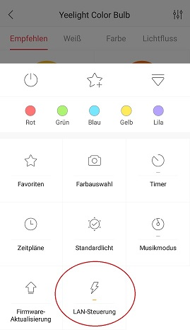

# IoBroker.yeelight-2
[Deutsche Beschreibung hier](README_de.md)

Этот адаптер управляет вашим устройством Yeelight. этот адаптер только для admin3. Admin2 не поддерживается

## Версия перехода
При переходе с 0.4.X на 0.9.X или выше объекты необходимо удалить вручную, чтобы их можно было воссоздать.

## Монтаж
для ламп RGB вам необходимо включить LAN в настройках приложения yeelight.

## Конфиг
вы можете добавить устройства вручную или найти устройства в сети. базовый порт - 55443. При желании вы можете изменить имя, ip, порт и смарт-имя

### Умное имя
если вы введете смарт-имя, устройство будет добавлено в iobroker.cloud и им можно будет управлять с помощью alexa.

### Найти устройство
с помощью этой кнопки вы можете сканировать вашу Сеть на предмет устройств, если что-то найдено, то деления добавляются в таблицу. Сканирование сети занимает около 20 секунд. если устройства не найдены, значит, режим LAN не включен или лампочки находятся в другой сети.

### Устройства нет в списке
Если вашего устройства нет в списке, например. yltd003 используйте другую лампу с такими же функциями в этом случае настольная лампа, цвет или что-то еще.

## Set_scene Использование: Этот метод используется для установки интеллектуального светодиода непосредственно в указанное состояние. Если интеллектуальный светодиод выключен, он сначала включит интеллектуальный светодиод, а затем применит указанную команду.
Параметры: 3 ~ 4.

 "class" может быть "color", "hsv", "ct", "cf", "auto_dealy_off".

- «цвет» означает изменение интеллектуального светодиода на указанный цвет и

яркость.

- «hsv» означает изменение интеллектуального светодиода на указанный цвет и яркость.
- «ct» означает изменение интеллектуального светодиода на указанное ct и яркость.
- «cf» означает запуск цветового потока определенным образом.
- "auto_delay_off" означает включение смарт-светодиода на указанный

яркость и запустите таймер сна, чтобы выключить свет через указанные минуты.

 «val1», «val2», «val3» зависят от класса.

Пример запроса:

- `` ["цвет", 65280, 70] `
- `` ["HSV", 300, 70, 100] ``
- `` ["ct", 5400, 100] `
- «« [«cf», 0,0, «500,1,255,100,1000,1,1,16776960,70»] «
- `` ["auto_delay_off", 50, 5] ``

ПРИМЕЧАНИЕ. Допускается как в состоянии «включено», так и в состоянии «выключено».

 Для приведенных выше примеров:

 - Первый - установить цвет на «652280» и яркость 70%.
 - Второй - установить цвет на оттенок: 300, насыщенность: 70 и максимальную яркость.
 - Третий устанавливает CT на 500K и яркость 100%.
 - Четвертый - запуск бесконечного цветового потока для двух потоковых кортежей.
 - Пятый - включить свет до 50% яркости, а затем выключить

через 5 минут.

## Changelog
### 1.1.0 (2021-07-26)
* (MeisterTR) add release-script update testing and dependencies
* (Diginix) fixed data types
### 1.0.3 (2019-12-01)
* (MeisterTR) add Pedant
* (MeisterTR) transfer to community
### 1.0.1 (2018-12-08)
* (MeisterTR) push version, added set_scene
### 0.9.6 (2018-12-08)
* (MeisterTR) yeelight-wifi added
* (MeisterTR) fixed  bugs
* (MeisterTR) add manuell light
* (MeisterTR) better error handling
* (MeisterTR) fixed reconnect at start
* (MeisterTR) delete object and smartname bug fixed
### 0.9.1 (2018-10-31)
* (MeisterTR) added offline detection, poll sates, cleanup
### 0.9.0 (2018-08-29)
* (MeisterTR) rebuild
### 0.4.1 (2018-08-29)
* (MeisterTR) fixed JSON error
### 0.4.0 (2018-08-29)
* (MeisterTR) fixed errors
* (MeisterTR) added scenen
### 0.3.6 (2018-07-07)
* (MeisterTR) catch spaces in config, small performance changes
### 0.3.5 (2018-06-18)
* (MeisterTR) added yeelight650, fixed some bugs, power on when ct change
### 0.2.9 (2018-06-07)
* (MeisterTR) change name for repo and npm
### 0.2.8 (2018-06-01)
* (MeisterTR) fixed bug wit port, fixed set ct by alexa
### 0.2.6 (2018-05-31)
* (MeisterTR) fixed manny bugs.
### 0.2.0 (2018-03-07)
* (MeisterTR) many changes add smartname Option, add manual devices, many fixes
* (MeisterTR) fix role for alexa
### 0.1.1 (2018-03-07)
* (MeisterTR)return to default value when turn on
* (MeisterTR)fix role for alexa
### 0.1.0 (2018-03-07)
* (MeisterTR) many changes, add hue and sat for alexa control
### 0.0.2 (2018-03-07)
* (MeisterTR) objects not overwirte after restart
### 0.0.2 (2018-03-07)
* (MeisterTR) testing added, log changed
### 0.0.1 (2018-01-29)
* (cahek2202) initinal version

base from: adb backup https://github.com/cahek2202/ioBroker.yeelight

The MIT License (MIT)

Copyright (c) 2018-2019 MeisterTR <meistertr.smarthome@gmail.com>, cahek2202 <cahek2202@mail.ru>

Permission is hereby granted, free of charge, to any person obtaining a copy
of this software and associated documentation files (the "Software"), to deal
in the Software without restriction, including without limitation the rights
to use, copy, modify, merge, publish, distribute, sublicense, and/or sell
copies of the Software, and to permit persons to whom the Software is
furnished to do so, subject to the following conditions:

The above copyright notice and this permission notice shall be included in
all copies or substantial portions of the Software.

THE SOFTWARE IS PROVIDED "AS IS", WITHOUT WARRANTY OF ANY KIND, EXPRESS OR
IMPLIED, INCLUDING BUT NOT LIMITED TO THE WARRANTIES OF MERCHANTABILITY,
FITNESS FOR A PARTICULAR PURPOSE AND NONINFRINGEMENT. IN NO EVENT SHALL THE
AUTHORS OR COPYRIGHT HOLDERS BE LIABLE FOR ANY CLAIM, DAMAGES OR OTHER
LIABILITY, WHETHER IN AN ACTION OF CONTRACT, TORT OR OTHERWISE, ARISING FROM,
OUT OF OR IN CONNECTION WITH THE SOFTWARE OR THE USE OR OTHER DEALINGS IN
THE SOFTWARE.