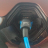

# iobroker.zoe2

\=================

**Тесты:**

**Загрузки**

**Лицензия:**

**Функции:**

Простой адаптер ioBroker для получения основных значений от Renault ZOE и использования их в ioBroker.

ВАЖНО!!! ЕСЛИ ВЫ ОБНОВЛЯЕТЕСЬ С ВЕРСИИ ДО 0.2.2, ВАМ ПРИДЕТСЯ ПОВТОРНО ВВЕСТИ ПАРОЛЬ, ПОСКОЛЬКУ НАЧИНАЯ С ВЕРСИИ 0.2.2 ПАРОЛЬ СОХРАНЯЕТСЯ В ЗАШИФРОВАННОМ ВИДЕ!!!

**КЛЮЧ API!!! ЕСЛИ АДАПТЕР ПЕРЕСТАЕТ РАБОТАТЬ, ПОЖАЛУЙСТА, ВСЕГДА ПРОВЕРЯЙТЕ <https://github.com/fungus75/ioBroker.zoe2/wiki> , ПОТОМУ ЧТО RENAULT ЧАСТО МЕНЯЕТ СВОЙ КЛЮЧ API!!!**

ВНИМАНИЕ: ЭТОТ АДАПТЕР ИСПОЛЬЗУЕТ ТОТ ЖЕ API, ЧТО И ПРИЛОЖЕНИЕ MY RENAULT. НО ПЕРЕД ИСПОЛЬЗОВАНИЕМ ЭТОГО АДАПТЕРА НЕОБХОДИМО НАСТРОИТЬ ПРИЛОЖЕНИЕ MY RENAULT. Например, для Android: <https://play.google.com/store/apps/developer?id=RENAULT+SAS> — если вы хотите использовать старый API, пожалуйста, воспользуйтесь <https://github.com/fungus75/ioBroker.zoe> .

ВНИМАНИЕ: ЭТО ОЧЕНЬ РАННЯЯ СТАДИЯ РАЗРАБОТКИ, ИСПОЛЬЗОВАНИЕ НА ВАШ СОБСТВЕННЫЙ РИСК.

ВНИМАНИЕ: ПОСЛЕ ЛЮБОГО ОБНОВЛЕНИЯ АДАПТЕРА ПЕРЕЙДИТЕ НА ЭКРАН НАСТРОЕК, ИЗМЕНИТЕ ЧТО-НИБУДЬ ТАК, ЧТОБЫ БЫЛА ВКЛЮЧЕНА ФУНКЦИЯ СОХРАНЕНИЯ, ВЕРНИТЕ ВСЕ ИЗМЕНЕНИЯ И НАЖМИТЕ «СОХРАНИТЬ»!

Если этот адаптер недоступен в административной панели ioBroker, используйте следующую команду для его установки (из командной строки на вашем сервере ioBroker):

`npm install https://github.com/fungus75/ioBroker.zoe2/tarball/master/`

Или вы можете использовать кнопку GitHub (с надписью: установить с собственного URL) в окне адаптера и ввести этот URL на вкладке «Другие». Это также можно использовать для обновления до текущей версии адаптера:

`https://github.com/fungus75/ioBroker.zoe2/tarball/master/` (Если эта ссылка не работает, используйте вместо неё <https://github.com/fungus75/ioBroker.zoe2.git> )

Вы можете использовать этот метод для обновления адаптера до последней версии.

После этого адаптер должен отобразиться в административной панели ioBroker.

### Конфигурация

- Вам необходимо указать имя пользователя, пароль и VIN-номер, как вы это сделали в моем приложении Renault.
- Эти локали («Laenderversionen») в настоящее время работают: de\_DE.
- Возможно, для использования этой функции вам потребуется My-ZEConnect или аналогичные сервисы от Renault.
- После сохранения создание объектов (zoe.0 и т.д.) заняло около 15 минут.

### Функции

- Прочитайте эти параметры от Зои:
  - уровень заряда в процентах
  - плата как логическое значение
  - подключен как логическое значение
  - оставшийся запас хода в километрах
  - оставшееся время зарядки
  - рассчитанная конечная точка зарядки (charging\_finished\_at)
  - температура батареи
  - Внешняя температура (не очень точная)
  - зарядкаPower
  - Емкость батареи
  - доступная энергия батареи
  - Функции gpsLatitude и gpsLongitude работают только на более новых версиях ZOE.
- Введите следующие параметры:
  - preconNow: запускает precon/hvac (запишите true в соответствующий узел или нажмите кнопку)
  - chargeCancel: прекращает зарядку
  - chargeEnable: включает зарядку

Контроль зарядки:

С помощью двух кнопок chargeCancel и chargeEnable можно управлять функцией зарядки. Если нажата кнопка chargeCancel (или в этот параметр записано значение true), функция зарядки отключается. ZOE не должен заряжаться, если подключен сетевой кабель. На моем ZOE первого поколения это не работает, возможно, на более новых моделях ZOE это работает?

Как только будет нажата кнопка chargeEnable (или этому параметру будет присвоено значение true), функция зарядки должна снова заработать.

Как это делается: функция chargeEnable создает расписание зарядки, которое начинается в указанный вами час на экране настроек каждый день и длится 15 минут. Похоже, это минимальное заданное время. Полное отключение зарядки невозможно с помощью текущего API (или тех частей текущего API, которые известны).

Некоторые параметры работают только на более новых версиях ZOE.

### Протестировано со следующими зонами безопасности:

- Зои Фаза 2 (Спасибо Jack-RK-24)
- Zoe R210 (1-е поколение, протестировано fungus75)
- Зои R90 (Спасибо arturwolf)

### Пожалуйста, обрати внимание!!

Связь с ZOE или Renault-Services осуществляется только в течение 10-минутных интервалов. Поэтому, если вы нажмете кнопку preconNow или chargeNow, отправка данных в ZOE займет до следующего интервала, а получение информации о состоянии сервиса — до следующего интервала.

Новый API ZOE от Renault, похоже, работает очень медленно. Это означает, что он отображает новые значения только тогда, когда происходит что-то важное. Насколько я выяснил, самое важное — это уровень заряда батареи. То есть, например, температура наружного воздуха не обновляется, пока машина стоит дома. Температура наружного воздуха обновляется только тогда, когда, например, ZOE заряжается. Если зарядка завершена, обновления по-прежнему нет. Во время движения уровень заряда батареи постоянно снижается, поэтому обновление должно происходить очень регулярно.

### Спасибо

<https://michael-heck.net/index.php/elektromobilitaet/renault-zoe-ins-smarthome-integrieren> , <https://michael-heck.net/index.php/elektromobilitaet/renault-zoe-im-smarthome-neue-api-2020> , <https://muscatoxblog.blogspot.com/2019/07/delving-into-renaults-new-api.html> , <https://github.com/edent/Renault-Zoe-API> , <https://github.com/jamesremuscat/pyze> и [https://github.com/hacf-fr/renault-api —](https://github.com/hacf-fr/renault-api) спасибо за вашу отличную документацию и работу.

## Changelog

### **WORK IN PROGRESS**
- (copilot) Adapter requires node.js >= 22 now
- (ioBroker-Bot) Adapter requires js-controller >= 6.0.11 now.

### 0.2.12 (2025-08-17)
- Fixes bug ChargeStartOrCancel

### 0.2.11 (2025-04-10)
- Fixes bug with totalMileage

### 0.2.10 (2024-10-27)
- Fixes according to ioBroker-Bot notification
  
### 0.2.9 (2024-04-27)
- BugFix Cockpit und Batterie json structure changed by Renault

### 0.2.8 (2024-04-27)
- BugFix Cockpit und Batterie (thanks to @MCP-KC, @gik007)

### 0.2.7 (2024-04-08)
- BugFix gps Location (thanks to @MCP-KC)

### 0.2.6 (2022-07-22)
- API Timeout configurable via config-screen
- Improved stability

### 0.2.5 (2022-03-30)
- Better error messages if kameronapikey changed
- Link to github-wiki added to admin-screen
- updated dependencies

### 0.2.4 (2022-02-16)
- Replaced obsolete Request-Library by axios
- Code-Adjustments

### 0.2.3 (2021-07-29)
- Code Adjustments, Error-Handling

### 0.2.2 (2021-07-26)
- Store Password Encrypted (You have to reset it, if updating from older version)

### 0.2.1 (2021-07-23)
- Code optimisation 

### 0.2.0 (2021-02-12)
- Adapter supports compact mode (required if adapter should be listed in official repo)

### 0.1.5 (2021-02-09)
- bugfix gigya parameter changed https://github.com/fungus75/ioBroker.zoe2/issues/17

### 0.1.4 (2021-02-05)
- added: kamereonapikey as setup parameter because it changed by Feb. 1st
- added: stopChargeWorkaroundHour: Because the API has no feature to stop charging, the stop-charging button starts scheduled charging to a very uncommon time. Configure the hour with that parameter
- bugfix https://github.com/fungus75/ioBroker.zoe2/issues/15
- bugfix https://github.com/fungus75/ioBroker.zoe2/issues/16
- bugfix https://github.com/fungus75/ioBroker.zoe2/issues/14

### 0.1.3 (2020-11-17)
- added: setup-value useHVACApi, see https://github.com/fungus75/ioBroker.zoe2/issues/10

### 0.1.2 (2020-07-28)
- changed: call charge-start API when "pressed" chargeEnable. Hopefully it helps on older ZOEs

### 0.1.1 (2020-07-18)
- added chargeCancel and chargeEnable. See "controll charging"

### 0.1.0 (2020-07-03)
- bugfix: https://github.com/fungus75/ioBroker.zoe2/issues/6, thanks to https://github.com/damack

### 0.0.9 (2020-06-25)
- added: getLocation can be turned on/off in config (useful for older ZOEs which do not allow getLocation)

### 0.0.8 (2020-06-18)
- bugfix: https://github.com/fungus75/ioBroker.zoe2/issues/2
- bugfix: https://github.com/fungus75/ioBroker.zoe2/issues/3

### 0.0.7 (2020-06-18)
- bugfix: https://github.com/fungus75/ioBroker.zoe2/issues/2
- added: gpsLatitude
- added: gpsLongitude 

### 0.0.6 (2020-04-30)
- added: chargingPower
- added: batteryCapacity
- added: batteryAvailableEnergy
- changed: Using battery-status v2 API (supplies better values for newer ZOEs, thanks Jack-RK-24 for testing)

### 0.0.5 (2020-04-29)
- added: config-paramter ignore API error (when set, the Adapter tries to ignore some API-Errors)

### 0.0.4 (2020-04-21)
- added: preconNow => starts precon (hvac)

### 0.0.3 (2020-04-16)
- added: totalMileage

### 0.0.2 (2020-04-15)
- first working version for github
- reads out some values (as shown in the Features list)

### 0.0.1 (2020-04-06)
- nonworking version, just to create initial repo on github
- code taken 1:1 from iobroker.zoe
- small adjustments, first access to the new renault api

## License
The MIT License (MIT)

Copyright (c) 2024-2026 RenePilz <rene@pilz.cc>

Permission is hereby granted, free of charge, to any person obtaining a copy
of this software and associated documentation files (the "Software"), to deal
in the Software without restriction, including without limitation the rights
to use, copy, modify, merge, publish, distribute, sublicense, and/or sell
copies of the Software, and to permit persons to whom the Software is
furnished to do so, subject to the following conditions:

The above copyright notice and this permission notice shall be included in
all copies or substantial portions of the Software.

THE SOFTWARE IS PROVIDED "AS IS", WITHOUT WARRANTY OF ANY KIND, EXPRESS OR
IMPLIED, INCLUDING BUT NOT LIMITED TO THE WARRANTIES OF MERCHANTABILITY,
FITNESS FOR A PARTICULAR PURPOSE AND NONINFRINGEMENT. IN NO EVENT SHALL THE
AUTHORS OR COPYRIGHT HOLDERS BE LIABLE FOR ANY CLAIM, DAMAGES OR OTHER
LIABILITY, WHETHER IN AN ACTION OF CONTRACT, TORT OR OTHERWISE, ARISING FROM,
OUT OF OR IN CONNECTION WITH THE SOFTWARE OR THE USE OR OTHER DEALINGS IN
THE SOFTWARE.