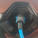

# Iobroker.zoe2
=================

**Тесты:**

**Загрузки**

**Лицензия:**

**Возможности:** [![Запросы функций] (https://feathub.com/fungus75/ioBroker.zoe2?format=svg)](https://feathub.com/fungus75/ioBroker.zoe2)

Простой ioBroker-Adapter для получения некоторых базовых значений от Renault ZOE и использования их в ioBroker.

ВАЖНЫЙ!!! ЕСЛИ ВЫ ОБНОВЛЯЕТЕСЬ С ВЕРСИИ ДО 0.2.2, ВЫ ДОЛЖНЫ ВВЕСТИ СВОЙ ПАРОЛЬ ПОВТОРНО, ПОТОМУ ЧТО, НАЧИНАЯ С 0.2.2, ПАРОЛЬ СОХРАНЯЕТСЯ ЗАШИФРОВАННЫМ!!!

**API КЛЮЧ!!! ЕСЛИ АДАПТЕР ПЕРЕСТАЕТ РАБОТАТЬ, ПОЖАЛУЙСТА, ВСЕГДА СМОТРИТЕ НА https://github.com/fungus75/ioBroker.zoe2/wiki, ПОТОМУ ЧТО RENAULT ЧАСТО МЕНЯЕТ СВОЙ КЛЮЧ API!!!**

ПОЖАЛУЙСТА, ОБРАТИТЕ ВНИМАНИЕ: ЭТОТ АДАПТЕР ИСПОЛЬЗУЕТ ТО ЖЕ API, ЧТО И ПРИЛОЖЕНИЕ MY RENAULT. НО ПЕРЕД ИСПОЛЬЗОВАНИЕМ ЭТОГО АДАПТЕРА ВЫ ДОЛЖНЫ НАСТРОИТЬ ПРИЛОЖЕНИЕ MY RENAULT ДЛЯ РАБОТЫ. т.е. на Android: https://play.google.com/store/apps/developer?id=RENAULT+SAS — если вы хотите использовать старый API, используйте https://github.com/fungus75/ioBroker.zoe. вместо.

ПОЖАЛУЙСТА, ОБРАТИТЕ ВНИМАНИЕ: ЭТО ОЧЕНЬ РАННЯЯ СТАДИЯ РАЗРАБОТКИ, ИСПОЛЬЗУЙТЕ НА СВОЙ РИСК

ПОЖАЛУЙСТА, ОБРАТИТЕ ВНИМАНИЕ: ПОСЛЕ ЛЮБОГО ОБНОВЛЕНИЯ АДАПТЕРА ПЕРЕЙДИТЕ НА ЭКРАН НАСТРОЙКИ, ИЗМЕНИТЕ ЧТО-НИБУДЬ, ЧТОБЫ СОХРАНЕНИЕ БЫЛО ВКЛЮЧЕНО, ИЗМЕНИТЕ ЭТО НАЗАД И НАЖМИТЕ СОХРАНИТЬ!

Если этот адаптер недоступен в ioBroker-Admin-View, используйте следующую команду для его установки (из командной строки на вашем ioBroker-Server):

```npm install https://github.com/fungus75/ioBroker.zoe2/tarball/master/```

Или вы можете использовать кнопку GitHub (помеченную: установить с собственного URL-адреса) в представлении адаптера и ввести этот URL-адрес на вкладке «Другое». Это также можно использовать для обновления до текущей версии адаптера:

```https://github.com/fungus75/ioBroker.zoe2/tarball/master/```

(если этот URL-адрес не работает, используйте вместо него https://github.com/fungus75/ioBroker.zoe2.git)

Вы можете использовать этот метод для обновления адаптера до самой последней версии.

После этого адаптер должен появиться в ioBroker-Admin-View.

### Конфигурация
- Вы должны установить имя пользователя, пароль и VIN, как вы сделали в моем приложении Renault.
- Эти локали ("Laenderversionen") в настоящее время работают: de_DE
- Возможно, вам понадобится My-Z.E.Connect или аналогичные услуги от Renault, чтобы использовать это
- После сохранения создание объектов (zoe.0 и т. д.) заняло около 15 минут.

### Функции
- Прочитайте эти параметры от Зои:
   - уровень заряда в процентах
   - зарядка как логическое значение
   - подключен как логическое значение
   - оставшаяся дальность в километрах
   - оставшееся время зарядки
   - рассчитанная конечная точка зарядки (charging_finished_at)
   - температура батареи
   - внешняя температура (не очень точно)
   - зарядкаМощность
   - емкость батареи
   - доступная энергия батареи
   - gpsLatitude и gpsLongitude, работает только на более новых ZOE
- Напишите эти параметры:
   - preconNow: запускает precon/hvac (напишите true для этого узла или нажмите кнопку)
   - chargeCancel: прекращает зарядку
   - chargeEnable: включает зарядку

Контрольная зарядка:

С помощью двух кнопок chargeCancel и chargeEnable можно управлять функцией зарядки. Если нажата chargeCancel (или в этот параметр записывается true), функция зарядки отключается. ZOE не должен заряжаться, если шнур питания подключен. На моем ZOE 1-го поколения это не действует, так что, может быть, это работает на более новых ZOE?

Как только нажмете chargeEnable (или в этот параметр запишется true), функция зарядки должна снова заработать.

Как это делается: chargeEnable создает график зарядки, который начинается в час, указанный вами на экране настройки, каждый день и длится 15 минут. Похоже, это самая короткая сумма, которую можно установить. Полное отключение зарядки невозможно с текущим API (или известными частями текущего API).

Некоторые параметры работают только с более новыми ZOE.

### Тестирование со следующими ZOE:
- Зои Фаза 2 (Спасибо, Джек-РК-24)
- Zoe R210 (1-е поколение, протестировано fungus75)
- Зоя R90 (Спасибо, arturwolf)

### Пожалуйста, обрати внимание!!
Связь с ZOE или Renault-Services осуществляется только в интервалах времени, равных 10 минутам.
Поэтому, если вы нажмете preconNow или chargeNow, потребуется следующий интервал, чтобы отправить его в ZOE, и потребуется следующий интервал, чтобы вернуть статус.

Новый ZOE API от Renault кажется очень кружевным. Это означает, что он показывает новые значения только тогда, когда есть что-то важное.
Насколько я понял, самое главное — это уровень заряда батареи. Это означает, что т.е. внешняя температура не обновляется, если машина стоит дома. Только если т.е. ZOE заряжается, внешняя температура обновляется. Если зарядка закончена, все еще нет нового обновления. Во время вождения уровень заряда батареи становится все ниже и ниже, поэтому он должен обновляться очень регулярно.

### Спасибо
https://michael-heck.net/index.php/elektromobilitaet/renault-zoe-ins-smarthome-integrieren, https://michael-heck.net/index.php/elektromobilitaet/renault-zoe-im-smarthome- neue-api-2020, https://muscatoxblog.blogspot.com/2019/07/delving-into-renaults-new-api.html, https://github.com/edent/Renault-Zoe-API, https://github.com/jamesremuscat/pyze и https://github.com/hacf-fr/renault-api за отличную документацию и работу.

## Changelog

### 0.2.4 (2022-02-16)
- Replaced obsolete Request-Library by axios
- Code-Adjustments

### 0.2.3 (2021-07-29)
- Code Adjustments, Error-Handling

### 0.2.2 (2021-07-26)
- Store Password Encrypted (You have to reset it, if updating from older version)

### 0.2.1 (2021-07-23)
- Code optimisation 

### 0.2.0 (2021-02-12)
- Adapter supports compact mode (required if adapter should be listed in official repo)

### 0.1.5 (2021-02-09)
- bugfix gigya parameter changed https://github.com/fungus75/ioBroker.zoe2/issues/17

### 0.1.4 (2021-02-05)
- added: kamereonapikey as setup parameter because it changed by Feb. 1st
- added: stopChargeWorkaroundHour: Because the API has no feature to stop charging, the stop-charging button starts scheduled charging to a very uncommon time. Configure the hour with that parameter
- bugfix https://github.com/fungus75/ioBroker.zoe2/issues/15
- bugfix https://github.com/fungus75/ioBroker.zoe2/issues/16
- bugfix https://github.com/fungus75/ioBroker.zoe2/issues/14

### 0.1.3 (2020-11-17)
- added: setup-value useHVACApi, see https://github.com/fungus75/ioBroker.zoe2/issues/10

### 0.1.2 (2020-07-28)
- changed: call charge-start API when "pressed" chargeEnable. Hopefully it helps on older ZOEs

### 0.1.1 (2020-07-18)
- added chargeCancel and chargeEnable. See "controll charging"

### 0.1.0 (2020-07-03)
- bugfix: https://github.com/fungus75/ioBroker.zoe2/issues/6, thanks to https://github.com/damack

### 0.0.9 (2020-06-25)
- added: getLocation can be turned on/off in config (useful for older ZOEs which do not allow getLocation)

### 0.0.8 (2020-06-18)
- bugfix: https://github.com/fungus75/ioBroker.zoe2/issues/2
- bugfix: https://github.com/fungus75/ioBroker.zoe2/issues/3

### 0.0.7 (2020-06-18)
- bugfix: https://github.com/fungus75/ioBroker.zoe2/issues/2
- added: gpsLatitude
- added: gpsLongitude 

### 0.0.6 (2020-04-30)
- added: chargingPower
- added: batteryCapacity
- added: batteryAvailableEnergy
- changed: Using battery-status v2 API (supplies better values for newer ZOEs, thanks Jack-RK-24 for testing)

### 0.0.5 (2020-04-29)
- added: config-paramter ignore API error (when set, the Adapter tries to ignore some API-Errors)

### 0.0.4 (2020-04-21)
- added: preconNow => starts precon (hvac)

### 0.0.3 (2020-04-16)
- added: totalMileage

### 0.0.2 (2020-04-15)
- first working version for github
- reads out some values (as shown in the Features list)

### 0.0.1 (2020-04-06)
- nonworking version, just to create initial repo on github
- code taken 1:1 from iobroker.zoe
- small adjustments, first access to the new renault api

## License
The MIT License (MIT)

Copyright (c) 2021 RenePilz <rene@pilz.cc>

Permission is hereby granted, free of charge, to any person obtaining a copy
of this software and associated documentation files (the "Software"), to deal
in the Software without restriction, including without limitation the rights
to use, copy, modify, merge, publish, distribute, sublicense, and/or sell
copies of the Software, and to permit persons to whom the Software is
furnished to do so, subject to the following conditions:

The above copyright notice and this permission notice shall be included in
all copies or substantial portions of the Software.

THE SOFTWARE IS PROVIDED "AS IS", WITHOUT WARRANTY OF ANY KIND, EXPRESS OR
IMPLIED, INCLUDING BUT NOT LIMITED TO THE WARRANTIES OF MERCHANTABILITY,
FITNESS FOR A PARTICULAR PURPOSE AND NONINFRINGEMENT. IN NO EVENT SHALL THE
AUTHORS OR COPYRIGHT HOLDERS BE LIABLE FOR ANY CLAIM, DAMAGES OR OTHER
LIABILITY, WHETHER IN AN ACTION OF CONTRACT, TORT OR OTHERWISE, ARISING FROM,
OUT OF OR IN CONNECTION WITH THE SOFTWARE OR THE USE OR OTHER DEALINGS IN
THE SOFTWARE.
