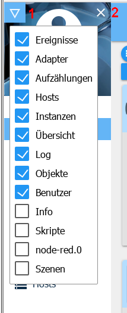

# Интерфейс администратора
!> **Из-за объема документации это только обзор; подробная информация представлена на страницах, которые связаны с вкладками через заголовки разделов. Щелкните заголовки.**

Администратор адаптера используется для управления всей установкой ioBroker.
Он предоставляет веб-интерфейс. Это вызывается в ``<IP-Adresse des Servers>:8081``.

Этот адаптер создается непосредственно при установке ioBroker - ручная установка не требуется.

Следующие функции могут быть вызваны через графический интерфейс, предоставляемый адаптером:

* Ввод общесистемных настроек
* Установка дополнительных адаптеров и экземпляров
* Доступ к конфигурации экземпляров
* Доступ к обзору собственности
* Доступ к обзору статуса объектов
* Доступ к администрированию пользователей и групп
* Доступ к файлу журнала
* Управление хозяевами

Вид адаптера разделен на три области:

1 - [Строка меню](#menüleiste)

2 - [Главное окно](#das-hauptfenster)

3 - [Системные настройки](#systemeinstellungen)

## Строка меню
Строка меню содержит несколько пунктов меню. При базовой установке эти точки отображаются, как показано на рисунке. После установки дополнительных адаптеров дополнительные точки можно активировать или деактивировать для лучшего обзора с помощью треугольного значка в верхнем левом углу (1).

Строку меню с вкладками можно скрыть с помощью **X** (2), чтобы освободить место на мобильных устройствах.

Строку меню можно снова отобразить с помощью «значка бургера».

## Главное окно
В главном окне отображается содержимое, относящееся к выбранному пункту меню.

Подробная информация об этом содержании доступна на страницах, связанных через заголовки.

[Обзор](https://www.iobroker.net/#de/documentation/admin/overview.md) Здесь отображаются все страницы с собственным веб-интерфейсом и информацией о хостах.

[адаптер](https://www.iobroker.net/#de/documentation/admin/adapter.md) Здесь отображаются и управляются доступные и установленные адаптеры.

[Экземпляры](https://www.iobroker.net/#de/documentation/admin/instances.md) Здесь перечислены экземпляры, уже установленные на вкладке «Адаптер», которые можно настроить соответствующим образом.

[Объекты](https://www.iobroker.net/#de/documentation/admin/objects.md) Управляемые объекты, структуры и точки данных устройств, которые интегрируются через адаптеры. Здесь можно создавать и удалять объекты. Целые структуры объектов могут быть загружены или загружены с помощью кнопок «стрелка вверх» и «стрелка вниз».

Если значения отображаются красным цветом, они еще не подтверждены получателем (ack = false).

[Перечисления](https://www.iobroker.net/#de/documentation/admin/enums.md) Здесь перечислены фавориты, сделки и комнаты из Homematic-CCU.

[бревно](https://www.iobroker.net/#de/documentation/admin/log.md) Здесь отображается журнал

Уровень ведения журнала может быть установлен для отдельных экземпляров на вкладке «Экземпляры». Минимальный отображаемый уровень журнала выбирается в меню выбора. В случае ошибки метка на вкладке отображается красным цветом.

[События](https://www.iobroker.net/#de/documentation/admin/events.md) Список обновлений текущего статуса.

[Пользователь](https://www.iobroker.net/#de/documentation/admin/users.md) Здесь можно создавать пользователей и добавлять их в существующие группы.

[Скрипты](scripts.md) Если установлен адаптер сценариев Java, вы можете создавать свои собственные сценарии с помощью javascript, блочного или машинописного текста на этой странице.

[Хосты](https://www.iobroker.net/#de/documentation/admin/hosts.md) Информация о компьютере, на котором установлен ioBroker. Если доступна новая версия, в этой записи в строке меню появляется сообщение.

## Системные настройки
В открывшемся здесь меню задаются [Системные настройки](https://www.iobroker.net/#de/documentation/admin/settings.md), такие как язык, формат времени и даты, а также другие общесистемные настройки.

Здесь также можно установить репозитории и настройки безопасности.

[Übersicht]: https://www.iobroker.net/#de/documentation/admin/overview.md

[Adapter]: https://www.iobroker.net/#de/documentation/admin/adapter.md

[Instanzen]: https://www.iobroker.net/#de/documentation/admin/instances.md

[Objekte]: https://www.iobroker.net/#de/documentation/admin/objects.md

[Aufzählungen]: https://www.iobroker.net/#de/documentation/admin/enums.md

[Log]: https://www.iobroker.net/#de/documentation/admin/log.md

[Ereignisse]: https://www.iobroker.net/#de/documentation/admin/events.md

[Benutzer]: https://www.iobroker.net/#de/documentation/admin/users.md

[Hosts]: https://www.iobroker.net/#de/documentation/admin/hosts.md

[Systemeinstellungen]: https://www.iobroker.net/#de/documentation/admin/settings.md