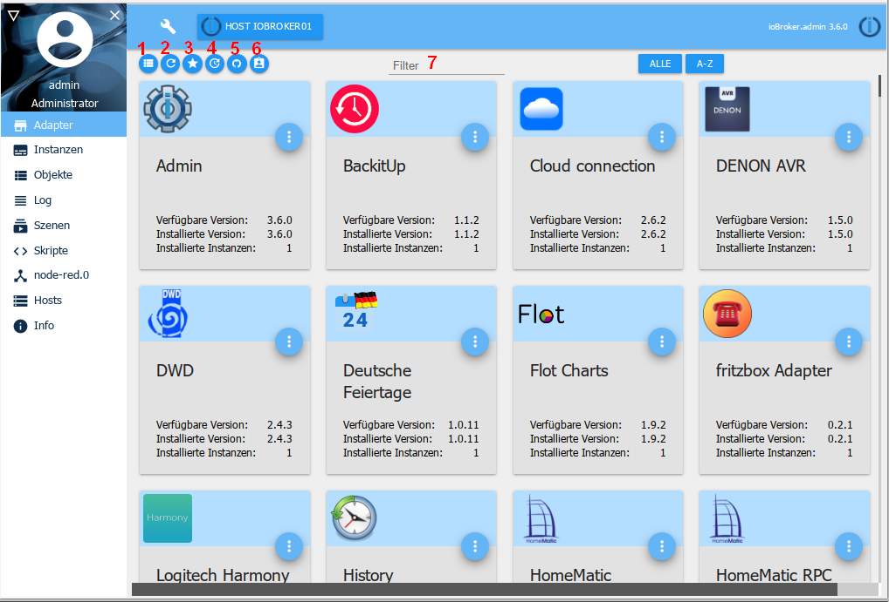
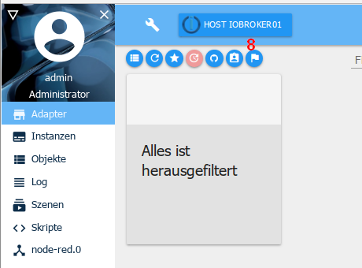
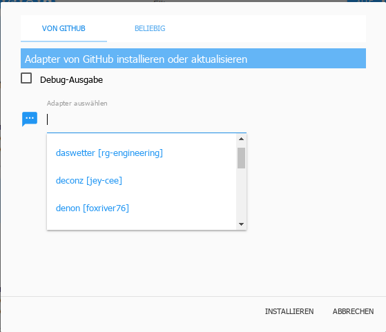
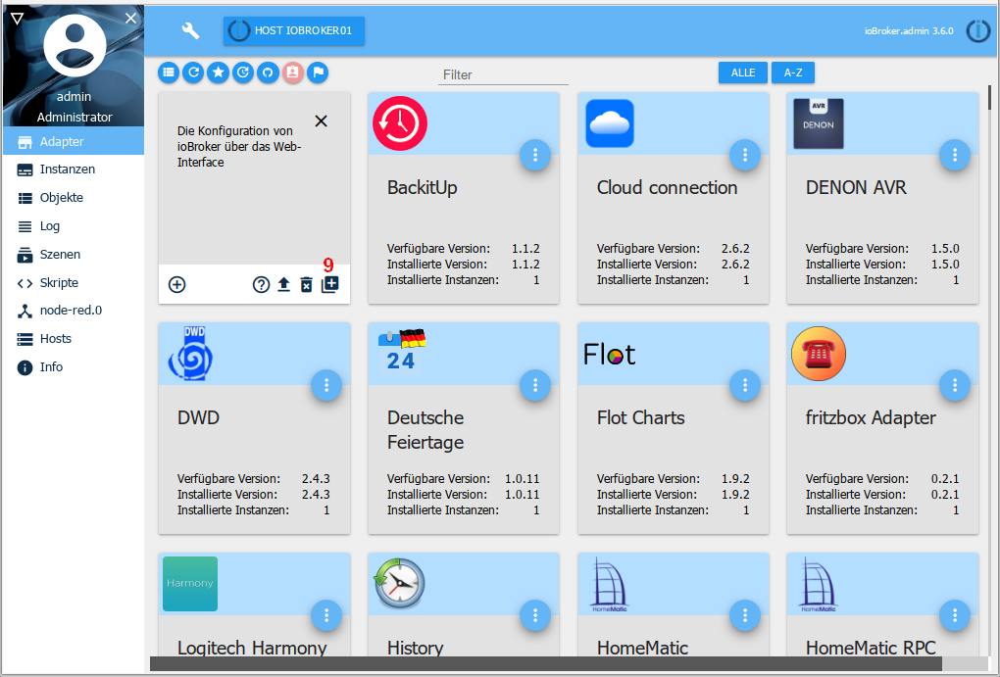

# Вкладка Адаптер
Доступные и установленные адаптеры отображаются и управляются здесь.

## Строка заголовка
в строке заголовка есть значки наиболее важных процессов. Для каждого значка есть контекстная справка. Для этого просто удерживайте некоторое время мышкой на значке.

### 1 - Переключить вид
Эта кнопка может использоваться для переключения между представлением плитки и представлением таблицы (функция переключения)

### 2 - обновить отображение
Обновления автоматически проверяются при каждом перезапуске. Эту кнопку можно использовать для запуска поиска вручную или для обновления страницы.

### 3 - показывать только установленные адаптеры
При выборе этого значка отображаются только адаптеры с уже установленными экземплярами (функция переключения)

### 4 - Показать адаптер с обновлениями
При выборе этого значка отображаются только адаптеры, для которых доступно обновление (функция переключения). Плитки обновляемых адаптеров имеют заголовок зеленого цвета. Если для адаптера нет обновления, появится соответствующее сообщение.

Еще один значок также появляется в строке заголовка:

Щелчок по этому значку (8) обновляет все доступные адаптеры.

### 5 - Установить адаптер с его собственного URL
!> **ВНИМАНИЕ: использование этой опции может привести к проблемам с установкой ioBroker.** Адаптеры от GitHub могут все еще находиться в стадии разработки и, следовательно, работать некорректно! В продуктивной системе их следует использовать с осторожностью. Рекомендуется дождаться стабильной версии!

Используя значок Octocat, адаптеры можно установить по их собственным путям (URL-адрес или пути к файлам) или предварительных версий с GitHub.

После нажатия на этот значок открывается соответствующее окно выбора:

На вкладке ***FROM GITHUB*** просто выберите нужный адаптер в раскрывающемся меню, и будет установлена последняя предварительная версия.

При выборе вкладки ***ЛЮБОЙ*** любой путь к файлу или URL-адрес (например, URL-адрес разработчика внешнего адаптера) можно ввести в поле и установить соответствующий адаптер.

### 6 - Включить экспертный режим
Экспертный режим также позволяет устанавливать более старые версии адаптера. Если выбрана эта кнопка (9), на плитке появляется дополнительный значок, с помощью которого можно установить более ранние версии.

### 7 - фильтр
Здесь вы можете искать конкретные адаптеры, используя термин фильтра.