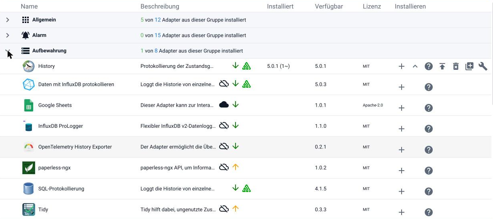

# Адаптер для водителя

На этой странице перечислены все доступные адаптеры для ioBroker: установленные и более 800 других. Здесь можно устанавливать, обновлять и удалять адаптеры.

Адаптер изначально представляет собой только программу. Для того чтобы он мог что-либо делать, ему необходим...
**Пример**Это также будет создано здесь, а затем на вкладке.
[Пример](/docs/admin/instances.md)
сконфигурировано.

## Панель инструментов

| Нет. | функция                                                                                                                                     |
| ---- | ------------------------------------------------------------------------------------------------------------------------------------------- |
| 1    | **Изменить режим просмотра**: переключает между плиточным и списковым режимами просмотра.                                                   |
| 2    | **Проверьте адаптер на наличие обновлений.** Это происходит автоматически при запуске администратора; здесь же это можно запустить вручную. |
| 3    | **Временная метка репозитория.** Когда был создан и последний раз загружен список адаптеров.                                                |
| 4    | **Отображать только установленные адаптеры.**                                                                                               |
| 5    | **Показать только адаптеры с обновлениями.**                                                                                                |
| 6    | **Установите из собственного источника.** (см. ниже).                                                                                       |
| 7    | **Фильтр по имени.**                                                                                                                        |
| 8    | **Выберите категорию**Освещение, энергетика, связь и так далее.                                                                             |
| 9    | **Сортировка**: Заголовок, Имя, Популярность в первую очередь, Недавно обновлено, Недавно создано.                                          |
| 10   | Столбец счетчика. При нажатии на него открывается статистика: доступные, установленные и обновленные адаптеры за последний месяц.           |

Над списком отображается желтое предупреждение, указывающее на то, что текущий репозиторий является...
_Последняя (бета) версия репозитория_ ioBroker предоставляет предварительные версии. Для системы, предназначенной для надежной работы, это крайне важно. _Стабильны&#x439;_&#x41F;ереход будет осуществлен в [Системные настройки](/docs/admin/settings.md).

## Вид плитки

Каждый адаптер получает плитку с его названием, описанием, количеством экземпляров, а также доступными и установленными версиями. Кнопка с тремя точками переворачивает плитку; команды находятся на обратной стороне.

| Нет. | функция                                                                                           |
| ---- | ------------------------------------------------------------------------------------------------- |
| 1    | **Добавить экземпляр.** Если адаптер еще не установлен, он будет установлен в процессе установки. |
| 2    | **Политика автоматического обновления** для этого адаптера.                                       |
| 3    | **Прочитай меня**: открывает документацию адаптера.                                               |
| 4    | **Загрузка файла.**                                                                               |
| 5    | **Удалите адаптер.** Существующие экземпляры и их объекты будут потеряны в процессе.              |
| 6    | **Установите определенную версию**: например, вернуться к более старой версии.                    |

Мелкими буквами под названием адаптера обозначены следующие символы: **Как** Адаптер работает, а не состояние его установки:

| Знак                          | Значение                                                                             |
| ----------------------------- | ------------------------------------------------------------------------------------ |
| Облако с линией посередине    | Адаптеру не требуется облачное хранилище; он взаимодействует напрямую с устройством. |
| Облако                        | Для работы адаптера требуется облачный сервис производителя.                         |
| Стрелка вниз (_толкать_)      | Устройство автоматически сообщает об изменениях.                                     |
| Стрелка вверх (_голосование_) | ioBroker регулярно запрашивает данные с устройства.                                  |
| Зелёные горы                  | Адаптер сообщает о сбоях своему разработчику через Sentry.                           |

?> _толкать_ Это более приятный случай: значения поступают мгновенно, без необходимости для ioBroker выполнять запросы каждую секунду.

Ниже названия адаптера вы также увидите оценку до пяти звезд. Это рейтинг пользователей, установивших адаптер. Нажав на него, вы откроете оценки и комментарии, а также сможете проголосовать сами. См.
[обзоры адаптеров](/docs/ecosystem/rating.md).

## Список

В списке адаптеры сгруппированы по категориям. В каждой строке указаны установленные и доступные версии, а также лицензия; справа отображаются те же команды, что и на обратной стороне плитки.

Этот режим удобен для просмотра: в заголовке каждой группы отображается количество уже установленных адаптеров данной категории.

## Установите из собственного источника.

Кнопка с изображением осьминога открывает диалоговое окно с четырьмя вариантами:

- **Из npm**: бета-версия или последняя версия, полученная непосредственно из npm.
- **Из GitHub**: последняя предварительная версия из репозитория разработчика.
- **Пользовательский**: любой URL.
- **Из файла**: локально доступный пакет.

Эти методы обходят проверенный репозиторий. Версии могут быть не полностью протестированы, и **Зависимости не проверяются.**&#x412; системах, требующих непрерывной работы, используйте это решение только в случае крайней необходимости; в противном случае дождитесь стабильной версии.

Вариант _Создайте экземпляр, если он еще не существует._ Это настройка по умолчанию. Если она отключена, экземпляр необходимо будет создать вручную.