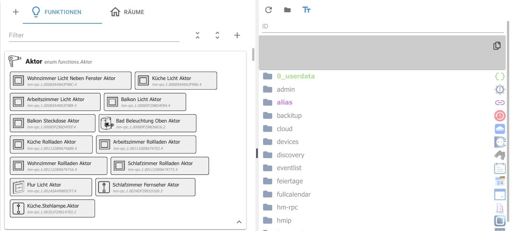

# Вкладка Категории

Категории сортируют точки данных по категориям. **комнаты** и **функции**Точка данных может находиться в обоих местах: потолочный светильник в гостиной относится к данной комнате.
_Гостиная_ и для своей функции _Свет_.

Раньше этого всадника звали... **Перечисления**Внутри системы эти объекты по-прежнему называются... `enum.rooms.*` и `enum.functions.*`.

Преимущество заключается во всем, что на его основе построено: визуализация, голосовое управление через Alexa или Google Home, а также скрипты, обращающиеся к группам устройств. Функция «Выключить свет в гостиной» работает только в том случае, если комната и ее функция правильно определены.

## функции

Слева расположены категории с соответствующими им точками данных, справа — дерево объектов. Точка данных назначается путем перетаскивания ее из дерева в нужную категорию.

Выше списка находится **фильтр**кнопки для развертывания и сворачивания всех категорий и **+**, что создает новую категорию. **+**
Кнопка в верхнем левом углу создает категорию верхнего уровня.

## Комнаты

Комнаты работают аналогично. Используя значок карандаша рядом с названием вкладки, вы можете изменить название, значок и цвет категории. Изменение цвета затрагивает всю группу, что делает список более читабельным.

Комнаты могут быть вложенными друг в друга: _Первый этаж_ может _Гостиная_ и _Кухня_
содержать.

Точку данных также можно назначить непосредственно на вкладке.
[объекты](/docs/admin/objects.md) о колоннах _Космос_ и _функци&#x44F;_&#x41E;ба метода изменяют одни и те же объекты.

!> Задания следует размещать по адресу **Точка данных**Не к каналу или устройству, иначе оценивающие адаптеры не будут знать, какое значение нужно переключить.