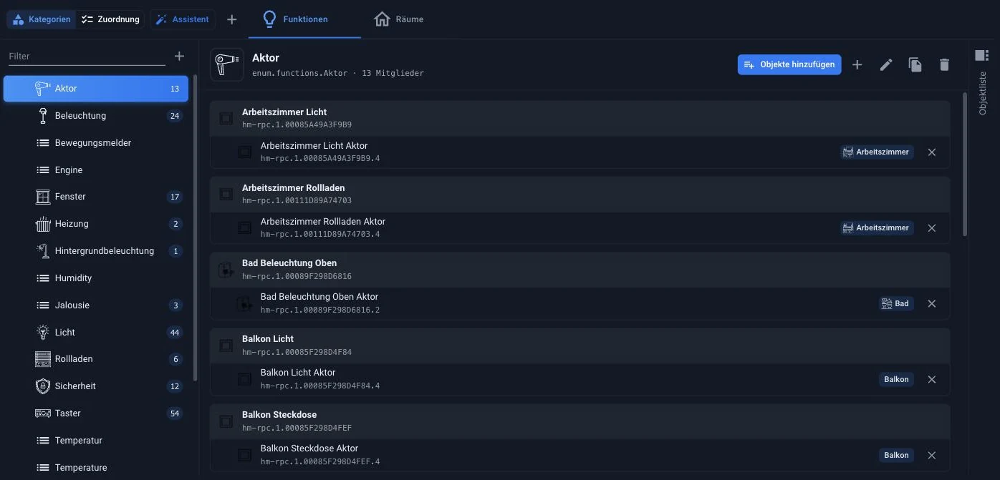
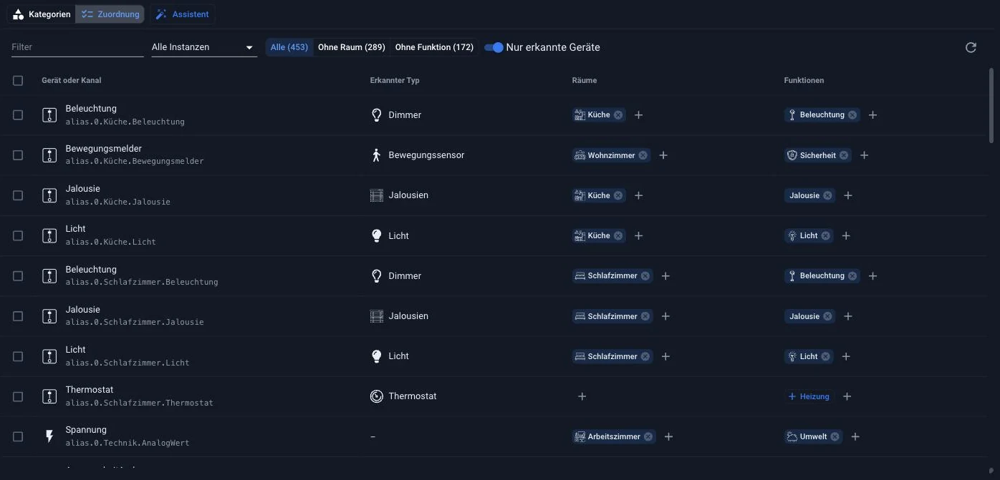
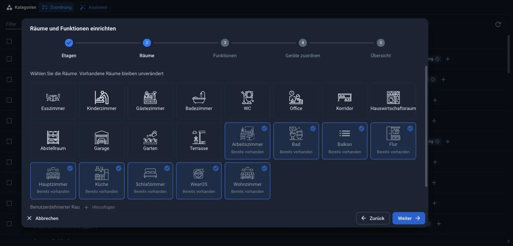

# Вкладка Категории

Категории организуют точки данных по **помещению** и **назначению** . Точка данных может относиться к обоим категориям: потолочный светильник в гостиной относится как к помещению _«гостиная»,_ так и к назначению _«освещение»_ .

Ранее эта вкладка называлась **"Перечисления** ". Внутри системы объекты по-прежнему называются...`enum.rooms.*` и`enum.functions.*` .

Преимущество заключается во всем, что на его основе построено: визуализация, голосовое управление через Alexa или Google Home, а также скрипты, обращающиеся к группам устройств. Функция «Выключить свет в гостиной» работает только в том случае, если комната и ее функция правильно определены.

В верхней части вкладки расположены три раздела:

| Область        | За что                                                                                   |
| -------------- | ---------------------------------------------------------------------------------------- |
| **Категории**  | Создавайте и переименовывайте пространства и функции, а также управляйте их участниками. |
| **Назначение** | таблица всех обнаруженных устройств для заполнения пробелов                              |
| **помощник**   | Первоначальная настройка в пять шагов.                                                   |

## Категории

### функции

Слева находится список категорий; число рядом с каждой категорией указывает количество участников. Справа отображаются участники выбранной категории: вверху — устройство или канал, а ниже, с отступом, — точки данных. Небольшие значки справа от каждой строки указывают, к каким другим категориям относится запись; **крестик** удаляет её из текущей категории.

Над списком расположены **фильтр** и кнопка **«+»** , которая создает новую категорию. Над участниками указано внутреннее название категории, например:`enum.functions.Aktor` и кнопки:

| кнопка               | Эффект                                                                          |
| -------------------- | ------------------------------------------------------------------------------- |
| **Добавить объекты** | Открывает выделенную область и одновременно захватывает несколько точек данных. |
| **+**                | создает подчиненную категорию                                                   |
| Ручка                | изменяет название, символ и цвет                                                |
| листья               | дублирует категорию                                                             |
| Мусорное ведро       | Они удаляют их, но сами данные остаются.                                        |

### Комнаты

Комнаты устроены одинаково. Цветная полоса слева от входа обозначает цвет категории; это облегчает чтение длинных списков.

Комнаты могут быть вложенными: _на первом этаже_ могут располагаться _гостиная_ и _кухня_ . Отступы в списке указывают на эти уровни.

### Список объектов

**Список объектов** расположен справа и отображается в виде выдвижной панели. Щелчок по вертикальному тексту разворачивает его, отображая дерево объектов. Оттуда можно перетащить элемент и поместить его в категорию. Для тех, кто хочет назначить много точек данных одновременно, функция **«Добавить объекты»** будет быстрее.

## Назначение

В этом разделе подход обратный: вместо того, чтобы начинать с категории, здесь перечислены все устройства и каналы, а в двух столбцах указано, какая комната и функция связаны с каждым из них. Назначение добавляется с помощью **кнопки «+»** , а удаляется — с помощью **крестика** на метке.

Инструменты для выявления пробелов перечислены выше:

- **фильтр** для имени
- выборка **экземпляра** , например, только`alias.0`
- Переключатели: **Все** , **Без комнаты** и **Без функции** , каждый с указанием количества.
- **Отображаются только распознанные устройства** , что ограничивает список устройствами, которые ioBroker распознал.

Самый быстрый способ обеспечить полную поддержку системы — это использовать параметры **«Без пробелов»** и **«Без функций»** : список обрабатывается до тех пор, пока число не достигнет нуля.

## помощник

Помощник настраивает комнаты и функции в пять этапов: **Этажи** , **Комнаты** , **Функции** , **Назначение устройств** , **Обзор** . На этапах «Комнаты» и «Функции» доступны готовые предложения в виде плиток; уже существующие отмечены и помечены как _«Уже существуют_ ». Отсутствующие элементы можно выбрать, а пользовательские названия добавить через **раздел «Пользовательские** ».

Существующие помещения и функции остаются неизменными; ассистент просто создает и назначает их. Поэтому он подходит и для уже работающих систем.

Точку данных также можно назначить непосредственно на вкладке [«Объекты»](/docs/admin/objects.md) через столбцы _«Пространство»_ и _«Функция»_ . Все методы изменяют одни и те же объекты.

!> Присваивания следует производить в **точке данных** , а не в канале или устройстве, иначе оценивающие адаптеры не будут знать, какое значение нужно переключить.