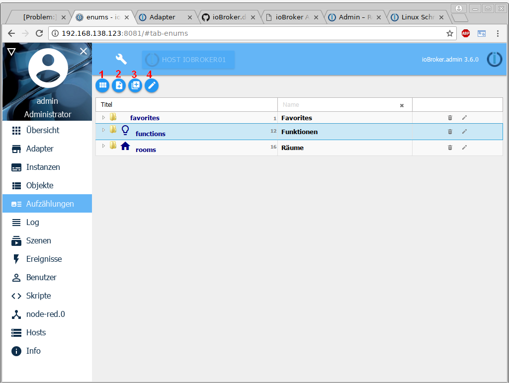

Избранное, сделки и комнаты перечислены здесь. Если есть установка HomeMatic, содержащиеся в ней списки будут приняты.
Вы также можете создавать свои собственные перечисления, которые затем можно использовать, например, в сценариях.

Первый значок в строке заголовка можно использовать для переключения в режим списка. Этот вид используется в следующих случаях:

## Строка заголовка
Строка заголовка содержит значки наиболее важных процессов. Для каждой иконки есть контекстная помощь. Просто задержите мышь на иконке на некоторое время.

### 1 - Переключить вид
Эта кнопка может использоваться для переключения между представлением плитки и представлением списка (функция переключения).

### 2 - Создать новое перечисление
Эта кнопка создает новый список. Для этого откроется новое окно

**Фамилия**

Здесь вводится желаемое имя перечисления. При желании значок для этого списка также можно перетащить в это поле.

**Сохранить идентификатор**

Этот флажок снят по умолчанию при создании нового перечисления, так как здесь создается новый идентификатор.

В режиме редактирования (см. ниже) существующего перечисления можно изменить имя без изменения идентификатора.

**Предварительный просмотр**

Здесь отображается полный идентификатор перечисления.

**Цвет**

На этом этапе можно выбрать цвет, которым должно быть отмечено перечисление.

В плиточном представлении плитка окрашена в этот цвет, в списочном представлении строка с названием перечисления подчеркнута этим цветом.

### 3 - Создать новую категорию
С помощью этой кнопки новая категория (например, функции/помещения и т. д.) создается так же, как и перечисление.

### 4 - Редактировать
С помощью этой кнопки можно управлять точками данных перечисления.
Сначала щелчком мыши отмечается нужное перечисление, а затем активируется режим редактирования.

Теперь экран разделен на две части:

Структура правой половины соответствует структуре [страницы объектов][].

Точки данных можно перетаскивать с правой стороны в желаемое перечисление с левой стороны простым перетаскиванием.

Точка данных в списке удаляется с помощью значка корзины.

[Objekte-Seite]: https://www.iobroker.net/#de/documentation/admin/objects.md
