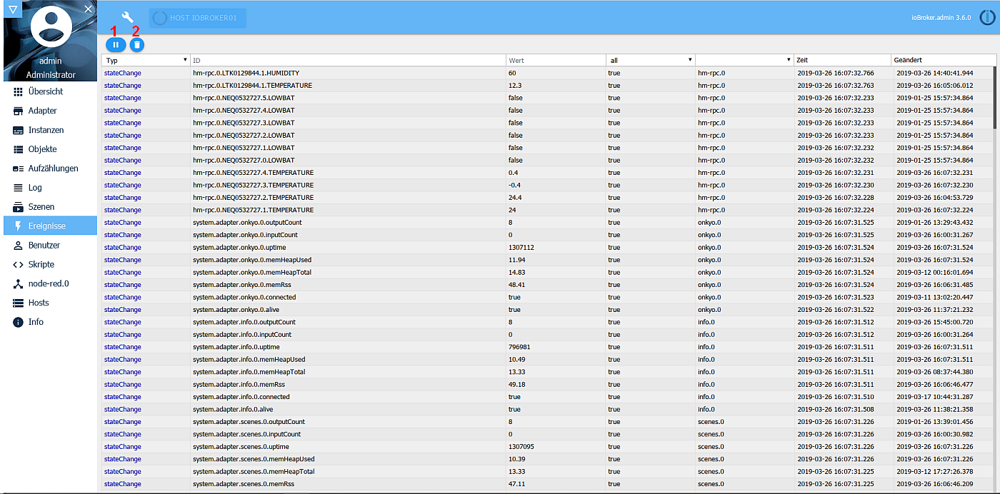
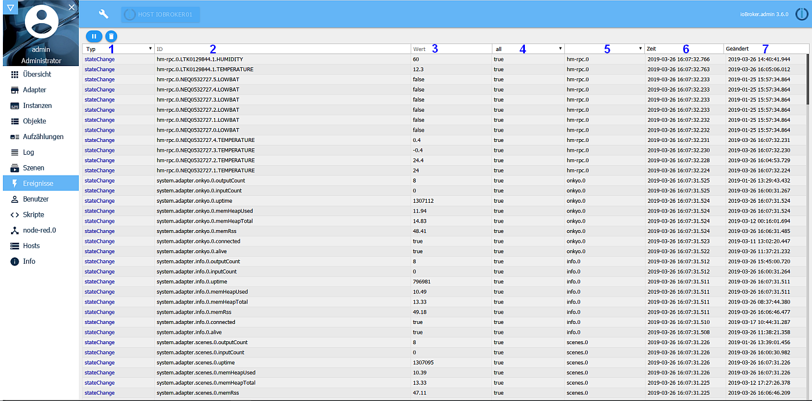

На этой вкладке отображаются текущие состояния всех точек данных.
Здесь нельзя изменить значения.

## Строка заголовка
в строке заголовка есть значки наиболее важных процессов. Для каждого значка есть контекстная справка. Для этого просто удерживайте некоторое время мышкой на значке.

### Значки подробно:
### 1 - приостановить просмотр
С помощью этой кнопки вы можете остановить текущее отображение последних событий. После этого кнопка становится желтым фоном, на котором подсчитывается количество «пропущенных» событий.

!> Поскольку события иногда обновляются в диапазоне миллисекунд, возможны задержки вплоть до зависания дисплея.

Повторное нажатие кнопки запускает отображение в реальном времени.

### 2 - удалить отображение
Эта кнопка очищает экран

## Содержание страницы
Существующие события отображаются в таблице на странице. Самое последнее событие находится вверху.

Щелкая заголовки столбцов, вы можете выполнять фильтрацию по определенным критериям.

### 1 - тип
Здесь либо ***stateChange*** - это обновление значения, либо ***objectChange*** . Это также две опции фильтра.

### 2 - ID
Это уникальное имя соответствующей точки данных согласно структуре, состоящей, например, из имени адаптера, номера экземпляра, имени устройства, имени канала, имени точки данных.

Здесь вы можете фильтровать полные идентификаторы, но также и их части, например, для всех точек данных ТЕМПЕРАТУРА.

### 3 - значение
Это текущее значение соответствующей точки данных.

### 4 - Подтверждено
Если это значение было изменено и было принято системой, значение истинно, в противном случае - ложно.

Это также параметры фильтра

### 5 - источник
Это указывает, какой экземпляр внес последнее изменение в точку данных.

Вы можете отфильтровать их в этом столбце.

### 6 - время
Это отметка времени, когда точка данных была обновлена в последний раз.

### 7 - Изменено
Это отметка времени, при которой значение точки данных в последний раз изменялось.