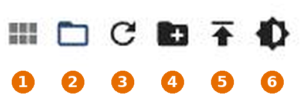

# вкладка «Файлы»

Помимо объектов и состояний, ioBroker также управляет файлами: значками, изображениями, конфигурациями адаптера и страницами визуализации. Эта вкладка является файловым менеджером для них.

Каждый адаптер получает свою собственную директорию, обычно`<adapter>.admin` для файлов его интерфейса конфигурации. В самом верху находятся **данные пользователя** (`0_userdata.0` Здесь следует размещать ваши собственные файлы, например, изображения для визуализации.

Справа от каждой записи указано количество содержащихся файлов и права доступа.

## Панель инструментов

| Нет. | функция                                                                                                                |
| ---- | ---------------------------------------------------------------------------------------------------------------------- |
| 1    | **Переключайтесь между режимом просмотра** списка и плиток.                                                            |
| 2    | **Скрыть пустые каталоги.**                                                                                            |
| 3    | **Перезагрузка.**                                                                                                      |
| 4    | **Создайте новую директорию.**                                                                                         |
| 5    | **Загрузка файла** : также с помощью перетаскивания.                                                                   |
| 6    | **Отключите отображение фона предварительного просмотра** , чтобы можно было оценивать изображения с прозрачным фоном. |

Каталоги адаптеров принадлежат соответствующему адаптеру. При обновлении он перезапишет свои файлы. Поэтому храните свои файлы в папке **User Data** . Они будут сохранены там.

Файлы также можно читать и записывать из скрипта. Как это сделать, объясняется в разделе [«Хранилище файлов»](/docs/dev/filestorage.md) .